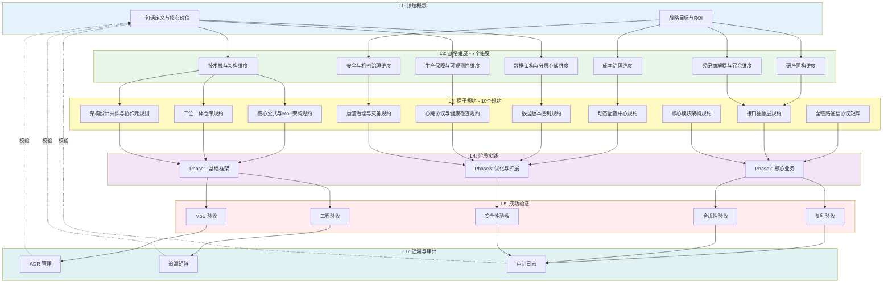
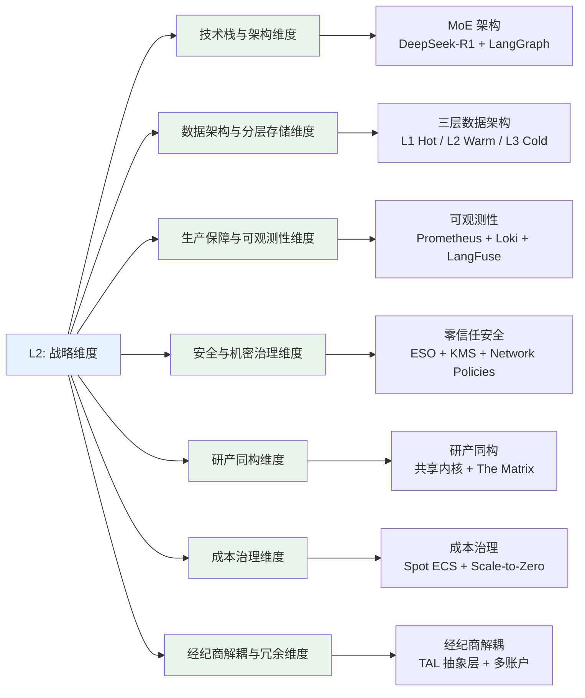
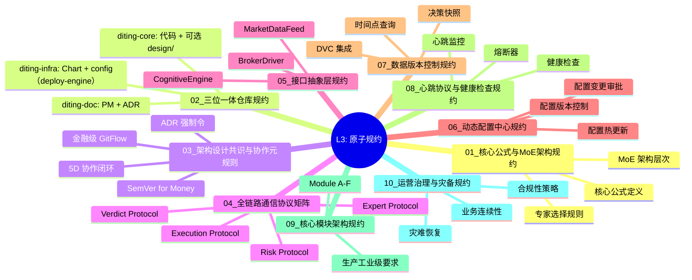
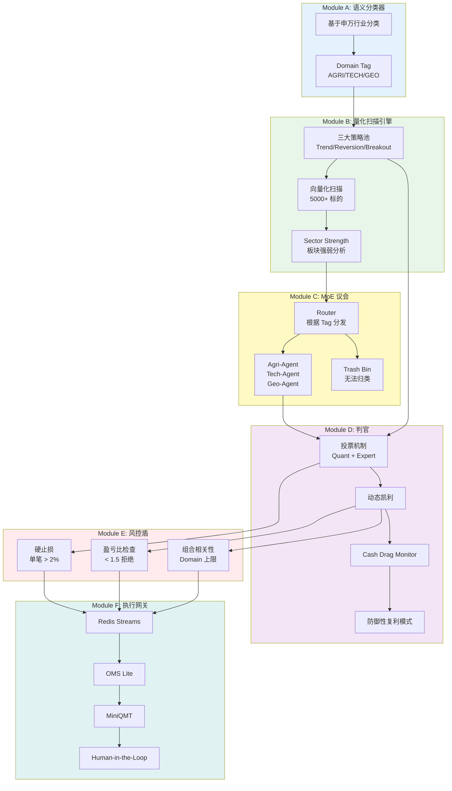
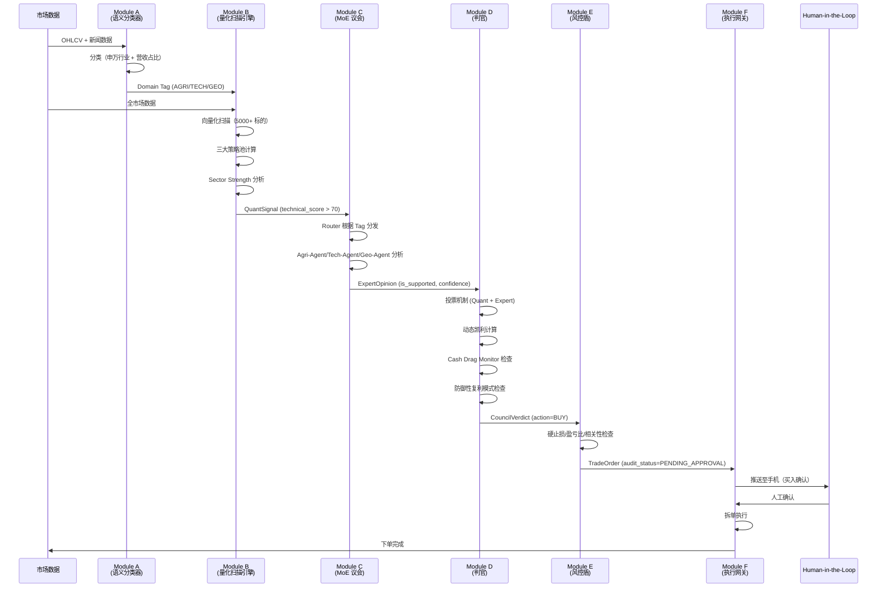
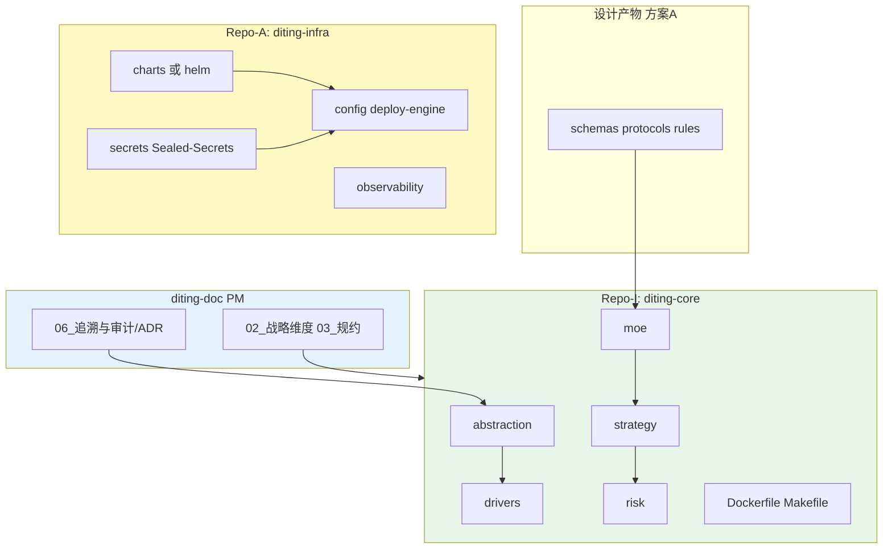
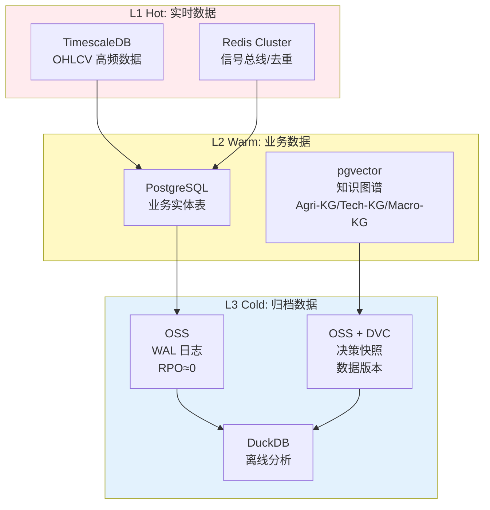
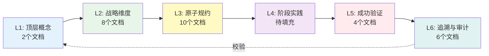

# 谛听 (Diting) 架构全景图

> [!NOTE] **[TRACEBACK] 架构全景图锚点**
> - **本文档**: 系统架构全景图，串联所有实践架构文档
> - **设计目标**: 提供系统架构的完整视图，帮助理解从顶层概念到具体实现的完整链路

## 核心理念

**一个通过 Neuro-Symbolic MoE（混合专家）架构将量化信号与专家路由强制交集，并用动态凯利公式最大化复利效率的分布式智能交易系统**，在胜率 ≥ 80%、年化复利 ≥ 30%、回撤 < 12% 的"不可能三角"约束下运行。

---

## 架构全景图

---

## 一、顶层概念 (L1)

### 核心价值

| 文档 | 内容 | 关键点 |
|------|------|--------|
| [01_一句话定义与核心价值.md](./01_顶层概念/01_一句话定义与核心价值.md) | 项目根本定位 | Neuro-Symbolic MoE、核心公式、不可能三角 |
| [02_战略目标与ROI.md](./01_顶层概念/02_战略目标与ROI.md) | 战略目标与 ROI（投资回报率） | 业务目标、技术目标、ROI 指标 |

### 核心公式

$$
Alpha = (Quant_{Signal} \cap Router(Experts)) \times Kelly_{Position}
$$

### 不可能三角

| 维度 | 约束条件 | 实现路径 |
|------|---------|---------|
| **认知边界** | 胜率 ≥ 80% | MoE 架构 + 领域专家 + 可解释性 |
| **复利增长** | 年化复利 ≥ 30% | 多策略池 + Cash Drag Monitor |
| **生存底线** | 回撤 < 12% | 硬止损 + 防御性复利模式 |

---

## 二、战略维度 (L2)

### 7 个战略维度总览

### 维度文档索引

| 维度 | 文档 | 核心内容 | 对应 L3 规约 |
|------|------|---------|------------|
| **01** | [技术栈与架构维度](./02_战略维度/产品设计/02_技术栈与架构维度.md) | Python 3.11+、DeepSeek-R1、Backtrader、K3s | 核心公式与MoE架构规约、核心模块架构规约 |
| **02** | [数据架构与分层存储维度](./02_战略维度/产品设计/03_数据架构与分层存储维度.md) | L1 Hot (TimescaleDB)、L2 Warm (PostgreSQL)、L3 Cold (OSS，对象存储服务) | 数据版本控制规约 |
| **03** | [生产保障与可观测性维度](./02_战略维度/产品设计/04_生产保障与可观测性维度.md) | Prometheus、Loki、LangFuse、Great Expectations | 心跳协议与健康检查规约 |
| **04** | [安全与机密治理维度](./02_战略维度/产品设计/05_安全与机密治理维度.md) | ESO（外部密钥操作符）+ KMS（密钥管理服务）、Network Policies、SonarQube | 运营治理与灾备规约 |
| **05** | [研产同构维度](./02_战略维度/产品设计/06_研产同构维度.md) | 共享内核、The Matrix (Redis Streams) | 接口抽象层规约、核心模块架构规约 |
| **06** | [成本治理维度](./02_战略维度/产品设计/07_成本治理维度.md) | Spot ECS、Scale-to-Zero、Token（词元）预算 | 动态配置中心规约 |
| **07** | [经纪商解耦与冗余维度](./02_战略维度/产品设计/08_经纪商解耦与冗余维度.md) | TAL（交易接口抽象层）抽象层、Multi-Account | 接口抽象层规约、核心模块架构规约 |

### 维度关系总览

→ 参见：[00_维度关系总览.md](./02_战略维度/00_维度关系总览.md)

### 通俗易懂的逻辑链路图

→ 参见：[08_通俗易懂的逻辑链路图.md](./02_战略维度/产品设计/09_通俗易懂的逻辑链路图.md)

---

## 三、原子规约 (L3)

### 10 个规约文档总览

### 规约文档索引

| 规约 | 文档 | 核心内容 | 对应 L2 维度 |
|------|------|---------|------------|
| **01** | [核心公式与MoE架构规约](./03_原子目标与规约/_共享规约/01_核心公式与MoE架构规约.md) | 核心公式组件、MoE 架构、专家选择规则 | 技术栈与架构维度 |
| **02** | [三位一体仓库规约](./03_原子目标与规约/_共享规约/02_三位一体仓库规约.md) | Repo-G/I/A 物理结构、职责边界 | 技术栈与架构维度、安全治理维度 |
| **03** | [架构设计共识与协作元规则](./03_原子目标与规约/_共享规约/03_架构设计共识与协作元规则.md) | ADR（架构决策记录）、GitFlow（分支与发布流程）、SemVer（语义化版本）、5D 协作 | 技术栈与架构维度、研产同构维度 |
| **04** | [全链路通信协议矩阵](./03_原子目标与规约/_共享规约/04_全链路通信协议矩阵.md) | Expert/Verdict/Order/Risk Protocol | 技术栈与架构维度 |
| **05** | [接口抽象层规约](./03_原子目标与规约/_共享规约/05_接口抽象层规约.md) | BrokerDriver、CognitiveEngine、MarketDataFeed | 研产同构维度、经纪商解耦维度 |
| **06** | [动态配置中心规约](./03_原子目标与规约/_共享规约/06_动态配置中心规约.md) | 配置热更新、版本控制、变更审批 | 成本治理维度 |
| **07** | [数据版本控制规约](./03_原子目标与规约/_共享规约/07_数据版本控制规约.md) | DVC（数据版本控制）集成、决策快照、时间点查询 | 数据架构维度 |
| **08** | [心跳协议与健康检查规约](./03_原子目标与规约/_共享规约/08_心跳协议与健康检查规约.md) | 心跳监控、熔断器、健康检查 | 生产保障维度 |
| **09** | [核心模块架构规约](./03_原子目标与规约/_共享规约/09_核心模块架构规约.md) | Module A-F、生产工业级要求 | 技术栈与架构维度 |
| **10** | [运营治理与灾备规约](./03_原子目标与规约/_共享规约/10_运营治理与灾备规约.md) | 合规性、灾难恢复、业务连续性 | 安全治理维度、生产保障维度 |

---

## 四、核心模块架构 (Module A-F)

### 模块架构总览

### 模块详细文档

→ 参见：[09_核心模块架构规约.md](./03_原子目标与规约/_共享规约/09_核心模块架构规约.md)

---

## 五、数据流与决策流

### 完整业务流程

---

## 六、技术架构总览

### 三位一体仓库架构

### 数据架构总览

*图中缩写：OHLCV 开高低收量，OSS 对象存储服务，DVC 数据版本控制，RPO 恢复点目标，WAL 预写日志；Proto 通信契约（Protocol Buffers），IaC 基础设施即代码，ESO 外部密钥操作符。*

---

## 七、成功验证 (L5)

### 验收标准总览

| 验收类别 | 关键指标 | 阈值 | 文档 |
|---------|---------|------|------|
| **MoE 验收** | 专家胜率 | ≥ 80% | [03_成功标识详细规约.md](./05_成功标识与验证/03_成功标识详细规约.md) |
| **MoE 验收** | 整体胜率 | ≥ 80%（连续 6 个月） | [03_成功标识详细规约.md](./05_成功标识与验证/03_成功标识详细规约.md) |
| **MoE 验收** | 混沌期弃单率 | > 95% | [03_成功标识详细规约.md](./05_成功标识与验证/03_成功标识详细规约.md) |
| **工程验收** | 全市场扫描+推理 | < 30 分钟 | [03_成功标识详细规约.md](./05_成功标识与验证/03_成功标识详细规约.md) |
| **工程验收** | 止损执行耗时 | < 500ms | [03_成功标识详细规约.md](./05_成功标识与验证/03_成功标识详细规约.md) |
| **复利验收** | 回测 CAGR（年化复合增长率） | ≥ 30% | [03_成功标识详细规约.md](./05_成功标识与验证/03_成功标识详细规约.md) |
| **复利验收** | 回测 MaxDD（最大回撤） | ≤ 12% | [03_成功标识详细规约.md](./05_成功标识与验证/03_成功标识详细规约.md) |
| **复利验收** | 未触及利润锁定线 | 连续 6 个月 | [03_成功标识详细规约.md](./05_成功标识与验证/03_成功标识详细规约.md) |
| **合规性验收** | 通道合规率 | 100% | [03_成功标识详细规约.md](./05_成功标识与验证/03_成功标识详细规约.md) |
| **安全性验收** | 数据加密率 | 100% | [03_成功标识详细规约.md](./05_成功标识与验证/03_成功标识详细规约.md) |

### 验收标准通俗解释

→ 参见：[04_验收标准通俗解释.md](./05_成功标识与验证/04_验收标准通俗解释.md)

---

## 八、追溯与审计 (L6)

### ADR 总览

| ADR ID | 标题 | 状态 | 关键决策 |
|--------|------|------|---------|
| [ADR-001](./06_追溯与审计/ADR/001-project-naming.md) | 动态命名 | Accepted | 采用 `${PROJECT_KEY}` 动态命名策略 |
| [ADR-002](./06_追溯与审计/ADR/002-moe-architecture.md) | MoE 架构 | Accepted | 采用 Neuro-Symbolic MoE 架构 |
| [ADR-003](./06_追溯与审计/ADR/003-spot-ecs-compute-storage-separation.md) | Spot ECS + 存算分离 | Accepted | 采用 Spot ECS + 存算分离架构 |
| [ADR-004](./06_追溯与审计/ADR/004-human-in-the-loop.md) | Human-in-the-Loop | Accepted | 买入/止盈需人工确认，止损自动执行 |
| [ADR-005](./06_追溯与审计/ADR/005-defensive-compound-mode.md) | 防御性复利模式 | Accepted | 年化收益 ≥ 30% 时触发防御模式 |

### 追溯矩阵

→ 参见：[02_战略追溯矩阵.md](./06_追溯与审计/02_战略追溯矩阵.md)

### 审计日志体系

→ 参见：[04_追溯与审计详细规约.md](./06_追溯与审计/04_追溯与审计详细规约.md)

---

## 九、文档导航地图

### 快速导航

#### 新手入门
1. [一句话定义与核心价值](./01_顶层概念/01_一句话定义与核心价值.md) - 了解项目是什么
2. [通俗易懂的逻辑链路图](./02_战略维度/产品设计/09_通俗易懂的逻辑链路图.md) - 理解业务流程
3. [核心模块架构规约](./03_原子目标与规约/_共享规约/09_核心模块架构规约.md) - 了解核心模块

#### 架构师视角
1. [战略维度目录](./02_战略维度/) - 7 个战略维度
2. [原子规约目录](./03_原子目标与规约/) - 10 个规约文档
3. [追溯与审计详细规约](./06_追溯与审计/04_追溯与审计详细规约.md) - 追溯与审计体系

#### 开发者视角
1. [核心模块架构规约](./03_原子目标与规约/_共享规约/09_核心模块架构规约.md) - Module A-F 详细实现
2. [接口抽象层规约](./03_原子目标与规约/_共享规约/05_接口抽象层规约.md) - 接口定义
3. [全链路通信协议矩阵](./03_原子目标与规约/_共享规约/04_全链路通信协议矩阵.md) - Protocol Buffers 定义

#### 运维视角
1. [运营治理与灾备规约](./03_原子目标与规约/_共享规约/10_运营治理与灾备规约.md) - 合规性、灾难恢复
2. [心跳协议与健康检查规约](./03_原子目标与规约/_共享规约/08_心跳协议与健康检查规约.md) - 监控与健康检查
3. [三位一体仓库规约](./03_原子目标与规约/_共享规约/02_三位一体仓库规约.md) - 仓库结构

#### 测试/QA 视角
1. [成功标识详细规约](./05_成功标识与验证/03_成功标识详细规约.md) - 详细验收标准
2. [验收标准通俗解释](./05_成功标识与验证/04_验收标准通俗解释.md) - 通俗易懂的解释
3. [核心模块架构规约 - 生产工业级要求](./03_原子目标与规约/_共享规约/09_核心模块架构规约.md) - 测试策略

---

## 十、文档体系完整性检查

### 文档覆盖度

| 层级 | 文档数量 | 完成度 | 关键文档 |
|------|---------|--------|---------|
| **L1** | 2 | ✅ 100% | 一句话定义、战略目标 |
| **L2** | 8 | ✅ 100% | 7 个维度 + 1 个总览 |
| **L3** | 10 | ✅ 100% | 10 个规约文档 |
| **L4** | 1 | ⏳ 待填充 | 阶段规划与实践 |
| **L5** | 4 | ✅ 100% | 完成情况、验收标准、详细规约、通俗解释 |
| **L6** | 6 | ✅ 100% | 追溯矩阵、审计规约、5 个 ADR |

### 追溯链路完整性

---

## 十一、关键决策追溯

### ADR 与核心价值的对应

| ADR | 对应 L1 价值点 | 对应 L2 维度 | 对应 L3 规约 |
|-----|--------------|------------|------------|
| **ADR-001** | 可追溯性 | 技术栈与架构维度 | 三位一体仓库规约 |
| **ADR-002** | 不可能三角（认知边界） | 技术栈与架构维度 | 核心公式与MoE架构规约 |
| **ADR-003** | 成本控制 | 成本治理维度、数据架构维度 | 运营治理与灾备规约 |
| **ADR-004** | 合规性 | 安全与机密治理维度 | 核心模块架构规约 |
| **ADR-005** | 不可能三角（复利增长、生存底线） | 技术栈与架构维度 | 核心模块架构规约 |

---

## 十二、系统配置总览

### 系统 DNA 配置

所有机器可读的配置都集中在：
- [global_const.yaml](./03_原子目标与规约/_System_DNA/global_const.yaml)

包含：
- 项目元信息
- 三位一体仓库配置
- 不可能三角约束
- 技术栈配置
- 核心公式参数
- 架构设计共识
- 接口抽象层配置
- 通信协议矩阵配置
- 动态配置中心配置
- 数据版本控制配置
- 心跳协议配置
- 核心模块架构配置
- 运营治理与灾备配置
- 成功标识与验收标准配置
- 追溯与审计配置

---

## 下一步

### 文档阅读路径推荐

#### 路径 1：快速了解（30 分钟）
1. [一句话定义与核心价值](./01_顶层概念/01_一句话定义与核心价值.md)
2. [通俗易懂的逻辑链路图](./02_战略维度/产品设计/09_通俗易懂的逻辑链路图.md)
3. [核心模块架构规约 - 模块总览](./03_原子目标与规约/_共享规约/09_核心模块架构规约.md)

#### 路径 2：深入理解（2 小时）
1. [战略维度目录](./02_战略维度/) - 阅读所有 7 个维度
2. [原子规约目录](./03_原子目标与规约/) - 阅读核心规约（01、02、09、10）
3. [成功标识详细规约](./05_成功标识与验证/03_成功标识详细规约.md)

#### 路径 3：完整掌握（1 天）
1. 按 L1 → L6 顺序阅读所有文档
2. 重点关注追溯链路和 ADR
3. 理解"不可能三角"的实现路径

---

## 文档维护

### 文档更新原则

1. **向下传播**：L1/L2 变更 → 检查 L3/L4/L5 是否有对应表述
2. **向上溯源**：L4 每阶段须可溯源到 L3 规约、L2 维度、L1 价值
3. **横向一致**：同层级内术语一致，避免重复定义

### 文档质量检查

- [ ] 所有文档都有追溯锚点（`[TRACEBACK]`）
- [ ] 所有 ADR 都追溯到 L1/L2/L3
- [ ] 所有验收标准都追溯到 L3 规约
- [ ] 所有模块都有对应的规约文档

---

## 相关资源

- **GitHub 仓库命名规范**：https://github.com/github/docs/blob/main/contributing/naming-conventions.md
- **ADR 最佳实践**：https://adr.github.io/
- **架构决策记录模板**：参见 [ADR/README.md](./06_追溯与审计/ADR/README.md)
