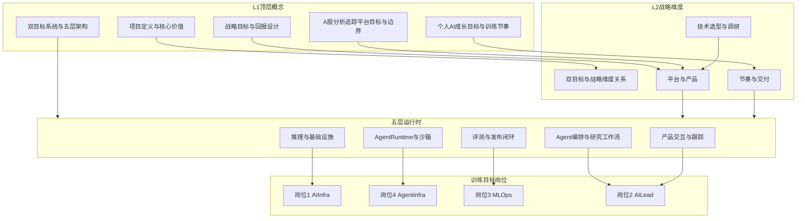

# 谛听（Diting）架构全景图

> [!NOTE] **[TRACEBACK] 架构全景图锚点**
> - **本文档**: 双目标系统的总览入口
> - **顶层概念**: [01_顶层概念/01_项目定义与核心价值.md](./01_顶层概念/01_项目定义与核心价值.md)
> - **战略维度**: [02_战略维度/README.md](./02_战略维度/README.md)

## 核心理念

谛听是一个双目标系统：

- 对外，提供 `A股分析追踪智能平台`
- 对内，沉淀 `AI Infra / Agent Infra / MLOps / AI 产品化` 能力

## 全景总图

```mermaid
flowchart TB
  subgraph l1 [L1顶层概念]
    l1a[项目定义与核心价值]
    l1b[战略目标与回报设计]
    l1c[双目标系统与五层架构]
    l1d[A股分析追踪平台目标与边界]
    l1e[个人AI成长目标与训练节奏]
  end

  subgraph l2 [L2战略维度]
    l2a[双目标与战略维度关系]
    l2b[平台与产品]
    l2c[节奏与交付]
    l2d[技术选型与调研]
  end

  subgraph runtime [五层运行时]
    r5[产品交互与跟踪]
    r4[Agent编排与研究工作流]
    r3[评测与发布闭环]
    r2[AgentRuntime与沙箱]
    r1[推理与基础设施]
  end

  subgraph jobs [训练目标岗位]
    j1[岗位1 AIInfra]
    j2[岗位4 AgentInfra]
    j3[岗位3 MLOps]
    j4[岗位2 AILead]
  end

  l1a --> l2a
  l1b --> l2b
  l1c --> runtime
  l1d --> l2b
  l1e --> l2c

  l2b --> runtime
  l2c --> runtime
  l2d --> l2b

  r1 --> j1
  r2 --> j2
  r3 --> j3
  r4 --> j4
  r5 --> j4
```

## 阅读路径

1. [项目定义与核心价值](./01_顶层概念/01_项目定义与核心价值.md)
2. [战略目标与回报设计](./01_顶层概念/02_战略目标与回报设计.md)
3. [双目标系统与五层架构](./01_顶层概念/03_双目标系统与五层架构.md)
4. [双目标与战略维度关系](./02_战略维度/00_双目标与战略维度关系.md)
5. [平台与产品目录](./02_战略维度/平台与产品/01_产品范围与优先级.md)
6. [节奏与交付目录](./02_战略维度/节奏与交付/01_八个月开发与交付节奏.md)

## 当前范围

L1 与 L2 已完全切到双目标叙事。L3/L4 中仍存在部分历史阶段命名，当前应按新主叙事理解其价值，后续再按阶段逐步迁移。
