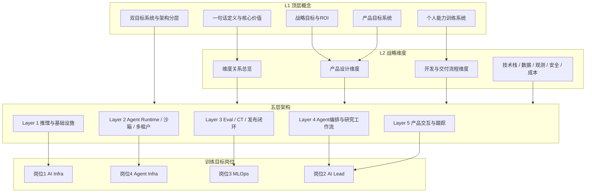

# 谛听（Diting）架构全景图

> [!NOTE] **[TRACEBACK] 架构全景图锚点**
> - **本文档**: 双目标系统的总览入口
> - **顶层概念**: [01_顶层概念/01_一句话定义与核心价值.md](./01_顶层概念/01_一句话定义与核心价值.md)
> - **战略维度**: [02_战略维度/README.md](./02_战略维度/README.md)
> - **说明**: 本文档已从旧的交易轨道主叙事，重构为“产品目标系统 + 个人能力训练系统”的全景架构

## 一、核心理念

谛听不是一个单纯的交易系统，也不是一个脱离业务的练手机器。  
它是一个**双目标系统**：

- 对外，是一个 **A 股分析追踪智能平台**
- 对内，是一个 **AI Infra / Agent Infra / MLOps / AI 产品化训练场**

## 二、全景总图

```mermaid
flowchart TB
  subgraph L1[L1 顶层概念]
    L1A[一句话定义与核心价值]
    L1B[战略目标与ROI]
    L1C[双目标系统与架构分层]
    L1D[产品目标系统]
    L1E[个人能力训练系统]
  end

  subgraph L2[L2 战略维度]
    L2A[维度关系总览]
    L2B[产品设计维度]
    L2C[开发与交付流程维度]
    L2D[技术栈 / 数据 / 观测 / 安全 / 成本]
  end

  subgraph Runtime[五层架构]
    R5[Layer 5 产品交互与跟踪]
    R4[Layer 4 Agent编排与研究工作流]
    R3[Layer 3 Eval / CT / 发布闭环]
    R2[Layer 2 Agent Runtime / 沙箱 / 多租户]
    R1[Layer 1 推理与基础设施]
  end

  subgraph Jobs[训练目标岗位]
    J1[岗位1 AI Infra]
    J2[岗位4 Agent Infra]
    J3[岗位3 MLOps]
    J4[岗位2 AI Lead]
  end

  L1A --> L2A
  L1B --> L2B
  L1C --> Runtime
  L1D --> L2B
  L1E --> L2C

  L2A --> Runtime
  L2B --> Runtime
  L2C --> Runtime
  L2D --> Runtime

  R1 --> J1
  R2 --> J2
  R3 --> J3
  R4 --> J4
  R5 --> J4
```

## 三、L1：顶层概念

### 1. 一句话定义与核心价值

定义项目到底是什么，以及为什么这个项目必须同时服务产品价值与职业价值。

### 2. 战略目标与 ROI

把项目回报拆成三类：

- 产品 ROI
- 能力 ROI
- 资产 ROI

### 3. 双目标系统与架构分层

给出统一的五层架构，把岗位 1/4/3/2 映射到系统不同层级。

### 4. 产品目标系统

定义平台对外到底要解决什么问题：

- 防雷
- 预期差挖掘
- 逻辑跟踪
- 自进化

### 5. 个人能力训练系统

定义副业对你本人要产生什么工程训练价值，尤其聚焦岗位 1 与岗位 4。

## 四、L2：战略维度

L2 把 L1 的双目标拆成可以执行的维度。

### 产品设计轴线

回答：

- 做什么
- 为什么现在做
- 什么先做、什么后做

### 开发与交付轴线

回答：

- 按什么顺序做
- 什么时候引入更重的复杂度
- 如何在 8 个月副业窗口内推进

### 其余产品设计维度

作为支撑维度继续存在：

- 技术栈与架构
- 数据架构
- 生产保障与可观测性
- 安全与机密治理
- 研产同构
- 成本治理
- 平台接入与隔离边界

## 五、五层运行时架构

### Layer 5：产品交互与跟踪

- 候选池
- 研究卡片
- thesis 跟踪
- 退出提醒

### Layer 4：Agent 编排与研究工作流

- 财报 Agent
- 新闻 Agent
- 产业链 Agent
- RAG 与证据引用
- 结构化结论生成

### Layer 3：Eval / CT / 发布闭环

- 标注集
- 评测集
- Prompt / Workflow 回归
- 灰度发布与回滚

### Layer 2：Agent Runtime / 沙箱 / 多租户

- 隔离执行
- 长任务管理
- 会话级状态
- 资源配额
- 运行时观测

### Layer 1：推理与基础设施

- 自托管推理
- `vLLM`
- `Kubernetes`
- 资源治理
- FinOps

## 六、岗位映射

| 岗位 | 系统主战场 | 在项目中的体现 |
|---|---|---|
| 岗位 1：AI 基础设施研发 | Layer 1 | 自托管推理、K8s、观测、成本治理 |
| 岗位 4：智能体基础设施工程师 | Layer 2 | 沙箱、长任务、多租户、隔离、安全 |
| 岗位 3：MLOps | Layer 3 | Eval、版本、灰度、回滚、CT |
| 岗位 2：AI 技术负责人 | Layer 4/5 | 业务抽象、Agent 工作流、产品取舍 |

## 七、建议阅读顺序

### 快速了解

1. [01_顶层概念/01_一句话定义与核心价值.md](./01_顶层概念/01_一句话定义与核心价值.md)
2. [01_顶层概念/02_战略目标与ROI.md](./01_顶层概念/02_战略目标与ROI.md)
3. [01_顶层概念/03_双轨制与VC-Agent.md](./01_顶层概念/03_双轨制与VC-Agent.md)

### 进入执行

4. [02_战略维度/00_维度关系总览.md](./02_战略维度/00_维度关系总览.md)
5. [02_战略维度/产品设计/01_产品设计维度.md](./02_战略维度/产品设计/01_产品设计维度.md)
6. [02_战略维度/开发与交付/01_开发与交付流程维度.md](./02_战略维度/开发与交付/01_开发与交付流程维度.md)

### 深入实现

7. [03_原子目标与规约/README.md](./03_原子目标与规约/README.md)
8. [04_阶段规划与实践/README.md](./04_阶段规划与实践/README.md)
9. [05_成功标识与验证/02_验收标准.md](./05_成功标识与验证/02_验收标准.md)

## 八、当前迁移状态说明

L1 与 L2 已切换到新叙事。  
L3、L4、L5 中仍有部分历史命名与旧交易轨道表述，当前应理解为：

- 它们属于待逐步迁移的下层文档
- 旧概念暂时作为历史模块名或实验分支存在
- 不再主导整个项目的顶层解释

## 一致性检查表

- [x] 已将总览入口切换到“双目标系统”
- [x] 已把岗位映射纳入总览主图
- [x] 已把运行时统一为五层架构
- [x] 已明确 L1/L2 已迁移、L3/L4 待逐步迁移

## 下一步

→ [01_顶层概念/01_一句话定义与核心价值.md](./01_顶层概念/01_一句话定义与核心价值.md)  
→ [02_战略维度/README.md](./02_战略维度/README.md)
