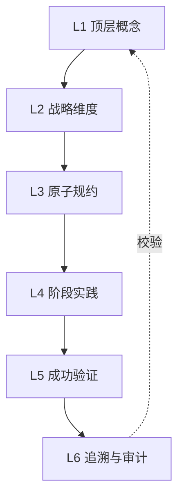

# 通用项目文档系统规则 (Universal Doc Protocol)

**版本**：v1.1  
**适用范围**：任意项目的文档仓（可配合代码仓、部署仓使用）  
**设计目标**：建立「顶层概念 → 战略维度 → 原子规约 → 阶段实践 → 成功验证 → 追溯与审计」的可追溯文档体系，适配 AI 协作与人类架构师协作。

**文档定位**：本文档为文档仓内**完整协议正文**，与工作区根目录 `.cursorrules` 中的同名规则保持同步；AI 与人类在文档仓内操作时以本文件为权威引用。

---

## 目录

- [规则生效要点（AI 必读）](#规则生效要点ai-必读)
- [快速导航与角色视图](#快速导航与角色视图)
- [一、核心理念 — 双核共生](#一核心理念--双核共生)
- [二、共识前提](#二共识前提)
- [三、六级架构层次](#三六级架构层次)
- [四、强制联动规则](#四强制联动规则)（含 [4.0 系统规则自身的同步（元规则）](#40-系统规则自身的同步元规则)、4.4 冲突与裁决、[4.5 关键重构与系统规则同步](#45-关键重构与系统规则同步)）
- [五、追溯锚点格式](#五追溯锚点格式)
- [六、核心工作流](#六核心工作流)
- [七、AI 执行与重构要求](#七ai-执行与重构要求)
- [八、L4 实践文档创建与 AI 协作规范](#八l4-实践文档创建与-ai-协作规范)（含 [8.4d DNA 为核心实践目标与核心指令引用 AI 可读](#84d-dna-为核心实践目标与核心指令引用-ai-可读)、[8.4e 实践文档可执行性与按文档验证](#84e-实践文档可执行性与按文档完成所有验证且不偏离不臆造)）
- [九、违规与修复](#九违规与修复)
- [十、如何开始](#十如何开始)
- [十一、项目定制化](#十一项目定制化)
- [十二、DNA 机制 — _System_DNA](#十二dna-机制--_system_dna)
- [十三、英文简写与技术名词对照表规则](#十三英文简写与技术名词对照表规则ai-自动执行)
- [使用说明](#使用说明)
- [协议修订记录](#协议修订记录)

---

## 规则生效要点（AI 必读）

以下要点确保本协议在每次协作中生效，AI 须在相关操作时自动遵守：

| 场景 | 强制动作 |
|------|----------|
| **生成/重构文档** | 先读 L3 规约或 `_System_DNA/`；输出含 `[TRACEBACK]` 的追溯锚点；结束时输出「一致性检查表」；涉及结构或全局约定变更时含对 00_系统规则 的同步（见 §4.0/§4.5） |
| **L4 实践/代码** | 步骤中明确 **工作目录**（如 `{project}-src`）；逻辑密集走 5D；代码注释含 `[Ref: 03_XX]` 或 `[Ref: 便利贴_XXX]` |
| **架构图** | 仅用 Mermaid 嵌入 Markdown；与 L3 规约一致；同一文档内选用 §7.4 一种可视化风格并保持一致 |
| **术语与能力** | 不臆造规约外技术栈；L3 中文业务语→代码用项目约定英文（如 积分→Credits） |
| **英文简写与技术名词** | 见 §十三：先检测对照表是否存在；使用简写或技术名词时查表、缺则补表；同一文档内首次出现附中文或释义，后续不重复 |
| **关键重构（任意层）** | 将更新后的关键逻辑（如目录约定、轴线划分、链接约定等）同步到本协议相应小节（如 §3.2、§4、§7.1）；并输出一致性检查表 |
| **产出涉及关键重构的变更计划/待办** | **生成计划时须先自检**：本次变更是否涉及关键重构（含 L4 阶段/步骤模板、Phase 结构等全局约定）？**若是，待办须显式包含**「按 §4.5 同步 00_系统规则（及 .cursorrules）」；执行顺序见 §4.5。未包含则违规。 |
| **L4 实践文档与核心指令** | 实践文档与核心指令以 **DNA 为核心实践目标**；核心指令内对文档/DNA 的**逻辑引用须以 AI 可读方式**呈现（完整路径、DNA 键路径或结构化引用块），见 §8.4d、§12。 |
| **L4 实践文档新增/修改** | 凡在 04_ 下**新增或修改实践文档**（阶段步骤文档，含各 Stage 下 01_～0N_）时，AI 须**判读是否为实践文档**；若是，产出须满足「**按文档完成所有验证且不偏离、不臆造**」之目标，见 §8.4e。 |

完整条文见下方各节。

### 快速导航与角色视图

- **最小必读**：§一 核心理念、§三 六级层次（含 3.5 职责边界）、§7.2 AI 守则、§十三 简写与技术名词。
- **按角色**：**架构师** — §一、§三、§四、§十二；**实现者** — §3.5、§八、§十二；**AI** — §七、§八、§十三。
- **完整协议**：按节顺序阅读，用于深度落地与审计。

---

## 一、核心理念 — 双核共生

解决「人类思维局限」与「系统复杂度」之间的矛盾：**人类定义战略，AI 补全实施**。

| 角色 | 层级 | 职责 |
|------|------|------|
| **人类架构师** | L1～L2 | 定义愿景、战略维度、关键约束；审查推演结果；裁决冲突 |
| **AI** | L3～L6 | 推演架构细节、生成代码/文档；维护追溯矩阵与审计；执行便利贴 GC |

**四大原则**：
1. **定义者 vs 补全者**：人类负责 L1～L2；AI 负责 L3～L6。
2. **配置即文档**：L3 优先用结构化表达（表格、列表、YAML），便于 AI 解析。
3. **惰性一致性**：不要求实时全量同步；用「增量便利贴」+ 定期合并。
4. **垂直切片**：L4 按特性打通数据→API→UI，避免横向断层。

---

## 二、共识前提

- **多仓库策略**（可选）：常见为三仓库 — **文档仓**、**代码仓**、**部署仓**。本协议约束文档仓。
- **文档仓定位**：仅存放项目文档，不含代码或运行时配置。
- **记录范围**：从顶层概念到战略维度、原子规约、阶段实践、成功验证与追溯审计。
- **层级原则**：上层定「为什么、做什么」，下层定「怎么做、做到哪」；下层须能溯源到上层。
- **本协议作为受约束文档**：`00_系统规则_通用项目协议.md` 是文档仓内受本协议约束的文档之一；当文档仓结构或全局约定发生变更时，本协议须与现状一致（见 §4.0、§4.5）。

---

## 三、六级架构层次

```
L1 (顶层概念) ↔ L2 (战略维度) ↔ L3 (原子规约) ↔ L4 (阶段实践) ↔ L5 (成功验证) → L6 (追溯与审计)
```

| 层级 | 目录 | 职责 |
|------|------|------|
| **L1** | `01_顶层概念/` | 定义项目根本定位与价值主张 |
| **L2** | `02_战略维度/` | 拆解为可落地的战略维度与覆盖面；**侧重技术/逻辑架构**（选型、维度划分、依赖关系），不写接口与实现细节 |
| **L3** | `03_原子目标与规约/` | 原子能力规约、技术规约、架构共识；**侧重实现设计与规约**（接口定义、协议、配置、可执行规约），不写单次迭代步骤 |
| **L4** | `04_阶段规划与实践/` | 阶段规划、实施步骤、实践记录 |
| **L5** | `05_成功标识与验证/` | 完成情况、验收标准、验证方法 |
| **L6** | `06_追溯与审计/` | 追溯矩阵、审计报告、增量便利贴 |

### 3.1 层级关系



### 3.2 文档目录体系（通用模板）

```
{project}-doc/
├── 00_系统规则_通用项目协议.md    # 本协议；结构或全局约定变更时须同步（§4.0/§4.5）
├── 01_顶层概念/
│   ├── 01_一句话定义与核心价值.md
│   └── 02_战略目标与ROI.md
├── 02_战略维度/
│   └── 01_维度A.md, 02_维度B.md ...
├── 03_原子目标与规约/
│   ├── _System_DNA/               # [可选] YAML 配置区
│   │   ├── global_const.yaml
│   │   ├── dna_dev_workflow.yaml  # workflow_stages 与 L4 Stage 1:1；每步含 design_doc、dna_file
│   │   ├── Stage1_仓库与骨架/～Stage5_优化与扩展/  # 步骤级 DNA（dna_stageX_0Y.yaml），与 03_ 设计、04_ 步骤 1:1:1
│   │   └── core_modules/          # Module A～F 语义（dna_module_a～f），被 Stage3 步骤引用
│   ├── _共享规约/                 # 跨 Stage 引用（01_核心公式、02_三位一体、04_协议矩阵、05_接口抽象层、09_核心模块、11_数据采集 等）
│   ├── Stage1_仓库与骨架/～Stage5_优化与扩展/  # 按 Stage 设计 doc + _DNA/
│   ├── _Design_Artifacts/protocols/  # Proto 定义（classifier/quant/trade_signal 等）
│   └── 01_能力规约A.md ...
├── 04_阶段规划与实践/
│   ├── Stage1_仓库与骨架/        # 01_三位一体、02_核心接口与Proto、03_密钥与配置
│   ├── Stage2_数据采集与存储/    # 01_基础设施～05_采集模块部署与验收
│   ├── Stage3_模块实践/          # 01_ModuleA～06_ModuleF、07_全链路验证
│   ├── Stage4_MoE与执行网关/     # MoE、执行网关、回测/仿真
│   └── Stage5_优化与扩展/        # 可观测性、成本治理、多策略、Level1 入口
├── 05_成功标识与验证/
│   ├── 01_完成情况.md
│   └── 02_验收标准.md
├── 06_追溯与审计/
│   ├── 01_顶层概念实现完成情况.md
│   ├── 02_战略追溯矩阵.md
│   └── 03_审计与一致性报告/
│       └── _增量便利贴/
└── README.md
```

**轴线子目录约定（可选）**：规模或双轨拆分需要时，可在层级目录下按轴线设子目录，并同步更新全仓链接。  
- **02_战略维度/**：可在其下设子目录（如 `开发与交付/`、`产品设计/`），对应维度文档置于相应子目录。迁移后 02 根下**仅保留** `00_维度关系总览.md`、`README.md` 与两轴线子目录；**产品设计轴线**含 `01_产品设计维度`（总纲）及 `02_～09_` 等维度（如 `02_技术栈与架构维度`、`09_通俗易懂的逻辑链路图`）。  
- **03_原子目标与规约/**：可在其下设子目录（如 `开发与交付/`、`产品设计/`），对应规约文档置于相应子目录；其余规约与 `_System_DNA/` 可保留在 03 根下。  
- 全仓引用上述文档时，链接路径须含轴线子目录名（如 `02_战略维度/开发与交付/01_...`、`02_战略维度/产品设计/02_...`）。关键重构后须按 §4.5 将本约定同步至本协议。

### 3.3 骨肉分离（可选）

规模较大时，L3 可将机器可读配置与人类可读解释分离：

| 区域 | 用途 | 特点 |
|------|------|------|
| **骨架** | `_System_DNA/` 下 YAML | AI、脚本；高压缩、无歧义 |
| **血肉** | 各能力目录下 Markdown | 人类；含解释、Mermaid 图 |

### 3.4 增量便利贴

**场景**：小改动（加字段、改阈值）不宜直接改长篇设计文档。

**流程**：
1. 在 `06_.../03_.../_增量便利贴/` 新建文件（如 `20260212_增加字段.txt`）；
2. 写下口语化需求；
3. Prompt：`@便利贴文件 按需求更新代码/文档，注释中标注 [Ref: 便利贴_文件名]`；
4. **熔断**：文件数 ≥10 或每周五/Sprint 结束前，必须合并并清空。
5. **便利贴合并**：合并入正式文档后，若该文档的标题或结构（含锚点）发生变更，须检查并更新 06_、ADR 及所有指向该文档的链接。

**责任与触发**：熔断前由 Sprint 负责人或由 AI 在专门会话执行合并；建议使用日历或 CI 提醒（如每周五检查未合并便利贴数量）。建议使用文档仓 `scripts/` 在熔断前检查便利贴数量（见 `scripts/check_sticky_count.sh`）。

### 3.5 层级职责边界

- **L1**：只写「是什么、为什么做、核心价值」；不写功能清单或技术实现。
- **L2**：只写「从哪几个维度落地、每个维度覆盖什么」；**侧重技术/逻辑架构**（选型、维度关系、覆盖范围）；不写接口或排期。
- **L3**：写「原子能力规约、技术规约、架构共识」；**侧重更细致化的实现设计与规约**（接口定义、协议矩阵、配置项、可执行规约）；不写单次迭代步骤。
- **L4**：写阶段目标、实施步骤、实践记录；须引用 L3 规约；AI 须遵守第八节 L4 实践文档创建与 AI 协作规范。
- **L5**：验证战略维度对应功能的完成情况、验收标准、验证方法。
- **L6**：维护追溯矩阵、审计报告、便利贴；不承载业务内容。

---

## 四、强制联动规则

### 4.0 系统规则自身的同步（元规则）

- 本协议（`00_系统规则_通用项目协议.md`）是文档仓内的一份文档，且为文档仓的**单一事实来源**。
- 凡变更文档仓**结构**（如目录、轴线）、**全局约定**（如链接规则、命名、L2↔L3 映射方式）或与协议某条描述**直接相关**的实践时，执行方须**自检**：本协议是否仍准确反映现状；若否，须在当次变更中或紧随其后更新本协议相应小节（参见 §4.5）。
- 本条款不替代 §4.5，而是与 §4.5 共同构成「关键重构 → 必须回写」与「任意相关变更 → 须自检并视情况回写」的双重保障。

### 4.1 向下传播

- **L2 变更** → 查 `06_追溯与审计/00_L2_L3_DNA_映射.md`（或项目约定的 L2↔L3↔DNA 映射）得到受影响 L3 与 DNA 列表 → 按 **变更传播顺序** 执行（见下）；新增 L2 维度时须同步维护该映射表。
- **L2 维度变更传播顺序**：当 L2 某维度内容变更时，（1）先更新该维度的**主责 L3 文档**；（2）再同步对应 **DNA 子树**（`_System_DNA/global_const.yaml` 或约定 dna_*.yaml）；（3）最后检查 L4 阶段/步骤是否仍引用正确 DNA 键。若某维度由多份 L3 联合支撑，以映射表中的「牵头规约」为变更第一落点。
- L1 变更 → 检查 L2/L3/L4/L5 是否有对应表述。
- L3 变更 → 同步 L4 阶段、L5 验收项；涉及 DNA 键时须同步 global_const 或对应 dna_* 文件。**DNA 的 workflow_stages 或 product_scope.phases[].steps 变更**时，须同步 L4 阶段/步骤文档中的引用（如 work_dir、verification_commands、本步骤落实的 DNA 键）及 L5 表体（或重新从 DNA 生成/校验一致）。
- **DNA 的 workflow_stages 新增或删除**时，须在 [05_成功标识与验证/02_验收标准](05_成功标识与验证/02_验收标准.md) 中同步新增或删除对应行及显式锚点（如 `<a id="l5-stage-stageX_0Y">`）；可选步骤仍保留行与锚点，状态可为「跳过/不适用」。
- **某 stage 的 dna_file 或 dna_dev_workflow 对应条目发生变更时**（含 delivery_scope、exit_criteria、work_dir、verification_commands、l5_stage_anchor），须在**当次或紧随的 MR** 中复核并更新对应 04_ 步骤文档（「本步骤落实的 DNA 键」、核心指令、可执行验证清单、工作目录等）；可选：使用 06_/03_ 或 scripts/ 下提供的「按 stage_id 列出对应 04_ 文件」脚本在 MR 前自检或 CI 提示。
- **L3 或 04_ 步骤新增、删除或重命名**时，须同步更新 03_ README 或 06_ 的「设计–DNA–实践–L5」索引表。

### 4.2 向上溯源

- L4 每阶段须可溯源到 L3 规约、L2 维度、L1 价值；
- L5 每条验收须标明对应 L3 能力与 L1 价值点。

### 4.3 横向一致

- 同层级内术语一致，避免重复定义；冲突时以架构师或项目负责人裁决为准，见下「冲突与裁决」。

### 4.4 冲突与裁决

- **裁决权**：同层级或跨层级（含 L3 与代码仓实现）冲突，由架构师或项目负责人裁决。
- **记录**：裁决结果须记入 `06_追溯与审计/ADR/` 的 ADR，并注明受影响的 L2/L3 文档或矩阵行。
- **同步**：执行方更新受影响文档或战略追溯矩阵，并在 TRACEBACK 或文末引用该 ADR。

### 4.5 关键重构与系统规则同步

- **适用**：任意层（L1～L6）发生**关键重构**时，须将**更新后的关键逻辑**同步到本协议（`00_系统规则_通用项目协议.md`）。
- **关键重构**包括但不限于：目录结构变更（如新增轴线子目录）、层级/维度划分变更、追溯链或链接约定变更、L2↔L3 映射方式变更。
- **动作**：执行方在当次重构内完成：（1）识别本次重构所涉的关键逻辑；（2）将上述逻辑写入本协议对应小节（如 §3.2、§4、§7.1）或新增条文；（3）更新本协议目录（若有新增节）；（4）确保后续协作以新规则为准。
- **责任**：当次重构的执行者在本轮会话/提交中完成系统规则更新；发布前由负责人或 AI 核对协议与现状一致。
- **计划与待办**：凡产出涉及关键重构的 **L2/L3/DNA/L4 变更计划或待办列表**时，待办中须**显式包含**一项：「按 §4.5 同步 00_系统规则_通用项目协议（及 .cursorrules）」。该待办在执行顺序上安排在关键逻辑落地（如规约修订、DNA 更新）之后，L4/L5/L6 更新之前或与之并行。AI 与人类在生成此类计划时须默认加入此项，不得依赖事后检查表补漏。
- **计划/待办生成时自检**：AI 或人类在**产出** L2/L3/DNA/L4 变更计划或待办列表时，须**先自检**：本次变更是否涉及**关键重构**（含目录/轴线、全局约定、L4 阶段/步骤模板、Phase 或 Stage 结构约定等）？若涉及，待办列表中**必须**包含上述「系统规则同步」项；未包含则视为违反本协议。自检在输出待办列表之前完成，不依赖事后一致性检查表补漏。

---

## 五、追溯锚点格式

### 5.1 推荐格式

```markdown
> [!NOTE] **[TRACEBACK] 战略追溯锚点**
> - **顶层概念**: [一句话定义](01_顶层概念/01_xxx.md)
> - **战略维度**: [维度A](02_战略维度/产品设计/02_xxx.md) 或 [开发与交付](02_战略维度/开发与交付/01_xxx.md)
> - **原子能力**: [规约A](03_原子目标与规约/01_xxx.md)
> - **阶段**: [Phase1](04_阶段规划与实践/Phase1_xxx/)
```

### 5.2 L3 规约文档须包含战略维度链接

- **要求**：每份 L3 规约的 TRACEBACK 中必须包含「**战略维度**：链接到具体 L2 维度文档」；若一份 L3 支撑多个 L2 维度，至少写主责维度（主责见 [06_追溯与审计/00_L2_L3_DNA_映射](06_追溯与审计/00_L2_L3_DNA_映射.md)）。
- **目的**：便于 L2 变更时定位主责 L3，且可从 L3 反查所属 L2 维度。

### 5.3 禁止

- 追溯锚点放在代码块或 HTML 注释内；
- 无 `[TRACEBACK]` 标识的零散链接。

### 5.4 锚点命名约定

**目的**：全仓引用与指向均有可解析的索引锚点；命名单点约定，便于 AI、人工与脚本一致使用。

- **L3 阶段设计文档**：`design-{stage}-{step}-goal`、`design-{stage}-{step}-exit`、`design-{stage}-{step}-dna-keys`（stage/step 如 stage1、02，与 DNA stage_id 对应）。
- **L4 步骤文档**：`l4-{stage}-{step}-goal`（本步目标）、`l4-{stage}-{step}-exit`（验证与准出/本步骤准出）；可选：`l4-{stage}-{step}-dna-keys`、`l4-{stage}-{step}-verify`、`l4-{stage}-{step}-fail`；步骤导航区块 id 建议 `l4-step-nav`。
- **L5**：`l5-stage-{stage_id}`（如 `l5-stage-stage1_02`）；功能验收表保持 `l5-mod-A`、`l5-func-02` 等。
- **格式**：仅小写字母、数字、连字符；stage 与 step 在锚点中用连字符，与 DNA 的 stage_id 下划线区分（如 stage_id 为 stage1_02，锚点为 l4-stage1-02-exit）。**复制或拆分步骤文档时须替换文档内全部锚点 id 为当前步骤对应 id，禁止重复 id。**

### 5.5 设计文档索引锚点（L3 阶段设计文档）

**目的**：使设计文档对 DNA、L4、L5 的引用可深链到具体段落，便于读者与脚本跳转；设计文档自身关键节可被 04_、06_、中央索引表反链。

- **TRACEBACK 中的引用**：
  - **DNA**：使用可点击的 Markdown 链接指向步骤级 DNA 文件（文件级，YAML 无段落锚点），禁止仅写行内代码路径。
  - **L4 实践**：链接须带目标文档的显式锚点，如 `#l4-{stage}-{step}-exit` 或 `#l4-{stage}-{step}-goal`（与 04_ 步骤文档内显式锚点一致，见 §5.4 锚点命名约定）。
  - **L5**：若提及「准出时更新 L5」或「L5 对应行」，须链到 [05_成功标识与验证/02_验收标准](05_成功标识与验证/02_验收标准.md) 对应行锚点 `#l5-stage-stageX_0Y`。
- **设计文档内关键节**：小节「本步目标」「设计要点」「准出」「本步落实的 _System_DNA 键」（若有）须可作为**索引锚点**被外链。推荐在标题前使用显式 HTML 锚点，如 `<a id="design-stage2-01-goal"></a>`；或采用统一命名约定：`design-{stage}-{step}-goal`、`design-{stage}-{step}-exit`、`design-{stage}-{step}-dna-keys`（其中 stage/step 如 stage2、01）。04_ 步骤文档引用「本步设计文档」时须使用上述锚点（如 `#design-stage2-01-exit` 或 `#design-stage2-01-goal`）。
- **04_ 步骤文档**：须具备可外链的「本步目标」「准出」显式锚点（`l4-{stage}-{step}-goal`、`l4-{stage}-{step}-exit`）及步骤导航（上一步/下一步），且步骤导航中的链接须带 #。
- **中央索引表**：03_ README 或 06_ 应维护「设计–DNA–实践–L5」索引表，每行 stage_id 对应设计文档（带 #）、DNA 文件、L4 步骤（带 #l4-*-exit 或 #l4-*-goal）、L5 锚点，链接均可点击；表旁注明 L4 列为准出锚点（#l4-*-exit）。

---

## 六、核心工作流

| 阶段 | 操作者 | 目标 |
|------|--------|------|
| **基因定义** | 人类 | L2 → L3：将战略转化为结构化规约 |
| **垂直生长** | AI | L3 → L4 → 代码：按规约生成实践与实现 |
| **增量维护** | AI | 便利贴 → 小改并入对应文档 |
| **定期合并** | AI | 熔断触发时合并便利贴并清空 |

**责任与触发（战略追溯矩阵）**：每次 L4 阶段完成或 L3 规约发生结构性变更后，由当次执行者（人或 AI）在本轮会话/提交中更新 `06_追溯与审计/02_战略追溯矩阵.md` 中受影响行；每次重大重构或发布前，由负责人或 AI 在专门会话中核对矩阵与各层文档一致。

---

## 七、AI 执行与重构要求

### 7.1 重构时须

0. **入口自检**：先判断本次是否涉及目录结构、轴线划分、链接约定或 L2↔L3 映射方式；若是，列出可能受影响的协议小节（如 §3.2、§4、§7.1），在本轮重构内完成对本协议的更新（见 §4.0、§4.5）。
1. 按目录体系迁移文件，保证层级正确；
2. 补全追溯锚点（Callout 格式）；
3. 更新 `02_战略追溯矩阵.md`，标注验证状态（✅/⚠️/❌）；**触发**：当次重构/变更由当次执行者在本轮会话中更新矩阵受影响行；发布前由负责人或 AI 专门核对矩阵与各层一致；
4. 输出一致性检查表。
5. **关键重构时**：将更新后的关键逻辑（目录约定、轴线划分、链接约定等）同步到本协议相应小节或新增条文，并更新协议目录（见 §4.5）。

### 7.2 AI 守则（通用 + L4 强化）

1. **先读规约（Read First）**：生成前先读 L3 相关规约（若有 `_System_DNA` 则优先喂给该目录，省 Token、防歧义）；
2. **禁止臆造（No Hallucination）**：不臆造规约中未定义的技术栈或能力；
3. **可追溯（Traceability）**：代码/文档注释含 `[Ref: 03_XX]` 或 `[Ref: 便利贴_XXX]`；
4. **语言约定（Language）**：L3 可用中文业务术语；生成代码时须译为项目约定的英文（如规约中的 `积分` → 代码中的 `Credits`）。

### 7.3 架构图规范

- 禁止仅存二进制图（.png/.jpg/.pptx）；架构图用 **Mermaid** 嵌入 Markdown；
- 架构图应与 L3 配置/规约一致。

### 7.4 可视化风格规范 (Visual Style Guidelines)

为确保架构图一致性与可读性，采用以下四种标准可视化风格（同一文档内择一并保持一致）：

| 风格 | 配色/元素 | 适用场景 |
|------|-----------|----------|
| **清新活力** | 明亮色（青绿/橙黄/天蓝/紫罗兰）；圆角+细边框 | 产品演示、创新功能、团队沟通 |
| **极简主义** | 单一蓝色系渐变；直角、无图标，颜色深度区分层次 | 技术文档、内部架构、信息层级 |
| **深色模式** | 深色背景+霓虹边框；白/金文字、高对比 | 技术会议、开发者文档、夜间环境 |
| **极光渐变** | 紫/薰衣草/青绿渐变；透明与流动感 | 高管汇报、创新展示、品牌宣传 |

**使用原则**：按受众、场景与文档整体风格择一；禁止同一文档内混用多种风格。可根据项目需求微调配色。

### 7.4a 设计文档索引锚点（与 §5.5 一致）

L3 阶段设计文档（03_/StageX_*/YY_*设计.md）须遵守 §5.5：TRACEBACK 中 DNA 为可点击链接、L4 实践带 #l4-*-exit 或 #l4-*-goal、L5 有则带 #；关键节（本步目标、设计要点、准出、本步落实的 _System_DNA 键）须具备可外链锚点。重构或新增此类文档时须同步更新 03_ README 或 06_ 的「设计–DNA–实践–L5」索引表（若有）。

### 7.5 一致性检查表

```markdown
## 一致性检查表
- [ ] 01_～06_ 目录层级正确
- [ ] 关键文档含 [TRACEBACK] 追溯锚点
- [ ] 战略追溯矩阵已更新且无断链
- [ ] 架构图使用 Mermaid，可追溯至规约
- [ ] 层级边界清晰，无错层堆放
- [ ] 架构图已按 §7.4 选定一种可视化风格且全文一致
- [ ] 英文简写与技术名词已按 §十三查表、首次附中文或释义
- [ ] 若项目提供 `scripts/` 一致性检查，其通过可作为本表部分满足条件
- [ ] 若为关键重构，系统规则已同步更新（§4.5）
- [ ] **设计文档索引锚点**：03_ 阶段设计文档 TRACEBACK 中 DNA 为可点击链接、L4 带 #l4-*-exit 或 #l4-*-goal、L5 有则带 #；关键节具备可外链锚点
- [ ] **中央索引表**（若有）：03_ README 或 06_ 的「设计–DNA–实践–L5」索引表完整且链接含 # 可解析
- [ ] **L4 步骤文档锚点**：04_ 步骤文档关键节（本步目标、准出）具备显式锚点（l4-*-goal、l4-*-exit）；步骤导航（上一步/下一步）存在且链接带 #；复制/拆分步骤文档须替换锚点 id
- [ ] **DNA 为核心实践目标**：04_ 实践文档与核心指令以 DNA 为权威，冲突以 DNA 为准
- [ ] **核心指令引用 AI 可读**：核心指令内对文档/DNA/L5 的引用为完整路径、DNA 键路径或结构化引用块
```

---

## 八、L4 实践文档创建与 AI 协作规范

本节适用于 **AI 参与创建或补全 L4 阶段实践文档、实施步骤、代码实现** 的场景，确保高效、准确、可追溯。

### 8.1 核心心法

**你是架构师，AI 是初级程序员。**

- **永远不要让 AI 替你做架构决策**：输入/输出结构、计算规则、边界条件、数据模型由人定义；AI 在约束内补全实现与测试。
- **设计左移 + 测试锚定**：先锁死数据结构与用例，再让 AI 写代码；验收标准是「测试从红变绿」，而非「跑一遍感觉对」。

### 8.2 5D 闭环模型（AI 须遵守）

| 步骤 | 英文 | 人的动作 | AI 的动作 |
|------|------|----------|-----------|
| **Design** | 设计左移 | 写伪代码、定义接口与结构体；用自然语言 + 代码片段锁死逻辑路径 | 理解意图，补全类型定义与流程，确认逻辑无歧义 |
| **Drive** | 测试驱动 | 定义测试用例：输入、期望输出、边界；不写实现 | 生成 Table-Driven 测试（先红灯） |
| **Decompose** | 原子拆解 | 将大功能拆成单一职责函数（建议 <50 行/函数） | 实现具体原子函数 |
| **Dispatch** | 模型路由 | 难逻辑给聪明模型，脏活给便宜模型 | 按分配执行 |
| **Defense** | 人工防御 | 运行测试、Code Review、确认业务规则覆盖后 Commit | 根据失败日志与 Review 意见修复 |

**口诀**：Design 锁逻辑 → Drive 锚测试 → Decompose 拆原子 → Dispatch 选模型 → Defense 人把关。

### 8.3 何时走全 5D vs 简化

| 场景 | 建议 | 说明 |
|------|------|------|
| **逻辑密集**（公式、算法、聚合、判定、证据链） | **必须走齐 5D** | 公式、边界、零值处理需测试锚定 |
| **CRUD、HTTP 绑定、DTO 映射、静态页** | Design + Decompose 后可直交 | 体力活可简化 |
| **NFR 敏感**（精度 <1%、性能、安全） | 全 5D + 专门验证 | 如成本核算、财务口径 |

### 8.4 工作目录强制

L4 实践文档中的实施步骤须**明确标注工作目录**，避免在错误仓库操作。**工作目录与多仓路径的权威定义**见 [04_阶段规划与实践/README](04_阶段规划与实践/README.md) 的「工作目录与多仓路径约定」；步骤内仍须明确标注工作目录（如 `diting-core`）。

| 类型 | 工作目录示例 | 示例说明 |
|------|--------------|----------|
| 源码 | `{project}-src` | 后端、前端、共享库 |
| 部署 | `{project}-deploy` | Helm、Values、K8s、CI 配置 |

每个实践步骤的 Prompt 或验收项须包含 `工作目录: xxx`。

**书写规范**：工作目录须统一为**仓库名**（如 `diting-core`、`diting-infra`）；若执行依赖特定分支，须注明「branch: xxx」；多仓库场景下避免歧义（可约定「相对工作区根或文档仓的说明」）。格式建议符合上述约定。

**工作目录与 DNA 对齐**：步骤内工作目录须与 DNA `workflow_stages[].work_dir` 的 description 一致，或在「本步骤落实的 _System_DNA 键」表中列出 `work_dir`；核心指令首句或「工作目录」小节须出现与 DNA 一致的工作目录表述（见 §8.4a、§12）。

### 8.4a 步骤文档模板（04_ 阶段目录内）

阶段目录内**步骤文档统一命名为** `01_本阶段实践与验证.md`，须包含：

- **本步骤落实的 _System_DNA 键**：须含小节「本步骤落实的 _System_DNA 键」，列出本阶段**消耗/产出的 DNA 根节点或键路径**（如 `core_formula`、`trinity_repos`、`dna_dev_workflow.workflow_stages[s0]`）；可用表格（DNA 键 | 用途）或「DNA 根节点：xxx、yyy」形式，便于与 [06_追溯与审计/00_L2_L3_DNA_映射](06_追溯与审计/00_L2_L3_DNA_映射.md) 联合做覆盖度检查。实施内容与验证步骤**按这些键展开**（如目录列表从 DNA 来、验收命令从 make_targets 来）。**工作目录**、**可执行验证命令**须从 DNA 的 `workflow_stages[].work_dir`、`workflow_stages[].verification_commands` 引用或与之一致（见 §12）；准出时更新的 L5 行锚与 DNA 的 `l5_stage_anchor` 一致。
- **完整实践指令**：步骤目标、前置条件、实施内容、验收标准、环境阶段；追溯锚点；**工作目录**（见 8.4；以 DNA work_dir 为权威）。
- **目标验证步骤**：最小闭环验证列表与准出检查清单（可执行勾选）；此处为阶段内**唯一**展开的准出清单。须包含**可执行验证清单**：每条为「**命令** + **工作目录** + **期望结果**（如退出码 0）+ **对应 DNA 键**」；命令须与 DNA 的 `verification_commands` 或代码仓 Makefile/CI 一致（见 §十一 文档仓与代码仓契约、§12）。
- **交付范围**：01_ 或 README 须**从 dna_dev_workflow 对应 stage 的 delivery_scope 直引**；若由 Phase 细化，写明「最小交付范围见上（DNA）；具体任务拆分见 PhaseX/YY」并链接。
- **验证结果说明**：准出时须更新 L5 的指向（见 04_阶段规划与实践/README 验证结果策略）；**不在本文档内嵌入可填写的验证结果表**（避免指令与可变状态混合）。
- **准出检查清单末条**：准出检查清单**最后一条**为必勾：「已更新 L5 [02_验收标准](path) 中本 stage 对应行（状态+验证方式）」；未更新视为未准出。
- **逻辑密集时必填**：**5D 对应**（本步骤主要涉及 Design/Drive/Decompose/Defense 中的哪几步）；**测试锚定位置**（测试文件路径或用例 id）。
- **本步骤失败时**（必填）：01_ 须含小节「本步骤失败时」，至少包含：回退目标（上一 stage 准出或本阶段第一步）、重试上限（建议 3）、临时跳过须谁审批；并须写一句「具体回退操作见 [03_项目全功能开发测试实践工作流详细规划 八、失败与回退策略](03_原子目标与规约/开发与交付/03_项目全功能开发测试实践工作流详细规划.md#八失败与回退策略)」。与 03_ 文档中「失败与回退策略」层级对应。
- **DNA/L3 变更时复核**：本步骤所依赖的 DNA 键或主责 L3 发生变更时，须复核本步骤实施内容与验证清单，必要时重跑或更新 01_；影响范围见 [06_追溯与审计](06_追溯与审计/) 下 L3/DNA→L4 影响表（若有）。
- **安全与成本引用**：若本步骤涉及密钥/凭证或部署资源选型，须引用 L3 安全与机密规约（如 02_三位一体 repo_a.secrets、05_安全与机密治理维度主责 L3）及 `cost_governance`（见 global_const）并遵守其中约束。
- **5D 角色**（逻辑密集阶段必填）：逻辑密集阶段（如 s0/s1/s1b）每步须标明「5D 角色」——Design/Drive/Decompose/Defense 之一或组合，与 [03_项目全功能开发测试实践工作流详细规划](03_原子目标与规约/开发与交付/03_项目全功能开发测试实践工作流详细规划.md) 中各阶段主要涉及的 5D 步骤总览表一致。

**建仓阶段例外**：对交付物包含「创建或初始化仓库」的阶段（如 s0_pre），工作目录可为新建仓库的**父路径或约定路径**；可执行验证清单可为**目录/文件存在性检查**或**占位脚本退出码**，不必与既有代码仓 Makefile 一致；该阶段准出后，后续阶段适用 §8.4 与 §十一 的常规约定。

与 [03_项目全功能开发测试实践工作流详细规划](03_原子目标与规约/开发与交付/03_项目全功能开发测试实践工作流详细规划.md) 中「各阶段主要涉及的 5D 步骤」总览表一致；新建或修改步骤时，逻辑密集阶段须按该总览表标注 5D 与测试锚定。

### 8.4b 阶段目录内结构化块约定（两文档结构）

阶段目录采用 **2 个核心文档**：`README.md`（阶段总览、关键最佳实践目标、AI 推荐模型、行动入口、本阶段关联 Phase）、`01_本阶段实践与验证.md`（实践指令、目标验证步骤、验证结果说明与 L5 同步指向）。

README 或 01_ 须包含**可解析结构**（如 YAML front matter 或固定标题），便于脚本/AI 检查「本阶段是否具备最小闭环验证」：

- **best_practice_goals**：可为同目录文件名或**锚点**（格式：`README.md#关键最佳实践目标`）；解析约定：按 `#` 拆分为「文件」与「锚点」，再定位到该文件内对应标题。
- **minimal_closure_verification**：可为同目录文件名或**锚点**（格式：`01_本阶段实践与验证.md#目标验证步骤`）；解析同上。
- **verification_result_ref**：可为「L5 02_验收标准 workflow_stages 对应行」或阶段内「验证结果记录.md」（仅当保留最小独立验证结果文件时）；**不得**指向 01_ 内嵌可填表。

各阶段 README 中须包含「**本阶段关联的 Phase 步骤**」列表（链接到 Phase1_xxx/ 等），与双轨执行顺序一致；Phase 未创建时可写占位。README 须在显眼处提供**行动入口**：本阶段执行与验证见 `01_本阶段实践与验证.md`。

**按角色阅读与使用路径**：人类执行者先读阶段 README 再按 01_ 执行；AI 执行者优先喂 01_ + 本阶段 DNA 键 + 可执行验证清单，README 作策略与选型补充；脚本从 01_ 固定标题（如「可执行验证清单」）解析验证命令与工作目录。详见 [04_阶段规划与实践/README](04_阶段规划与实践/README.md)「按角色阅读与使用路径」。

**Phase–Stage 双向约定**：Phase 文档须在开头或元数据中声明「依赖的 Stage」（stage_id + 链接）；Stage 的「本阶段关联的 Phase」在 Phase 创建后由负责人或 AI **回填链接**，回填时机为 Phase 合并或定稿时。详见 [04_阶段规划与实践/README](04_阶段规划与实践/README.md)「Phase–Stage 双向约定」。

### 8.4c AI 实践最佳（性价比）推荐模型

L4 阶段 README 须含「**AI 实践最佳（性价比）推荐模型**」小节。推荐格式为表格或列表：**用途**（如设计/架构、代码生成、评审/Defense）、**推荐模型或档次**、**一句理由**（成本/质量/性价比）；具体推荐由各阶段填写，格式由本协议统一，便于横向对比与自动化。

- **「推荐模型或档次」须填写具体模型名或可识别产品**（如 Claude 3.5、GPT-4o、DeepSeek-R1、豆包、Cursor 默认模型等）；**禁止**仅填写泛化能力描述（如「具备长上下文的模型」「性价比高的代码模型」）而不给出具体名称；若项目暂未选定，可填「待项目选定」并注明**决策责任人或决策时机**（如「待架构师在 Phase0 前选定」）。
- **维护约定**：AI 推荐模型表须在**固定周期或触发条件**下复审（如每季度/每 Release/模型重大变更时），**责任人**为架构师或项目负责人；若某模型停产或不再推荐，须更新为当前推荐型号或「待项目选定」。
- **自检**：生成或修订 L4 阶段 README 的「AI 实践最佳（性价比）推荐模型」后，须自检「推荐模型或档次」列是否每行均含具体模型名/产品名或明确的「待项目选定」说明；若仅含能力描述且无具体名称，须补全或改为占位。
- **Phase 步骤级可选**：各 Phase 的步骤文档（01_、02_…）可含「本步骤推荐模型」或引用阶段 README 的推荐模型表。

### 8.4d DNA 为核心实践目标与核心指令引用 AI 可读

- **DNA 为核心实践目标**：04_ 下所有实践文档（含 Stage 01_、Phase 步骤 01_～0N_）及其中「核心指令（The Prompt）」块所描述的目标、交付范围、验收与准出，**必须以 _System_DNA 为唯一权威依据**；不得与 DNA 冲突，冲突时以 DNA 为准。核心指令应依据本步 DNA 的 `delivery_scope`、`exit_criteria`、`artifacts`、`verification_commands` 生成任务与验收项（与 §8.4a、§12 一致）。
- **核心指令块内禁止项**：核心指令块内**禁止**出现以下不可读形式：仅「0X_」开头的文档名（如 `04_全链路…`、`02_三位一体`）；仅「XX_规约」「XX_协议」等无路径指代；仅 DNA 文件名（如 `dna_module_a.yaml`）而无键路径或完整 YAML 路径。
- **核心指令块内必须项**：核心指令块内**必须**满足：**文档引用** = 从文档仓根起的完整相对路径（可带 `#锚点`），如 `03_原子目标与规约/_共享规约/04_全链路通信协议矩阵.md`；**DNA 引用** = 与 YAML 结构一致的键路径（如 `dna_dev_workflow.workflow_stages[stage1_02]`、`global_const.data_ingestion`）或完整 YAML 文件路径（如 `03_原子目标与规约/_System_DNA/Stage1_仓库与骨架/dna_stage1_02.yaml`）。
- **核心指令内引用须 AI 可读**：核心指令块内对任意文档、DNA 节点或 L5 锚点的**逻辑引用**，须以 **AI 可读方式** 呈现，便于脚本与 AI 无歧义解析，禁止仅用口语化简称或「见上文」类指代。满足以下任一即视为 AI 可读：
  - **文档**：使用从文档仓根起的**完整相对路径**（如 `03_原子目标与规约/_共享规约/02_三位一体仓库规约.md`），或带锚点的路径（如 `05_成功标识与验证/02_验收标准.md#l5-stage-stage1_01`）；
  - **DNA**：使用与 YAML 结构一致的**键路径**（如 `dna_dev_workflow.workflow_stages[stage1_01]`、`global_const.trinity_repos`）；
  - **结构化引用块**：在步骤文档中提供固定标题（如「本步逻辑引用（AI 可读）」）下的表格或 YAML 块，列出本步 `stage_id`、`dna_file`、`design_doc`、`l3_docs`、`l5_anchor` 等，且核心指令内引用与该表中路径/键一致。
- **自然语言指示时的自动约束**：凡以**自然语言命令**修改或新增实践文档、核心指令及其中引用时，**系统规则自动要求按 AI 完全可读方式实践**（文档引用=从文档仓根起的完整相对路径或路径#锚点，DNA 引用=键路径或完整 YAML 路径；禁止 0X_ 简称、仅文件名等）。AI 与人在执行此类指示时须默认遵守，无需另行声明。

### 8.4e 实践文档可执行性与「按文档完成所有验证且不偏离、不臆造」

凡在 **04_阶段规划与实践** 下**新增或修改**的文档，若为**实践文档**（阶段步骤文档：各 Stage 下 01_ 本阶段实践与验证、01_～0N_ 步骤文档，含「核心指令」「验证与准出」的文档），AI 须确保该文档满足以下目标：**任何 AI 或人类执行者仅凭该文档与约定输入，即可完成文档中规定的全部验证步骤，且不偏离、不臆造**。

**判读**：当 AI 被要求在 L4（04_）添加或修改文档时，须先判读是否为实践文档（是否含步骤目标、核心指令、验证与准出、工作目录等）；若是，则适用本条。

**实践文档须包含（满足可执行、不臆造）**：

| 要素 | 要求 |
|------|------|
| **本步输入** | 执行前必须提供的变量/路径（如 REPO_A_ROOT、KUBECONFIG）；**缺则报错中止，不得臆造**；以表格或列表明确列出，并注明「禁止臆造」。 |
| **可执行验证命令** | 验证表中的命令须**可复制执行**；路径、release 名、Secret 名、namespace 等仅使用本文档、DNA 或对应 L3 设计文档中已写明的值；**禁止占位符未替换即交给执行者**（如 `/path/to/xxx` 须改为「由本步输入 REPO_A_ROOT 提供」或 DNA 中的约定路径）。 |
| **准出检查清单** | 文档内须有**准出检查清单**（可勾选项），便于执行者与 AI 自检；末条须为「已更新 L5/06_ 对应行」（与 §8.4a 一致）。 |
| **验证结果去向** | 明确写出验证结果同步到的**具体位置**（如 L5 02_验收标准 #l5-stage-xxx、06_追溯与审计/02_战略追溯矩阵.md 某行）；不得仅写「更新 L5」而无锚点或文件名。 |
| **AI 执行约束** | 文档中须显式写出：所有路径、名称、命令仅使用本文档、DNA 或 L3 设计已出现的值；**不得臆造**；本步输入缺失时**中止并报错**。 |

**环境前提**：若步骤涉及多仓（如 diting-doc、diting-infra、diting-core）或集群（KUBECONFIG），须在「本步输入」或「工作目录」中写明；执行者无对应环境时仅完成可完成部分并报错，不臆造环境。
- **与 TRACEBACK 的关系**：步骤文档顶部的 [TRACEBACK] 已包含设计文档、DNA 文件等可点击链接时，核心指令内可引用「本步设计文档」「本步 DNA 文件」等，但须在 TRACEBACK 或上述结构化引用块中提供**完整路径或键**，确保 AI/脚本可解析。
- **「本步逻辑引用（AI 可读）」统一格式**（若采用该块）：步骤文档可含固定标题「**本步逻辑引用（AI 可读）**」；若含，则至少包含字段：`stage_id`、`dna_file`（完整相对路径）、`design_doc`（路径#锚点）、`l3_docs`（分号分隔的完整路径）、`l5_anchor`（路径#锚点）；形式为表格或 YAML 块二选一。示例（表格）：

| 类型 | 引用 |
|------|------|
| stage_id | stage1_01 |
| dna_file | 03_原子目标与规约/_System_DNA/Stage1_仓库与骨架/dna_stage1_01.yaml |
| design_doc | 03_原子目标与规约/Stage1_仓库与骨架/01_三位一体仓库设计.md#design-stage1-01-exit |
| l3_docs | 03_原子目标与规约/开发与交付/01_开发生命周期与实践流程规约.md; 03_原子目标与规约/_共享规约/02_三位一体仓库规约.md |
| l5_anchor | 05_成功标识与验证/02_验收标准.md#l5-stage-stage1_01 |

### 8.5 Context 优化（防幻觉、省 Token）

- **优先喂给**：`03_原子目标与规约/_System_DNA/` 下的 YAML（若有），或与该步骤相关的 L3 文档；
- **禁止**：一次性塞入全仓文档；无依据的臆造技术栈。
- **本步骤推荐 Context 清单**：各阶段 01_ 宜包含「本步骤推荐 Context 清单」小节，列出：**必读 YAML 路径**（如本 stage 对应的 dna_dev_workflow 子树）、**必读 L3 文档路径**（1～2 个）、**可选文档**；便于脚本/AI 组装 Prompt 时一致注入、避免遗漏关键约束。
- **量级建议**：单步建议 Context 总字符量不超过约 50k 字符（或按项目约定 Token 量级），超出时优先保留必读 YAML + 主责 L3 摘录，按需引用可选文档；可在 01_ 或 DNA 中标注「单步最大建议 Token」供调用方裁剪。

### 8.6 L4 垂直生长 Prompt 模板

「@03_原子目标与规约/_System_DNA @04_阶段规划与实践/PhaseX/YY步骤  
请实现该步骤。1. 根据 _System_DNA 中的存储规范生成 Schema/建表语句；2. 根据领域模型生成业务逻辑；3. 根据特性要求生成前端/接口。  
**工作目录**：`{project}-src` / `{project}-deploy`（按步骤标注）。  
若为逻辑密集或 NFR 敏感，须在步骤中标明对应 5D 的哪一步（Design/Drive/Decompose/Defense）及测试用例/验收锚定位置。  
**核心指令中所有文档与 DNA 引用须为完整路径或 DNA 键路径，禁止 0X_ 简称或仅文件名。**  
输出须含 [TRACEBACK] 追溯锚点，代码注释含 `[Ref: 03_XX]`。」

### 8.7 影子模式（可选）

项目复杂度高时，可先不写后端，用模拟数据验证前端：

- 在 `04_阶段规划与实践/` 或 `tests/simulations/` 下建立模拟数据目录；
- 基于 `_System_DNA/domain_*.yaml` 让 AI 生成 JSON 格式模拟数据；
- **Prompt**：*「基于 `_System_DNA/domain_xxx.yaml`，请生成 N 条 JSON 格式模拟数据，用于前端展示验证。」*

### 8.8 L4 实践文档一致性检查表

创建或修改 L4 实践文档后，AI 须自检：

```markdown
## L4 实践文档一致性检查表
- [ ] 引用具体 L3 架构/规约文档（含路径）
- [ ] 每个实践步骤明确工作目录（{project}-src / {project}-deploy）
- [ ] **「本步骤落实的 _System_DNA 键」已列出且实施/验证按键展开**
- [ ] **可执行验证清单**（命令+工作目录+期望+DNA 键）已填写且与代码仓 Makefile/CI 一致；清单含**验证类型**列（占位 / 真实），s0_pre 可为全占位，其余阶段按实际填写
- [ ] **AI 推荐模型表**「推荐模型或档次」列为具体模型名或「待项目选定」+ 决策责任/时机
- [ ] 逻辑密集步骤遵循 5D（Design-Drive-Decompose-Dispatch-Defense）
- [ ] 实践步骤可追溯到 L3 设计元素
- [ ] 本步骤对应 5D 的哪一步（Design/Drive/Decompose/Defense）已标注（逻辑密集或 NFR 敏感时必填）
- [ ] 测试用例/验收锚定位置已标明（L4 子目录或代码仓路径，逻辑密集或 NFR 敏感时必填）
- [ ] 含 [TRACEBACK] 追溯锚点
- [ ] 版本/可复现信息：涉及镜像或部署的阶段（s2/s3/s4）为**必填**；其余阶段若适用则填
- [ ] **01_ 中英文简写**须符合 §十三：在 00_英文简写对照表 中存在，且首次出现处附中文释义
- [ ] **04_ 下所有实践文档**（含 Stage 01_、Phase0 01_、各 Phase 的 01_～04_）：须含**核心指令（The Prompt）**、**验证步骤**、**验证结果预期**（见 04_ README 实践文档统一必备结构）。**Phase 步骤文档**另须本步骤可开始条件（DoR）、技术约束、验收与测试含可复制命令、下一步、输出格式等；逻辑密集/占位步骤仍须最小上下文、5D、本步骤失败时、准出、占位边界（见 04_ README Phase 步骤文档模板）
- [ ] **本步设计文档/本步 DNA 引用带锚点**：04_ 步骤中「本步设计文档」「本步 DNA 文件」等引用须为带 # 的深链（如设计文档 #design-{stage}-{step}-exit，L4 准出 #l4-{stage}-{step}-exit），与 03_ 设计文档内锚点一致（见 §5.4）
- [ ] **L4 关键节显式锚点**：本步目标、准出小节前有 l4-{stage}-{step}-goal、l4-{stage}-{step}-exit；步骤导航（上一步/下一步）存在且链接带 #
- [ ] **复制/拆分步骤文档**：须替换文档内全部锚点 id 为当前步骤对应 id，禁止重复 id
- [ ] **中央索引表**（若项目已建）：03_ README 或 06_ 的「设计–DNA–实践–L5」索引表已包含本步骤且链接带 # 可解析
- [ ] **本步以 DNA 为核心实践目标；核心指令内引用为 AI 可读**（完整路径或结构化引用块）
- [ ] **核心指令块内无任何简称引用**：每处文档/DNA 引用均为完整路径或 DNA 键路径（禁止 0X_ 简称、仅「XX_规约」无路径、仅 DNA 文件名无键路径）
- [ ] **本步逻辑引用（AI 可读）块**（若采用）：含 stage_id、dna_file、design_doc、l3_docs、l5_anchor 且与核心指令一致
- [ ] **§8.4e 按文档完成所有验证且不偏离、不臆造**（实践文档必达）：若为实践文档，须含**本步输入**（缺则报错、禁止臆造）、**可执行验证命令**（无未替换占位符）、**准出检查清单**、**验证结果去向**（L5/06_ 具体锚点或文件与行）、**AI 执行约束**（仅用文档/DNA/L3 已写明值；缺输入中止）
```

---

## 九、违规与修复

**视为违规**：错层堆放、单点更新未联动、断链、追溯格式错误；关键重构后未将目录/轴线/链接等约定同步至本协议（§4.5）。  
**修复**：先归类到正确层级，再补全上下游引用与追溯矩阵；若为关键重构遗漏，须按 §4.5 补写本协议相应小节。

---

## 十、如何开始

1. 新建 `01_～06_` 目录；
2. 新建 `_增量便利贴`；
3. 可选：新建 `_System_DNA/` 用于 YAML 配置；
4. 让 AI 读取现有文档，提取核心逻辑并迁入对应层级。

---

## 十一、项目定制化

采用本协议时，可在项目内补充：

- **仓库命名**：仓库名统一**小写**，如 `diting-doc`、`diting-core`、`diting-infra`；文档中首次出现可写「diting-doc（文档仓）」等说明，避免 Diting-doc 与 diting-doc 混用导致链接或理解错误。通用模板为 `{project}-doc`、`{project}-src`、`{project}-deploy`；
- **L2 维度**：根据业务定义（如 成本/质量/体验/安全 等）；
- **L4 阶段命名**：如 Phase1_骨架、Phase2_核心逻辑、Phase3_集成 等；
- **工作目录**：L4 步骤中标注代码在哪个仓、部署配置在哪个仓。

### 文档与配置同步（部署/基础设施）

- **配置真相源**：部署仓（如 `diting-infra`）中的配置文件为配置的**单一真相源**；文档仓不存放可被运行时直接消费的部署 config。
- **文档仓职责**：仅描述配置的**语义、可选范围与约束**（如 L3 基础设施与部署规约、部署配置说明章节）。
- **同步约定**：部署仓中 config 结构或关键字段发生变更时，需同步更新文档仓的对应说明（如「部署配置说明」或 L3 基础设施与部署规约），避免文档与配置脱节。

### 文档仓与代码仓契约

- **L4 与 branch/PR 对应**：L4 步骤与代码仓 branch 或 PR 的对应方式由项目约定（如 branch 名含 Phase 或步骤编号、或每步骤对应一个 PR）；便于发布前按步骤核对实现与文档一致。
- **可执行验证与代码仓一致**：01_ 本阶段实践与验证中的**可执行验证清单**（命令、工作目录、期望结果）须与代码仓（如 diting-core）的 **Makefile / CI 配置** 一致；代码仓变更 make target 或 CI 步骤时，须**同步更新**对应阶段 01_，避免文档与真实流水线/本地执行脱节。
- **Ref 纪律与检查点**：代码注释须含 `[Ref: 03_XX]` 或 `[Ref: 便利贴_XXX]`（见 §7.2）；Code Review 时至少检查新增/修改逻辑是否引用对应 L3 规约或便利贴。
- **可选**：代码仓 README 或 ADR 中链回文档仓的 L3/L4 文档；文档仓 L4 步骤中链到对应 PR/branch（若可访问），以利双向追溯。

### 可部署单元与运行形态（多服务部署）

- **可部署单元**：实盘多服务时，可部署单元清单（如 数据采集与存储、Module A/B/C、热路径 D+E+F）在 L3（如 09_）与 DNA（`global_const.deployable_units`、`dna_dev_workflow.deployable_units`）中一致定义；热路径 D+E+F 为同一进程、同一镜像。
- **三种运行形态**：回测 = 单进程 + 历史数据；实盘 = 多服务；开发期连调 = 本地运行部分服务 + 远程 K3s 基础组件与相关服务 + 线上/类生产数据。见 L2 研产同构维度与 L4 各 Stage README「开发期连调」。
- **Release bundle**：一次发布使用同一 tag 的全体可部署单元镜像；部署时禁止混用不同 build 的镜像。见 L3 基础设施与部署规约与 DNA `release_bundle`。

---

## 十二、DNA 机制 — `_System_DNA`

本项目在 `03_原子目标与规约/_System_DNA/` 目录下维护**机器可读的 YAML「骨架」**，用于承载从 L2/L3 推导出的所有关键参数与约束，为 L4 阶段实践与 L5 验收提供统一「单一真相源」。**步骤级 DNA**（`StageX_*/dna_stageX_0Y.yaml`）与本步 03_ 设计文档、04_ 步骤文档形成 **1:1:1**；规约级配置收敛至 `global_const.yaml` 各子树，_共享规约 01_～11_ 对应 `global_const#xxx` 键，不设独立 dna_0X 文件。

- **L2（战略维度）职责**：以自然语言说明「从哪些维度落地」，对应到 `_System_DNA/global_const.yaml` 中的**主题节点**（如：`tech_stack`、`constraints`、`production_requirements`、`governance_and_dr` 等），并在 YAML 中通过 `strategic_dimensions.*` 显式声明「维度 ↔ DNA 节点」映射。
- **L3（原子规约）职责**：在各规约文档中解释「每个原子能力/规则的含义与设计」，同时将会影响实现与验收的**阈值、开关、路径、比例、频率等变量**收敛到 `_System_DNA/*.yaml` 的对应子树（如：`core_modules.*`、`dynamic_config.*`、`data_version_control.*`、`heartbeat_protocol.*` 等），并在 `03_原子目标与规约/README.md` 顶部维护一张「L3 文档 ↔ DNA 子树」总对照表。
- **L4（阶段规划与实践）职责**：所有阶段与步骤文档只引用 YAML 中的键值，而不再硬编码具体数值；步骤目标、实施内容与验收标准应显式标注「本步骤落实了哪些 `_System_DNA` 键」（例如：`core_modules.module_b_quant_engine.scanner.technical_score_threshold`），确保实践与配置一一对应、可追溯。**工作目录**、**可执行验证命令**、**验证结果预期**、**准出时更新的 L5 行**须从 DNA 的 `workflow_stages[].work_dir`、`workflow_stages[].verification_commands`、`workflow_stages[].l5_stage_anchor` 引用或与之一致；核心指令宜由 DNA 的 delivery_scope、exit_criteria、verification_commands 生成任务与验收项（见 §8.4）。
- **L5（成功标识与验证）职责**：L5 的 workflow_stages 表行集与 DNA 的 `workflow_stages` 的 `stage_id` 一一对应；每行锚点（如 `l5-stage-stage1_01`）与 DNA 的 `l5_stage_anchor` 一致。功能验收表与 `product_scope.phases[].steps`（含 `l5_anchor`、验收标准、验证方法）一致；表体可由 DNA 生成或严格校验，仅「状态」列在 L5 文档维护。**DNA workflow_stages 新增或删除**时，须在 02_验收标准 中同步新增或删除对应行及显式锚点；可选步骤仍保留行与锚点，状态可为「跳过/不适用」。

通过上述分工，形成「L2/L3 写规则 → `_System_DNA` 收敛为键值对 → L4 按键执行与验收、L5 以 DNA 为源或强一致」的闭环，方便 AI 与脚本自动消费这些配置。**实践文档与核心指令**：所有 04_ 实践文档及其中核心指令块，**以 DNA 为核心实践目标**；核心指令内对文档与 DNA 的引用须符合 **§8.4d（AI 可读）** 约定。

---

## 十三、英文简写与技术名词对照表规则（AI 自动执行）

**目的**：统一**英文简写**与**技术名词**的释义与文档内引用方式，避免同一简写或技术名词在不同文档中释义不一致或重复堆砌；技术名词与 L3 规约、代码命名保持一致。

**对照表约定位置**：文档仓根目录 `00_英文简写对照表.md`（若项目另有约定，以项目约定为准）。该对照表可同时包含两类条目：
- **英文简写**：简写、英文全称、中文释义；
- **技术名词**：中文术语、英文对应、释义/说明（可选）、代码/标识用名（可选，与 L3、代码一致）。

### 13.1 执行流程（AI 在操作文档仓时自动执行）

1. **检测对照表是否存在**
   - 在生成、修改或引用文档仓内 Markdown 内容之前，先检查是否存在 `00_英文简写对照表.md`。
   - **若不存在**：提示用户「未检测到英文简写对照表（00_英文简写对照表.md），是否创建？」，待用户确认后可按本协议附录模板创建并写入默认简写条目（可同时预留技术名词章节）。
   - **若存在**：继续后续步骤。

2. **使用英文简写或技术名词时查表并补表**
   - 当在文档中**将要写入**某一英文简写（如 ROI、MoE、RTO、DVC 等）或技术名词（如 混合专家、路由权重、证据链、数据版本控制 等）时，先读取 `00_英文简写对照表.md`，检查是否已在表中。
   - **英文简写**：若表中不存在该简写，将「简写、英文全称、中文释义」按现有表格格式追加到对应分类下；当前文档内**首次出现处**书写为「简写（中文释义）」；若已存在则按表中释义书写。
   - **技术名词**：若表中不存在该名词，将「中文术语、英文对应、释义/说明」按表格格式追加到对应分类下（分类可与简写对齐）；当前文档内**首次出现处**书写为「中文术语（英文对应）」或「中文术语（释义）」；若已存在则按表中定义使用，并与 L3/代码命名一致。

3. **同一文档内引用规则**
   - **英文简写**：首次出现须为 `简写（中文释义）`，例如 `RTO（恢复时间目标）`、`MoE（混合专家）`；后续重复出现仅写简写。
   - **技术名词**：首次出现须附英文对应或释义，格式为「中文术语（英文对应）」或「中文术语（释义）」；后续重复出现仅写已定义的术语，同一概念不混用多种说法。

### 13.2 对照表维护约定

- 对照表可同时包含「英文简写」与「技术名词」两类；分类建议一致（业务与指标、架构与模型、运维与灾备、安全与存储、成本与资源、产品与组件等），必要时可新增「其他」。
- 简写：若同时属于多类，归入最常被引用的那一类；产品/品牌名可只列「说明」列，不强制英文全称。
- 技术名词：英文对应/代码标识用名应与 `_System_DNA`、L3 规约及代码仓一致（如 积分 → Credits）；若某技术名词有简写（如 MoE），可在表中注明「简称：MoE」并与简写表一致。

---

## 使用说明

- 本协议为 **AI 与人类协作的强制规则**，宜写入工作区根目录 `.cursorrules` 供 AI 读取执行。
- 按系统规则重构项目文档时须严格遵循本协议，并输出「一致性检查表」（§7.5）。
- AI 创建或补全 L4 实践文档时，须额外遵守 **第八节 L4 实践文档创建与 AI 协作规范**。
- AI 在文档仓内书写或修改含**英文简写**或**技术名词**的内容时，须按 **第十三节 英文简写与技术名词对照表规则** 自动检测对照表、查表补表，并按「首次附中文或释义、后续不重复」执行。
- 文档仓内以本文档（`00_系统规则_通用项目协议.md`）为完整协议权威来源；`.cursorrules` 与之保持一致以便 IDE 内 AI 直接加载。

---

## 协议修订记录

| 日期 | 触发原因 | 涉及小节 |
|------|----------|----------|
| 2026-02-14 | 方案 B：产品设计轴线迁移；02 根下 01～08 迁入 02_战略维度/产品设计/ 并重编号为 02_～09_；02/03 目录结构、06 映射与矩阵、全仓链接更新 | §3.2、02/03 目录结构、06 追溯与审计、协议修订记录 |
| 2026-02-14 | 系统规则自同步增强：新增 §4.0 元规则、§2 本协议受约束、§3.2 目录树旁注、§7.1 入口自检、规则生效要点表与 §9 违规条款强化、本修订记录 | §2、§3.2、§4（4.0）、目录、规则生效要点表、§7.1、§9、协议修订记录 |
| 2026-02-14 | L2/L3/DNA 优化与工作流：§十一 新增「文档与配置同步（部署/基础设施）」；配置真相源为部署仓、文档仓仅描述语义与约束 | §十一、.cursorrules 同步 |
| 2026-02-14 | 计划/待办默认含「系统规则同步」：产出涉及关键重构的变更计划时，待办须显式包含该项 | §4.5、规则生效要点表、协议修订记录 |
| 2026-02-14 | L4 00_交付流程步骤改为每阶段一目录：Stage0_骨架期～Stage4_与流水线衔接（含 Stage1b）；§3.2 增加 00_ 阶段目录树；§8 增加 8.4a 步骤文档模板（5D/测试锚定）、8.4b 阶段目录结构化块与 Phase 链接约定 | §3.2、§8（8.4a、8.4b）、协议修订记录 |
| 2026-02-14 | L4 阶段文档合并为两文档结构：README + 01_本阶段实践与验证；验证结果与指令分离（准出直接更新 L5）；§8.4b 锚点约定与 8.4c AI 推荐模型；L3 规定 L4 文档四要素 | §8（8.4a、8.4b、8.4c）、03_工作流详细规划、协议修订记录 |
| 2026-02-14 | L4 阶段文档深化：§8.4c AI 推荐具体模型名与维护责任；§8.4 工作目录规范；§8.4a DNA 键与可执行验证、delivery_scope 直引、准出 L5 强制、本步骤失败时；§8.8 检查表增项；§十一 可执行验证与代码仓一致；按角色阅读路径；Phase–Stage 双向约定；Stage0 试点与全阶段推广 | §8（8.4、8.4a、8.4b、8.4c、8.8）、§十一、00_交付流程步骤 README、各阶段 01_/README、协议修订记录、.cursorrules 同步 |
| 2026-02-14 | L3/DNA 推翻与 L4 全流程闭环：新增 s0_pre（仓库与 L3 就绪）；00_ Stage0_pre；L5/L6 与协议建仓阶段适配；§8.4a 建仓阶段例外；Phase–Stage 映射与回退检查点；当前实施方式单点引用（03_架构设计共识·当前实施状态） | §8.4a、L3 01_开发生命周期、DNA、00_/04_ README、L5 02_验收标准、L6 追溯矩阵、03_工作流详细规划、协议修订记录、.cursorrules 同步 |
| 2026-02-14 | L4 与协议优化待办（第一层）：§8.4a 增 DNA/L3 变更时复核、安全与成本引用、5D 角色；§8.5 增本步骤推荐 Context 清单与量级建议；§8.8 检查表增验证类型列、s2/s3/s4 版本必填、英文简写 §十三；06_ 新增 01_L3_DNA_变更对L4影响表、审计清单增 Phase 回填与 L4 变更复核 | §8.4a、§8.5、§8.8、06_追溯与审计、协议修订记录 |
| 2026-02-14 | L4 与协议优化待办（第二～五层）：各 Stage 01_ 增验证类型列、本步骤失败时验证失败输出与自动反馈分级（03_工作流）；本步骤推荐 Context 清单与精密 Prompt 要素、5D/执行者与 Defense/L5 权责（03_）；00_ 全生命周期与 Stage 映射、Phase 回填 5 日与审计检查、多环境与产物版本；Stage3 环境观测/灰度/回滚与可观测性验收、Stage4 准出后移交运维；s0_pre/s3 禁止明文密钥与 cost 引用、Stage3/4 多环境声明；闭环验证机器可读格式、L4 生成可复现性（04_ README） | 00_交付流程步骤、03_工作流详细规划、04_ README、协议修订记录 |
| 2026-02-14 | 计划/待办生成时自检：§4.5 增「计划/待办生成时自检」条文；规则生效要点表「产出涉及关键重构的变更计划/待办」行增「生成计划时须先自检…若是，待办须显式包含…未包含则违规」；避免产出 L4/阶段/步骤等变更计划时漏列系统规则同步待办 | §4.5、规则生效要点表、协议修订记录、.cursorrules 同步 |
| 2026-02-14 | L4 Phase 步骤模板扩展：核心指令、DoR、技术约束、验收与测试（含可复制命令）、工作目录约定、下一步、输出格式等；§8.8 检查表增 Phase 步骤文档项；§8.4 引用 04_/00_ 工作目录与多仓路径约定；§8.4c Phase 步骤可含本步骤推荐模型 | §8.4、§8.4c、§8.8、协议修订记录、.cursorrules 同步 |
| 2026-02-14 | L4/L5 进 DNA：§12 DNA 机制扩展为 L4/L5 以 DNA 为源（work_dir、verification_commands、l5_stage_anchor；L5 表与 product_scope.phases[].steps 一致）；§8.4 工作目录/验证命令/L5 行锚从 DNA 引用；§4.1 DNA workflow_stages 或 phases.steps 变更时同步 L4 引用与 L5 表体 | §12、§8.4、§4.1、协议修订记录 |
| 2026-02-17 | Diting 文档体系优化：§3.2 新增 Stage0_数据采集、Phase1_按模块实践（01_～06_ Module A～F）、_System_DNA/core_modules/、_Design_Artifacts/protocols/；06_ 变更影响表补充 data_ingestion、11_、core_modules | §3.2、06_01_L3_DNA_变更对L4影响表、.cursorrules 同步 |
| 2026-02-17 | L4 与 03_/DNA 一体化重构：双轨（00_交付流程步骤 + Phase）合并为单轨 Stage1～5；03_ 新增 _共享规约、Stage1～5 设计+DNA；_System_DNA 按 Stage 拆分；04_ Stage1_仓库与骨架～Stage5_优化与扩展；删除 00_交付流程步骤、Phase0/1/2/3；L5、06_ 映射更新；scripts/ 新增 check_design_dna_practice_consistency.sh | §3.2、04_、03_、_System_DNA、L5、06_、scripts、协议修订记录、.cursorrules 同步 |
| 2026-02-17 | 方案 B 优化落地：§十一 新增「可部署单元与运行形态」「Release bundle」；可部署单元（采集、Module A/B/C、热路径 D+E+F）、三种运行形态（回测/实盘/开发期连调）、Release bundle 约定 | §十一、协议修订记录、.cursorrules 同步 |
| 2026-02-17 | 设计–DNA–实践 1:1:1：§3.2 _System_DNA 目录树补全 Stage3～Stage5、core_modules、规约级 dna_01～11；§12 增步骤级 DNA 与 1:1:1 约定；dna_dev_workflow 每步增 design_doc/dna_file；L5 workflow_stages 表 22 行；06_ 增 check_111_design_dna_practice.sh | §3.2、§12、协议修订记录、.cursorrules 同步 |
| 2026-02-17 | 设计文档索引锚点：§5.4 设计文档索引锚点（TRACEBACK DNA 可点击、L4/L5 带 #、关键节可外链）；§7.4a、§7.5、§8.8 增索引锚点检查项；03_ README 设计–DNA–实践–L5 索引表与 L3↔DNA 表行 id；22 份设计文档与 04_ 步骤带 # 深链 | §5.4、§7.4a、§7.5、§8.8、协议修订记录、.cursorrules 同步 |
| 2026-02-17 | L4 锚点与引用体系优化：§5.4 锚点命名约定（L3 design-*、L4 l4-*-goal/exit、L5 l5-stage-*）；§5.5 设计文档索引锚点（L4 链接改为 #l4-*-exit/#l4-*-goal、04_ 须显式锚点与步骤导航）；§4.1 DNA↔L5 同步与索引表同步；§3.4 便利贴合并后链接检查；§7.4a/§7.5/§8.8/§12 增 L4 锚点与步骤导航、复制拆分须替换 id | §3.4、§4.1、§5.4、§5.5、§7.4a、§7.5、§8.8、§12、协议修订记录、.cursorrules 同步 |
| 2026-02-17 | Stage1 配置与基础设施设计优化：新增 stage1_03（基础设施 ECS 与 K3s 就绪）、原密钥与配置顺延为 stage1_04；配置真相源单一 YAML、deploy-engine 调用约定、.env.template 双仓（02_基础设施与部署规约、02_三位一体）；基础设施步骤验证后必须回收（03_工作流 八）；L5 workflow_stages 表 23 行；03_ README 设计–DNA–实践–L5 索引表增 stage1_03/04 | §4.5、02_基础设施与部署规约、02_三位一体、03_工作流、L5、03_ README、协议修订记录 |
| 2026-02-18 | DNA 为核心实践目标与核心指令引用 AI 可读：规则生效要点表增「L4 实践文档与核心指令」行；新增 §8.4d（DNA 为核心实践目标、核心指令内引用须 AI 可读、本步逻辑引用块格式与示例）；§12 补实践文档与核心指令以 DNA 为核心实践目标及 §8.4d 引用；§7.5、§8.8 检查表增两项；协议修订记录、.cursorrules 同步 | §8.4d、§12、规则生效要点、§7.5、§8.8、协议修订记录、.cursorrules 同步 |
| 2026-02-18 | 核心指令引用全量 AI 可读：§8.4d 增核心指令块内禁止项/必须项、自然语言指示时的自动约束；§8.8 检查表增「核心指令块内无任何简称引用」勾选项 | §8.4d、§8.8、协议修订记录 |
| 2026-02-18 | 规约级 DNA 删除：移除 dna_01～dna_11 独立文件；_共享规约 01_～11_ 对应 DNA 改为 global_const.yaml#xxx；§3.2、§12、03_README、06_审计、00_L2_L3_DNA_映射、.cursorrules 同步 | §3.2、§12、_共享规约、06_、协议修订记录、.cursorrules |
| 2026-02-22 | 实践文档可执行性与「按文档完成所有验证且不偏离、不臆造」：规则生效要点表增「L4 实践文档新增/修改」行；新增 §8.4e（本步输入、可执行验证命令、准出检查清单、验证结果去向、AI 执行约束）；§8.8 检查表增 §8.4e 勾选项；目录与 .cursorrules 同步 | §8.4e、规则生效要点、§8.8、目录、协议修订记录、.cursorrules |

