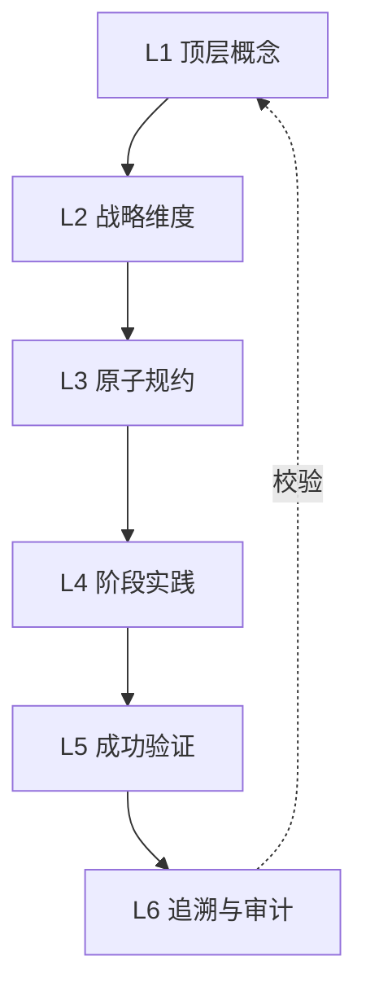

# 通用项目文档系统规则 (Universal Doc Protocol)

**版本**：v1.1  
**适用范围**：任意项目的文档仓（可配合代码仓、部署仓使用）  
**设计目标**：建立「顶层概念 → 战略维度 → 原子规约 → 阶段实践 → 成功验证 → 追溯与审计」的可追溯文档体系，适配 AI 协作与人类架构师协作。

**文档定位**：本文档为文档仓内**完整协议正文**，与工作区根目录 `.cursorrules` 中的同名规则保持同步；AI 与人类在文档仓内操作时以本文件为权威引用。

---

## 目录

- [规则生效要点（AI 必读）](#规则生效要点ai-必读)
- [快速导航与角色视图](#快速导航与角色视图)
- [一、核心理念 — 双核共生](#一核心理念--双核共生)
- [二、共识前提](#二共识前提)
- [三、六级架构层次](#三六级架构层次)
- [四、强制联动规则](#四强制联动规则)（含 [4.0 系统规则自身的同步（元规则）](#40-系统规则自身的同步元规则)、4.4 冲突与裁决、[4.5 关键重构与系统规则同步](#45-关键重构与系统规则同步)、[4.6 Debug/修复/疑问时的 1:1:1 检查与问题穿透防护](#46-debug修复疑问时的-111-检查与问题穿透防护)、[4.7 新要求/设计变更的 1:1:1 反写与可执行性验收](#47-新要求设计变更的-111-反写与可执行性验收)）
- [五、追溯锚点格式](#五追溯锚点格式)
- [六、核心工作流](#六核心工作流)
- [七、AI 执行与重构要求](#七ai-执行与重构要求)
- [八、L4 实践文档创建与 AI 协作规范](#八l4-实践文档创建与-ai-协作规范)（含 [8.4d DNA 为核心实践目标与核心指令引用 AI 可读](#84d-dna-为核心实践目标与核心指令引用-ai-可读)、[8.4e 实践文档可执行性与按文档验证](#84e-实践文档可执行性与按文档完成所有验证且不偏离不臆造)、[8.4f 步骤失败时的处理原则](#84f-步骤失败时的处理原则)、[8.4g 实施记录正文维护：单一最佳结果](#84g-实施记录正文维护单一最佳结果)、[8.4h L3 步骤为权威索引：周次仅为别名](#84h-l3-步骤为权威索引周次仅为别名)）
- [九、违规与修复](#九违规与修复)
- [十、如何开始](#十如何开始)
- [十一、项目定制化](#十一项目定制化)（含 [云原生优先（部署仓）](#云原生优先部署仓)、[部署与编排文件归属（部署仓）](#部署与编排文件归属部署仓)、[实践测试方式约定（L4 全局）](#实践测试方式约定l4-全局)、[Diting 目标运行时（ECS/K3s）](#diting-ecs-k3s-helm-acr-deploy-engine)、[部署内容由配置与 Chart 控制](#部署内容由配置与-chart-控制部署仓)、[Copilot 统一部署](#copilot-统一部署diting-infra--ai日常标准)）
- [十二、DNA 机制 — _System_DNA](#十二dna-机制--_system_dna)
- [十三、英文简写与技术名词对照表规则](#十三英文简写与技术名词对照表规则ai-自动执行)
- [使用说明](#使用说明)
- [协议修订记录](#协议修订记录)

---

## 规则生效要点（AI 必读）

以下要点确保本协议在每次协作中生效，AI 须在相关操作时自动遵守。

**AI 默认遵循（1:1:1 同步）**：凡用户提出**设计需求、实践修改需求、设计修改需求、或由疑问引起的修改需求**时，AI 在给出解决方案的**同时**须默认遵循 §4.6/§4.7，不仅解决问题且**同步补充或更新** 1:1:1 文档（03_ 设计、步骤级 DNA、dna_dev_workflow、04_ 实践、L5 对应行）；无需用户额外提醒。适用 §4.6 时修复后执行 1:1:1 核对并输出结果；适用 §4.7 时当次完成 1:1:1 反写。

| 场景 | 强制动作 |
|------|----------|
| **生成/重构文档** | 先读 L3 规约或 `_System_DNA/`；输出含 `[TRACEBACK]` 的追溯锚点；结束时输出「一致性检查表」；涉及结构或全局约定变更时含对 00_系统规则 的同步（见 §4.0/§4.5） |
| **修改/新增 L1 哲学文档** | **仅承载哲学性陈述**（核心立场 + 哲学边界 + 哲学性判据 + 不做什么 + 承接位置）；**禁止**写具体阈值数字、Python/伪代码、详细规则矩阵动作列、完整 DNA YAML；具体规则均移交对应 L2 `04_XX实践策略规划.md`。每个哲学基石内统一为「①核心立场 / ②哲学边界 / ③哲学性判据 / ④实践规划承接位置」四节。见 §3.5.1/§3.5.2。 |
| **修改/新增 L2 实践策略规划** | 须含「①层级定位 / ②承接 L1 待办清单（含状态）/ ③具体规则/阈值/矩阵 / ④DNA 键落地建议 / ⑤一致性检查」；`[TRACEBACK]` 须上溯到具体 L1 哲学基石 + 下沉到 L3 规约 + DNA 键；**禁止重新定义哲学边界**（哲学引用 L1）。见 §3.5.1。 |
| **L4 实践/代码** | 步骤中明确 **工作目录**（如 `{project}-src`）；逻辑密集走 5D；代码注释含 `[Ref: 03_XX]` 或 `[Ref: 便利贴_XXX]` |
| **架构图** | 仅用 Mermaid 嵌入 Markdown；与 L3 规约一致；同一文档内选用 §7.4 一种可视化风格并保持一致 |
| **术语与能力** | 不臆造规约外技术栈；L3 中文业务语→代码用项目约定英文（如 积分→Credits） |
| **英文简写与技术名词** | 见 §十三：先检测对照表是否存在；使用简写或技术名词时查表、缺则补表；同一文档内首次出现附中文或释义，后续不重复 |
| **关键重构（任意层）** | 将更新后的关键逻辑（如目录约定、轴线划分、链接约定等）同步到本协议相应小节（如 §3.2、§4、§7.1）；并输出一致性检查表 |
| **产出涉及关键重构的变更计划/待办** | **生成计划时须先自检**：本次变更是否涉及关键重构（含 L4 阶段/步骤模板、Phase 结构等全局约定）？**若是，待办须显式包含**「按 §4.5 同步 00_系统规则（及 .cursorrules）」；执行顺序见 §4.5。未包含则违规。 |
| **L4 实践文档与核心指令** | 实践文档与核心指令以 **DNA 为核心实践目标**；核心指令内对文档/DNA 的**逻辑引用须以 AI 可读方式**呈现（完整路径、DNA 键路径或结构化引用块），见 §8.4d、§12。 |
| **L4 实践文档新增/修改** | 凡在 **04_阶段规划与实践** 下**新增或修改实践文档**（各实践阶段内 01_～0N_ 步骤文档）时，AI 须**判读是否为实践文档**；若是，产出须满足「**按文档完成所有验证且不偏离、不臆造**」之目标，见 §8.4e；**不把任务留给人**（所有动作作为步骤或「不满足时」命令写入文档），**尽量不专门写脚本**（优先文档内命令/Make），见 §8.4e；**步骤失败时**须约定「先分析、修复、重试；同一问题修复重试超过 2 次仍失败则回收/退出」，见 §8.4f。 |
| **L3 启动期 step 文档新增/修改（六维度共享模板）** | 凡在 **03_原子目标与规约/0X_维度*/stages/stage_1_启动期/steps/** 下新增或修改 `step_*.md` 时，**须**遵守权威模板 [`_共享规约/L3_启动期step_重构模板`](03_原子目标与规约/_共享规约/L3_启动期step_重构模板.md) 的 **13 个强制小节**（数据对象 / 真实数据源 / 凭证清单 / 启动期目标 / 下一步一行 / 实施步骤 / **部署节奏** / 准出 / [Deploy] / 依赖 / 风险 / 修订记录）；**禁止**省略 §4.2「用户须提供的凭证」、§5「启动期数据量预期」、§8「本步在哪里跑」三节。全局开发地图见 [`_共享规约/14_六维度启动期统一节奏表`](03_原子目标与规约/_共享规约/14_六维度启动期统一节奏表.md)。 |
| **持仓 SoT（六维度共享单一真相源）** | 启动期所有维度的数据采集（D1 财报/公告 / D2 thesis 候选池 / D3 持仓监控 / D4 卖出协议 / D0 副驾驶 CRUD）须以 **`diting-src/data/config/my_holdings.yaml`** 为唯一来源（环境变量 `MY_HOLDINGS_YAML`）；加载器在 `apps/common/holdings_sot.py`；模板见 `data/config/my_holdings.example.yaml`。**禁止**在 step 文档或代码中硬编码 symbol 列表或另起 SoT；持仓 yaml 私有副本已在 `.gitignore`，禁止提交。启动期默认仅对 `active=true` 标的拉真实数据；扩展期触发条件写入对应 step §6「下一步」。 |
| **no-mock-policy（启动期六维度统一）** | 启动期 L3 step 与 L4 实践记录中**禁止**出现 `CRYO_MOCK=1` / `--use-mock` / `mock_*.json` 作为业务事件流 / `THESIS_GENERATOR_MODE=stub` 进入生产路径等表达。占位 fixture **仅**在 `tests/` 单元测试中合法，且**不得**入业务库、**不得**入训练集、**不得**上 staging。上游真流未就绪时下游 step **应等待**或仅以 fixture 单测推进；缺凭证时须写「待用户提供 `XXX_API_KEY` 后由 Cursor 直接执行」，**禁止**伪造 LLM 输出或行情/财务数字。详见 [`_共享规约/14_六维度启动期统一节奏表`](03_原子目标与规约/_共享规约/14_六维度启动期统一节奏表.md) §8 占位 fixture 合法边界。 |
| **数据采集质量优先于数据量（启动期六维度通则）** | **巴菲特原则**：不看财报的投资是自杀，**但看了三表 ≠ 看了财报**。启动期 L3 数据采集 step 须按**下游模型引擎的分析需求**反推所需字段粒度，**禁止**仅以"行数 / 条数"作为准出。须在 step §3.5 写**数据质量验收矩阵**（按目标引擎分块 · 4 列：分析维度 → 必产字段 / 衍生 → 启动期覆盖状态 ✅/⚠️ → 启动期降级路径），下游每个消费 step 都至少列 1 行。**禁止**：①只采"表面层"（如仅三表 raw / 仅公告标题 / 仅关联方文本行），而不扩展到附注 / 披露 / 事件链 / 网络穿透 / 定价方法 / 承诺履约等分析必需的细分；②把字段假装填 null 即视为达标；③数据量达 §5 行数门槛但 §3.5 矩阵不绿就准出；④**在 §3.5 矩阵列扩展期 / 完善期内容**——本 step **只对启动期负责**，扩展期数据类型与质量要求在 `stages/stage_2_扩展期/` 文档独立维护。修复：按 [`_共享规约/L3_启动期step_重构模板`](03_原子目标与规约/_共享规约/L3_启动期step_重构模板.md) §3.5 补质量矩阵。**启动期标的可以少，但数据质量必须达到引擎能做实质分析的程度。** |
| **L3 以设计规划推演为主（不嵌入完整代码 · 给后续模型工作指引）** | **L3 根本定位**：以**设计规划推演**为主——靠谱地描述"做什么 / 如何执行 / 验证标准"，**不**嵌入完整 Makefile / 脚本代码、**不**试图本 step 把所有事 100% 完成。具体命令、调试日志、参数填值由 **L4 实践记录 / 后续执行模型**按 L3 规划自行落地。L3 是"给后面模型的工作指引 + 验证标准"，不是"自己把活全干了"。L3 启动期 step 文档 §7 须为"实施规划"风格：①§7.1 实现要点（4 列表：实现要点 → 涉及代码位置 → 关键设计决策 → 验证标准）；②§7.2 Makefile 一键复现合约（若涉及多步流水线 · 强制 · 见下条）；③§7.3 给后续执行模型的指引。**禁止**：①在 L3 step 嵌入完整 Makefile 实现代码或完整脚本；②把每一条命令、每一行参数都写在 L3（那是 L4 实践记录的事）；③试图在 L3 step 完成所有具体落地（L3 给规划，L4/执行模型按规划落地）。 |
| **采集 / 训练 / 评估类 step 须 Makefile 一键复现合约（配置驱动 · 可重入幂等）** | 涉及多步流水线的 L3 step（数据采集 / 模型训练 / 质量评估等）须在 §7.2 写 **Makefile target 合约表**：一组 `<module>-step<N>-prep / -collect / -quality-check / -test / -all / -status / -clean` target，**让架构师只改配置文件**（如 `data/config/my_holdings.yaml` 增减 active 标的、改年份、调阈值）就能跑 `make *-all` 一键端到端完成全套，无需改 Makefile / 脚本 / 命令行。**合约要求**：①入参全部环境变量化（命令行 / `.env` / Makefile 顶部三层叠加优先级）；②target 是"脚本 + 环境变量"的薄包装，**不**在 Makefile 写业务逻辑；③可重入幂等（重跑 `*-all` 不破坏已有数据，须按业务主键 upsert 而非 insert）；④配置驱动（变更范围只改配置文件，**禁止** Makefile / 脚本内 hardcode 标的代码、年份、阈值等）；⑤失败可观察（每个 target 输出"做了什么 / 期望什么 / 实际什么"3 行摘要，中文优先）。**L3 只定义合约**（target 名 / 用途 / 入参 / 验证标准）；**实现交 L4 / `diting-src/Makefile`**。准出须含"配置驱动验证"项：临时增 1 个 active 标的，跑 `make *-all` 端到端通过；移除并跑 `make *-status` 验证可重入。 |
| **`实践记录_*.md` 与 L3 步骤索引** | **实际开发与追溯**以 L3 **`steps/step_*.md`（或项目约定的可执行步骤清单）** 与 L4 **`实践记录_*.md`** 的 **映射表** 为权威；**节奏表、日历周次（如 W1、W3）仅为计划/沟通别名**，**不得**据此推断「一周 = 一份独立实践记录」或「实践记录文件数 = 自然周数」。详见 **§8.4h**。 |
| **按实践文档执行** | 按 **04_阶段规划与实践** 下所有实践阶段的所有实践文档执行步骤时：**遇问题则分析问题、解决问题并重试**；仅当**同一问题**在**修复重试两次以上**仍无法解决时，才执行文档规定的回收/退出。不得在首次失败时直接回收退出。见 §8.4f。 |
| **Debug/修复/疑问并给出解决方案** | 修复**后**须对该步骤执行 1:1:1 核对（03_、DNA、04_、L5）；发现引用不清、要求不具体或验证缺失（问题穿透）时**须一并修复**并说明已联动更新；回复须含「1:1:1 核对结果」与已修改项。见 §4.6。 |
| **新要求/新想法/设计变更** | 当次反写到 03_、DNA、dna_dev_workflow、04_、L5（§4.7）；若某验证项待实现须在文档中写明代用动作；变更准出/必做项/验证命令或设计要点时须完整 1:1:1。见 §4.7。 |
| **按四阶段规约提问** | 用户按 04_ 下 `00_四阶段提问体系_完整规约.md`（新需求/设计变更入口）执行时，须**先**完成阶段 1～4 产出待办清单；**执行**待办中的文档操作与实践任务时须满足 §4.7 的 1:1:1 反写与可执行性验收。 |
| **部署内容调整** | **部署内容**（Service 类型、NodePort、副本数等）由 **配置文件与 Chart** 控制，**不在 Makefile 中写死**；Makefile 仅从配置读取并传递给 helm。见 §十一「部署内容由配置与 Chart 控制」。 |
| **修改部署仓 Makefile/脚本** | 涉及**某组件的部署方式、暴露、端口、类型**时：**先**改 config 或 values 覆盖文件，Makefile/脚本仅 `-f` 或从配置传参；**禁止**在 Makefile 中为单组件写专属分支、临时文件或写死值；**禁止**为每次功能/波次/step 新增 `copilot-*-deploy` 类 Make 目标（日常发版统一 `make copilot-deploy`，见 §十一「Copilot 统一部署」）。修改前自检：该决策是否已在配置中？见 §十一「部署内容由配置与 Chart 控制」。 |
| **部署/基础设施类实现** | **默认云原生**：建表、初始化、一次性 Job 等能力由 **Chart 内模板**（ConfigMap、Secret、Job/CronJob）实现，通过 `helm install/upgrade` 统一创建或更新；**不新增独立脚本**去创建或更新 K8s 资源；Makefile 仅调用 helm 并传参（config/values）。见 §十一「云原生优先（部署仓）」。
| **部署与编排文件归属** | **Docker Compose、本地验证用编排文件** 须放在 **diting-infra**（如 `compose/`），**禁止**放在 diting-src；代码仓仅保留 Dockerfile（构建镜像）、业务代码与单测。见 §十一「部署与编排文件归属（部署仓）」、02_三位一体 本地开发与部署文件。 |
| **上架与集群目标环境（Diting）** | 目标运行时 **阿里云 ECS + K3s**，工作负载 **Helm Chart**，镜像 **阿里云 ACR**，编排入口 **在 diting-infra 调用 deploy-engine**；拓扑、职责闸、与用户价值/L1/L4（部署快照字段）对齐见 L3：**[16_阿里云ECS_K3s_ACR_Helm部署与deploy-engine链路](03_原子目标与规约/_共享规约/16_阿里云ECS_K3s_ACR_Helm部署与deploy-engine链路.md)**；各维度 **`steps/step_*.md`** §1 必选引用还须满足 **[L3步骤文档_部署价值哲学_必选引用](03_原子目标与规约/_共享规约/L3步骤文档_部署价值哲学_必选引用.md)**。**L4 实践记录须有「部署/部署快照」**（占位亦可），见 [04_/README §3.3](04_阶段规划与实践/README.md)；与「实践测试方式约定」**并排**：默认本地 Compose 不替代在文档中写清上架路径。详见 §十一「Diting 目标运行时」。 |
| **平台部署轨（P 轨）实施步骤** | **D0~D5 业务 step 不写部署 SOP**；任何「Spot ECS 起停 / K3s 双 Stack / GPU 节点按需 / 数据盘继承 / Down 回收纪律」类工作必须走 **P 轨 L3 step**：[`共享平台基础/stages/stage_1_启动期/steps/`](03_原子目标与规约/共享平台基础/stages/stage_1_启动期/steps/README.md)（7 step）+ DNA [`shared/dna_shared_platform_baseline.yaml`](03_原子目标与规约/_System_DNA/shared/dna_shared_platform_baseline.yaml) v1.1 + L4 [`04_/共享平台基础/stage_1_启动期/`](04_阶段规划与实践/共享平台基础/stage_1_启动期/README.md)。**接口面**：业务 step 用 K8s API（nodeSelector / PVC / Service / ConfigMap）+ Makefile target；P 轨 step 用 Terraform + Helm。**地域**：阿里云**新加坡 `ap-southeast-1`**；**GPU 规格**：`ecs.gn6i-c4g1.xlarge`（T4 16G · Spot）。**禁止**：①在业务 step 写 Terraform/Helm 安装命令；②在 P 轨 step 写业务 Makefile 命令；③把 GPU 节点起停与业务训练命令耦合。**与 14 表 §6.4 一致**；与 `.cursorrules` 规则生效要点同名行一致。 |
| **修改 deploy-engine** | **禁止在 diting-infra 内对 `diting-infra/deploy-engine/` 做任何会改变其 Git 状态或工作树的操作**：包括编辑文件、git add/commit/push、**git stash** 等。子模块真相源在 **deploy-engine 独立仓库**（与 diting-infra 平级的 `deploy-engine/`）。**正确做法**：① 仅在 **deploy-engine 独立仓库**内编辑；② 在独立仓库内 **commit 并 push**；③ 再在 diting-infra 执行 `make update-deploy-engine`。**仅修改不推送则 diting-infra 子模块无法拉取到变更**。**编辑/写操作前强制自检**：若目标路径为 `diting-infra/deploy-engine` 或其子路径则**禁止**操作，仅允许在平级 deploy-engine 目录内修改。见 §十一。 |
| **Copilot 代码上线（统一部署）** | 工作目录 **diting-infra**；**日常唯一入口** **`make copilot-deploy`**（smart：自动 build/push/Helm/rollout；tag 自动回写 `config/diting-prod.yaml` 的 `copilot.image.tag`）；仅改 Helm/env 且镜像已在 ACR 时用 **`make copilot-deploy-rollout`**；executing 补采 **`make executing-t0-bootstrap-sync`**（与 deploy 解耦）。**禁止**为每次改动新增 Make deploy 目标。见 §十一「Copilot 统一部署」。 |
| **判断根因 / 修复问题 / Bug 分析** | **禁止臆想**：须按 §7.2 第 6 条（Verify First）— 先逐步检查实际文档/配置/集群状态（读文件、执行可验证命令、对比渲染结果），**先验证再下结论、再改代码**；不得凭假设直接断言原因或直接改。用户可显式要求「先按 §7.2 Verify First 排查」以触发。 |
| **排查/修复/部署验证（直接执行 + 穿透）** | 涉及**排查、修复、实现、部署**时：① **由 AI 直接执行**可执行的验证与修复验证（读文件、make/helm/kubectl、集群状态与日志等）；② **实现或修复完成后**，由 AI **直接执行**可执行的验收步骤（如 make、脚本、查库、看分类结果等），**任务穿透至可执行验收完成**；**禁止默认以「你需要做的」「建议您」「请执行」收尾**。仅当本环境无法执行时（如用户独占集群/凭证/交互）才给出用户侧操作清单。见 §7.2 第 7 条。 |
| **代码/配置变更后的同会话验证（禁止可选收尾）** | 当次任务修改了**代码仓或部署仓**内可执行制品（Python/Shell/Makefile/Helm values 等），且用户目标含**实现、修复、联调或验收**时：在本环境具备 shell/Python 等前提下，须**同一轮会话内**执行与变更**直接相关**的最小可重复验证（如受影响路径的 `pytest`、文档或 Makefile 约定的 `make <target>`、导入/语法检查）。**禁止**用「若你希望」「可下一步再联调」「建议你本地跑」等**代替**上述执行；**禁止**将本环境可完成的验证列为用户待办。因无 DSN/凭证/外网等**确实无法执行**时，须在回复中区分**已执行验证**与**未执行项及阻塞原因**；不得暗示已完成需库/集群才能做的验收。见 §7.2 第 10 条。 |
| **写/修/加代码（代码修改闭环）** | 凡**写代码、修复代码、修改或添加**实现时，须满足闭环：**(1) 有理解**—明确改动所解决的问题、依赖与边界；**(2) 有预期目标**—明确验收标准（如单测通过、make 退出码 0）；**(3) 有验证**—同会话内执行最小可重复验证；**(4) 验证失败→修复→再验证**—若验证失败须分析原因、修复、重跑直至通过；**禁止**在验证未通过时收尾，**禁止**以「请本地跑一下」替代。与第 7、10 条叠加防穿透。见 §7.2 第 10a 条。 |
| **依赖链与数据路径验收（禁止只改代码不验就绪）** | 当能力依赖 **L2/L1 表、采集任务、外部 API、密钥或上游数据** 时，须**同一会话**内：**(1)** 列出**最小依赖清单**（如 `PG_L2_DSN`、相关表名、须先执行的 `ingest`/init）；**(2)** 对可自动化项做**就绪检查**（连接/表存在/环境变量/相关 `pytest`）；**(3)** 缺表或缺数据时在目标路径上**主动** init/采集重试后再跑**最小成功路径**（与 §7.2 第 9 条一致）；**(4)** 仅当环境不可达时，在回复中写明**未就位项**、**已执行命令与输出摘要**，**禁止**未核验依赖即宣称「已联调/已验证/生产级完成」。见 §7.2 第 11 条。 |
| **数据/模块验证结论（须有证据）** | 断言「数据符合预期」「模块验证通过」或「符合 AB/C 模块要求」时，**必须同时提供**：① **数据库查询证据**（库 DSN 说明、表名、查询条件、结果行数或样本）；② **模块执行证据**（实际运行命令与输出摘要）。**禁止**在仅看到降级/回退结果（如 Module A 全部输出「未知」、L2 行业名为空未补全）时断言「符合预期」，除非规约/文档已明确该行为为预期。见 §7.2 第 8 条。 |
| **答复事实、全量宣称与输出语义（禁止打太极、禁止误导占位）** | 用户问「是否完成/是否符合/是否全量」时须给出**可核验事实**（命令、范围、输出/行数）；**禁止**用「原则上」「抽样代替全量」**除非用户明确同意**；未跑全量/未查库时**不得**作肯定结论。缺数据时输出须**显式**（如「无披露」、约定 `segment_id`），**禁止**用行业标签伪造分部或冒充已验收。见 §7.2 第 12 条。 |
| **`.env` 与 `*.env.template` 同步** | 任务依赖的配置说明已写在仓库 `*.env.template`（或项目约定模板）时，须**同一代码仓**将**注释与非密钥占位**合并进**已存在**的 `.env`；**不得**覆盖用户已填 DSN/密钥/密码；**禁止**以「请自行复制 template」为唯一收尾。见 §7.2 第 13 条。 |
| **面向人的输出以中文为主** | 终端/CLI、文档解释、Cursor 对话、**代码输出（print/log/脚本终端输出）**等**优先中文**；环境变量名、配置键、代码标识符等技术必要处可英文。见 §7.2 第 14 条。 |
| **目标路径上的前置项与顺手优化（主动完成）** | 在完成用户**已声明目标**的前提下，凡属**达成该目标所必需**的前置动作（如缺表、缺依赖、配置未就绪、**从 template 合并 `.env` 中与任务相关的非密钥块**、验证命令失败）、**明显阻塞的小问题**，以及**低成本、低歧义、与当前改动同一上下文**可完成的优化，AI 须**主动分析、修复或实现，并执行可重复的验证**，**不得**默认停顿、仅列「请你执行」清单或等用户逐条追加指令。典型示例包括：`relation … does not exist`、`ImportError`、`make`/`pytest` 失败、文档与实现不一致等。**边界**：仍须遵守 §7.2 第 6 条（先验证再改）、禁止臆造能力或擅自扩大与目标无关的大规模重构；生产/集群以 Chart/schema-init 为权威，本地可与仓库脚本对齐。 |
| **同会话共享资源批处理（禁止中间过早释放）** | 同一会话/待办包内，若多项任务**复用同一运行时资源**（P 轨 ECS+K3s、同一集群 kubeconfig、同一 GPU 节点、同一 persist 环境等），**禁止**单项完成后立即 `down-stack`/销毁 ECS，除非用户明确要求或该项为最后一项资源消费者；**须**等会话内全部消费者完成后再 tier-1 回收。见 §7.2 第 15 条 · §十四。 |

完整条文见下方各节。

**关于「判断/修复时禁止臆想」的触发与防穿透**：① **触发**：问题涉及「为什么不对」「修 bug」「排查原因」时，上表「判断根因/修复问题/Bug 分析」行生效；或显式写「先按 §7.2 Verify First 排查」「不要臆想原因，先按排查清单逐项检查」。② **防穿透**：若仅说「修一下」「改好就行」，AI 可能直接改而跳过验证；建议涉及原因判断或修 bug 时带上「先排查/先验证/按规则不要臆想」或引用规则生效要点「判断根因」行。③ **直接执行与验收穿透**：排查、修复、部署相关验证**由 AI 直接执行**；**实现或修复完成后**，可执行的验收步骤（make、脚本、查库、看结果等）也**由 AI 直接执行**，任务穿透至可执行验收完成，**禁止默认以「你需要做的」「建议您」「请执行」收尾**；仅在本环境无法执行时（如用户独占集群/凭证）才给出用户侧操作清单。④ **同会话最小验证**：凡修改代码/配置且目标含交付或验收，须**同会话**跑与变更相关的**最小** pytest/make 等（见上表「代码/配置变更后的同会话验证」）；**禁止**用「可选下一步」「若你希望」替代可本地完成的验证，避免把本应由 AI 执行的检查留给用户。⑤ **依赖链与数据路径**：凡涉及**库表、采集、外部数据**的能力，须**先核验依赖就绪**再宣称完成（见上表「依赖链与数据路径验收」与 §7.2 第 11 条）；**禁止**只合并代码或只改 YAML 而不执行表存在性/单标的采集/最小端到端命令，亦**禁止**在未说明缺数据、缺表或未跑通路径的情况下断言「已验证」。⑥ **全量与占位**：用户声明「全部标的」时**不得**擅自改为抽样；缺披露/缺表时**不得**用占位冒充真实分部或全量验收（见上表「答复事实、全量宣称与输出语义」与 §7.2 第 12 条）。⑦ **代码修改闭环**：写/修/加代码须满足「有理解→有预期目标→有验证→验证失败则修复再验证」；**禁止**验证未通过时收尾，**禁止**以「请本地跑一下」替代（见上表「写/修/加代码（代码修改闭环）」与 §7.2 第 10a 条）。

### 快速导航与角色视图

- **最小必读**：§一 核心理念、§三 六级层次（含 3.5 职责边界）、§7.2 AI 守则、§十三 简写与技术名词。
- **按角色**：**架构师** — §一、§三、§四、§十二；**实现者** — §3.5、§八、§十二；**AI** — §七、§八、§十三。**上架/集群（ECS+K3s）**：§十一「**Diting 目标运行时**」与 L3 [_共享规约/16](03_原子目标与规约/_共享规约/16_阿里云ECS_K3s_ACR_Helm部署与deploy-engine链路.md)。**修改部署仓 Makefile/脚本**时必读 §十一「部署内容由配置与 Chart 控制」与「修改前自检（部署仓）」。
- **完整协议**：按节顺序阅读，用于深度落地与审计。

---

## 一、核心理念 — 双核共生

解决「人类思维局限」与「系统复杂度」之间的矛盾：**人类定义战略，AI 补全实施**。

| 角色 | 层级 | 职责 |
|------|------|------|
| **人类架构师** | L1～L2 | 定义愿景、战略维度、关键约束；审查推演结果；裁决冲突 |
| **AI** | L3～L6 | 推演架构细节、生成代码/文档；维护追溯矩阵与审计；执行便利贴 GC |

**四大原则**：
1. **定义者 vs 补全者**：人类负责 L1～L2；AI 负责 L3～L6。
2. **配置即文档**：L3 优先用结构化表达（表格、列表、YAML），便于 AI 解析。
3. **惰性一致性**：不要求实时全量同步；用「增量便利贴」+ 定期合并。
4. **垂直切片**：L4 按特性打通数据→API→UI，避免横向断层。

---

## 二、共识前提

- **多仓库策略**（可选）：常见为三仓库 — **文档仓**、**代码仓**、**部署仓**。本协议约束文档仓。
- **文档仓定位**：仅存放项目文档，不含代码或运行时配置。
- **记录范围**：从顶层概念到战略维度、原子规约、阶段实践、成功验证与追溯审计。
- **层级原则**：上层定「为什么、做什么」，下层定「怎么做、做到哪」；下层须能溯源到上层。
- **本协议作为受约束文档**：`00_系统规则_通用项目协议.md` 是文档仓内受本协议约束的文档之一；当文档仓结构或全局约定发生变更时，本协议须与现状一致（见 §4.0、§4.5）。

---

## 三、六级架构层次

```
L1 (顶层概念) ↔ L2 (战略维度) ↔ L3 (原子规约) ↔ L4 (阶段实践) ↔ L5 (成功验证) → L6 (追溯与审计)
```

| 层级 | 目录 | 职责 |
|------|------|------|
| **L1** | `01_顶层概念/` | 定义项目根本定位、价值主张、**哲学边界**（含哲学性判据：什么算正确/什么算失败/不做什么）；**仅承载哲学性陈述**，不写具体参数、矩阵、代码、DNA YAML |
| **L2** | `02_战略维度/` | 拆解战略维度 + **承接 L1 哲学边界的实践策略规划**（具体阈值、规则矩阵、健康范围、告警规则、协作 schema、伪代码思路）；不写代码实现细节与字段类型 |
| **L3** | `03_原子目标与规约/` | 原子能力规约、技术规约、架构共识；**侧重实现设计与规约**（接口定义、协议、配置、可执行规约、最终 DNA YAML）；不写单次迭代步骤 |
| **L4** | `04_阶段规划与实践/` | 阶段规划、实施步骤、**实践情况记录**；须引用 L3 规约 + DNA 键；不重新设计规约 |
| **L5** | `05_成功标识与验证/` | 完成情况、验收标准、验证方法 |
| **L6** | `06_追溯与审计/` | 追溯矩阵、审计报告、增量便利贴 |

### 3.1 层级关系


```mermaid
flowchart TD
    L1[L1 顶层概念] --> L2[L2 战略维度]
    L2 --> L3[L3 原子规约]
    L3 --> L4[L4 阶段实践]
    L4 --> L5[L5 成功验证]
    L5 --> L6[L6 追溯与审计]
    L6 -.->|校验| L1
```

### 3.2 文档目录体系（通用模板）

```
{project}-doc/
├── 00_系统规则_通用项目协议.md    # 本协议；结构或全局约定变更时须同步（§4.0/§4.5）
├── 01_顶层概念/
│   ├── 01_项目定义与核心价值.md
│   ├── 02_战略目标与回报设计.md
│   ├── 03_双目标系统与五层架构.md
│   ├── 04_A股分析追踪平台目标与边界.md
│   └── 05_个人AI成长目标与训练节奏.md
├── 02_战略维度/
│   ├── 00_双目标与战略维度关系.md
│   ├── README.md
│   ├── 平台与产品/
│   ├── 节奏与交付/
│   └── 技术选型与调研/
├── 03_原子目标与规约/
│   ├── _System_DNA/               # [可选] YAML 配置区
│   │   ├── global_const.yaml
│   │   ├── dna_dev_workflow.yaml  # workflow_stages 与 L4 Stage 1:1；每步含 design_doc、dna_file
│   │   ├── Stage1_仓库与骨架/～Stage5_优化与扩展/  # 步骤级 DNA（dna_stageX_0Y.yaml），与 03_ 设计、04_ 步骤 1:1:1
│   │   └── core_modules/          # Module A～F 语义（dna_module_a～f），被 Stage3 步骤引用
│   ├── _共享规约/                 # 跨 Stage 引用（01_核心公式、02_三位一体、04_协议矩阵、05_接口抽象层、09_核心模块、11_数据采集 等）
│   ├── 平台与产品/                # 需求范围、与 L2 产品维度对齐的主责规约入口
│   ├── 节奏与交付/                # 生命周期、工作流、与 L2 交付维度对齐的主责规约入口
│   ├── Stage1_仓库与骨架/～Stage5_优化与扩展/  # 按 Stage 设计 doc + _DNA/
│   ├── _Design_Artifacts/protocols/  # Proto 定义（classifier/quant/trade_signal 等）
│   └── README.md
├── 04_阶段规划与实践/
│   ├── 00_四阶段提问体系_完整规约.md  # 新需求/设计变更入口，四阶段产出待办清单；见规则生效要点「按四阶段规约提问」
│   ├── Stage1_仓库与骨架/        # 01_三位一体、02_核心接口与Proto、03_密钥与配置
│   ├── Stage2_数据采集与存储/    # 01_基础设施～05_采集模块部署与验收
│   ├── Stage3_模块实践/          # 01_语义分类器～05_决策风控与动作主链、06_全链路验证
│   ├── Stage4_MoE与执行网关/     # MoE、执行网关、评测/仿真
│   ├── Stage5_优化与扩展/        # 可观测性、成本治理、多策略、Level1 入口
├── 05_成功标识与验证/
│   ├── 01_完成情况.md
│   └── 02_验收标准.md
├── 06_追溯与审计/
│   ├── 01_顶层概念实现完成情况.md
│   ├── 02_战略追溯矩阵.md
│   └── 03_审计与一致性报告/
│       └── _增量便利贴/
└── README.md
```

**轴线子目录约定（可选）**：规模较大或主叙事明确分层时，可在层级目录下按轴线设子目录，并同步更新全仓链接。  
- **02_战略维度/**：当前默认采用三轴线目录：`平台与产品/`、`节奏与交付/`、`技术选型与调研/`。02 根下**仅保留** `00_双目标与战略维度关系.md`、`README.md` 与这三类子目录；其中 `平台与产品/` 含 `01_产品范围与优先级`（总纲）及 `02_～09_` 等维度。  
- **03_原子目标与规约/**：当前默认与 L2 对齐，采用 `平台与产品/`、`节奏与交付/` 等主轴线组织 L3 规约；历史轨道目录已完成收口，不再作为主叙事入口。  
- 全仓引用上述文档时，链接路径须含轴线子目录名（如 `02_战略维度/10_节奏与交付/01_...`、`02_战略维度/07_平台与产品/02_...`）。关键重构后须按 §4.5 将本约定同步至本协议。

### 3.3 骨肉分离（可选）

规模较大时，L3 可将机器可读配置与人类可读解释分离：

| 区域 | 用途 | 特点 |
|------|------|------|
| **骨架** | `_System_DNA/` 下 YAML | AI、脚本；高压缩、无歧义 |
| **血肉** | 各能力目录下 Markdown | 人类；含解释、Mermaid 图 |

### 3.4 增量便利贴

**场景**：小改动（加字段、改阈值）不宜直接改长篇设计文档。

**流程**：
1. 在 `06_.../03_.../_增量便利贴/` 新建文件（如 `20260212_增加字段.txt`）；
2. 写下口语化需求；
3. Prompt：`@便利贴文件 按需求更新代码/文档，注释中标注 [Ref: 便利贴_文件名]`；
4. **熔断**：文件数 ≥10 或每周五/Sprint 结束前，必须合并并清空。
5. **便利贴合并**：合并入正式文档后，若该文档的标题或结构（含锚点）发生变更，须检查并更新 06_、ADR 及所有指向该文档的链接。

**责任与触发**：熔断前由 Sprint 负责人或由 AI 在专门会话执行合并；建议使用日历或 CI 提醒（如每周五检查未合并便利贴数量）。建议使用文档仓 `scripts/` 在熔断前检查便利贴数量（见 `scripts/check_sticky_count.sh`）。

### 3.5 层级职责边界

> **核心分层原则（哲学 → 规划 → 规约 → 实施）**：
>
> | 层级 | 回答的问题 | 不回答的问题 |
> |---|---|---|
> | **L1**（哲学）| 是什么 / 为什么 / 什么算正确 / 不做什么 | 用什么数字 / 按什么步骤 / 写什么代码 |
> | **L2**（实践策略规划）| 具体阈值 / 规则矩阵 / 健康范围 / 协作 schema / 伪代码思路 | 字段类型 / 代码实现 |
> | **L3**（规约）| 接口 / 协议 / Schema / 最终 DNA YAML | 单次迭代步骤 |
> | **L4**（实施记录）| 实施情况 / 验证结果 | 重新设计规约 |
>
> **判据**：若一条内容回答"为什么/是什么/算不算正确"→ 属 L1；若回答"用什么数字/按什么矩阵/几个交易日"→ 属 L2；若回答"字段叫什么/接口怎么调"→ 属 L3；若回答"按规约做了什么、跑出什么结果"→ 属 L4。

- **L1**：只写「是什么、为什么做、核心价值、**哲学边界与判据**（什么算正确/什么算失败/不做什么）」；**不写**功能清单、具体阈值数字、规则矩阵、Python 代码、DNA YAML 配置。
- **L2**：写「从哪几个维度落地、每个维度覆盖什么、**承接 L1 哲学边界的具体实践策略规划**（具体阈值、规则矩阵、健康范围、告警规则、审计逻辑思路、协作 schema、DNA 键落地建议）」；**侧重技术/逻辑架构 + 实践策略规划**；不写接口字段类型或单次迭代排期；维度文档须有 `[TRACEBACK]` 上溯到 L1 哲学基石。
- **L3**：写「原子能力规约、技术规约、架构共识」；**侧重更细致化的实现设计与规约**（接口定义、协议矩阵、配置项、可执行规约、**最终 DNA YAML**）；不写单次迭代步骤；规约须有 `[TRACEBACK]` 上溯到 L2 实践规划。
- **L4**：写阶段目标、实施步骤、**实践情况记录**；须引用 L3 规约 + DNA 键 + 工作目录 + 验证命令；AI 须遵守第八节 L4 实践文档创建与 AI 协作规范；不重新设计规约。
- **L5**：验证战略维度对应功能的完成情况、验收标准、验证方法。
- **L6**：维护追溯矩阵、审计报告、便利贴；不承载业务内容。

#### 3.5.1 L1 哲学 → L2 实践策略的承接模式（强制）

> **触发**：任何 L1 哲学基石的具体落地（含阈值、矩阵、规则、流程、参数）须通过 L2 实践策略规划文档承接，**不得在 L1 内堆砌**。

| 项 | 强制要求 |
|---|---|
| **L1 内部结构** | 每个哲学基石内统一为：①核心立场、②哲学边界、③哲学性判据、④实践规划承接位置（→ L2 文档路径 + L3 规约路径 + DNA 键提示）|
| **L2 文档命名** | 维度目录下增设 `04_XX实践策略规划.md`（或与维度命名对齐），文件首部明确"本文档承接 L1 基石 X 的全部实践层规则" |
| **L2 文档结构** | 须含：①本文档的层级定位（L1→L2→L3→L4 简表）、②承接 L1 基石的待办清单（含状态）、③具体规则/阈值/矩阵、④DNA 键落地建议、⑤一致性检查 |
| **L1 严禁内容** | 具体阈值数字（如 0.95、5 个交易日、30%）、Python 代码、详细规则矩阵的动作列、完整 DNA YAML、字段 Schema |
| **L2 严禁内容** | 重新定义哲学边界（哲学引用 L1）、单次迭代步骤、代码实现细节 |
| **TRACEBACK 链** | L2 文档须含上溯 L1 哲学锚点（具体到基石 X）+ 下沉 L3 规约 + DNA 键 |

#### 3.5.2 违规与修复（哲学/实践层混淆类）

凡发现 L1 哲学文档内出现以下内容均视为违规：
- 具体阈值表（如健康度 [0.3, 0.5)、≥ 0.95、5 个交易日 …）
- Python/伪代码实现
- 详细规则矩阵的具体动作列（如"减仓 50%+"、"加仓 30%"）
- 完整 DNA YAML 配置块

修复方式：
1. 将上述内容迁移到对应维度的 `04_XX实践策略规划.md`；
2. 在 L1 内仅保留"哲学边界 + 承接位置指向 L2"；
3. 在 L1 修订记录中标注本次重构；
4. 同步更新 [TRACEBACK] 链（上溯/同层/下沉）。

---

## 四、强制联动规则

### 4.0 系统规则自身的同步（元规则）

- 本协议（`00_系统规则_通用项目协议.md`）是文档仓内的一份文档，且为文档仓的**单一事实来源**。
- 凡变更文档仓**结构**（如目录、轴线）、**全局约定**（如链接规则、命名、L2↔L3 映射方式）或与协议某条描述**直接相关**的实践时，执行方须**自检**：本协议是否仍准确反映现状；若否，须在当次变更中或紧随其后更新本协议相应小节（参见 §4.5）。
- 本条款不替代 §4.5，而是与 §4.5 共同构成「关键重构 → 必须回写」与「任意相关变更 → 须自检并视情况回写」的双重保障。

### 4.1 向下传播

- **L2 变更** → 查 `06_追溯与审计/00_L2_L3_DNA_映射.md`（或项目约定的 L2↔L3↔DNA 映射）得到受影响 L3 与 DNA 列表 → 按 **变更传播顺序** 执行（见下）；新增 L2 维度时须同步维护该映射表。
- **L2 维度变更传播顺序**：当 L2 某维度内容变更时，（1）先更新该维度的**主责 L3 文档**；（2）再同步对应 **DNA 子树**（`_System_DNA/global_const.yaml` 或约定 dna_*.yaml）；（3）最后检查 L4 阶段/步骤是否仍引用正确 DNA 键。若某维度由多份 L3 联合支撑，以映射表中的「牵头规约」为变更第一落点。
- L1 变更 → 检查 L2/L3/L4/L5 是否有对应表述。
- L3 变更 → 同步 L4 阶段、L5 验收项；涉及 DNA 键时须同步 global_const 或对应 dna_* 文件。**DNA 的 workflow_stages 或 product_scope.phases[].steps 变更**时，须同步 L4 阶段/步骤文档中的引用（如 work_dir、verification_commands、本步骤落实的 DNA 键）及 L5 表体（或重新从 DNA 生成/校验一致）。
- **DNA 的 workflow_stages 新增或删除**时，须在 [05_成功标识与验证/02_验收标准](05_成功标识与验证/02_验收标准.md) 中同步新增或删除对应行及显式锚点（如 `<a id="l5-stage-stageX_0Y">`）；可选步骤仍保留行与锚点，状态可为「跳过/不适用」。
- **某 stage 的 dna_file 或 dna_dev_workflow 对应条目发生变更时**（含 delivery_scope、exit_criteria、work_dir、verification_commands、l5_stage_anchor），须在**当次或紧随的 MR** 中复核并更新对应 04_ 步骤文档（「本步骤落实的 DNA 键」、核心指令、可执行验证清单、工作目录等）；可选：使用 06_/03_ 或 scripts/ 下提供的「按 stage_id 列出对应 04_ 文件」脚本在 MR 前自检或 CI 提示。
- **L3 或 04_ 步骤新增、删除或重命名**时，须同步更新 03_ README 或 06_ 的「设计–DNA–实践–L5」索引表。

### 4.2 向上溯源

- L4 每阶段须可溯源到 L3 规约、L2 维度、L1 价值；
- L5 每条验收须标明对应 L3 能力与 L1 价值点。

### 4.3 横向一致

- 同层级内术语一致，避免重复定义；冲突时以架构师或项目负责人裁决为准，见下「冲突与裁决」。

### 4.4 冲突与裁决

- **裁决权**：同层级或跨层级（含 L3 与代码仓实现）冲突，由架构师或项目负责人裁决。
- **记录**：裁决结果须记入 `06_追溯与审计/ADR/` 的 ADR，并注明受影响的 L2/L3 文档或矩阵行。
- **同步**：执行方更新受影响文档或战略追溯矩阵，并在 TRACEBACK 或文末引用该 ADR。

### 4.5 关键重构与系统规则同步

- **适用**：任意层（L1～L6）发生**关键重构**时，须将**更新后的关键逻辑**同步到本协议（`00_系统规则_通用项目协议.md`）。
- **关键重构**包括但不限于：目录结构变更（如新增轴线子目录）、层级/维度划分变更、追溯链或链接约定变更、L2↔L3 映射方式变更。
- **动作**：执行方在当次重构内完成：（1）识别本次重构所涉的关键逻辑；（2）将上述逻辑写入本协议对应小节（如 §3.2、§4、§7.1）或新增条文；（3）更新本协议目录（若有新增节）；（4）确保后续协作以新规则为准。
- **责任**：当次重构的执行者在本轮会话/提交中完成系统规则更新；发布前由负责人或 AI 核对协议与现状一致。
- **计划与待办**：凡产出涉及关键重构的 **L2/L3/DNA/L4 变更计划或待办列表**时，待办中须**显式包含**一项：「按 §4.5 同步 00_系统规则_通用项目协议（及 .cursorrules）」。该待办在执行顺序上安排在关键逻辑落地（如规约修订、DNA 更新）之后，L4/L5/L6 更新之前或与之并行。AI 与人类在生成此类计划时须默认加入此项，不得依赖事后检查表补漏。
- **计划/待办生成时自检**：AI 或人类在**产出** L2/L3/DNA/L4 变更计划或待办列表时，须**先自检**：本次变更是否涉及**关键重构**（含目录/轴线、全局约定、L4 阶段/步骤模板、Phase 或 Stage 结构约定等）？若涉及，待办列表中**必须**包含上述「系统规则同步」项；未包含则视为违反本协议。自检在输出待办列表之前完成，不依赖事后一致性检查表补漏。

<a id="46-debug修复疑问时的-111-检查与问题穿透防护"></a>
### 4.6 Debug/修复/疑问时的 1:1:1 检查与问题穿透防护

- **适用场景**：用户提出 **debug 请求、修复要求、或对某阶段/步骤的疑问**，AI 或人类给出解决方案（含对文档或代码的修改）时。与「用户提出新功能、新步骤或明确要求改设计/准出/必做项」区分：后者适用 §4.7；若同时涉及，两条均适用。
- **问题穿透定义**：**「问题穿透」**指因 03_ 设计、DNA、04_ 实践或 L5 中**引用不明确、要求不具体或验证覆盖缺失**，导致执行者仅凭文档操作仍失败或不得不臆造路径、命令或是否必做。
- **强制动作**：在**修复后必须执行一次**该步骤的 1:1:1 核对；**范围**至少为该 step 的 03_ 设计、对应步骤级 DNA、该 04_ 步骤、L5 对应行；若变更可能影响上下游（如准出或准入），须同时检查**相邻 step** 的 1:1:1。
  - **03_ 设计**：本步目标、设计要点、准出是否与 04_ 及 L5 一致；对 DNA、L4、L5 的引用是否带锚点、路径是否完整可解析。
  - **步骤级 DNA**：exit_criteria、delivery_scope、verification_commands、work_dir 是否与 04_ 和 L5 一致；是否覆盖所有必做验证项。
  - **04_ 实践**：本步输入是否明确（缺则报错、禁止臆造）；可执行验证命令是否无未替换占位符、与代码仓 Makefile/CI 一致；准出清单是否包含设计/DNA 中所有必做项；是否存在「文档写了但无对应命令或实现」的缺口；AI 执行约束是否显式写出。
  - **L5**：对应 stage 行是否与 03_ 准出、DNA exit_criteria、04_ 准出一致。
- **发现问题时**：若存在引用不明确、要求不具体、验证覆盖缺失（或因此导致问题穿透），须在**本次解决方案中一并修复** 03_、DNA、04_、L5 中受影响处，并在回复中说明「已按 1:1:1 联动更新」。
- **与代码仓不一致时**：若可执行验证命令与代码仓 Makefile/CI 不一致，须在本次解决方案或待办中**列出代码仓需同步的项**（如新增/重命名 make target、CI 步骤），或**注明不一致原因与后续处理**（与 §十一 可执行验证与代码仓一致 呼应）。
- **输出要求**：完成修复后，回复中须包含**「1:1:1 核对结果」**：已核对 03_/DNA/04_/L5 四项（可简表）；**已修改项**（若有）：列出文件名与修改性质（如「03_ 设计：准出补充步骤 8」）。
- **与 §8.8 的衔接**：若本次修改涉及 04_ 实践文档，1:1:1 核对后须同时满足 §8.8 L4 实践文档一致性检查表中与本次修改相关的勾选项。
- **责任主体**：人类在执行修复或采纳新需求/设计变更时，应遵循同一 1:1:1 检查要求。
- **L6 矩阵（可选）**：当因 Debug 或修复而修改了 03_/DNA/04_/L5 且影响阶段产出或准出时，须在当次或紧随其后的 MR 中更新 `06_追溯与审计/02_战略追溯矩阵.md` 受影响行（状态或备注）。

<a id="47-新要求设计变更的-111-反写与可执行性验收"></a>
### 4.7 新要求/设计变更的 1:1:1 反写与可执行性验收

- **适用场景**：用户提出**新要求、新想法**，或对某阶段/步骤的**设计或准出做变更**（例如将某步骤从可选改为必做、新增必做验证、调整准出条件）。与 debug/修复/疑问区分：后者适用 §4.6；若同时涉及，两条均适用。
- **与四阶段提问体系的关系**：当用户**按四阶段提问体系规约**（如「按 @00_四阶段提问体系_完整规约.md 执行」）提出新需求/设计变更时，须**先**按该规约完成阶段 1～4 并产出待办清单；**执行**待办清单中的文档操作与实践任务时，须满足本条（§4.7）的 1:1:1 反写与可执行性验收（仅凭实践文档与约定输入可完成全部验证、不偏离不臆造）。
- **强制动作**：新要求或设计变更必须在**当次**同步到该步骤的 1:1:1 文档：**03_ 设计**（设计要点、准出）；**步骤级 DNA**（exit_criteria 等）；**dna_dev_workflow** 对应 stage 条目；**04_ 实践**（步骤表、验证与准出表、准出后自检）；**L5 02_验收标准**对应行。**范围**：至少该 step；若准出/必做项变更影响上一 stage 产出或下一 stage 准入，待办须**显式列出受影响的其他 stage** 并复核其 03_/DNA/04_/L5 是否需同步。
- **变更量级例外**：若变更**仅限文案、错别字或格式**且**不改变准出条件、必做项或验证命令**，可仅更新直接涉及的文档；若变更**准出、必做项、验证命令或设计要点**，须完整执行 1:1:1 反写。
- **验收标准**：变更后须满足：**任何 AI 或人类执行者仅凭实践文档与约定输入，即可完成文档规定的全部验证步骤，且不偏离、不臆造**。**「完美完成」**指完成文档中规定的全部**可执行验证**与**已写明的替代动作**；不要求完成文档中已标明「**待实现**」且已提供替代动作（如单测+记录待补验）的项。若某验证项依赖尚未实现的实现（如某 Feed、某 make target），文档中须**显式写出**「待实现」及**当前可执行的替代动作**，不得留下未定义动作。
- **与 §8.8 的衔接**：若本次修改涉及 04_ 实践文档，1:1:1 反写后须同时满足 §8.8 L4 实践文档一致性检查表中与本次修改相关的勾选项。
- **与代码仓不一致时**：若 1:1:1 反写中发现可执行验证命令与代码仓 Makefile/CI 不一致，须在待办中列出代码仓需同步的项或注明原因/后续处理。
- **计划/待办**：若变更影响多个 stage 或多份 04_ 文档，待办中须列出「同步 03_、DNA、dna_dev_workflow、04_、L5」的逐项检查或修改项；跨 stage 影响时须列出受影响 stage 并复核。
- **L6 矩阵（可选）**：修改 03_/DNA/04_/L5 且影响阶段产出或准出时，须在当次或紧随 MR 更新 02_战略追溯矩阵 受影响行。

---

## 五、追溯锚点格式

### 5.1 推荐格式

```markdown
> [!NOTE] **[TRACEBACK] 战略追溯锚点**
> - **顶层概念**: [一句话定义](01_顶层概念/01_xxx.md)
> - **战略维度**: [维度A](02_战略维度/07_平台与产品/02_xxx.md) 或 [开发与交付](02_战略维度/10_节奏与交付/01_xxx.md)
> - **原子能力**: [规约A](03_原子目标与规约/01_xxx.md)
> - **阶段**: [Phase1](04_阶段规划与实践/Phase1_xxx/)
```

### 5.2 L3 规约文档须包含战略维度链接

- **要求**：每份 L3 规约的 TRACEBACK 中必须包含「**战略维度**：链接到具体 L2 维度文档」；若一份 L3 支撑多个 L2 维度，至少写主责维度（主责见 [06_追溯与审计/00_L2_L3_DNA_映射](06_追溯与审计/00_L2_L3_DNA_映射.md)）。
- **目的**：便于 L2 变更时定位主责 L3，且可从 L3 反查所属 L2 维度。

### 5.3 禁止

- 追溯锚点放在代码块或 HTML 注释内；
- 无 `[TRACEBACK]` 标识的零散链接。

### 5.4 锚点命名约定

**目的**：全仓引用与指向均有可解析的索引锚点；命名单点约定，便于 AI、人工与脚本一致使用。

- **L3 阶段设计文档**：`design-{stage}-{step}-goal`、`design-{stage}-{step}-exit`、`design-{stage}-{step}-dna-keys`（stage/step 如 stage1、02，与 DNA stage_id 对应）。
- **L4 步骤文档**：`l4-{stage}-{step}-goal`（本步目标）、`l4-{stage}-{step}-exit`（验证与准出/本步骤准出）；可选：`l4-{stage}-{step}-dna-keys`、`l4-{stage}-{step}-verify`、`l4-{stage}-{step}-fail`；步骤导航区块 id 建议 `l4-step-nav`。
- **L5**：`l5-stage-{stage_id}`（如 `l5-stage-stage1_02`）；功能验收表保持 `l5-mod-A`、`l5-func-02` 等。
- **格式**：仅小写字母、数字、连字符；stage 与 step 在锚点中用连字符，与 DNA 的 stage_id 下划线区分（如 stage_id 为 stage1_02，锚点为 l4-stage1-02-exit）。**复制或拆分步骤文档时须替换文档内全部锚点 id 为当前步骤对应 id，禁止重复 id。**

### 5.5 设计文档索引锚点（L3 阶段设计文档）

**目的**：使设计文档对 DNA、L4、L5 的引用可深链到具体段落，便于读者与脚本跳转；设计文档自身关键节可被 04_、06_、中央索引表反链。

- **TRACEBACK 中的引用**：
  - **DNA**：使用可点击的 Markdown 链接指向步骤级 DNA 文件（文件级，YAML 无段落锚点），禁止仅写行内代码路径。
  - **L4 实践**：链接须带目标文档的显式锚点，如 `#l4-{stage}-{step}-exit` 或 `#l4-{stage}-{step}-goal`（与 04_ 步骤文档内显式锚点一致，见 §5.4 锚点命名约定）。
  - **L5**：若提及「准出时更新 L5」或「L5 对应行」，须链到 [05_成功标识与验证/02_验收标准](05_成功标识与验证/02_验收标准.md) 对应行锚点 `#l5-stage-stageX_0Y`。
- **设计文档内关键节**：小节「本步目标」「设计要点」「准出」「本步落实的 _System_DNA 键」（若有）须可作为**索引锚点**被外链。推荐在标题前使用显式 HTML 锚点，如 `<a id="design-stage2-01-goal"></a>`；或采用统一命名约定：`design-{stage}-{step}-goal`、`design-{stage}-{step}-exit`、`design-{stage}-{step}-dna-keys`（其中 stage/step 如 stage2、01）。04_ 步骤文档引用「本步设计文档」时须使用上述锚点（如 `#design-stage2-01-exit` 或 `#design-stage2-01-goal`）。
- **04_ 步骤文档**：须具备可外链的「本步目标」「准出」显式锚点（`l4-{stage}-{step}-goal`、`l4-{stage}-{step}-exit`）及步骤导航（上一步/下一步），且步骤导航中的链接须带 #。
- **中央索引表**：03_ README 或 06_ 应维护「设计–DNA–实践–L5」索引表，每行 stage_id 对应设计文档（带 #）、DNA 文件、L4 步骤（带 #l4-*-exit 或 #l4-*-goal）、L5 锚点，链接均可点击；表旁注明 L4 列为准出锚点（#l4-*-exit）。

---

## 六、核心工作流

| 阶段 | 操作者 | 目标 |
|------|--------|------|
| **基因定义** | 人类 | L2 → L3：将战略转化为结构化规约 |
| **垂直生长** | AI | L3 → L4 → 代码：按规约生成实践与实现 |
| **增量维护** | AI | 便利贴 → 小改并入对应文档 |
| **定期合并** | AI | 熔断触发时合并便利贴并清空 |

**责任与触发（战略追溯矩阵）**：每次 L4 阶段完成或 L3 规约发生结构性变更后，由当次执行者（人或 AI）在本轮会话/提交中更新 `06_追溯与审计/02_战略追溯矩阵.md` 中受影响行；每次重大重构或发布前，由负责人或 AI 在专门会话中核对矩阵与各层文档一致。

---

## 七、AI 执行与重构要求

### 7.1 重构时须

0. **入口自检**：先判断本次是否涉及目录结构、轴线划分、链接约定或 L2↔L3 映射方式；若是，列出可能受影响的协议小节（如 §3.2、§4、§7.1），在本轮重构内完成对本协议的更新（见 §4.0、§4.5）。**若修改部署仓的 Makefile 或部署脚本**，须先自检 §十一「部署内容由配置与 Chart 控制」与「修改前自检（部署仓）」：涉及某组件的部署/暴露/端口/类型时，决策须在 config 或 values 覆盖文件中，Makefile/脚本仅 -f 或从配置传参。
1. 按目录体系迁移文件，保证层级正确；
2. 补全追溯锚点（Callout 格式）；
3. 更新 `02_战略追溯矩阵.md`，标注验证状态（✅/⚠️/❌）；**触发**：当次重构/变更由当次执行者在本轮会话中更新矩阵受影响行；发布前由负责人或 AI 专门核对矩阵与各层一致；
4. 输出一致性检查表。
5. **关键重构时**：将更新后的关键逻辑（目录约定、轴线划分、链接约定等）同步到本协议相应小节或新增条文，并更新协议目录（见 §4.5）。

### 7.2 AI 守则（通用 + L4 强化）

1. **先读规约（Read First）**：生成前先读 L3 相关规约（若有 `_System_DNA` 则优先喂给该目录，省 Token、防歧义）；
2. **禁止臆造（No Hallucination）**：不臆造规约中未定义的技术栈或能力；
3. **可追溯（Traceability）**：代码/文档注释含 `[Ref: 03_XX]` 或 `[Ref: 便利贴_XXX]`；
4. **语言约定（Language）**：L3 可用中文业务术语；生成代码时须译为项目约定的英文（如规约中的 `积分` → 代码中的 `Credits`）；
5. **deploy-engine 路径（Path Check）**：凡编辑或对 deploy-engine 执行写操作前，**必须先确认目标路径**：若为 `diting-infra/deploy-engine` 或其子路径则**禁止**操作，仅允许在**与 diting-infra 平级的 deploy-engine** 目录内修改。见 §十一。
6. **判断/修复时禁止臆想（Verify First）**：判断逻辑或修复问题时，**禁止凭假设断言原因**；须逐步检查、根据逻辑核对每一份实际文档/配置/集群状态（如读文件、执行可验证命令、对比渲染结果），先验证再下结论。
7. **排查/修复/部署由 AI 直接执行，验收穿透（No “需要你做的”）**：① 涉及排查、修复、实现与部署时，**由 AI 直接执行**可执行的验证与修复验证（读文件、make/helm/kubectl、集群状态与日志等）。② **实现或修复完成后**，须由 AI **直接执行**可执行的验收或验证步骤（如运行 make、脚本、查库、查看分类/采集结果等），**任务穿透至可执行验收完成**；**禁止默认以「你需要做的」「建议您」「请执行」作为收尾**。仅当本环境无法执行时（如用户独占集群、凭证或交互）才给出用户侧操作清单。
8. **数据/模块验证须有证据**：断言「数据符合预期」「模块验证通过」时，须同时提供**数据库查询结果**（表、条件、行数或样本）与**模块执行输出**（命令与日志摘要）；不得在模块明显为降级结果（如全「未知」）时断言符合预期，除非规约已明确该行为。
9. **目标路径主动完成（Proactive completion）**：在完成用户已声明目标的路径上，对**必需的依赖项**（环境、表、包、配置）、**小阻塞**与**可顺手完成的优化**（同文件/同模块、低风险、与目标一致），须**主动完成并验证**，不得默认等待用户专门下「优化一下」类指令。仍须遵守第 6 条先验证再改；**禁止**无依据扩大范围或大规模无关重构。
10. **同会话本地验证闭环（禁止用「可选下一步」代替执行）**：当次任务涉及**代码或配置**变更（含实现、修复、文档中约定的可执行命令所涉脚本/Makefile），且用户目标包含落地或验收时，在本环境可运行 shell/Python 的前提下，须**同一轮会话内**执行与变更**直接相关**的最小可重复验证（例如：受影响模块的 `pytest`、仓库已约定的 `make <target>`、`python -m compileall` 或导入自检）。**禁止**以「若你希望」「可以下一步再跑」「建议你本地验证」等**代替**上述执行而将验证列为用户任务；**禁止**在能跑单测/编译检查时不跑而仅写「建议联调」。**确实无法执行**时（如无 `PG_L2_DSN`、无外网、无集群凭证）：须在回复中写明**已执行的本地验证**、**依赖外部环境且未执行的项**及**阻塞原因**；若断言端到端数据验收仍须满足第 8 条证据要求。本条与第 7 条配合：第 7 条约束收尾话术，本条约束**改代码须带最小可自动化验证**。

10a. **代码修改闭环（有理解 → 有预期目标 → 有验证 → 验证失败 → 修复 → 再验证）**：凡**写代码、修复代码、修改或添加**实现时，须满足闭环：**(1) 有理解** — 明确当前改动所解决的问题、依赖与边界；**(2) 有预期目标** — 明确期望输出或验收标准（如单测通过、make 退出码 0、某断言成立）；**(3) 有验证** — 同一会话内执行最小可重复验证（pytest、make、导入检查等）；**(4) 验证失败 → 修复 → 再验证** — 若验证失败，须分析原因、修复、重新执行验证直至通过；**禁止**在验证未通过时收尾，亦**禁止**将「请本地跑一下」作为替代。本条与第 7、10 条叠加，防止「只改代码不跑验证」的问题穿透。
11. **依赖链与数据路径验收（禁止只改实现不验依赖）**：当本次交付的能力**依赖数据库表、采集流水线、外部 API、密钥或上游业务数据**时，AI 须在**同一会话**内完成：**(1) 依赖清单**——在回复或实现说明中列出**最少**依赖（例如：`PG_L2_DSN`、`segment_registry` 已建、`run_ingest_business_profile` 已对该标的成功写入等）；**(2) 就绪核验**——对环境中可检查项执行实际检查（如测试连接、`information_schema` 或约定脚本/`make init-*` 是否已执行）；**(3) 最小成功路径**——在依赖满足或已补齐后，执行**至少一条**与本次改动相关的端到端或准端到端验证（如相关 `pytest` + 单标的采集或 `run_module_a_local` 对单标）；**(4) 禁止**在未执行上述检查、未补齐可本地补齐的缺表/缺依赖时，以「已修改代码」代替「已验证可用」；若因凭证/独占集群无法执行，须**逐项**列出**未验证项**与**已执行的命令及输出**，不得笼统收尾。本条与第 8、9、10 条叠加：**无证据不断言数据正确；能补齐的依赖不得留给用户；话术上不穿透为「已完成」而实际未验路径。**
12. **答复事实、全量宣称与输出语义（禁止打太极、禁止误导性占位）**：**(1) 用户问「是否完成 / 是否符合 / 是否覆盖全量」时**，答复须**可核验**：写明**已执行**的**命令/脚本**、**范围**（如标的个数、表名、时间条件）、**原始输出**或**查询行数**；**禁止**用「原则上」「基本可以」「从结果看」等**替代事实**；**禁止**用「抽样」代替用户声明的「**全部标的**」**除非用户明确同意抽样**。**(2) 未跑全量、未查库、未在同一环境复现时**，**不得**作肯定结论；须写**未执行**项与**阻塞原因**（如未跑批采、未连 DSN）。**(3) 代码与对外输出**中，缺数据须**显式**（如 `无披露`、`segment_id=seg_no_disclosure`），**禁止**用与事实不符的占位（如用行业主 Tag 伪造 segment、用未执行的「全量验收」冒充已验证）。**Module A 等**：无 `symbol_business_profile` 行时不得假装有分部占比。本条与第 8 条证据要求、第 11 条依赖验收叠加。
13. **代码仓 `.env` 与 `*.env.template` 合并（禁止「请复制 template」收尾）**：当任务依赖的配置说明已写入仓库内 `*.env.template`（或项目约定的环境模板），且目标为**可本地运行/联调**时，AI 须在**同一代码仓**内将对应**注释块与非密钥占位**合并进**已存在的** `.env`（或项目约定的本地环境文件）；**不得**覆盖用户已填写的 DSN、密钥、账号、密码；**禁止**以「请自行从 template 复制」作为**唯一**收尾。与第 9、10 条及 §十一「文档仓与代码仓契约」中本款配合。
14. **面向人的输出以中文为主（非必要不使用英文）**：凡**终端与 CLI、文档说明、Cursor 对话中的逻辑解释与结论、代码审查说明**等面向人类的内容，**优先使用中文**（简称、术语与项目约定一致）；**非必要不堆英文**。**代码输出**（`print`、`logging`、脚本/命令的终端输出、`summary` 等面向用户的消息）**须以中文表达为主**；新增或修改 CLI、脚本输出时，字段标签、状态描述、汇总信息等应使用中文（如「无主营业标的人数」「已写入细分数」「失败细分数」），避免用户看到纯英文字段名。下列情形可保留英文：**环境变量名、配置文件键名、代码标识符与类型名、协议字段名、须与日志或上游系统一致的枚举**；**首次出现的英文简写**仍按 §十三 附中文释义。新增或修改 CLI 时须在输出中体现关键策略是否生效（如占位开关、门控状态），避免用户误以为未执行策略逻辑。
15. **同会话共享资源批处理（禁止中间过早释放）**：当**同一会话或同一待办包**内有多项任务复用**同一运行时资源**（典型：P 轨 Spot ECS + K3s + `prod.conn` 所指集群、同一 GPU 节点、三轮 persist 测试环境）时，**禁止**在**单项**任务（如 Makefile 复验、L4 回填、单轮 smoke）完成后立即执行 tier-1 `down-stack`、Terraform 销毁 ECS 或等价回收，**除非**用户**明确要求**释放，或该项已是该资源的**最后一项**消费者。**须**在会话内**全部**依赖该资源的任务完成后再统一回收；中间可并行推进不依赖 down/up 的工作（L4/L5/14 表、本地 pytest、代码修改）。**例外**：用户单条指令明确要求「测完立刻 down」；tier-3 `FULL_DESTROY=1` 等已二次确认操作；某项任务本身的设计就是「down→up 验证」（如 persist 脚本内嵌的 down/up 轮次）——该 down **仅**服务于该测试合约，**不**代表会话结束即释放。与 `.cursorrules` §15.4、`14_六维度启动期统一节奏表` §6.4「AI 行为约定」一致。

### 7.3 架构图规范

- 禁止仅存二进制图（.png/.jpg/.pptx）；架构图用 **Mermaid** 嵌入 Markdown；
- 架构图应与 L3 配置/规约一致。

### 7.4 可视化风格规范 (Visual Style Guidelines)

为确保架构图一致性与可读性，采用以下四种标准可视化风格（同一文档内择一并保持一致）：

| 风格 | 配色/元素 | 适用场景 |
|------|-----------|----------|
| **清新活力** | 明亮色（青绿/橙黄/天蓝/紫罗兰）；圆角+细边框 | 产品演示、创新功能、团队沟通 |
| **极简主义** | 单一蓝色系渐变；直角、无图标，颜色深度区分层次 | 技术文档、内部架构、信息层级 |
| **深色模式** | 深色背景+霓虹边框；白/金文字、高对比 | 技术会议、开发者文档、夜间环境 |
| **极光渐变** | 紫/薰衣草/青绿渐变；透明与流动感 | 高管汇报、创新展示、品牌宣传 |

**使用原则**：按受众、场景与文档整体风格择一；禁止同一文档内混用多种风格。可根据项目需求微调配色。

### 7.4a 设计文档索引锚点（与 §5.5 一致）

L3 阶段设计文档（03_/StageX_*/YY_*设计.md）须遵守 §5.5：TRACEBACK 中 DNA 为可点击链接、L4 实践带 #l4-*-exit 或 #l4-*-goal、L5 有则带 #；关键节（本步目标、设计要点、准出、本步落实的 _System_DNA 键）须具备可外链锚点。重构或新增此类文档时须同步更新 03_ README 或 06_ 的「设计–DNA–实践–L5」索引表（若有）。

### 7.5 一致性检查表

```markdown
## 一致性检查表
- [ ] 01_～06_ 目录层级正确
- [ ] 关键文档含 [TRACEBACK] 追溯锚点
- [ ] 战略追溯矩阵已更新且无断链
- [ ] 架构图使用 Mermaid，可追溯至规约
- [ ] 层级边界清晰，无错层堆放
- [ ] 架构图已按 §7.4 选定一种可视化风格且全文一致
- [ ] 英文简写与技术名词已按 §十三查表、首次附中文或释义
- [ ] 若项目提供 `scripts/` 一致性检查，其通过可作为本表部分满足条件
- [ ] 若为关键重构，系统规则已同步更新（§4.5）
- [ ] **L1 哲学层纯净**（§3.5.1）：若本次涉及 L1 哲学文档修改，已确保 L1 不含具体阈值数字、Python/伪代码、详细规则矩阵动作列、完整 DNA YAML；每个基石内为「①核心立场 / ②哲学边界 / ③哲学性判据 / ④实践规划承接位置」四节
- [ ] **L2 实践规划承接**（§3.5.1）：若本次涉及 L2 维度文档修改，对应 `04_XX实践策略规划.md` 已含「①层级定位 / ②承接 L1 待办清单 / ③具体规则/阈值/矩阵 / ④DNA 键落地建议 / ⑤一致性检查」；TRACEBACK 上溯具体 L1 基石 + 下沉 L3 规约 + DNA 键
- [ ] **设计文档索引锚点**：03_ 阶段设计文档 TRACEBACK 中 DNA 为可点击链接、L4 带 #l4-*-exit 或 #l4-*-goal、L5 有则带 #；关键节具备可外链锚点
- [ ] **中央索引表**（若有）：03_ README 或 06_ 的「设计–DNA–实践–L5」索引表完整且链接含 # 可解析
- [ ] **L4 步骤文档锚点**：04_ 步骤文档关键节（本步目标、准出）具备显式锚点（l4-*-goal、l4-*-exit）；步骤导航（上一步/下一步）存在且链接带 #；复制/拆分步骤文档须替换锚点 id
- [ ] **DNA 为核心实践目标**：04_ 实践文档与核心指令以 DNA 为权威，冲突以 DNA 为准
- [ ] **L3 步骤与 L4 实施记录（§8.4h）**：若维护 `实践记录_*.md`，进度与缺档判断以 **L3 `step_*.md` 映射** 为准；节奏**周次**不充当排期权威
- [ ] **核心指令引用 AI 可读**：核心指令内对文档/DNA/L5 的引用为完整路径、DNA 键路径或结构化引用块
- [ ] **部署仓修改**（若涉及）：若本次变更涉及部署仓 Makefile/脚本，已确认未在 Makefile 中为单组件写专属逻辑或写死端口/类型；**未**为 Copilot 功能新增 `copilot-*-deploy` target（日常发版用 `make copilot-deploy`）；部署内容由 config 或 values 覆盖文件控制，见 §十一
- [ ] **deploy-engine 路径自检**：若本次涉及 deploy-engine 内文件编辑或写操作，已确认目标路径为**独立仓库**（与 diting-infra 平级的 deploy-engine），**非** diting-infra/deploy-engine。见 §十一。
- [ ] **Diting 上架与 §16 / L4 快照**：若本次新建或重写涉及镜像、helm、ACR、diting-infra、K3s，已链 L3 **[16](03_原子目标与规约/_共享规约/16_阿里云ECS_K3s_ACR_Helm部署与deploy-engine链路.md)**（或同属 _共享规约 的等价表述），并已按 **`L3步骤文档_部署价值哲学_必选引用`** 自检；若改 L4，已对齐 **部署快照**（`04_/README.md` §3.3）。
- [ ] **部署与编排文件归属**：若新增或修改 Docker Compose、本地验证用编排文件，已放在 **diting-infra**（如 compose/），未放在 diting-src。见 §十一「部署与编排文件归属（部署仓）」。
- [ ] **目标路径主动完成**：若本次涉及达成目标所必需的前置修复、小阻塞或顺手优化，已按 §7.2 第 9 条完成并在可执行范围内重跑验证
- [ ] **同会话最小验证**：若本次修改了代码或配置且目标含实现/修复/验收，已按 §7.2 第 10 条在同一会话内执行相关最小 pytest/make 等；无法执行数据库/集群验收时已区分已验证项与阻塞原因，未用「可选下一步」代替可本地完成的验证
- [ ] **代码修改闭环（§7.2 第 10a 条）**：若本次写/修/加代码，已满足「有理解→有预期目标→有验证→验证失败则修复再验证」；验证未通过时未收尾，未以「请本地跑一下」替代
- [ ] **依赖链与数据路径**：若本次能力依赖 L2/L1、采集、外部 API 或上游数据，已按 §7.2 第 11 条列出依赖清单、执行就绪检查与最小成功路径（或已写明未验证项、阻塞原因与已执行命令输出）
- [ ] **答复与全量宣称（§7.2 第 12 条）**：未跑用户声明的全量范围时未作肯定结论；缺数据输出未用误导性占位冒充已披露
- [ ] **`.env` 与 template（§7.2 第 13 条）**：若本次任务要求将 template 中某配置块落地到本地环境，已合并进 `.env`（或约定文件）且未覆盖用户密钥；未仅以「请复制 template」收尾
- [ ] **面向人的输出（§7.2 第 14 条）**：若本次涉及终端、文档解释或协作说明，已优先中文；关键策略状态（如占位、门控）已可读体现
- [ ] **同会话共享资源（§7.2 第 15 条）**：若本次多任务复用 ECS/K3s/GPU，未在最后一项消费者完成前 tier-1 down（除非用户明确要求）
```

---

## 八、L4 实践文档创建与 AI 协作规范

本节适用于 **AI 参与创建或补全 L4 阶段实践文档、实施步骤、代码实现** 的场景，确保高效、准确、可追溯。

### 8.1 核心心法

**你是架构师，AI 是初级程序员。**

- **永远不要让 AI 替你做架构决策**：输入/输出结构、计算规则、边界条件、数据模型由人定义；AI 在约束内补全实现与测试。
- **设计左移 + 测试锚定**：先锁死数据结构与用例，再让 AI 写代码；验收标准是「测试从红变绿」，而非「跑一遍感觉对」。

### 8.2 5D 闭环模型（AI 须遵守）

| 步骤 | 英文 | 人的动作 | AI 的动作 |
|------|------|----------|-----------|
| **Design** | 设计左移 | 写伪代码、定义接口与结构体；用自然语言 + 代码片段锁死逻辑路径 | 理解意图，补全类型定义与流程，确认逻辑无歧义 |
| **Drive** | 测试驱动 | 定义测试用例：输入、期望输出、边界；不写实现 | 生成 Table-Driven 测试（先红灯） |
| **Decompose** | 原子拆解 | 将大功能拆成单一职责函数（建议 <50 行/函数） | 实现具体原子函数 |
| **Dispatch** | 模型路由 | 难逻辑给聪明模型，脏活给便宜模型 | 按分配执行 |
| **Defense** | 人工防御 | 运行测试、Code Review、确认业务规则覆盖后 Commit | 根据失败日志与 Review 意见修复 |

**口诀**：Design 锁逻辑 → Drive 锚测试 → Decompose 拆原子 → Dispatch 选模型 → Defense 人把关。

### 8.3 何时走全 5D vs 简化

| 场景 | 建议 | 说明 |
|------|------|------|
| **逻辑密集**（公式、算法、聚合、判定、证据链） | **必须走齐 5D** | 公式、边界、零值处理需测试锚定 |
| **CRUD、HTTP 绑定、DTO 映射、静态页** | Design + Decompose 后可直交 | 体力活可简化 |
| **NFR 敏感**（精度 <1%、性能、安全） | 全 5D + 专门验证 | 如成本核算、财务口径 |

### 8.4 工作目录强制

L4 实践文档中的实施步骤须**明确标注工作目录**，避免在错误仓库操作。**工作目录与多仓路径的权威定义**见 [04_阶段规划与实践/README](04_阶段规划与实践/README.md) 的「工作目录与多仓路径约定」；步骤内仍须明确标注工作目录（如 `diting-src`）。

| 类型 | 工作目录示例 | 示例说明 |
|------|--------------|----------|
| 源码 | `{project}-src` | 后端、前端、共享库 |
| 部署 | `{project}-deploy` | Helm、Values、K8s、CI 配置 |

每个实践步骤的 Prompt 或验收项须包含 `工作目录: xxx`。

**书写规范**：工作目录须统一为**仓库名**（如 `diting-src`、`diting-infra`）；若执行依赖特定分支，须注明「branch: xxx」；多仓库场景下避免歧义（可约定「相对工作区根或文档仓的说明」）。格式建议符合上述约定。

**工作目录与 DNA 对齐**：步骤内工作目录须与 DNA `workflow_stages[].work_dir` 的 description 一致，或在「本步骤落实的 _System_DNA 键」表中列出 `work_dir`；核心指令首句或「工作目录」小节须出现与 DNA 一致的工作目录表述（见 §8.4a、§12）。

### 8.4a 步骤文档模板（04_ 阶段目录内）

阶段目录内**步骤文档统一命名为** `01_本阶段实践与验证.md`，须包含：

- **本步骤落实的 _System_DNA 键**：须含小节「本步骤落实的 _System_DNA 键」，列出本阶段**消耗/产出的 DNA 根节点或键路径**（如 `core_formula`、`trinity_repos`、`dna_dev_workflow.workflow_stages[s0]`）；可用表格（DNA 键 | 用途）或「DNA 根节点：xxx、yyy」形式，便于与 [06_追溯与审计/00_L2_L3_DNA_映射](06_追溯与审计/00_L2_L3_DNA_映射.md) 联合做覆盖度检查。实施内容与验证步骤**按这些键展开**（如目录列表从 DNA 来、验收命令从 make_targets 来）。**工作目录**、**可执行验证命令**须从 DNA 的 `workflow_stages[].work_dir`、`workflow_stages[].verification_commands` 引用或与之一致（见 §12）；准出时更新的 L5 行锚与 DNA 的 `l5_stage_anchor` 一致。
- **完整实践指令**：步骤目标、前置条件、实施内容、验收标准、环境阶段；追溯锚点；**工作目录**（见 8.4；以 DNA work_dir 为权威）。
- **目标验证步骤**：最小闭环验证列表与准出检查清单（可执行勾选）；此处为阶段内**唯一**展开的准出清单。须包含**可执行验证清单**：每条为「**命令** + **工作目录** + **期望结果**（如退出码 0）+ **对应 DNA 键**」；命令须与 DNA 的 `verification_commands` 或代码仓 Makefile/CI 一致（见 §十一 文档仓与代码仓契约、§12）。
- **交付范围**：01_ 或 README 须**从 dna_dev_workflow 对应 stage 的 delivery_scope 直引**；若由 Phase 细化，写明「最小交付范围见上（DNA）；具体任务拆分见 PhaseX/YY」并链接。
- **验证结果说明**：准出时须更新 L5 的指向（见 04_阶段规划与实践/README 验证结果策略）；**不在本文档内嵌入可填写的验证结果表**（避免指令与可变状态混合）。
- **准出检查清单末条**：准出检查清单**最后一条**为必勾：「已更新 L5 [02_验收标准](path) 中本 stage 对应行（状态+验证方式）」；未更新视为未准出。
- **逻辑密集时必填**：**5D 对应**（本步骤主要涉及 Design/Drive/Decompose/Defense 中的哪几步）；**测试锚定位置**（测试文件路径或用例 id）。
- **本步骤失败时**（必填）：01_ 须含小节「本步骤失败时」，至少包含：回退目标（上一 stage 准出或本阶段第一步）、重试上限（建议 3）、临时跳过须谁审批；并须写一句「具体回退操作见 [03_项目全功能开发测试实践工作流详细规划 八、失败与回退策略](03_原子目标与规约/节奏与交付/03_项目全功能开发测试实践工作流详细规划.md#八失败与回退策略)」。与 03_ 文档中「失败与回退策略」层级对应。
- **DNA/L3 变更时复核**：本步骤所依赖的 DNA 键或主责 L3 发生变更时，须复核本步骤实施内容与验证清单，必要时重跑或更新 01_；影响范围见 [06_追溯与审计](06_追溯与审计/) 下 L3/DNA→L4 影响表（若有）。
- **安全与成本引用**：若本步骤涉及密钥/凭证或部署资源选型，须引用 L3 安全与机密规约（如 02_三位一体 repo_a.secrets、05_安全隔离与机密治理主责 L3）及 `cost_governance`（见 global_const）并遵守其中约束。
- **5D 角色**（逻辑密集阶段必填）：逻辑密集阶段（如 s0/s1/s1b）每步须标明「5D 角色」——Design/Drive/Decompose/Defense 之一或组合，与 [03_项目全功能开发测试实践工作流详细规划](03_原子目标与规约/节奏与交付/03_项目全功能开发测试实践工作流详细规划.md) 中各阶段主要涉及的 5D 步骤总览表一致。

**建仓阶段例外**：对交付物包含「创建或初始化仓库」的阶段（如 s0_pre），工作目录可为新建仓库的**父路径或约定路径**；可执行验证清单可为**目录/文件存在性检查**或**占位脚本退出码**，不必与既有代码仓 Makefile 一致；该阶段准出后，后续阶段适用 §8.4 与 §十一 的常规约定。

与 [03_项目全功能开发测试实践工作流详细规划](03_原子目标与规约/节奏与交付/03_项目全功能开发测试实践工作流详细规划.md) 中「各阶段主要涉及的 5D 步骤」总览表一致；新建或修改步骤时，逻辑密集阶段须按该总览表标注 5D 与测试锚定。

### 8.4b 阶段目录内结构化块约定（两文档结构）

阶段目录采用 **2 个核心文档**：`README.md`（阶段总览、关键最佳实践目标、AI 推荐模型、行动入口、本阶段关联 Phase）、`01_本阶段实践与验证.md`（实践指令、目标验证步骤、验证结果说明与 L5 同步指向）。

README 或 01_ 须包含**可解析结构**（如 YAML front matter 或固定标题），便于脚本/AI 检查「本阶段是否具备最小闭环验证」：

- **best_practice_goals**：可为同目录文件名或**锚点**（格式：`README.md#关键最佳实践目标`）；解析约定：按 `#` 拆分为「文件」与「锚点」，再定位到该文件内对应标题。
- **minimal_closure_verification**：可为同目录文件名或**锚点**（格式：`01_本阶段实践与验证.md#目标验证步骤`）；解析同上。
- **verification_result_ref**：可为「L5 02_验收标准 workflow_stages 对应行」或阶段内「验证结果记录.md」（仅当保留最小独立验证结果文件时）；**不得**指向 01_ 内嵌可填表。

各阶段 README 中须包含「**本阶段关联的 Phase 步骤**」列表（链接到 Phase1_xxx/ 等），与双轨执行顺序一致；Phase 未创建时可写占位。README 须在显眼处提供**行动入口**：本阶段执行与验证见 `01_本阶段实践与验证.md`。

**按角色阅读与使用路径**：人类执行者先读阶段 README 再按 01_ 执行；AI 执行者优先喂 01_ + 本阶段 DNA 键 + 可执行验证清单，README 作策略与选型补充；脚本从 01_ 固定标题（如「可执行验证清单」）解析验证命令与工作目录。详见 [04_阶段规划与实践/README](04_阶段规划与实践/README.md)「按角色阅读与使用路径」。

**Phase–Stage 双向约定**：Phase 文档须在开头或元数据中声明「依赖的 Stage」（stage_id + 链接）；Stage 的「本阶段关联的 Phase」在 Phase 创建后由负责人或 AI **回填链接**，回填时机为 Phase 合并或定稿时。详见 [04_阶段规划与实践/README](04_阶段规划与实践/README.md)「Phase–Stage 双向约定」。

### 8.4c AI 实践最佳（性价比）推荐模型

L4 阶段 README 须含「**AI 实践最佳（性价比）推荐模型**」小节。推荐格式为表格或列表：**用途**（如设计/架构、代码生成、评审/Defense）、**推荐模型或档次**、**一句理由**（成本/质量/性价比）；具体推荐由各阶段填写，格式由本协议统一，便于横向对比与自动化。

- **「推荐模型或档次」须填写具体模型名或可识别产品**（如 Claude 3.5、GPT-4o、DeepSeek-R1、豆包、Cursor 默认模型等）；**禁止**仅填写泛化能力描述（如「具备长上下文的模型」「性价比高的代码模型」）而不给出具体名称；若项目暂未选定，可填「待项目选定」并注明**决策责任人或决策时机**（如「待架构师在 Phase0 前选定」）。
- **维护约定**：AI 推荐模型表须在**固定周期或触发条件**下复审（如每季度/每 Release/模型重大变更时），**责任人**为架构师或项目负责人；若某模型停产或不再推荐，须更新为当前推荐型号或「待项目选定」。
- **自检**：生成或修订 L4 阶段 README 的「AI 实践最佳（性价比）推荐模型」后，须自检「推荐模型或档次」列是否每行均含具体模型名/产品名或明确的「待项目选定」说明；若仅含能力描述且无具体名称，须补全或改为占位。
- **Phase 步骤级可选**：各 Phase 的步骤文档（01_、02_…）可含「本步骤推荐模型」或引用阶段 README 的推荐模型表。

### 8.4d DNA 为核心实践目标与核心指令引用 AI 可读

- **DNA 为核心实践目标**：04_ 下所有实践文档（含 Stage 01_、Phase 步骤 01_～0N_）及其中「核心指令（The Prompt）」块所描述的目标、交付范围、验收与准出，**必须以 _System_DNA 为唯一权威依据**；不得与 DNA 冲突，冲突时以 DNA 为准。核心指令应依据本步 DNA 的 `delivery_scope`、`exit_criteria`、`artifacts`、`verification_commands` 生成任务与验收项（与 §8.4a、§12 一致）。
- **核心指令块内禁止项**：核心指令块内**禁止**出现以下不可读形式：仅「0X_」开头的文档名（如 `04_全链路…`、`02_三位一体`）；仅「XX_规约」「XX_协议」等无路径指代；仅 DNA 文件名（如 `dna_module_a.yaml`）而无键路径或完整 YAML 路径。
- **核心指令块内必须项**：核心指令块内**必须**满足：**文档引用** = 从文档仓根起的完整相对路径（可带 `#锚点`），如 `03_原子目标与规约/_共享规约/04_全链路通信协议矩阵.md`；**DNA 引用** = 与 YAML 结构一致的键路径（如 `dna_dev_workflow.workflow_stages[stage1_02]`、`global_const.data_ingestion`）或完整 YAML 文件路径（如 `03_原子目标与规约/_System_DNA/Stage1_仓库与骨架/dna_stage1_02.yaml`）。
- **核心指令内引用须 AI 可读**：核心指令块内对任意文档、DNA 节点或 L5 锚点的**逻辑引用**，须以 **AI 可读方式** 呈现，便于脚本与 AI 无歧义解析，禁止仅用口语化简称或「见上文」类指代。满足以下任一即视为 AI 可读：
  - **文档**：使用从文档仓根起的**完整相对路径**（如 `03_原子目标与规约/_共享规约/02_三位一体仓库规约.md`），或带锚点的路径（如 `05_成功标识与验证/02_验收标准.md#l5-stage-stage1_01`）；
  - **DNA**：使用与 YAML 结构一致的**键路径**（如 `dna_dev_workflow.workflow_stages[stage1_01]`、`global_const.trinity_repos`）；
  - **结构化引用块**：在步骤文档中提供固定标题（如「本步逻辑引用（AI 可读）」）下的表格或 YAML 块，列出本步 `stage_id`、`dna_file`、`design_doc`、`l3_docs`、`l5_anchor` 等，且核心指令内引用与该表中路径/键一致。
- **自然语言指示时的自动约束**：凡以**自然语言命令**修改或新增实践文档、核心指令及其中引用时，**系统规则自动要求按 AI 完全可读方式实践**（文档引用=从文档仓根起的完整相对路径或路径#锚点，DNA 引用=键路径或完整 YAML 路径；禁止 0X_ 简称、仅文件名等）。AI 与人在执行此类指示时须默认遵守，无需另行声明。

### 8.4e 实践文档可执行性与「按文档完成所有验证且不偏离、不臆造」

凡在 **04_阶段规划与实践** 下**新增或修改**的文档，若为**实践文档**（阶段步骤文档：各 Stage 下 01_ 本阶段实践与验证、01_～0N_ 步骤文档，含「核心指令」「验证与准出」的文档），AI 须确保该文档满足以下目标：**任何 AI 或人类执行者仅凭该文档与约定输入，即可完成文档中规定的全部验证步骤，且不偏离、不臆造**。

**判读**：当 AI 被要求在 L4（04_）添加或修改文档时，须先判读是否为实践文档（是否含步骤目标、核心指令、验证与准出、工作目录等）；若是，则适用本条。

**实践文档须包含（满足可执行、不臆造）**：

| 要素 | 要求 |
|------|------|
| **本步输入** | 执行前必须提供的变量/路径（如 REPO_A_ROOT、KUBECONFIG）；**缺则报错中止，不得臆造**；以表格或列表明确列出，并注明「禁止臆造」。 |
| **可执行验证命令** | 验证表中的命令须**可复制执行**；路径、release 名、Secret 名、namespace 等仅使用本文档、DNA 或对应 L3 设计文档中已写明的值；**禁止占位符未替换即交给执行者**（如 `/path/to/xxx` 须改为「由本步输入 REPO_A_ROOT 提供」或 DNA 中的约定路径）。 |
| **准出检查清单** | 文档内须有**准出检查清单**（可勾选项），便于执行者与 AI 自检；末条须为「已更新 L5/06_ 对应行」（与 §8.4a 一致）。 |
| **验证结果去向** | 明确写出验证结果同步到的**具体位置**（如 L5 02_验收标准 #l5-stage-xxx、06_追溯与审计/02_战略追溯矩阵.md 某行）；不得仅写「更新 L5」而无锚点或文件名。 |
| **AI 执行约束** | 文档中须显式写出：所有路径、名称、命令仅使用本文档、DNA 或 L3 设计已出现的值；**不得臆造**；本步输入缺失时**中止并报错**。 |

**不把任务留给人、尽量不专门写脚本**：
- **所有可执行动作须写入文档**：实践文档不得将任务「留给人」或「需另行完成」；前置条件、依赖准备（如镜像推送、凭证配置）须作为**流程内步骤**或**「不满足时」的明确命令**写入文档，执行者按文档顺序执行即可完成全部验证，无需记忆或额外操作。
- **优先文档内命令/Make**：流程宜用文档内的**逐条命令**或** Make 目标**表达；**尽量避免单独编写专用脚本**——若流程可由文档中的可复制命令块（含 `export`、`cd`、`make` 等）完整表达，则不新增独立脚本；仅当多仓/多环境重复序列过长且需参数化时，可保留简短脚本并确保文档中仍提供等效的逐条命令说明。

**步骤失败时的处理**：见 [§8.4f 步骤失败时的处理原则](#84f-步骤失败时的处理原则)。

**环境前提**：若步骤涉及多仓（如 diting-doc、diting-infra、diting-src）或集群（KUBECONFIG），须在「本步输入」或「工作目录」中写明；执行者无对应环境时仅完成可完成部分并报错，不臆造环境。
- **与 TRACEBACK 的关系**：步骤文档顶部的 [TRACEBACK] 已包含设计文档、DNA 文件等可点击链接时，核心指令内可引用「本步设计文档」「本步 DNA 文件」等，但须在 TRACEBACK 或上述结构化引用块中提供**完整路径或键**，确保 AI/脚本可解析。
- **「本步逻辑引用（AI 可读）」统一格式**（若采用该块）：步骤文档可含固定标题「**本步逻辑引用（AI 可读）**」；若含，则至少包含字段：`stage_id`、`dna_file`（完整相对路径）、`design_doc`（路径#锚点）、`l3_docs`（分号分隔的完整路径）、`l5_anchor`（路径#锚点）；形式为表格或 YAML 块二选一。示例（表格）：

| 类型 | 引用 |
|------|------|
| stage_id | stage1_01 |
| dna_file | 03_原子目标与规约/_System_DNA/Stage1_仓库与骨架/dna_stage1_01.yaml |
| design_doc | 03_原子目标与规约/Stage1_仓库与骨架/01_三位一体仓库设计.md#design-stage1-01-exit |
| l3_docs | 03_原子目标与规约/节奏与交付/01_开发生命周期与实践流程规约.md; 03_原子目标与规约/_共享规约/02_三位一体仓库规约.md |
| l5_anchor | 05_成功标识与验证/02_验收标准.md#l5-stage-stage1_01 |

### 8.4f 步骤失败时的处理原则

**[04_阶段规划与实践](04_阶段规划与实践/) 下所有实践阶段的所有实践文档**须遵循本条约定；**按上述实践文档执行**时遇步骤失败须按此处理。

- **遇问题则分析、修复、重试**：任一步骤执行失败时，**先分析问题、解决问题，然后重新执行**（或从该步重试）；**不直接回收环境退出**（或文档中不得将「失败则立即回收并退出」作为唯一动作）。
- **仅当同一问题两次循环以上仍无法解决时回收/退出**：若**同一问题**在**修复并重试两次以上**仍无法解决，则执行文档规定的回收/退出动作（如回收环境、结束流程）。上述实践文档中步骤的「失败时」描述须体现：先修复重试；同一问题修复重试超过 2 次仍失败则回收/退出。
- **适用**：04_阶段规划与实践 下各 Stage（及 Phase）中，含运行步骤表、可执行验证清单或涉及环境/部署的实践文档；执行者（人或 AI）按 04_ 下任一实践文档执行时须遵守本条。

<a id="l4-practice-record-best-only"></a>

### 8.4g 实施记录正文维护：单一最佳结果

**适用于**：`04_阶段规划与实践/` 下名为 **`实践记录_*.md`（及项目约定的同角色实施记录）** 的正文，以及 AI 回填验证输出时的纪律。

- **单一事实来源**：每份实施记录应维护**一份**与当前代码仓、当前规约一致的**最佳可复现结论**（命令、期望输出、环境前提）。新一轮验证若**推翻或细化**旧结论，须在正文内 **编辑、替换** 旧段落与终端摘录，使读者打开文档即见**当前**结论。
- **禁止堆叠**：**禁止**在文末无限制追加「第 N 轮」「首轮/二轮/…」全文、重复粘贴过期命令输出，或以「会话纪要不删」为名保留多条互斥准出。确需保留审计痕迹时，写入 **`06_追溯与审计/`**（报告、ADR、矩阵变更说明），**不**将多轮全文堆在同一 `实践记录_*.md` 内。
- **跨周引用**：多份实施记录共用同一环境证据时（如全局 Redis/`/health`），**一处写深、他处链接**，避免每份文档各抄一套数字。
- **「实际进展」不是「未验证清单」**：`实践记录_*.md` 的 **「二、实际进展」**（或项目约定的等效小节）默认承载 **与本步 L3 子步骤对齐、且已按「说明」列所述方式核验过的当前准出**。✅ 表示该格对应验证链 **已跑通**（pytest、TestClient、真机 `curl`、Redis 探活等，以该格文字为准）。若主证据在别份记录，须在说明中给出 **可点击路径与锚点**，仍视为闭环，**不是**「省略验证」。
- **L3 变更或真实 Redis 复验仍须写入 L4**：用户更新 L3、改用真实 Redis、或提高重验标准后，须 **编辑并覆盖** 本文件「三、测试运行」「当前最佳验证结果」等小节中的 **日期、命令、期望与摘录**，并同步刷新「二、实际进展」相关行的表述。§8.4g **禁止**的是文末 **append** 多轮互斥全文；**不禁止**、且 **要求** 用覆盖式更新把**唯一当前有效**结论写清楚。
- **AI 执行**：回填 L4 实施记录时，默认动作是 **search_replace / 重写相关小节**，而非仅在文件末尾 `append`；除非用户或规约明确要求追加 changelog 表，且表内仍须以「当前有效」行为准。

<a id="l4-step-authority-not-calendar-week"></a>

### 8.4h L3 步骤为权威索引：周次仅为别名

**适用于**：采用 **`steps/step_*.md` + `实践记录_*.md`** 成对维护的 Stage（如维度零 `stage_1_启动期`）；其他项目可在 §十一声明等价结构。

- **权威索引**：统计「做到第几步」「缺哪份实施记录」时，以 **L3 步骤序号 / `step_NN_*.md` 文件** 与 **`steps/README.md`（或项目唯一映射表）** 为准，并以 **L4 是否已按该 step 回写** 为核验依据。**实际开发顺序**可与最初「第几周」计划不一致；**文档与看板不得假装仍按日历周真实发生**。
- **周次（W1、W3、W7-W8…）的定位**：出现在文件名或表格中时，多为 **与共享节奏表 / 产品沟通对齐的别名或标签**，**不是**「每个日历周必须产出一篇独立 `实践记录`」的定义。**多个节奏周合并进一个 L3 step**（如 W1+W2 → `step_01`）时，**仍只对应一份**约定名称下的 L4 `实践记录_*.md`；**禁止**因周次数字相加而要求文件数与周数相等。
- **TRACEBACK / 索引表写法**：`实践记录_*.md` 的 `[TRACEBACK]`（或等效块）须 **显式含 L3 `step_*.md` 可点击路径**；看板表格宜分列 **「L3 step（权威）」** 与 **「节奏周次（别名）」**，避免单用「周次」列计数步骤。
- **AI / 人类**：解读「已完成 7 步为何只有 5 个 md」类问题时，**先**核对 **step↔实践记录** 映射与 **是否合并命名**，**禁止**仅按「周」数或文件个数臆断缺写。

### 8.5 Context 优化（防幻觉、省 Token）

- **优先喂给**：`03_原子目标与规约/_System_DNA/` 下的 YAML（若有），或与该步骤相关的 L3 文档；
- **禁止**：一次性塞入全仓文档；无依据的臆造技术栈。
- **本步骤推荐 Context 清单**：各阶段 01_ 宜包含「本步骤推荐 Context 清单」小节，列出：**必读 YAML 路径**（如本 stage 对应的 dna_dev_workflow 子树）、**必读 L3 文档路径**（1～2 个）、**可选文档**；便于脚本/AI 组装 Prompt 时一致注入、避免遗漏关键约束。
- **量级建议**：单步建议 Context 总字符量不超过约 50k 字符（或按项目约定 Token 量级），超出时优先保留必读 YAML + 主责 L3 摘录，按需引用可选文档；可在 01_ 或 DNA 中标注「单步最大建议 Token」供调用方裁剪。

### 8.6 L4 垂直生长 Prompt 模板

「@03_原子目标与规约/_System_DNA @04_阶段规划与实践/PhaseX/YY步骤  
请实现该步骤。1. 根据 _System_DNA 中的存储规范生成 Schema/建表语句；2. 根据领域模型生成业务逻辑；3. 根据特性要求生成前端/接口。  
**工作目录**：`{project}-src` / `{project}-deploy`（按步骤标注）。  
若为逻辑密集或 NFR 敏感，须在步骤中标明对应 5D 的哪一步（Design/Drive/Decompose/Defense）及测试用例/验收锚定位置。  
**核心指令中所有文档与 DNA 引用须为完整路径或 DNA 键路径，禁止 0X_ 简称或仅文件名。**  
输出须含 [TRACEBACK] 追溯锚点，代码注释含 `[Ref: 03_XX]`。」

### 8.7 影子模式（可选）

项目复杂度高时，可先不写后端，用模拟数据验证前端：

- 在 `04_阶段规划与实践/` 或 `tests/simulations/` 下建立模拟数据目录；
- 基于 `_System_DNA/domain_*.yaml` 让 AI 生成 JSON 格式模拟数据；
- **Prompt**：*「基于 `_System_DNA/domain_xxx.yaml`，请生成 N 条 JSON 格式模拟数据，用于前端展示验证。」*

### 8.8 L4 实践文档一致性检查表

创建或修改 L4 实践文档后，AI 须自检：

```markdown
## L4 实践文档一致性检查表
- [ ] 引用具体 L3 架构/规约文档（含路径）
- [ ] 每个实践步骤明确工作目录（{project}-src / {project}-deploy）
- [ ] **「本步骤落实的 _System_DNA 键」已列出且实施/验证按键展开**
- [ ] **可执行验证清单**（命令+工作目录+期望+DNA 键）已填写且与代码仓 Makefile/CI 一致；清单含**验证类型**列（占位 / 真实），s0_pre 可为全占位，其余阶段按实际填写
- [ ] **AI 推荐模型表**「推荐模型或档次」列为具体模型名或「待项目选定」+ 决策责任/时机
- [ ] 逻辑密集步骤遵循 5D（Design-Drive-Decompose-Dispatch-Defense）
- [ ] 实践步骤可追溯到 L3 设计元素
- [ ] 本步骤对应 5D 的哪一步（Design/Drive/Decompose/Defense）已标注（逻辑密集或 NFR 敏感时必填）
- [ ] 测试用例/验收锚定位置已标明（L4 子目录或代码仓路径，逻辑密集或 NFR 敏感时必填）
- [ ] 含 [TRACEBACK] 追溯锚点
- [ ] 版本/可复现信息：涉及镜像或部署的阶段（s2/s3/s4）为**必填**；其余阶段若适用则填
- [ ] **01_ 中英文简写**须符合 §十三：在 00_英文简写对照表 中存在，且首次出现处附中文释义
- [ ] **04_ 下所有实践文档**（含 Stage 01_、Phase0 01_、各 Phase 的 01_～04_）：须含**核心指令（The Prompt）**、**验证步骤**、**验证结果预期**（见 04_ README 实践文档统一必备结构）。**Phase 步骤文档**另须本步骤可开始条件（DoR）、技术约束、验收与测试含可复制命令、下一步、输出格式等；逻辑密集/占位步骤仍须最小上下文、5D、本步骤失败时、准出、占位边界（见 04_ README Phase 步骤文档模板）
- [ ] **本步设计文档/本步 DNA 引用带锚点**：04_ 步骤中「本步设计文档」「本步 DNA 文件」等引用须为带 # 的深链（如设计文档 #design-{stage}-{step}-exit，L4 准出 #l4-{stage}-{step}-exit），与 03_ 设计文档内锚点一致（见 §5.4）
- [ ] **L4 关键节显式锚点**：本步目标、准出小节前有 l4-{stage}-{step}-goal、l4-{stage}-{step}-exit；步骤导航（上一步/下一步）存在且链接带 #
- [ ] **步骤失败时的处理（§8.4f）**：**04_阶段规划与实践** 下含运行步骤表/可执行验证的实践文档，步骤「失败时」须约定「先分析、修复、重试；同一问题修复重试超过 2 次仍失败则回收/退出」；不得仅写「失败则立即回收并退出」
- [ ] **实施记录单一最佳结果（§8.4g）**：若创建或修改 **`实践记录_*.md`**，验证结论与摘录已 **替换**为当前有效内容，无多轮全文堆叠；**「二、实际进展」** 与 **「三」类验证段落** 一致且表达 **已核验** 准出（含外链锚点）；审计追溯已写入 06_ 或不与本条冲突
- [ ] **L3 步骤与周次（§8.4h）**：若本次涉及 `实践记录_*.md` 或步骤索引，已明示 **权威索引用 `step_*.md` / 映射表**；**节奏周次仅为别名**；看板或 README 未将「周数」误当作「应有实践记录份数」的唯一依据
- [ ] **复制/拆分步骤文档**：须替换文档内全部锚点 id 为当前步骤对应 id，禁止重复 id
- [ ] **中央索引表**（若项目已建）：03_ README 或 06_ 的「设计–DNA–实践–L5」索引表已包含本步骤且链接带 # 可解析
- [ ] **本步以 DNA 为核心实践目标；核心指令内引用为 AI 可读**（完整路径或结构化引用块）
- [ ] **核心指令块内无任何简称引用**：每处文档/DNA 引用均为完整路径或 DNA 键路径（禁止 0X_ 简称、仅「XX_规约」无路径、仅 DNA 文件名无键路径）
- [ ] **本步逻辑引用（AI 可读）块**（若采用）：含 stage_id、dna_file、design_doc、l3_docs、l5_anchor 且与核心指令一致
- [ ] **§8.4e 按文档完成所有验证且不偏离、不臆造**（实践文档必达）：若为实践文档，须含**本步输入**（缺则报错、禁止臆造）、**可执行验证命令**（无未替换占位符）、**准出检查清单**、**验证结果去向**（L5/06_ 具体锚点或文件与行）、**AI 执行约束**（仅用文档/DNA/L3 已写明值；缺输入中止）
```

---

## 九、违规与修复

**视为违规**：错层堆放、单点更新未联动、断链、追溯格式错误；关键重构后未将目录/轴线/链接等约定同步至本协议（§4.5）；**在 diting-infra 内对 `deploy-engine/` 做任何会改变其 Git 状态或工作树的操作**；**在代码仓（diting-src）内放置用于部署/编排或「连接远程库验证」的 docker-compose 等文件**（此类文件归属 diting-infra，见 §十一「部署与编排文件归属」）。（含编辑文件、git commit/push、**git stash**；须在 deploy-engine 独立仓库操作，diting-infra 仅通过子模块更新，见 §十一）；**在部署仓 Makefile 或脚本中为单一组件写死部署/暴露逻辑**（如为某组件写专属 if、临时 values 文件、或写死端口/类型），而未将决策放在 config 或 Chart values 覆盖文件中（见 §十一「部署内容由配置与 Chart 控制」）；**为每次 Copilot 功能/波次/step 新增 `copilot-*-deploy` 类 Make 目标**（日常发版须统一 `make copilot-deploy`，见 §十一「Copilot 统一部署」）；**在本环境可执行最小验证（如 pytest、约定 make）的情况下，修改代码或配置后以「若你希望」「建议下一步」等将验证留给用户，而未在同一会话执行或未说明阻塞原因**（见 §7.2 第 7、10 条）；**写/修/加代码后验证失败时未分析修复再验证即收尾，或以「请本地跑一下」替代实际执行**（见 §7.2 第 10a 条）；**实现依赖库表/采集/外部数据的能力时，未做依赖清单与就绪核验、未执行可本地完成的最小成功路径即宣称已验证或生产级完成，亦未说明未就位项与已执行命令**（见 §7.2 第 11 条）。  
**修复**：先归类到正确层级，再补全上下游引用与追溯矩阵；若为关键重构遗漏，须按 §4.5 补写本协议相应小节；若已在 diting-infra 内误改或误操作 deploy-engine（含 stash），须到 **deploy-engine 独立仓库** 恢复或迁移改动并提交、再在 diting-infra 执行 `make update-deploy-engine` 同步子模块；若在 Makefile/脚本中为单组件写了专属逻辑，须将相关决策**迁移到 config 下的 values 覆盖文件或主配置**，Makefile/脚本改为仅 `-f` 或从配置读值传递；若新增了 per-feature deploy target，须**删除或标注弃用**，文档改为 **`make copilot-deploy` + 镜像 tag**；若在 diting-src 内放置了部署/编排用 compose 文件，须将该文件**迁移到 diting-infra/compose/**，并更新 04_ 实践文档中的路径与工作目录（见 §十一「部署与编排文件归属」）；若写/修/加代码后验证失败即收尾，须**分析失败原因、修复实现、重新执行验证直至通过**（见 §7.2 第 10a 条）。

---

## 十、如何开始

1. 新建 `01_～06_` 目录；
2. 新建 `_增量便利贴`；
3. 可选：新建 `_System_DNA/` 用于 YAML 配置；
4. 让 AI 读取现有文档，提取核心逻辑并迁入对应层级。

---

## 十一、项目定制化

采用本协议时，可在项目内补充：

- **仓库命名**：仓库名统一**小写**，如 `diting-doc`、`diting-src`、`diting-infra`；文档中首次出现可写「diting-doc（文档仓）」等说明，避免 Diting-doc 与 diting-doc 混用导致链接或理解错误。通用模板为 `{project}-doc`、`{project}-src`、`{project}-deploy`；
- **L2 维度**：根据业务定义（如 成本/质量/体验/安全 等）；
- **L4 阶段命名**：如 Phase1_骨架、Phase2_核心逻辑、Phase3_集成 等；
- **工作目录**：L4 步骤中标注代码在哪个仓、部署配置在哪个仓。

### 云原生优先（部署仓）

- **默认实现方式**：凡涉及部署仓内「建表、初始化、一次性/定时 Job、ConfigMap/Secret 创建」等能力时，**默认采用云原生方式**：在 Chart 内用模板定义（ConfigMap、Secret、Job/CronJob），由 `helm install/upgrade` 统一渲染并应用；配置与开关通过 values/config 注入。
- **禁止**：不新增独立 shell 脚本（如 `scripts/xxx-init.sh`）去执行 `kubectl create configmap`、`kubectl create secret`、`kubectl apply -f job.yaml` 等；不在 Makefile 中为上述能力写专属步骤调用脚本。
- **Makefile 职责**：仅负责调用 helm 并传入 config/values（如 `helm upgrade -f $(TMP)`）；不承载资源定义逻辑。
- **例外**：若某能力必须由集群外触发、或与 helm 生命周期解耦（如 Sealed Secrets、外部 CI 注入），可在文档中说明并保留最小脚本；新能力优先评估是否可纳入 Chart。与「部署操作的云原生实践要求」一致，本条作为其**默认约定**的显式强化。

### 部署与编排文件归属（部署仓）

- **原则**：与**部署、编排、本地验证用 Compose** 相关的文件归属 **部署仓（diting-infra）**；**代码仓（diting-src）** 仅保留业务代码、**构建镜像用 Dockerfile**（如 `docker/module_a/Dockerfile`）、单测与 Make 目标（如 `make build-module-a`），**不放置**用于「连接远程库验证」「本地编排运行某可部署单元」的 docker-compose 等部署编排文件。
- **归属 diting-infra**：本地 Docker Compose 文件（如 `compose/docker-compose.ingest.yaml`、`compose/docker-compose.module-a.yaml`）、本地建表/初始化脚本、`make local-deps-up` / `local-deps-down` / `local-deps-init` 等编排与部署验证用制品；连接信息（如 `prod.conn`）由部署仓产出或存放，供 Compose 或 Chart 使用。
- **归属 diting-src**：业务代码、Dockerfile（仅用于构建镜像）、单元测试、`make test` / `make build-module-a` 等构建与测试目标；不包含「以连接远程库或启动某服务栈」为目的的 compose 文件。
- **实践流程**：先在一仓构建镜像（如 diting-src 内 `make build-module-a`），再在**部署仓**执行 Compose 或 Helm 进行本地验证/K3s 部署；L4 实践文档中须明确**工作目录**（编排与部署步骤的工作目录为 diting-infra）。与 [02_三位一体仓库规约](03_原子目标与规约/_共享规约/02_三位一体仓库规约.md)#本地开发与部署文件 一致。

### 实践测试方式约定（L4 全局）

**以本地 Docker Compose 为主要实践测试方式**：各 Stage 下 04_ 实践文档（01_～0N_ 步骤）在适用时，**默认、优先**采用**本地 Docker Compose**（或等价本地编排，如 diting-infra 的 `compose/docker-compose.ingest.yaml` + `make local-deps-up` / `local-deps-init`）完成验收；**可选** K3s/ECS 或实盘环境。无云凭证或无需真实集群时，**必须**优先使用本地 Compose 完成步骤验证与准出；需验证与真实集群/NodePort/Sealed-Secrets 一致时再采用可选路线。各实践文档须在「验证路线说明」或步骤前明确标注「默认：本地 Docker Compose」「可选：K3s/实盘」，并将默认路线步骤表置于可选路线之前。详见 [02_三位一体仓库规约](03_原子目标与规约/_共享规约/02_三位一体仓库规约.md)#本地开发与部署文件。

**与「上架目标」并行不冲突**：本项目（Diting）**生产向目标运行时**为 **阿里云 ECS + K3s + Helm + ACR**，入口 **diting-infra→deploy-engine**（见下节 **`#diting-ecs-k3s-helm-acr-deploy-engine`** 及 L3 **[16](03_原子目标与规约/_共享规约/16_阿里云ECS_K3s_ACR_Helm部署与deploy-engine链路.md)**）。凡步骤涉及镜像构建、helm release、集群 smoke，须在 L3/L4 **显式**写出上架路径或填写 **「本周无上架」** 占位与原因；**不得以「用了 Compose」为唯一记录而省略**与 16/L4§3.3 的对齐表述。

<a id="diting-ecs-k3s-helm-acr-deploy-engine"></a>

### Diting 目标运行时（阿里云 ECS · K3s · Helm · 阿里云 ACR · diting-infra→deploy-engine）

本小节为 **Diting 文档仓与三仓协作**的项目定制约定；不改变通用「云原生」「配置与 Chart 控制」原则的适用。

| 维度 | 约定 |
|------|------|
| **计算 / 编排** | **阿里云 ECS** 宿主机上运行 **K3s**；Workload 统一以 **Helm Chart** 管理（Chart 归属 **diting-infra**）。 |
| **镜像** | **阿里云 ACR**：可部署镜像在 **diting-src**（或 CI）构建后推送；Tag/digest **由 config/values 注入**，不在业务仓 Makefile **写死** Service/镜像/端口类部署决策。 |
| **执行入口** | 从 **diting-infra** 根目录调用 **deploy-engine**（如先 `make update-deploy-engine`，再约定 `deploy-*` 目标）；Terraform/Helm 等下层动作由 **deploy-engine** 执行。 |
| **真相源与子模块** | **deploy-engine** 可编辑源代码仅在与 **diting-infra 平级的独立仓库**；**禁止**在 **`diting-infra/deploy-engine/`** 子模块拷贝内做任何改变 Git 工作树的操作——见本节下 **deploy-engine 子模块约定**。 |
| **L3 展开（字段级拓扑 · 与用户价值 · 与 L1 挂钩 · 部署节奏闸）** | **[16_阿里云ECS_K3s_ACR_Helm部署与deploy-engine链路](03_原子目标与规约/_共享规约/16_阿里云ECS_K3s_ACR_Helm部署与deploy-engine链路.md)**；**本节不重复枚举**具体 config 键名。 |
| **L3 步骤必选格式** | **[L3步骤文档_部署价值哲学_必选引用](03_原子目标与规约/_共享规约/L3步骤文档_部署价值哲学_必选引用.md)** — 约束各维度 **`stages/*/steps/step_*.md`** §1 资源表及对 **[Deploy]** 小节的要求。 |
| **L4 回写** | 每份实践记录须有 **部署/部署快照**（可填「无上架」占位），字段见 [04_/README §3.3](04_阶段规划与实践/README.md)；与 16§四 所列建议字段对齐。 |

**按角色必读**：编写或审查 **镜像、helm、kubectl、infra Makefile** 的 AI/人 — 必读 **§十一**「deploy-engine 子模块约定」与 L3 **[16](03_原子目标与规约/_共享规约/16_阿里云ECS_K3s_ACR_Helm部署与deploy-engine链路.md)**。

### .cursorrules 与仓库提交

- **允许提交到仓库**：各仓库（**deploy-engine**、**diting-src**、**diting-doc**、**diting-infra**）**允许并将 `.cursorrules` 提交到仓库**；根目录 `.cursorrules` 用于存放本仓的 Cursor/AI 操作规则，供团队与 AI 共享。
- **禁止忽略**：不得将 `.cursorrules` 加入各仓的 `.gitignore`，以便规则随仓版本化与协作一致。

### 文档与配置同步（部署/基础设施）

- **配置真相源**：部署仓（如 `diting-infra`）中的配置文件为配置的**单一真相源**；文档仓不存放可被运行时直接消费的部署 config。
- **文档仓职责**：仅描述配置的**语义、可选范围与约束**（如 L3 基础设施与部署规约、部署配置说明章节）。
- **同步约定**：部署仓中 config 结构或关键字段发生变更时，需同步更新文档仓的对应说明（如「部署配置说明」或 L3 基础设施与部署规约），避免文档与配置脱节。

### diting-infra 目录边界（部署仓）

- **config/**：**仅配置**。仅存放环境与部署**控制用**文件（如 `*.tfvars`、`diting-prod.yaml`、`deploy.yaml`）。**禁止**在 config/ 下放置 K8s 部署用 manifest（如 Secret、Job、Deployment 的 YAML）或与某 Chart 绑定的附属资源；此类文件归属 **charts/** 下对应 Chart。
- **charts/**：Chart 及附属 manifest。与某 Chart 配套、需单独 apply 的 K8s YAML（如 ACR 拉取凭证 Secret）放在该 Chart 的 **manifests/** 子目录（如 `charts/diting-stack/manifests/`）。**禁止**将部署用 manifest 放在 config/ 或仓根。
- **scripts/**：脚本；不存放 K8s 资源定义。**docs/**：文档；不存放可执行部署或配置真相源。
- 违规示例：在 config/ 下创建 `config/manifests/acr-pull-secret.yaml` 属**违规**；正确位置为 `charts/diting-stack/manifests/acr-pull-secret.yaml`。部署仓（diting-infra）的 `.cursorrules` 须与本约定一致。

### 部署操作的云原生实践要求（部署仓与 L4）

- **原则**：凡涉及部署、发布、初始化或运维类操作，**须优先采用符合云原生要求的方式实践**；文档与实现一致，避免以脚本为中心、 imperative 式流程。
- **优先方式**：**声明式资源**（Helm Chart、Kustomize、Kubernetes 原生资源）优于手写 YAML 或脚本生成；**Helm Hook**（pre-install、pre-upgrade 等）优于单独脚本触发初始化 Job；**kubectl/Helm 原生能力**（如 `kubectl create secret --from-env-file`、`helm upgrade --install`）优于自定义脚本拼装，仅在过滤或复杂逻辑时辅以最小脚本或 Makefile。
- **避免**：新增「仅做部署/初始化」的脚本时，须先评估是否可用 Chart/Hook、Makefile + kubectl 替代；禁止以脚本堆叠实现本可由 Chart 生命周期或 K8s 资源表达的能力。
- **L4 实践文档**：04_ 中涉及部署、建表、采集 Job、Secret 同步等步骤时，描述与可执行清单须体现上述优先方式（如「Secret 由 make prod-sync-conn-secret（kubectl --from-env-file）提供」「schema-init 由 charts/ingest 的 pre-install Hook 执行」），并与部署仓实际实现一致。

### 部署内容由配置与 Chart 控制（部署仓）

- **单一事实来源**：**部署内容**（如 Service 类型 ClusterIP/NodePort、NodePort 端口号、副本数、资源限制、暴露方式等）由 **Helm Chart 与配置文件**（如部署仓 `config/*.yaml`、Chart 的 `values.yaml` 或 **values 覆盖文件**）**控制**，**禁止在 Makefile 或通用脚本中写死**。Makefile/脚本仅从配置**读取**并**传递**给 helm/terraform（如 `-f config/xxx.yaml` 或从配置读值后 `--set`），不承载业务端口、类型等决策。
- **禁止单组件专属逻辑**：**禁止**在 Makefile 或脚本中为**单一组件**（如 Redis、某数据库）写专属分支逻辑，包括：根据「是否 NodePort」等条件生成临时 values 文件、对某组件单独写死 `--set ...=端口/类型`、或为满足某 Chart 的 schema（如某键须为 string）而在 Makefile 里拼装临时 YAML。若某 Chart 的 values 需特殊格式或类型，应**在 config 下新增或维护该组件的 values 覆盖文件**（如 `config/redis-values-prod.yaml`），Makefile 仅执行 `helm ... -f config/该文件`，不包含任何该组件专属的 if/临时文件/字面量。
- **正确做法**：新增或调整某组件的暴露方式、端口、类型时，**先**在 config 下新增或修改 **values 覆盖文件**或主配置中对应段落；Makefile 仅通过 `-f config/xxx.yaml` 或从配置读取后 `--set`（且 `--set` 的值必须来自配置文件，不得使用字面量）。同一组件的所有部署相关决策（含 schema 要求的类型）集中在**同一份配置/覆盖文件**中。
- **违规示例**：在 Makefile 中为 Redis 写「若 NodePort 则生成临时 YAML 并 -f」、或对某组件写 `--set master.service.nodePorts.redis=30379` 等，均视为**违规**；应改为在 config 下独立 values 文件（如 `config/redis-values-prod.yaml`）中写 `master.service.nodePorts.redis: "30379"`，Makefile 仅 `-f config/redis-values-prod.yaml`。
- **修改前自检（部署仓）**：凡修改部署仓的 **Makefile、部署脚本**或任何「如何部署/暴露某组件」的逻辑时，须**先自检**：该决策（端口、Service 类型、副本数等）是否已落在**配置文件或 Chart values 覆盖文件**中？若否，**先**在 config 或 values 中新增/修改，再改 Makefile/脚本为「仅 -f 或从配置读值传递」；不得在 Makefile 中为单组件补写分支、临时文件或写死值。
- **与云原生实践一致**：本约定与「部署操作的云原生实践要求」一致；配置即文档、配置即单一事实来源，便于审计与多环境复用。

### Copilot 统一部署（diting-infra · AI/日常标准）

<a id="copilot-统一部署diting-infra--ai日常标准"></a>

**原则**：Copilot（及同 Chart 内可部署服务模块）的**日常发版只有一条命令**；版本差异由 **Helm values 中的镜像 tag** 表达，**禁止**为每次功能、波次或 L3 step 在 Makefile 新增 `copilot-stepNN-deploy` / `copilot-waveN-deploy` / `copilot-xxx-deploy` 类目标。

**工作目录**：`diting-infra` · `KUBECONFIG=~/.kube/config-diting-prod`（或 `prod.conn` 约定路径）。

#### 日常发版（默认路径）

| 你改了什么 | 做什么 | 镜像 tag |
|------------|--------|----------|
| **`diting-src` 代码**（UI/后端/依赖） | `make copilot-deploy` | 自动：`copilot-resolve-image-tag.sh` → git short sha；脏工作区 → `sha-d<hash7>` |
| **仅 Helm/env**（副本、env、Cron、非镜像 values） | `make copilot-deploy-rollout` | 不变（或 `COPILOT_IMAGE_TAG=已有tag` 显式 rollout） |
| **指定已在 ACR 的镜像** | `COPILOT_IMAGE_TAG=<tag> make copilot-deploy-rollout` | 手设 tag，不 build |

**配置真相源**：`config/diting-prod.yaml` → `stack.copilot.image.repository` / **`stack.copilot.image.tag`**（Helm 覆盖 Chart `diting-stack`）。`make copilot-deploy` 成功后会由 `copilot-sync-image-tag-to-config.sh` **自动回写 tag**；正常发版**不必手改** yaml。

**smart 决策链**（`make copilot-deploy` = `scripts/copilot-deploy.sh smart`）：① ACR 已有同 content tag → 仅 Helm + rollout（~30s）；② 本地 `diting-copilot:<tag>` 存在 → push + Helm；③ 否则 full build + push + Helm（~5–10min）。

**进阶档位**（同一入口的不同模式，**非**新功能专用 target）：`copilot-deploy-rollout` / `copilot-deploy-push` / `copilot-deploy-full`；或 `COPILOT_FORCE_BUILD=1 make copilot-deploy`。`copilot-deploy-fast` 为 **`copilot-deploy` 别名**，禁止再增同类别名。

#### 禁止与例外

| 类别 | 规则 |
|------|------|
| **禁止** | 每次 UI/后端/Helm 小改就新增 `make copilot-<feature>-deploy`；在 L3/L4 文档把「生产部署」写成必须跑某 step 专用 deploy target |
| **允许（历史遗留）** | 带**一次性** bootstrap / 数据迁移 / 专项验收的 target（如 `executing-bars250-deploy`、`copilot-executing-workspace-deploy`）— **仅首次环境初始化**，文档须标注「非日常发版」 |
| **验收** | 生产 HTTP/单测验收用 **`diting-src` 的 `make copilot-stepNN-tier2-verify`** 等；**不**与 deploy 绑成新 Make 目标 |
| **executing 补采** | 与 deploy **解耦**：`make executing-t0-bootstrap-sync`（默认异步）；**禁止**默认绑进 deploy（避免 90min 级阻塞） |

**环境变量**（节选）

| 变量 | 默认 | 含义 |
|------|------|------|
| `COPILOT_IMAGE_TAG` | 自动解析 | 显式指定 tag |
| `COPILOT_FORCE_BUILD=1` | 0 | 强制 full build |
| `COPILOT_SKIP_BUILD=1` | 0 | 跳过 build/push |
| `COPILOT_WAIT_ROLLOUT` | 1 | 0=helm 后不等待 Pod Ready |
| `EXECUTING_T0_BOOTSTRAP` | 0 | 1=部署末尾跑 executing bootstrap Job |

**凭证合并**：`copilot-sync-ai-from-src-env.sh` 先读 `diting-infra/.env` 再读 `diting-src/.env`（src 覆盖 infra）。

**AI 部署守则**：① 改代码后先跑相关 pytest；② **仅** `make copilot-deploy`（或 rollout 档）；③ 禁止用「请本地 deploy」收尾；④ **禁止**为本次功能新增 Makefile deploy 目标；⑤ Pod 标签 `app=diting,component=copilot`。

**与 L3 对齐**：[16_阿里云ECS_K3s_ACR_Helm部署与deploy-engine链路](03_原子目标与规约/_共享规约/16_阿里云ECS_K3s_ACR_Helm部署与deploy-engine链路.md) · Chart `diting-stack.copilot.image.tag`。

### deploy-engine 子模块约定（部署仓）

- **禁止在子模块拷贝内做任何“写”操作**：在部署仓（如 `diting-infra`）内，**禁止在 `deploy-engine/` 目录下进行任何会改变其 Git 状态或工作树的操作**，包括但不限于：编辑/添加/修改文件，`git add/commit/push`，**`git stash`**。deploy-engine 在部署仓中为 **Git 子模块**，真相源为 **deploy-engine 独立仓库**（与 diting-infra 平级）；在子模块拷贝内 stash/commit 会污染该拷贝、影响后续 `make update-deploy-engine` 或 pull main，视为**违规**（见 §九）。
- **路径判定**：工作区若同时存在 `diting-infra/deploy-engine`（子模块）与**与 diting-infra 平级的** `deploy-engine`（独立仓库），则**仅平级 deploy-engine 为可编辑源**，`diting-infra/deploy-engine` 为只读引用；编辑或写操作**必须**使用平级路径，禁止使用子模块路径。
- **AI 编辑前路径强制自检**（防忽略）：凡对 deploy-engine 内文件执行**编辑或任何写操作**前，必须依次确认：① 目标完整路径是什么？② 该路径是否位于 `diting-infra/deploy-engine` 下（或是否以 `diting-infra/` 开头且含 `deploy-engine`）？③ 若是 → **禁止操作**，改为在**与 diting-infra 平级的 deploy-engine** 目录下编辑。未完成自检不得执行写操作。
- **唯一允许的更新方式**：① 在 **deploy-engine 独立仓库** 中修改、**commit 并 push**；② 在部署仓（diting-infra）中**仅**通过子模块同步拉取，例如 `git submodule update --init --remote deploy-engine` 或该仓 Makefile 约定的 `make update-deploy-engine`。**仅修改不提交推送则子模块无法拉取到变更**。
- **正确做法（完整流程）**：① 在 **deploy-engine 独立仓库** 内编辑；② 在独立仓库根目录执行 `git add`、`git commit`、`git push`；③ 再在 diting-infra 执行 `make update-deploy-engine`。**不得**在 `diting-infra/deploy-engine/` 内做任何写操作（含编辑、commit、stash、push）。
- **AI 执行前自检**：凡需改动 deploy-engine 或在其内执行 git 写命令（含 stash）时，**先判断操作是否发生在 `diting-infra/deploy-engine/`**：若是，则**不得在该路径下执行**，须改为在 **deploy-engine 独立仓库**内操作，再在 diting-infra 中执行子模块更新。
- **AI 行为**：凡需改动 deploy-engine 逻辑或配置时，须在 deploy-engine 独立仓库中修改、**commit 并 push**，再在 diting-infra 中执行子模块更新；不得在 diting-infra 内对 `deploy-engine/` 做任何写操作（含编辑、stash、commit、push）。

### charts/dependencies 目录约定（部署仓）

- **禁止直接修改 Chart**：在部署仓（如 `diting-infra`）的 **`charts/dependencies/`** 目录下，**禁止直接更改、添加或修改** Chart 内文件（如 `templates/`、`Chart.yaml`、`values.yaml` 等）。Chart 须从官方/上游（如 Helm 仓库）**下载到本地**后原样存放使用。
- **允许的定制方式**：仅允许通过 **values 覆盖** 定制行为（如在本仓新建或维护 `values-*.yaml`，或在 `helm install/upgrade` 时通过 `-f`、`--set` 传入），不得修改 `charts/dependencies/<chart-name>/` 下的 Chart 源码。
- **版本与更新**：Chart 版本在 `Chart.yaml` 或 `Chart.lock` 中显式固定；升级时通过重新下载同路径覆盖或按项目约定的更新流程执行，仍不得在 dependencies 下手改 Chart 内容。

### 文档仓与代码仓契约

- **L4 与 branch/PR 对应**：L4 步骤与代码仓 branch 或 PR 的对应方式由项目约定（如 branch 名含 Phase 或步骤编号、或每步骤对应一个 PR）；便于发布前按步骤核对实现与文档一致。
- **可执行验证与代码仓一致**：01_ 本阶段实践与验证中的**可执行验证清单**（命令、工作目录、期望结果）须与代码仓（如 diting-src）的 **Makefile / CI 配置** 一致；代码仓变更 make target 或 CI 步骤时，须**同步更新**对应阶段 01_，避免文档与真实流水线/本地执行脱节。
- **Ref 纪律与检查点**：代码注释须含 `[Ref: 03_XX]` 或 `[Ref: 便利贴_XXX]`（见 §7.2）；Code Review 时至少检查新增/修改逻辑是否引用对应 L3 规约或便利贴。
- **可选**：代码仓 README 或 ADR 中链回文档仓的 L3/L4 文档；文档仓 L4 步骤中链到对应 PR/branch（若可访问），以利双向追溯。
- **代码仓本地执行与前置项（diting-src 等）**：凡用户目标依赖本地可执行验证（make、脚本、单测），AI 应按 §7.2 第 7、9、**10**、**11**、**13** 条**主动**完成路径上**必需**的步骤（含但不限于：**`make init-l2-b-module-tables`**、**`make deps-scanner`**、**`pip install -r requirements-*.txt`**、修复缺表/缺包导致的失败；**代码变更后同会话内**跑相关 **`pytest` / 约定 `make`**；**涉及 L2/采集/外部数据时**须做**依赖清单 + 就绪检查 + 最小成功路径**，见第 11 条；**template 中已有说明块时**须合并进 `.env` 见第 13 条），并**重跑**直至通过；**不得**将可本地完成的修复留成「请你执行」清单。生产环境以 **diting-infra** Chart / schema-init 为权威。
- **`.env` 与 template 同步**：当任务要求运行依赖某配置节（如 Module C、采集开关）且仓库已提供 `*.env.template` 时，AI 须在**同一代码仓**将对应**注释与非密钥占位**合并进**已存在的** `.env`（或项目约定文件名）；**不得**覆盖用户已填 DSN/密钥；**禁止**以「请自行复制 template」作为唯一收尾。见 §7.2 第 13 条。

### 可部署单元与运行形态（多服务部署）

- **可部署单元**：实盘多服务时，可部署单元清单（如 数据采集与存储、Module A/B/C、热路径 D+E+F）在 L3（如 09_）与 DNA（`global_const.deployable_units`、`dna_dev_workflow.deployable_units`）中一致定义；热路径 D+E+F 为同一进程、同一镜像。
- **三种运行形态**：回测 = 单进程 + 历史数据；实盘 = 多服务；开发期连调 = 本地运行部分服务 + 远程 K3s 基础组件与相关服务 + 线上/类生产数据。见 L2 评测一致性与发布闭环与 L4 各 Stage README「开发期连调」。
- **Release bundle**：一次发布使用同一 tag 的全体可部署单元镜像；部署时禁止混用不同 build 的镜像。见 L3 基础设施与部署规约与 DNA `release_bundle`。

---

## 十二、DNA 机制 — `_System_DNA`

本项目在 `03_原子目标与规约/_System_DNA/` 目录下维护**机器可读的 YAML「骨架」**，用于承载从 L2/L3 推导出的所有关键参数与约束，为 L4 阶段实践与 L5 验收提供统一「单一真相源」。**步骤级 DNA**（`StageX_*/dna_stageX_0Y.yaml`）与本步 03_ 设计文档、04_ 步骤文档形成 **1:1:1**；规约级配置收敛至 `global_const.yaml` 各子树，_共享规约 01_～11_ 对应 `global_const#xxx` 键，不设独立 dna_0X 文件。

- **L2（战略维度）职责**：以自然语言说明「从哪些维度落地」，对应到 `_System_DNA/global_const.yaml` 中的**主题节点**（如：`tech_stack`、`constraints`、`production_requirements`、`governance_and_dr` 等），并在 YAML 中通过 `strategic_dimensions.*` 显式声明「维度 ↔ DNA 节点」映射。
- **L3（原子规约）职责**：在各规约文档中解释「每个原子能力/规则的含义与设计」，同时将会影响实现与验收的**阈值、开关、路径、比例、频率等变量**收敛到 `_System_DNA/*.yaml` 的对应子树（如：`core_modules.*`、`dynamic_config.*`、`data_version_control.*`、`heartbeat_protocol.*` 等），并在 `03_原子目标与规约/README.md` 顶部维护一张「L3 文档 ↔ DNA 子树」总对照表。
- **L4（阶段规划与实践）职责**：所有阶段与步骤文档只引用 YAML 中的键值，而不再硬编码具体数值；步骤目标、实施内容与验收标准应显式标注「本步骤落实了哪些 `_System_DNA` 键」（例如：`core_modules.module_b_quant_engine.scanner.technical_score_threshold`），确保实践与配置一一对应、可追溯。**工作目录**、**可执行验证命令**、**验证结果预期**、**准出时更新的 L5 行**须从 DNA 的 `workflow_stages[].work_dir`、`workflow_stages[].verification_commands`、`workflow_stages[].l5_stage_anchor` 引用或与之一致；核心指令宜由 DNA 的 delivery_scope、exit_criteria、verification_commands 生成任务与验收项（见 §8.4）。
- **L5（成功标识与验证）职责**：L5 的 workflow_stages 表行集与 DNA 的 `workflow_stages` 的 `stage_id` 一一对应；每行锚点（如 `l5-stage-stage1_01`）与 DNA 的 `l5_stage_anchor` 一致。功能验收表与 `product_scope.phases[].steps`（含 `l5_anchor`、验收标准、验证方法）一致；表体可由 DNA 生成或严格校验，仅「状态」列在 L5 文档维护。**DNA workflow_stages 新增或删除**时，须在 02_验收标准 中同步新增或删除对应行及显式锚点；可选步骤仍保留行与锚点，状态可为「跳过/不适用」。

通过上述分工，形成「L2/L3 写规则 → `_System_DNA` 收敛为键值对 → L4 按键执行与验收、L5 以 DNA 为源或强一致」的闭环，方便 AI 与脚本自动消费这些配置。**实践文档与核心指令**：所有 04_ 实践文档及其中核心指令块，**以 DNA 为核心实践目标**；核心指令内对文档与 DNA 的引用须符合 **§8.4d（AI 可读）** 约定。

---

## 十三、英文简写与技术名词对照表规则（AI 自动执行）

**目的**：统一**英文简写**与**技术名词**的释义与文档内引用方式，避免同一简写或技术名词在不同文档中释义不一致或重复堆砌；技术名词与 L3 规约、代码命名保持一致。

**对照表约定位置**：文档仓根目录 `00_英文简写对照表.md`（若项目另有约定，以项目约定为准）。该对照表可同时包含两类条目：
- **英文简写**：简写、英文全称、中文释义；
- **技术名词**：中文术语、英文对应、释义/说明（可选）、代码/标识用名（可选，与 L3、代码一致）。

### 13.1 执行流程（AI 在操作文档仓时自动执行）

1. **检测对照表是否存在**
   - 在生成、修改或引用文档仓内 Markdown 内容之前，先检查是否存在 `00_英文简写对照表.md`。
   - **若不存在**：提示用户「未检测到英文简写对照表（00_英文简写对照表.md），是否创建？」，待用户确认后可按本协议附录模板创建并写入默认简写条目（可同时预留技术名词章节）。
   - **若存在**：继续后续步骤。

2. **使用英文简写或技术名词时查表并补表**
   - 当在文档中**将要写入**某一英文简写（如 ROI、MoE、RTO、DVC 等）或技术名词（如 混合专家、路由权重、证据链、数据版本控制 等）时，先读取 `00_英文简写对照表.md`，检查是否已在表中。
   - **英文简写**：若表中不存在该简写，将「简写、英文全称、中文释义」按现有表格格式追加到对应分类下；当前文档内**首次出现处**书写为「简写（中文释义）」；若已存在则按表中释义书写。
   - **技术名词**：若表中不存在该名词，将「中文术语、英文对应、释义/说明」按表格格式追加到对应分类下（分类可与简写对齐）；当前文档内**首次出现处**书写为「中文术语（英文对应）」或「中文术语（释义）」；若已存在则按表中定义使用，并与 L3/代码命名一致。

3. **同一文档内引用规则**
   - **英文简写**：首次出现须为 `简写（中文释义）`，例如 `RTO（恢复时间目标）`、`MoE（混合专家）`；后续重复出现仅写简写。
   - **技术名词**：首次出现须附英文对应或释义，格式为「中文术语（英文对应）」或「中文术语（释义）」；后续重复出现仅写已定义的术语，同一概念不混用多种说法。

### 13.2 对照表维护约定

- 对照表可同时包含「英文简写」与「技术名词」两类；分类建议一致（业务与指标、架构与模型、运维与灾备、安全与存储、成本与资源、产品与组件等），必要时可新增「其他」。
- 简写：若同时属于多类，归入最常被引用的那一类；产品/品牌名可只列「说明」列，不强制英文全称。
- 技术名词：英文对应/代码标识用名应与 `_System_DNA`、L3 规约及代码仓一致（如 积分 → Credits）；若某技术名词有简写（如 MoE），可在表中注明「简称：MoE」并与简写表一致。

### 13.3 与 §7.2 第 14 条的关系（文档仓与代码仓）

- **文档仓 Markdown** 仍按 §十三 1～2 节处理英文简写与技术名词（首次附释义等）。
- **凡面向人的表述**（含终端、协作对话中的策略与逻辑解释）与 §7.2 第 14 条一致：以中文为主；环境变量名、配置键、代码标识符等技术必要处可保留英文。

---

## 十四、同会话共享资源批处理（§十四）

与 **§7.2 第 15 条**、`.cursorrules` §15.4、`14_六维度启动期统一节奏表` §6.4「AI 行为约定」一致。

**适用**：同会话多步任务复用 P 轨 ECS+K3s、同一 GPU 节点、三轮 persist 环境等。

| 场景 | 做法 |
|------|------|
| 多项任务共用 base ECS + K3s | 全部消费者完成后再 tier-1 `down-stack`（或用户明确要求提前释放）|
| 单项 Makefile 绿、后续还有 persist | **不** down；继续下一项 |
| persist 脚本内嵌 down/up | 测试合约内轮次，**不**代表会话结束即释放 |
| 用户说「测完立刻 down」 | 按用户指令 |

---

## 使用说明

- 本协议为 **AI 与人类协作的强制规则**，宜写入工作区根目录 `.cursorrules` 供 AI 读取执行。
- 按系统规则重构项目文档时须严格遵循本协议，并输出「一致性检查表」（§7.5）。
- AI 创建或补全 L4 实践文档时，须额外遵守 **第八节 L4 实践文档创建与 AI 协作规范**。
- AI 在文档仓内书写或修改含**英文简写**或**技术名词**的内容时，须按 **第十三节 英文简写与技术名词对照表规则** 自动检测对照表、查表补表，并按「首次附中文或释义、后续不重复」执行。
- 文档仓内以本文档（`00_系统规则_通用项目协议.md`）为完整协议权威来源；`.cursorrules` 与之保持一致以便 IDE 内 AI 直接加载。

---

## 协议修订记录

| 日期 | 触发原因 | 涉及小节 |
|------|----------|----------|
| 2026-06-09 | **Copilot 统一部署（关键重构按 §4.5）**：用户要求禁止「每次功能/step 新增 deploy Make 命令」，日常只 **`make copilot-deploy`**，版本仅改 Helm **`copilot.image.tag`**（deploy 自动回写 `config/diting-prod.yaml`）。落地：① §十一「Copilot 快速部署三档」→ **「Copilot 统一部署」**（唯一入口 + 禁止 per-feature deploy target + 历史 bootstrap 例外）；②规则生效要点表「Copilot 代码上线」「修改部署仓 Makefile/脚本」两行；③§九 违规/修复、§7.5 检查项；④ `.cursorrules`、`diting-infra/.cursorrules`、Makefile 注释同步 | §十一、规则生效要点、§九、§7.5、协议修订记录、`.cursorrules`、`diting-infra/.cursorrules` |
| 2026-06-09 | **Copilot 快速部署三档（关键重构按 §4.5）**：用户反馈 `make copilot-deploy-fast` 构建/executing bootstrap 过慢易误判卡住。落地：① diting-infra 新增 smart/rollout/push/full 目标与 `scripts/copilot-deploy.sh`；② ACR 命中跳过 build、本地 `diting-copilot:<tag>` 仅 push；③ executing bootstrap 默认异步（`EXECUTING_T0_WAIT=0`）；④ `copilot-resolve-image-tag.sh` Linux `sha256sum` 兼容；⑤ Helm 凭证 infra→src 合并（TUSHARE 等）；⑥ §十一 新增「Copilot 快速部署三档」+ 规则生效要点表 + `.cursorrules` / `diting-infra/.cursorrules` 同步 | §十一、规则生效要点、协议修订记录、`.cursorrules`、`diting-infra/.cursorrules`、`diting-infra/Makefile`、`diting-infra/scripts/copilot-*.sh` |
| 2026-05-27 | **标的深度分析与阶段判定层（Lighthouse-β · 关键重构按 §4.5）**：用户基于 Gemini 对话审计 12 处事实漏洞与对话提出的「炒概念/炒预期/炒业绩/利好出尽」「戴维斯双击」「卡脖子节点」概念要求把可固化机制沉到系统。4 项决策：q1=all4 / q2=4_levels / q3=backfill / q4=write_now。落地：①新建 [_共享规约/22_事实交叉验证与防幻觉规约](03_原子目标与规约/_共享规约/22_事实交叉验证与防幻觉规约.md) + DNA `shared/dna_fact_gate.yaml`（4 档 verification matrix + 5 类触发场景 + R1~R4 反模式）；②新建 [D2 step_11 估值动态评估器](03_原子目标与规约/02_维度二_纵深进攻/stages/stage_1_启动期/steps/step_11_估值动态评估器.md) + DNA（戴维斯 4 档 · 纯函数）；③新建 [D3 step_09 市场阶段分类器 MVP](03_原子目标与规约/03_维度三_持仓监控/stages/stage_1_启动期/steps/step_09_市场阶段分类器MVP.md) + DNA（market_phase 4 档正交轴 · 纯规则启动期 + LoRA 扩展期）；④升级 D2 step_05 thesis 卡 schema（§3.5.5 矩阵 10 项 + §3.5.6 反向补全 8 持仓 SOP）；⑤同步 D2/D3 steps/README + _共享规约/README；⑥新建 L2 [02_战略维度/06_跨维度协作/06_标的深度分析与阶段判定实践规划](02_战略维度/06_跨维度协作/06_标的深度分析与阶段判定实践规划.md)（承接 L1 ②/⑥/⑦ 七待办 + 3 个 4 档矩阵 + 4×4 协作矩阵）；⑦升级 L1 [06_投资哲学体系总纲](01_顶层概念/06_投资哲学体系总纲.md) 基石 ②.3 增「断言级原则·多源验证」+ §2.4 承接表加 fact_gate 与 L2 规划链接。新增/修改 11 文件 ~2,200 行。与 `.cursorrules` 同步本条修订记录。 | 协议修订记录、与 .cursorrules 同步、L1 06_/_共享规约/22+DNA、D2 step_11+DNA、D3 step_09+DNA、D2 step_05 升级、L2 06_/06_、D2/D3 README、_共享规约 README |
| 2026-05-25 | **同会话共享资源批处理 + W4 A3/A4 收口（关键重构按 §4.5）**：用户要求执行 A3/A4，并规定「多任务复用 ECS/K3s 时禁止每项完成后 down，须等全部消费者完成再释放」。落地：①规则生效要点新增「同会话共享资源批处理」行；②§7.2 第 15 条；③新增 §十四；④§7.5 检查项；⑤§15.4（.cursorrules）；⑥14 表 §4 W4 `⚠️→✅`、§6.4、§9.1.1、§9.1 D0 行；⑦L5 三-B P 轨 7 子锚点；⑧L4 step_03 A3 收口。 | 规则生效要点、§7.2、§7.5、§十四、协议修订记录、.cursorrules、14 表、L5、L4 step_03 |
| 2026-05-24 | **平台部署轨（P 轨）补全：7 step L3 + DNA + L4 + 14 表 §6.4（关键重构按 §4.5）**：用户两轮提问后确认方案 A 全量补 P 轨（地域=新加坡 `ap-southeast-1` / GPU=`ecs.gn6i-c4g1.xlarge` T4 16G Spot / CPU 常驻 + GPU 双 Stack 按需 · 同步改 14 表与 .cursorrules）。落地：①新建 [`diting-doc/03_原子目标与规约/共享平台基础/`](03_原子目标与规约/共享平台基础/README.md)：P 轨 README + 启动期拓扑设计 + 7 step（DeployEngine 就绪 / Spot ECS Up + 数据盘继承 / CPU Stack 中间件 / GPU 训练组按需 / GPU 推理组按需 / Stack Down 与回收 / 阶段验收平台快照），每 step 13 节模板（§1 定位 / §2 TRACEBACK / §3 资源对象 / §3.5 平台健康矩阵 / §4 凭证 / §5 启动期目标 / §6 下一步 / §7 实施规划 + Makefile 合约 + 后续模型指引 / §8 部署节奏 / §9 准出 / §10 [Deploy] / §11 依赖 / §12 风险 / §13 修订记录）；②扩展 DNA [`shared/dna_shared_platform_baseline.yaml`](03_原子目标与规约/_System_DNA/shared/dna_shared_platform_baseline.yaml) v1.0→v1.1：新增 `region / cpu_node / gpu_node / cost_estimate_cny_per_month` 共享键 + `steps[]` 7 step（含 verification_commands / exit_criteria / decision_pending / blocked_paths）+ stage_2_trigger；③L4 [`04_/共享平台基础/`](04_阶段规划与实践/共享平台基础/README.md) README 加 P 轨 7 行索引 + 新建 [stage_1_启动期/](04_阶段规划与实践/共享平台基础/stage_1_启动期/README.md) + 7 份实践记录占位；④14 表新增 §6.4 P 轨 × 周次表（W1/W2/W4/W5/任意/W11~12 · 7 step 触发条件 + 业务依赖 + 成本估算 + ★M2 触发顺序锁死 + DECISION_PENDING 保留项）+ §9.1.1 BLOCKED 必填字段表增 `BLOCKED(platform_not_ready)` + `BLOCKED(spot_inventory_zero)` + §12 索引加 P 轨行；⑤`.cursorrules` 规则生效要点新增「**平台部署轨（P 轨）实施步骤**」行（业务 step 不写部署 SOP；P 轨/业务接口面为 K8s API + Makefile target；地域=新加坡；GPU=gn6i T4 16G Spot）。新增 ~3580 行；与 `.cursorrules` 同步本条修订记录。 | 协议修订记录、与 .cursorrules 同步、新建 03_/共享平台基础/ 11 文档、DNA v1.1、L4 README + 7 实践记录、14 表 §6.4/§9.1.1/§12 |
| 2026-05-24 v2 | **P 轨平台部署重大修正（关键重构按 §4.5）**：用户两连校正：①命令统一用 chart 名 `make down-stack <chart-name>`；②VPC/SG/路由/网关与数据同级永驻（0 成本 · 重建贵）。落地：①重写 `03_/共享平台基础/` 全部 9 文件（含新增 02_deploy-engine 扩展规约 · 删除旧 4 个 step）；②4 chart 架构（platform-base + stack + training + vllm）+ 3 stack matrix（base/train/infer）+ 三档释放纪律（tier-1/2/3 命令统一 chart 名）+ 永驻 10 项（VPC+SG+路由+网关+NAS+NAS 挂载点+独立盘+OSS+ACR · 与数据同级）；③地域回香港 cn-hongkong（复用现状 6 类资源）+ 0 节点常态 + 月成本 ¥140-310（vs v1 ¥400-600 节省 60%）；④GPU 镜像 ubuntu_22_04 预装驱动 · 开箱即用；⑤deploy-engine 在外仓改流程（02_扩展规约）；⑥DNA v2.0（charts[]+stacks[]+lifecycle_tiers+perpetual_resources）；⑦同步 14 表 §6.4 + .cursorrules + 本协议。新增/重写文档 ~5200 行。 |
| 2026-05-24 | **W4 启动期 tier-1 / tier-2 双层口径写入 14 表（关键重构按 §4.5）**：用户要求将 D5 verified 不足、D0 D2 thesis 未就绪的 BLOCKED 路径与补步规矩写入 [`14_六维度启动期统一节奏表`](03_原子目标与规约/_共享规约/14_六维度启动期统一节奏表.md)。落地：§4 W4 日历行 tier 读法；§4 末「W4 启动期 tier-1/tier-2 口径」（五维表 + BLOCKED-A/B + TEST_ONLY + Mapper≠thrust + 不算欠项 + 执行序）；§9.1.1 W4 进度预期 + L4 BLOCKED 必填字段；§11 风险表 D0/D5 行链 W4 BLOCKED；同步 `.cursorrules` | 协议修订记录、14 节奏表 §4/§9.1/§11、与 .cursorrules 同步 |
| 2026-05-24 | **W3 启动期 tier-1 / tier-2 双层口径同步（关键重构按 §4.5）**：用户连续两轮提问──①「现在你给我，检查一下W3是不是都全完成了？还有哪些关键的点没有完成或者完成的这个不达标？」②「分配一下哪些任务，建议用什么模型？」。**W3 补完 Session 1+2 全部完成**：Session 1（Sonnet 主）= A1 D5 export 修复 / B2 P6 8s 超时 / B3 P7 正则扩 / B1 P5 ccgp 数据刷新；Session 2（Opus 主）= A2 Critic 入 `EvidenceChainBuilder.build()`（5 集成测）+ B4 `MonitorDictReader` 实现共享规约 20 §五 MC1～MC5（11 单测 + E2E 300308/600312）+ A3 Architect 双归一化（operator set→tuple；新增 polling_frequency `weekly→daily`）+ `max_tokens=4096` + 真 Opus 重跑 3 只 fallback（002837/300499/300502）→ **6/6 watchlist 0 fallback、30 个 monitor 字段**。落地：①14 节奏表 §4 W3 行 `⚠️→✅`、§4 末新增「W3 启动期 tier-1 / tier-2 口径」标准小节（区分"数据+合约绿"与"Lighthouse-α+真流闭环"，明确「可接受降级」与「不纳入 W3 范围」清单）、§9.1 看板新增 tier-1/tier-2 双列与 D2/D3/D5 W3 行补完细节；②D2/D3/D5 三份 L4 实践记录加 §三/§四「W3 补完 Session 2」段；③同会话复验：deep_strike test_evidence_builder.py **14 passed**、test_lighthouse.py **21 passed**、state_watch test_monitor_dict_reader.py + test_physical_probes.py 共 **47 passed**；同步本条至 `.cursorrules` | 规则生效要点（隐含）、协议修订记录、与 .cursorrules 同步、14 节奏表（§4/§9.1）、D2/D3/D5 L4 实践记录、diting-src 8 个文件改动 |
| 2026-05-23 | **D1 启动期金标准 + 长期推演内嵌（D1 三档质量门槛闭环 · 关键重构按 §4.5）**：用户两条核心反馈：①「8 只持仓**先做成黄金标版**让低中模型有标准答案，让以后扩展时不跑题不偏离」；②「**长期推演**详细计划（含质量要求 + 数据要求 + 方法）加进相关步骤，便于以后低中模型实际执行时能不跑题、不偏离、准确优质完成任务」。落地：①**D1 step_02 v2.4**：§3.5 矩阵从 18 → **21 项**（新增 N1 OCR 噪音率 ≤ 55% + S7 关联交易公告交叉验证）；§5.3 加 `roe` / 有效交易行 / N1 噪音率行；**新增 §6.5 长期推演**（启动期→扩展期→完善期 三档质量门槛总表 17 行 + 跨阶段升级硬约束 + 数据质量提升方法论 + 对低/中模型的 5 禁 4 必约束）；②**D1 step_03 v3.1**：**新增 §6.5**（65→3500→10000+ case 三档路径表 14 行 + Q1~Q9 蒸馏样本质量矩阵 + 7 禁 4 必约束）；③**新建** `stage_2_扩展期/step_01_数据深度扩展.md`（13 节 · 17 表 · **31 项矩阵** · 6 张新表 · N1≤30%）+ `step_02_Teacher蒸馏深化.md`（3500 case）；④**新建** `stage_3_完善期/step_01_数据精量与全量化.md`（13 节 · 25 表 · **45 项矩阵** · 全 A 5000+ × 10 年 · N1≤10% · 实时 CDC · 多语种 · ESG · 隐性担保）；⑤**新建金标准 L4 文档** `04_/01_维度一/stage_1_启动期/金标准_8只持仓股数据验收清单.md`（同会话可执行验收 SQL + 修复 SoP + 9 条对低/中模型的防跑题约束）；⑥**配套代码**：`clean_related_party_noise.py`（去噪标注 N1=47.9% ✅）+ `backfill_pricing_method.py` 升级（有效行口径 · R3=100% ✅）+ `validate_quality_matrix.py` 升级（21 项含 N1/S7）+ `crawl_announcements.py` 扩 **8 类**（人事变动 / 监管问询 / 关联交易）+ 公告补采 8 标的 × 2024（8 类齐：业绩 523 / 人事变动 221 / 战略 97 / 质押 85 / 减持 64 / 关联交易 43 / 增持 11 / 监管问询 7）；⑦同步 14 节奏表 §9.1 + 修订记录；与 `.cursorrules` 同步 | 协议修订记录、与 `.cursorrules` 同步、14 节奏表、D1 stage_1/2/3 全部 step、金标准 L4 文档、diting-src 5 个配套脚本 |
| 2026-05-20 | **L3 定位修正 + Makefile 一键复现合约 + §3.5 仅启动期 · 关键重构按 §4.5**：用户两条核心反馈：①「**L3 主要以设计规划推演为主**，做靠谱的设计描述和实现描述，**不是**写一大堆代码和具体实现，把具体实现留给后面的模型或执行步骤；L3 给规划 + 重点描述 + 落位 / 测试 / 验证标准，让后续模型按规划落实，**不是自己把所有事 100% 完成**」；②「本 step **只记录启动期负责**的数据类型与质量检测，不写扩展期 / 完善期；要 **L4 输出加上 L3 规划已执行结果的可复调能力**——比如标的从 4 个加到 10 个，最好写一个 make 指令传好参数一键启动，扩展只需要改配置文件，无需改其他代码」。修复：①规则生效要点表**新增 2 行**：「L3 以设计规划推演为主」（不嵌入完整代码 · 给后续模型工作指引）+ 「采集 / 训练 / 评估类 step 须 Makefile 一键复现合约」（配置驱动 · 可重入幂等）；②`_共享规约/L3_启动期step_重构模板.md` **v1.2**：§一 "强制回答 5 件事" 扩为 6 件并加 L3 根本定位说明、§3.5 改为「仅启动期负责」（矩阵无 ❌）、§6 收敛为"一行触发条件 + 下一阶段指向"不展开扩展期清单、**§7 完整重写**为"实施规划"风格（§7.1 实现要点 4 列表 + §7.2 Makefile 一键复现合约 7 个 target + §7.3 给后续执行模型的指引）、§四检查清单同步 7 项；③`01_维度一/.../step_02 v2.3`：§7 重写、§3.5 剔除扩展期 ❌ 行只保留启动期 18 项、§6 收敛、§9.4 加 Makefile 9 个 target 落地 + 配置驱动可重入验证；④`.cursorrules` 同步 | 规则生效要点（新增 2 行）、协议修订记录、与 `.cursorrules` 同步、`_共享规约/L3_启动期step_重构模板`（v1.2）、`01_维度一/.../step_02`（v2.3） |
| 2026-05-20 | **数据采集质量优先于数据量（启动期六维度通则）· 关键重构按 §4.5**：用户审 D1 step_02 v2 样板后指出 v2 "行数门槛"过于表面——"采集数据是要给模型引擎分析，引擎分析根据目标功能需求来；巴菲特说不看财报的投资就是自杀，那我们看财报分析就是看这么点表面数据吗？前期标的可以少，但数据质量得上去呀，这是根本。以此类推其他数据也一样"。修复：①规则生效要点表新增"数据采集质量优先于数据量（启动期六维度通则）"行（巴菲特原则、§3.5 数据质量验收矩阵、禁止三类违规）；②`_共享规约/L3_启动期step_重构模板.md` v1.1：新增 **§3.5** 为第 14 个强制小节（4 列结构 + 6 大类数据"表面层 vs 引擎要的深度"对照），§一/§四检查清单同步；③`_共享规约/14_六维度启动期统一节奏表.md` v2.1：新增 **§8.1** 数据质量优于数据量（启动期通则），列违规与修复；④`diting-doc/01_维度一/.../step_02 v2.1`：新增 §3.5 数据质量验收矩阵（F1~F10 财务测谎 / S1~S7 大股东 / R1~R6 关联交易 / C1~C3 共用 · 共 26 行）；启动期默认报告类型扩到全 4 类（financial_reports ≥ 64）；公告类别扩到 7 类（加人事变动 / 监管问询）；新建 `related_party_graph` 表骨架；`financial_reports` 加 `industry` 列；§9 准出标准重构为四档（数据量 / **数据质量** / 锁库 / 工程），质量门槛不绿则不准出；§7 新增 5 个动作（ORM 改 / 行业归类 / 关联方图与定价方法抽取 / 研发资本化口径抽样校验 / 质量矩阵复核脚本）；⑤`.cursorrules` 同步 | 规则生效要点（新增 1 行）、协议修订记录、`.cursorrules` 同步、`_共享规约/L3_启动期step_重构模板`（v1.1）、`_共享规约/14_六维度启动期统一节奏表`（v2.1）、`01_维度一/.../step_02`（v2.1） |
| 2026-05-20 | **L3 启动期 step 六维度大重构（关键重构按 §4.5）**：用户指出 D1 step_02 用 Mock 数据"跑通"实际无法用于真实分析/训练，要求清除全部 Mock、按启动期/扩展期/完善期分级数据量、首先保证少量持仓标的拿到真实数据、每 step 深度推演（凭证/数据源/部署节奏）、并把 14 节奏表精简为开发地图。本次 **Phase 0** 落地：（1）新建持仓 SoT `diting-src/data/config/my_holdings.example.yaml` + 加载器 `apps/common/holdings_sot.py` + `.env.template` 指向 + `.gitignore` 私有 yaml；（2）新建 L3 启动期 step 重构模板 [`_共享规约/L3_启动期step_重构模板.md`](03_原子目标与规约/_共享规约/L3_启动期step_重构模板.md)（13 强制小节）；（3）`_共享规约/14_六维度启动期统一节奏表.md` 大改为「全局开发地图」：删除 §4.3 Mock 策略表 / §九点四 Mock 退场闸；新增 §2 用户凭证清单（按开发顺序）、§3 6 维 56 step 关键介绍、§8 占位 fixture 合法边界、§9 进度看板；§4 矩阵清理 Mock 装饰；§6 部署节奏整理为"形态→典型 step + 周段→环境目标 + 模块入口"；（4）规则生效要点表新增 **3 行**：「L3 启动期 step 文档新增/修改」「持仓 SoT」「no-mock-policy」；`.cursorrules` 同步。后续 Phase 1～6 按 D1→D2→D3→D4→D5→D0 顺序重写各维度 step，每维度交付一次 | 规则生效要点、协议修订记录、`.cursorrules` 同步、`_共享规约/14_`、`_共享规约/L3_启动期step_重构模板`、`diting-src/data/config/my_holdings.example.yaml`、`diting-src/apps/common/holdings_sot.py`、`diting-src/.env.template`、`diting-src/.gitignore` |
| 2026-05-17 | **L4 实施记录（`实践记录_*.md`）单一最佳结果**：用户要求 Redis/本地环境就绪后更新准出叙事，且禁止在多轮会话中堆叠多轮全文验证输出。新增 **§8.4g**（HTML 锚点 `l4-practice-record-best-only`）：正文以**覆盖**代追加、审计轨迹归 **06_**、共用环境证据**一处写深、他处链接**；§八目录、§8.8 检查表；维度零 `stage_1_启动期` 实践记录对齐；`.cursorrules` 规则表同步 | §八（8.4g）、目录、§8.8、协议修订记录、.cursorrules、`04_/00_维度零/.../stage_1_启动期/` |
| 2026-05-17 | **§8.4g 语义澄清（实际进展 ≠ 未验证）**：明确「二、实际进展」为 **已核验准出** 表述；L3 变更或真实 Redis 复验后须 **覆盖更新** L4 正文验证小节；禁止项仅为文末多轮全文堆叠，**非**禁止记录真实环境结论 | §八（8.4g）、`04_/00_维度零/.../stage_1_启动期/README`、`.cursorrules` |
| 2026-05-17 | **§8.4h（L3 步骤权威、周次别名）**：用户要求实际开发按步骤规划与 L4 一一对应，不得将日历周当作实践记录权威。新增 **§8.4h**（锚点 `l4-step-authority-not-calendar-week`）、目录与规则生效要点表；§7.5、§8.8 增勾选项；维度零 `stage_1_启动期/README`、`steps/README` 拆分「step 权威 / 周次别名」；`.cursorrules` 同步 | §八（8.4h）、目录、规则生效要点、§7.5、§8.8、`.cursorrules`、`04_/00_维度零/.../stage_1_启动期/`、`03_/.../steps/README` |
| 2026-05-17 | **ECS+K3s+Helm+ACR+diting-infra→deploy-engine：系统规则 §4.5 全文同步**。用户要求在 L3 已有 [_共享规约/16](03_原子目标与规约/_共享规约/16_阿里云ECS_K3s_ACR_Helm部署与deploy-engine链路.md) 等前提下将目标运行时升格为协议级条目并扫描 L3 补链。变更：§十一 增补锚点小节「Diting 目标运行时」、「实践测试方式约定」增补与 Compose 并排条款；规则生效要点表新增「上架与集群目标环境（Diting）」行；§7.5 增 **§16/L4 快照** 勾选项；§三 目录与快速导航增链；`_共享规约/02`、`_共享规约/00_六大模块抽象总纲`、各维 `stage_1_启动期/README`、`节奏与交付/01`、`.cursorrules` 增补对 16 的显式指向 | §三目录、§规则生效要点、§7.5、§十一、`.cursorrules`、L3 若干 |
| 2026-05-16 | **L3 从四大升级为六大（关键重构按 §4.5）Phase 1（框架）**：用户指出 L3 与 L2 不严格对齐（L2 6 维度 vs L3 4 大 + 前端，状态机监控承载维度三+四造成职责模糊）。决策（用户三选项确认）：q1 split + q2 evolve + q3 l3。修复：（1）`03_/00_四大模块抽象总纲.md` → `_legacy/`，新建 [00_六大模块抽象总纲.md](03_原子目标与规约/00_六大模块抽象总纲.md)；（2）4 个旧 L3 模块目录 mv 重命名为「维度X_xxx/」格式；（3）`03_/状态机监控/` 拆为「维度三_持仓监控/」+「维度四_卖出决策/」，旧目录归档 _legacy/；（4）6 个 L3 维度模块各新建 `stages/{stage_1_启动期,stage_2_扩展期,stage_3_完善期}/` 三段实践目录约定，启动期 README 列出步骤清单（5-6 步/维度）；（5）L4 04_ 同步 mv 5 个目录 + 新建维度四_卖出决策/；（6）全仓批量修复对旧 5 类路径 + 旧总纲的引用；（7）启动期下各步骤的详细 7 要素实践设计文档将在 Phase 2 完成；（8）.cursorrules 同步 | §三（六级架构层次表）说明、协议修订记录、.cursorrules 同步、L3 全部模块、L4 全部模块、_legacy/ 归档 |
| 2026-05-14 | **维度零 L2 主线设计 + 各维度实践策略规划填充**：用户在 L1/L2 分层重构后，要求"根据投资哲学继续完成 L2 维度0贯穿全局产品用户价值主动投递设计，和后续的各维度设计"。本批次产出：（1）维度零新增 `06_全局价值投递主线设计.md`（产品宪法）— L1 9 块基石 × 产品形态 双向映射矩阵（哲学找产品 + 产品找哲学 + 反向验证清单）+ 用户每日/周/月/季哲学触点全景 + 3 阶段演进基石激活节奏 + 维度零 5 子模块协作契约与 SLO + 价值证明 5 句话最小信任单元 + 自我熔断（连续坏指标建议暂停使用）；（2）维度零 `04_与5维度后端的契约.md` 从 P1 占位完整化为 5 维度事件流 schema、Redis Stream 命名、推送路由、SLO、降级策略；（3）维度一 `04_防御实践策略规划.md` 占位→完整版（量化判据阈值、多源弱信号汇聚 5 档、黑名单生命周期含解除流程、认知边界 5 维评估、reject 配额管理、10 类暴雷引擎参数表、F/B 归因算法）；（4）维度二 `04_进攻实践策略规划.md` 占位→完整版（thesis 卡 5 必填元素完整 schema、推荐与持仓限额、置信度/赔率/胜率三门槛联合判定、与维度一一票否决对接、战场 × thesis 类型矩阵 11 种、thesis 生成 5 步骤工作流、G/H 归因）；（5）维度四 `04_卖出实践策略规划.md` 占位→完整版（4 类正确卖出协议触发条件 + 执行节奏 + 推送级别、1 类错误卖出拦截、卖飞豁免 180 天规则、与维度三 4×4 矩阵完整协作 schema、SellSignalEvent schema、流动性限制、卖出失败定义 premature/slow_execution）；（6）维度五 `04_演进实践策略规划.md` 占位→完整版（8 象限路由含权重和训练用途、LoRA 守门 6 指标 + 灰度策略、Kappa 标定双盲机制、战场分级训练频率、成本约束 ¥10000/月、训练数据治理、回滚机制）；（7）维度零 README 更新文件索引 | 维度零 README、维度零 04_/06_ 新增、维度一/二/四/五 04_ 完整化、协议修订记录 |
| 2026-05-14 | **L1 哲学/L2 实践分层重构（关键重构按 §4.5）**：用户指出 L1 哲学层与 L2 实践层混淆，L1 内堆砌了具体阈值、Python 代码、矩阵动作、DNA YAML，使「哲学」与「实践规划」职责模糊。修复方案：（1）L1 `01_顶层概念/06_投资哲学体系总纲.md` 全面精简，每个基石统一为「①核心立场 / ②哲学边界 / ③哲学性判据 / ④实践规划承接位置」四节，剧离所有具体阈值/Python/矩阵动作列/完整 DNA YAML 到 L2；（2）L2 各维度新增 `04_XX实践策略规划.md` 承接：维度三（持仓策略与战场分配，主载示范）+ 维度一/二/四/五（占位待填充）；（3）§3.5 层级职责边界精化：新增「分层原则核心表」+ §3.5.1「L1→L2 承接强制模式」+ §3.5.2「违规与修复」；（4）规则生效要点表增加「修改/新增 L1 哲学文档」与「修改/新增 L2 实践策略规划」两行；（5）§7.5 一致性检查表增加「L1 哲学层纯净」与「L2 实践规划承接」两项；（6）.cursorrules 同步 | §三（六级架构层次表 L1/L2/L3 表述）、§3.5（含 3.5.1/3.5.2 新增）、§规则生效要点（新增 2 行）、§7.5（新增 2 项）、协议修订记录、.cursorrules 同步、L1 `06_投资哲学体系总纲.md` 重写、L2 各维度 `04_XX实践策略规划.md` 新建（维度一/二/三/四/五） |
| 2026-05-13 | **L3 顶层抽象重构（第 2 批，关键重构按 §4.5）**：5 个模块（极寒防御 / 纵深进攻 / 状态机监控 / 超级个体进化 / 前端工程与服务）全部展开 `01~05_*_设计.md`（共 25 份）：01 目标与边界、02 后端服务子模块、03 接口契约（Proto + HTTP/gRPC）、04 数据契约（表结构 + 存储拓扑 + 保留与归档）、05 实施推演（MVP/V1/V2 + 时序 + 依赖 + 风险）；前端 01 用户场景与产品形态（七大场景）、02 组件分层与状态管理、03 API 依赖与 BFF、04 技术栈与构建、05 实施推演。`_System_DNA/global_const.yaml` 重写为 v2.0：移除旧 stage1~5 / module_a~f；新增 cryo_guard_top / deep_strike_top / state_watch_top / super_evo_top / frontend_top + tech_stack / protocols / constraints / production_requirements / governance_and_dr + deployable_units 顶层键。`_System_DNA/dna_dev_workflow.yaml` 重写为 v2.0：21 个 workflow_stages 按 MVP/V1/V2 三个里程碑组织，每条含 design_doc / dna_file / l5_stage_anchor / verification_commands / depends_on，规划 phase1_mvp_e2e / phase2_v1_production_grade / phase3_v2_evolution。新建 `_System_DNA/{cryo_guard,deep_strike,state_watch,super_evo,frontend}/` 五个子目录 + 各自 README + 各自 MVP 阶段步骤级 DNA。更新 `_System_DNA/README.md` 与 `_System_DNA/core_modules/README.md` 反映新结构。更新 `03_/README.md` 第五节索引为可点击链接。第 3 批将完成 04_/L5/06_ 联动与 V1/V2 步骤级 DNA 补齐 | 03_/ 25 份模块设计文档、_System_DNA/global_const.yaml v2.0、_System_DNA/dna_dev_workflow.yaml v2.0、5 个 DNA 子目录及 MVP 步骤 DNA、_System_DNA/README.md、_System_DNA/core_modules/README.md、03_/README.md 索引、协议修订记录、.cursorrules 同步 |
| 2026-05-13 | **L3 顶层抽象重构（第 1 批，关键重构按 §4.5）**：废弃旧 ABCDEF 模块体系；按 L2 战略主轴新增四大模块（极寒防御 / 纵深进攻 / 状态机监控 / 超级个体进化）+ 前端工程与服务，作为 03_ 顶层目录；新增 03_/00_四大模块抽象总纲.md（含定义、I/O、边界、ABCDEF 映射、L2 主轴对应）；删除 03_/Stage1~5/、03_/_共享规约/09_核心模块架构规约.md、03_/_共享规约/12_右脑数据支撑与Segment规约.md、03_/_System_DNA/Stage1~5/、03_/_System_DNA/core_modules/dna_module_a~f.yaml、dna_a_track_position_lifecycle.yaml；保留 _共享规约 02~08、10、11 通用基础规约；_System_DNA/global_const.yaml 与 dna_dev_workflow.yaml 顶部加重构警示（第 2 批将整体重组）；重写 03_/README.md 与 03_/_System_DNA/README.md；第 2 批将展开各模块 01~05_*_设计.md 与 DNA 重组，第 3 批将完成 L4/L5/06_ 联动 | 03_/ 目录结构、03_/README.md、03_/_System_DNA/README.md、协议修订记录、.cursorrules 同步 |
| 2026-02-14 | 方案 B：产品设计轴线迁移；02 根下 01～08 迁入 02_战略维度/07_平台与产品/ 并重编号为 02_～09_；02/03 目录结构、06 映射与矩阵、全仓链接更新 | §3.2、02/03 目录结构、06 追溯与审计、协议修订记录 |
| 2026-02-14 | 系统规则自同步增强：新增 §4.0 元规则、§2 本协议受约束、§3.2 目录树旁注、§7.1 入口自检、规则生效要点表与 §9 违规条款强化、本修订记录 | §2、§3.2、§4（4.0）、目录、规则生效要点表、§7.1、§9、协议修订记录 |
| 2026-02-14 | L2/L3/DNA 优化与工作流：§十一 新增「文档与配置同步（部署/基础设施）」；配置真相源为部署仓、文档仓仅描述语义与约束 | §十一、.cursorrules 同步 |
| 2026-02-14 | 计划/待办默认含「系统规则同步」：产出涉及关键重构的变更计划时，待办须显式包含该项 | §4.5、规则生效要点表、协议修订记录 |
| 2026-02-14 | L4 00_交付流程步骤改为每阶段一目录：Stage0_骨架期～Stage4_与流水线衔接（含 Stage1b）；§3.2 增加 00_ 阶段目录树；§8 增加 8.4a 步骤文档模板（5D/测试锚定）、8.4b 阶段目录结构化块与 Phase 链接约定 | §3.2、§8（8.4a、8.4b）、协议修订记录 |
| 2026-02-14 | L4 阶段文档合并为两文档结构：README + 01_本阶段实践与验证；验证结果与指令分离（准出直接更新 L5）；§8.4b 锚点约定与 8.4c AI 推荐模型；L3 规定 L4 文档四要素 | §8（8.4a、8.4b、8.4c）、03_工作流详细规划、协议修订记录 |
| 2026-02-14 | L4 阶段文档深化：§8.4c AI 推荐具体模型名与维护责任；§8.4 工作目录规范；§8.4a DNA 键与可执行验证、delivery_scope 直引、准出 L5 强制、本步骤失败时；§8.8 检查表增项；§十一 可执行验证与代码仓一致；按角色阅读路径；Phase–Stage 双向约定；Stage0 试点与全阶段推广 | §8（8.4、8.4a、8.4b、8.4c、8.8）、§十一、00_交付流程步骤 README、各阶段 01_/README、协议修订记录、.cursorrules 同步 |
| 2026-02-14 | L3/DNA 推翻与 L4 全流程闭环：新增 s0_pre（仓库与 L3 就绪）；00_ Stage0_pre；L5/L6 与协议建仓阶段适配；§8.4a 建仓阶段例外；Phase–Stage 映射与回退检查点；当前实施方式单点引用（03_架构设计共识·当前实施状态） | §8.4a、L3 01_开发生命周期、DNA、00_/04_ README、L5 02_验收标准、L6 追溯矩阵、03_工作流详细规划、协议修订记录、.cursorrules 同步 |
| 2026-02-14 | L4 与协议优化待办（第一层）：§8.4a 增 DNA/L3 变更时复核、安全与成本引用、5D 角色；§8.5 增本步骤推荐 Context 清单与量级建议；§8.8 检查表增验证类型列、s2/s3/s4 版本必填、英文简写 §十三；06_ 新增 01_L3_DNA_变更对L4影响表、审计清单增 Phase 回填与 L4 变更复核 | §8.4a、§8.5、§8.8、06_追溯与审计、协议修订记录 |
| 2026-02-14 | L4 与协议优化待办（第二～五层）：各 Stage 01_ 增验证类型列、本步骤失败时验证失败输出与自动反馈分级（03_工作流）；本步骤推荐 Context 清单与精密 Prompt 要素、5D/执行者与 Defense/L5 权责（03_）；00_ 全生命周期与 Stage 映射、Phase 回填 5 日与审计检查、多环境与产物版本；Stage3 环境观测/灰度/回滚与可观测性验收、Stage4 准出后移交运维；s0_pre/s3 禁止明文密钥与 cost 引用、Stage3/4 多环境声明；闭环验证机器可读格式、L4 生成可复现性（04_ README） | 00_交付流程步骤、03_工作流详细规划、04_ README、协议修订记录 |
| 2026-02-14 | 计划/待办生成时自检：§4.5 增「计划/待办生成时自检」条文；规则生效要点表「产出涉及关键重构的变更计划/待办」行增「生成计划时须先自检…若是，待办须显式包含…未包含则违规」；避免产出 L4/阶段/步骤等变更计划时漏列系统规则同步待办 | §4.5、规则生效要点表、协议修订记录、.cursorrules 同步 |
| 2026-02-14 | L4 Phase 步骤模板扩展：核心指令、DoR、技术约束、验收与测试（含可复制命令）、工作目录约定、下一步、输出格式等；§8.8 检查表增 Phase 步骤文档项；§8.4 引用 04_/00_ 工作目录与多仓路径约定；§8.4c Phase 步骤可含本步骤推荐模型 | §8.4、§8.4c、§8.8、协议修订记录、.cursorrules 同步 |
| 2026-02-14 | L4/L5 进 DNA：§12 DNA 机制扩展为 L4/L5 以 DNA 为源（work_dir、verification_commands、l5_stage_anchor；L5 表与 product_scope.phases[].steps 一致）；§8.4 工作目录/验证命令/L5 行锚从 DNA 引用；§4.1 DNA workflow_stages 或 phases.steps 变更时同步 L4 引用与 L5 表体 | §12、§8.4、§4.1、协议修订记录 |
| 2026-02-17 | Diting 文档体系优化：§3.2 新增 Stage0_数据采集、Phase1_按模块实践（01_～06_ Module A～F）、_System_DNA/core_modules/、_Design_Artifacts/protocols/；06_ 变更影响表补充 data_ingestion、11_、core_modules | §3.2、06_01_L3_DNA_变更对L4影响表、.cursorrules 同步 |
| 2026-02-17 | L4 与 03_/DNA 一体化重构：双轨（00_交付流程步骤 + Phase）合并为单轨 Stage1～5；03_ 新增 _共享规约、Stage1～5 设计+DNA；_System_DNA 按 Stage 拆分；04_ Stage1_仓库与骨架～Stage5_优化与扩展；删除 00_交付流程步骤、Phase0/1/2/3；L5、06_ 映射更新；scripts/ 新增 check_design_dna_practice_consistency.sh | §3.2、04_、03_、_System_DNA、L5、06_、scripts、协议修订记录、.cursorrules 同步 |
| 2026-02-17 | 方案 B 优化落地：§十一 新增「可部署单元与运行形态」「Release bundle」；可部署单元（采集、Module A/B/C、热路径 D+E+F）、三种运行形态（回测/实盘/开发期连调）、Release bundle 约定 | §十一、协议修订记录、.cursorrules 同步 |
| 2026-02-17 | 设计–DNA–实践 1:1:1：§3.2 _System_DNA 目录树补全 Stage3～Stage5、core_modules、规约级 dna_01～11；§12 增步骤级 DNA 与 1:1:1 约定；dna_dev_workflow 每步增 design_doc/dna_file；L5 workflow_stages 表 22 行；06_ 增 check_111_design_dna_practice.sh | §3.2、§12、协议修订记录、.cursorrules 同步 |
| 2026-02-17 | 设计文档索引锚点：§5.4 设计文档索引锚点（TRACEBACK DNA 可点击、L4/L5 带 #、关键节可外链）；§7.4a、§7.5、§8.8 增索引锚点检查项；03_ README 设计–DNA–实践–L5 索引表与 L3↔DNA 表行 id；22 份设计文档与 04_ 步骤带 # 深链 | §5.4、§7.4a、§7.5、§8.8、协议修订记录、.cursorrules 同步 |
| 2026-02-17 | L4 锚点与引用体系优化：§5.4 锚点命名约定（L3 design-*、L4 l4-*-goal/exit、L5 l5-stage-*）；§5.5 设计文档索引锚点（L4 链接改为 #l4-*-exit/#l4-*-goal、04_ 须显式锚点与步骤导航）；§4.1 DNA↔L5 同步与索引表同步；§3.4 便利贴合并后链接检查；§7.4a/§7.5/§8.8/§12 增 L4 锚点与步骤导航、复制拆分须替换 id | §3.4、§4.1、§5.4、§5.5、§7.4a、§7.5、§8.8、§12、协议修订记录、.cursorrules 同步 |
| 2026-02-17 | Stage1 配置与基础设施设计优化：新增 stage1_03（基础设施 ECS 与 K3s 就绪）、原密钥与配置顺延为 stage1_04；配置真相源单一 YAML、deploy-engine 调用约定、.env.template 双仓（02_基础设施与部署规约、02_三位一体）；基础设施步骤验证后必须回收（03_工作流 八）；L5 workflow_stages 表 23 行；03_ README 设计–DNA–实践–L5 索引表增 stage1_03/04 | §4.5、02_基础设施与部署规约、02_三位一体、03_工作流、L5、03_ README、协议修订记录 |
| 2026-02-18 | DNA 为核心实践目标与核心指令引用 AI 可读：规则生效要点表增「L4 实践文档与核心指令」行；新增 §8.4d（DNA 为核心实践目标、核心指令内引用须 AI 可读、本步逻辑引用块格式与示例）；§12 补实践文档与核心指令以 DNA 为核心实践目标及 §8.4d 引用；§7.5、§8.8 检查表增两项；协议修订记录、.cursorrules 同步 | §8.4d、§12、规则生效要点、§7.5、§8.8、协议修订记录、.cursorrules 同步 |
| 2026-02-18 | 核心指令引用全量 AI 可读：§8.4d 增核心指令块内禁止项/必须项、自然语言指示时的自动约束；§8.8 检查表增「核心指令块内无任何简称引用」勾选项 | §8.4d、§8.8、协议修订记录 |
| 2026-02-18 | 规约级 DNA 删除：移除 dna_01～dna_11 独立文件；_共享规约 01_～11_ 对应 DNA 改为 global_const.yaml#xxx；§3.2、§12、03_README、06_审计、00_L2_L3_DNA_映射、.cursorrules 同步 | §3.2、§12、_共享规约、06_、协议修订记录、.cursorrules |
| 2026-02-22 | 实践文档可执行性与「按文档完成所有验证且不偏离、不臆造」：规则生效要点表增「L4 实践文档新增/修改」行；新增 §8.4e（本步输入、可执行验证命令、准出检查清单、验证结果去向、AI 执行约束）；§8.8 检查表增 §8.4e 勾选项；目录与 .cursorrules 同步 | §8.4e、规则生效要点、§8.8、目录、协议修订记录、.cursorrules |
| 2026-02-23 | charts/dependencies 禁止直接修改：§十一 新增「charts/dependencies 目录约定（部署仓）」；禁止在 charts/dependencies 下直接更改/添加/修改 Chart，仅允许 values 覆盖；diting-infra 仓新增 .cursorrules 同步该限制 | §十一、协议修订记录、diting-infra/.cursorrules |
| 2026-02-23 | .cursorrules 允许提交到各仓：§十一 新增「.cursorrules 与仓库提交」；deploy-engine、diting-src、diting-doc、diting-infra 允许并鼓励将根目录 .cursorrules 提交入仓，禁止将其加入 .gitignore | §十一、协议修订记录 |
| 2026-02-23 | diting-infra 操作前置与 deploy-engine 子模块：工作区 .cursorrules 增「diting-infra 仓库操作前置」— 凡操作 diting-infra 的 AI 须先读 diting-infra/.cursorrules；§十一 新增「deploy-engine 子模块约定」— 禁止在 diting-infra 内直接修改 deploy-engine/，唯一方式为在 deploy-engine 仓修改并推送、再在 diting-infra 子模块拉取同步；diting-infra/.cursorrules 同步该限制 | §十一、.cursorrules、diting-infra/.cursorrules、协议修订记录 |
| 2026-02-27 | Debug/新需求与 1:1:1 检查及反写（问题穿透防护）：新增 §4.6、§4.7；规则生效要点表增两行及「AI 默认遵循 1:1:1」表述；.cursorrules 四、强制联动与追溯 增 §4.6/§4.7 摘要及「AI 默认遵循 1:1:1」 | §4.6、§4.7、规则生效要点、协议修订记录、.cursorrules |
| 2026-02-28 | 四阶段提问体系与系统规则衔接：规则生效要点表增「按四阶段规约提问」行；§4.7 增「与四阶段提问体系的关系」；§3.2 目录树 04_ 下增 00_四阶段提问体系_完整规约.md；.cursorrules 增四阶段规约入口与按角色实现者说明；四阶段规约增用户后续 §4.7 验收、阶段 4 新建步骤时 dna_dev_workflow/03_ 索引/05_ 同步、阶段 2 自检索引表与 dna_dev_workflow 核对 | 规则生效要点、§3.2、§4.7、协议修订记录、.cursorrules、04_ 00_四阶段提问体系_完整规约 |
| 2026-03-01 | deploy-engine 直接修改防护：规则生效要点表增「修改 deploy-engine」行（禁止在 diting-infra 内直接编辑、执行前自检）；§十一 deploy-engine 子模块约定增「执行前自检」「违规」表述；§九 违规与修复增 deploy-engine 直接修改为违规及修复方式；.cursorrules、diting-infra/.cursorrules 同步 | 规则生效要点、§十一、§九、协议修订记录、.cursorrules、diting-infra/.cursorrules |
| 2026-03-01 | deploy-engine 子模块约定优化：明确禁止在 diting-infra/deploy-engine 内**任何会改变 Git 状态或工作树的操作**（含 git stash、commit、编辑文件）；补充「正确做法」为到 deploy-engine 独立仓库执行 stash/commit 再子模块更新；规则生效要点与 §九 同步为「含 git stash」等写操作，避免在子模块拷贝内操作影响后续 pull main | 规则生效要点、§十一、§九、协议修订记录、.cursorrules、00_系统规则 |
| 2026-03-02 | 部署操作云原生实践：§十一 新增「部署操作的云原生实践要求」；部署相关操作须优先采用声明式资源（Helm Chart、Hook）、kubectl/Helm 原生能力，避免脚本堆叠；L4 部署步骤描述须与上述方式一致 | §十一、协议修订记录、.cursorrules 同步 |
| 2026-03-02 | diting-infra 目录边界：§十一 新增「diting-infra 目录边界（部署仓）」— config/ 仅配置、charts/ 含 Chart 及附属 manifests/、禁止部署 manifest 放 config/；ACR Secret 等归属 charts/diting-stack/manifests/；diting-infra/.cursorrules 同步目录边界与违规示例 | §十一、协议修订记录、diting-infra/.cursorrules |
| 2026-03-02 | L4 实践不把任务留给人、尽量不专门写脚本：§8.4e 新增「不把任务留给人、尽量不专门写脚本」— 所有可执行动作作为流程内步骤或「不满足时」命令写入文档；优先文档内命令/Make，避免单独编写专用脚本；规则生效要点表「L4 实践文档新增/修改」行同步；06_生产级数据要求_实践 将 C3/push-images 纳入步骤 0、可执行清单含 C1 与步骤 0～10、删除独立脚本 run_stage2_06_phase2.sh | §8.4e、规则生效要点、06_生产级数据要求_实践、协议修订记录、.cursorrules |
| 2026-03-02 | 步骤失败时先修复重试、同一问题两次以上才回收退出：新增 §8.4f 步骤失败时的处理原则；规则生效要点表增「L4 实践文档新增/修改」步骤失败时约定与「按实践文档执行」行；§8.8 检查表增步骤失败时（§8.4f）勾选项；06_生产级数据要求_实践 运行步骤与回收环境小节按 §8.4f 修订 | §8.4f、规则生效要点、§8.8、06_生产级数据要求_实践、协议修订记录、.cursorrules |
| 2026-03-02 | 部署内容由配置与 Chart 控制：§十一 新增「部署内容由配置与 Chart 控制（部署仓）」— 部署内容（Service 类型、NodePort、副本数等）由配置文件与 Chart 控制，禁止在 Makefile 中写死；Makefile 仅从配置读取并传递；规则生效要点表增「部署内容调整」行；diting-infra 改为 config/diting-prod.yaml 中 stack.databases.*.service 控制暴露方式，Makefile 与 prod-write-conn 从配置读取 | §十一、规则生效要点、config/diting-prod.yaml、Makefile、scripts/prod-write-conn.sh、协议修订记录、.cursorrules |
| 2026-03-02 | 部署内容由配置控制（防再犯优化）：§十一「部署内容由配置与 Chart 控制」增「禁止单组件专属逻辑」「正确做法」「违规示例」「修改前自检（部署仓）」；规则生效要点表增「修改部署仓 Makefile/脚本」行；§7.1 增修改部署仓时的自检、§7.5 增部署仓修改检查项；§九 违规与修复增「在 Makefile 中为单组件写死部署/暴露逻辑」及修复方式；避免再次在 Makefile 中为单组件写 if/临时文件/写死值 | §十一、规则生效要点、§7.1、§7.5、§九、协议修订记录、.cursorrules |
| 2026-03-05 | deploy-engine 规则防忽略优化：规则生效要点「修改 deploy-engine」增「编辑/写操作前强制自检」与路径确认；§十一增「路径判定」「AI 编辑前路径强制自检」；§7.2 AI 守则增第 5 条 deploy-engine 路径检查；§7.5 一致性检查表增「deploy-engine 路径自检」项；避免再次在子模块路径下编辑 | 规则生效要点、§十一、§7.2、§7.5、协议修订记录、.cursorrules、00_系统规则 |
| 2026-03-05 | deploy-engine 须提交并推送：规则生效要点与 §十一 明确在独立仓库内修改后须 **commit 并 push**，再在 diting-infra 执行 make update-deploy-engine；仅修改不推送则子模块无法拉取到变更 | 规则生效要点、§十一、协议修订记录、.cursorrules、00_系统规则 |
| 2026-03-06 | 部署与编排文件归属：§十一 新增「部署与编排文件归属（部署仓）」— Compose、本地验证用编排归属 diting-infra，diting-src 仅保留 Dockerfile/业务代码/单测；规则生效要点表与 §7.5、§九 增对应项；docker-compose.module-a.yaml 从 diting-src 迁至 diting-infra/compose/；01_语义分类器_实践、02_三位一体 同步路径与工作目录 | §十一、规则生效要点、§7.5、§九、协议修订记录、01_语义分类器_实践、02_三位一体、diting-infra/compose/docker-compose.module-a.yaml |
| 2026-03-07 | 云原生优先：规则生效要点表增「部署/基础设施类实现」；§十一 新增「云原生优先（部署仓）」；建表/初始化/Job 等默认由 Chart 模板实现，不新增独立脚本创建 K8s 资源；Makefile 仅调用 helm 并传参 | 规则生效要点、§十一、协议修订记录、.cursorrules、00_系统规则 |
| 2026-03-07 | 判断/修复时禁止臆想：§7.2 AI 守则增第 6 条「Verify First」— 判断逻辑或修复问题时禁止凭假设断言，须逐步检查实际文档/配置/集群状态、先验证再下结论；01_语义分类器_实践 增「未按指定标的跑」排查清单（本地 Chart 渲染、集群 ConfigMap、Pod 内 env 与挂载文件四步可执行命令） | §7.2、01_语义分类器_实践、协议修订记录、.cursorrules、00_系统规则 |
| 2026-03-07 | 判断/修复规则触发与防穿透：规则生效要点表增「判断根因/修复问题/Bug 分析」行以按场景触发；.cursorrules 与 00_系统规则 增「关于触发与防穿透」说明—显式话术触发、避免仅「修一下」导致穿透 | 规则生效要点、.cursorrules、00_系统规则、协议修订记录 |
| 2026-03-07 | 排查/修复/部署由 AI 直接执行：规则生效要点表增「排查/修复/部署验证（直接执行）」行；§7.2 增第 7 条—涉及排查/修复/部署时由 AI 直接执行验证与修复验证，不得以「需要用户执行的步骤」为默认产出，仅无法在本环境执行时才给出用户侧操作清单 | 规则生效要点、§7.2、.cursorrules、00_系统规则、协议修订记录 |
| 2026-03-07 | 验收穿透（防「你需要做的」收尾）：规则生效要点「排查/修复/部署验证」扩展为「直接执行 + 穿透」— 实现或修复完成后由 AI 直接执行可执行验收步骤，任务穿透至可执行验收完成，禁止默认以「你需要做的」「建议您」「请执行」收尾；§7.2 第 7 条与「关于触发与防穿透」同步 | 规则生效要点、§7.2、.cursorrules、00_系统规则、协议修订记录 |
| 2026-03-07 | 数据/模块验证须有证据：规则生效要点表增「数据/模块验证结论（须有证据）」行；§7.2 AI 守则增第 8 条—断言数据符合预期或模块验证通过时须同时提供数据库查询结果与模块执行输出，禁止在降级结果（如全「未知」）时断言符合预期；06_生产级数据要求_实践 增可执行证据脚本说明与命令 | 规则生效要点、§7.2、06_生产级数据要求_实践、协议修订记录、.cursorrules、00_系统规则 |
| 2026-03-14 | 共享补充能力文档与目录约定：§3.2 目录树 03_ 下增 B轨/（01_B轨系统设计、02_数据与存储、03_共识与逻辑证伪），04_ 下增 B轨/（01_数据与采集、02_语义与候选、03_共识与执行）；B 轨与 A 轨分离便于开发测试与调试；DNA 见 _System_DNA/global_const.yaml | §3.2、协议修订记录 |
| 2026-03-14 | B 轨 1:1:1 并入各 Stage：04_/Stage2/3/4 实践与 03_ 设计统一为 01_A轨_*～06_A轨_* 与 01_B轨_* 命名；B 轨实践从 04_/B轨/01～03 迁至 Stage2 01_B轨_数据与采集、Stage3 01_B轨_语义与候选、Stage4 01_B轨_共识与执行；04_/B轨/ 仅保留 README 总览 | §3.2、03_/04_ README、06_、B轨 README、协议修订记录 |
| 2026-03-22 | 缺表/缺依赖主动修复：规则生效要点表增「缺表、缺依赖与本地环境自愈」；§7.2 增第 9 条；§7.5 一致性检查表增缺表/缺依赖项；§十一「文档仓与代码仓契约」增本地 L2 与 pip 自愈说明；diting-src 增 `init_l2_industry_revenue_summary` / `make init-l2-industry-revenue-table` / `make init-l2-b-module-tables`，修正 scanner 读 L2 时 DSN 优先 `PG_L2_DSN` | 规则生效要点、§7.2、§7.5、§十一、协议修订记录、.cursorrules、diting-src |
| 2026-03-23 | 目标路径主动完成（泛化）：将规则生效要点与 §7.2 第 9 条由「仅缺表/缺依赖」扩展为**完成已声明目标所必需的前置项、小阻塞、可顺手优化**均须主动完成并验证；§7.5、§十一 契约用语同步；边界为 §7.2 第 6 条与不擅自扩大无关重构 | 规则生效要点、§7.2、§7.5、§十一、协议修订记录、.cursorrules |
| 2026-03-23 | 同会话最小验证与禁止可选收尾：规则生效要点表增「代码/配置变更后的同会话验证」；§7.2 增第 10 条；防穿透说明增④；§7.5 增检查项；§九 违规增「可选收尾代替验证」；与第 7 条验收穿透互补，避免仅改文档/代码却不跑 pytest/make 而把任务留给用户 | 规则生效要点、§7.2、§7.5、§九、协议修订记录、.cursorrules |
| 2026-03-23 | 代码修改闭环（有理解→目标→验证→失败→修复→再验证）：§7.2 增第 10a 条；凡写/修/加代码须闭环：有理解、有预期目标、有验证、验证失败则修复再验证；禁止验证未通过时收尾或「请本地跑一下」替代；与第 7、10 条叠加防穿透；同步 .cursorrules 与 diting-system-rules.mdc | §7.2、协议修订记录、.cursorrules、.cursor/rules/diting-system-rules.mdc |
| 2026-03-23 | 依赖链与数据路径验收（防穿透补强）：规则生效要点表增「依赖链与数据路径验收」；§7.2 增第 11 条；防穿透增⑤；§7.5、§九、§十一 契约；针对「改了代码但未核验 L2/采集/就绪、未跑最小成功路径即宣称验证」类穿透 | 规则生效要点、§7.2、§7.5、§九、§十一、协议修订记录、.cursorrules |
| 2026-03-23 | 答复事实、全量宣称与输出语义：规则生效要点表增「答复事实、全量宣称与输出语义」；§7.2 增第 12 条——可核验事实、禁止抽样替代用户声明的全量、禁止误导性占位；防穿透增⑥；§7.5 增检查项；diting-src Module A 无主营表时 segment_id=`seg_no_disclosure`、申万「电力」无披露时标签「无披露」 | 规则生效要点、§7.2、§7.5、防穿透、协议修订记录、.cursorrules、diting-src |
| 2026-03-22 | 代码仓 `.env` 与 template 合并：§7.2 增第 13 条；规则生效要点表增「`.env` 与 template 同步」；§7.5 增检查项；§十一 契约增款；目标路径主动完成示例含 template 合并；diting-src：`config/moe_router.yaml` 增领域标签映射，Router 解析 `tag_to_router_domain` / `unmapped_router_domain`；与 `.cursorrules` 同步 | §7.2、§7.5、§十一、规则生效要点、协议修订记录、.cursorrules、diting-src |
| 2026-03-22 | 终端与 CLI 中文简写优先：§7.2 增第 14 条；规则生效要点表增对应行；§十三 增 13.3；§7.5 增检查项；diting-src `run_module_c_local` 增短轨摘要列与占位/门控说明；与 `.cursorrules` 同步 | §7.2、§十三、§7.5、规则生效要点、协议修订记录、.cursorrules、diting-src |
| 2026-03-22 | 面向人的输出以中文为主：§7.2 第 14 条扩展为含 Cursor 对话与逻辑解释；规则生效要点与 §十三 13.3 同步；diting-src：MoE `require_quant_passed` 与「确认∪预警」对齐、`moe_router.yaml` 生产建议 true；STUB 未设置默认开 | §7.2、§十三、规则生效要点、diting-src、moe_router.yaml |
| 2026-03-23 | AC 模块优化实践：C 模块大类/垂直/路由分列，路由=垂直细分；短轨「垃圾箱」→「不予支持」；风险等级无则空、不虚构；认知边界拆分为无细分/主营利空/主营无信号；设计文档 06_AC模块联动优化实践_设计；05_Module_C 说明更新；04_MoE议会_实践 引用 | 06_AC模块联动优化实践_设计、05_Module_C、04_MoE议会_实践、alignment.py、experts.py、run_module_c_local、snapshot_reader、协议修订记录 |
| 2026-03-23 | 代码输出以中文为主：§7.2 第 14 条扩展为含**代码输出（print/log/脚本终端输出）**须以中文表达为主；规则生效要点表「面向人的输出」行同步；diting-src `run_refresh_segment_signals` 输出改为中文（无主营业标的人数、已写入细分数等） | §7.2、规则生效要点、diting-src/run_refresh_segment_signals.py、协议修订记录 |
| 2026-04-28 | L3 双目标重构与历史术语收口：`03_原子目标与规约` 下原 `B轨/`、`C轨/` 专项目录已删除；`§3.2` 目录树以 `平台与产品/`、`节奏与交付/` 与 Stage 能力命名为准；废弃 A/B/C 轨道文件命名链，执行与校验以 `dna_dev_workflow.yaml` 与主责 L3 规约为准 | §3.2、03_/README、06_ 映射表、协议修订记录 |
| 2026-05-13 | **L3 顶层抽象重构（第 3 批 · 全仓联动闭环，关键重构按 §4.5）**：① **04_** 删除旧 `Stage1_仓库与骨架/～Stage5_优化与扩展/` 五个目录与 `00_5D范例_*` / `00_从零到第一次准出.md`；新建 `共享平台基础/` + `极寒防御/` + `纵深进攻/` + `状态机监控/` + `超级个体进化/` + `前端工程与服务/` 6 个模块目录与 README；按 22 个 `workflow_stages` 1:1 产出 22 份 `0N_本阶段实践与验证.md`（8 个 MVP + 11 个 V1 + 5 个 V2 = 22 份）。② **L5** `05_/02_验收标准.md` 完全重写为 22 行 `workflow_stages` 验收表 + Phase 滚动 + 不可能三角 + 工程性能 + 质量 + Go-Live 五张主表，与 DNA `l5_stage_anchor` 严格 1:1。③ **DNA 补齐** 17 份 V1/V2 步骤级 DNA（cryo_guard ×2、deep_strike ×4、state_watch ×4、super_evo ×4、frontend ×2）+ `shared/dna_shared_platform_baseline.yaml` + 修正 5 份 MVP DNA 的 `l4_doc` 路径为实际文件名 + 修正 `dna_dev_workflow.yaml#frontend_v1_full.dna_file` → `dna_frontend_v1_full.yaml`；22 个 stage 的 `design_doc/dna_file/l4_doc` 路径全部校验通过。④ **core_modules** 填充 4 份跨模块元数据：`dna_pillar_definitions.yaml`（5 pillar + shared 元定义；为 `global_const#vision.pillars` 真相源）、`dna_core_formulas.yaml`（议会一致性 / 预期差 / 状态机迁移 / 四大退出模型 / 风控约束 / 推理成本）、`dna_subject_taxonomy.yaml`、`dna_severity_taxonomy.yaml`。⑤ **06_追溯与审计** 重写 `00_L2_L3_DNA_映射.md`（22 行映射）+ `01_L3_DNA_变更对L4影响表.md`（5 类变更 SOP + 22 行 stage 影响矩阵）+ `02_战略追溯矩阵.md`（按新 5 模块）+ `05_L2_L3_映射表.md`（精简版）+ `01_顶层概念实现完成情况.md`（按 5 pillar × milestone 聚合）。⑥ **节奏与交付** 3 份 L3 规约（`01_开发生命周期与实践流程规约.md` / `02_基础设施与部署规约.md` / `03_项目全功能开发测试实践工作流详细规划.md`）全部重写或修复死链至新 5 pillar × 3 phase 节奏。⑦ **死链清零**：全仓 markdown 链接形式的 `Stage1~5_*` / `module_[a-f]` / `stage[1-5]_0[0-9]` 死链已清零；`scripts/README.md` / `06_审计/README.md` / `_共享规约/README.md` 同步更新；`04_追溯与审计详细规约.md` / `03_成功标识详细规约.md` 加 v2 横幅说明历史。⑧ 同步本协议（00_系统规则）与 `.cursorrules` 修订记录。文档体系 v2 重构（第 1~3 批）至此全部完成；后续按新 22 个 stage 进入实际执行 | 04_ 22 份阶段文档 + 6 README、L5 02_、_System_DNA 22 份步骤 DNA + 4 份 core_modules、06_/00 + 01 + 02 + 05 + 01_完成情况、节奏与交付 3 份、scripts/README、_共享规约/README、06_/03_/README、04_追溯与审计详细规约 v2 横幅、03_成功标识详细规约 v2 横幅、协议修订记录、.cursorrules 同步 |

