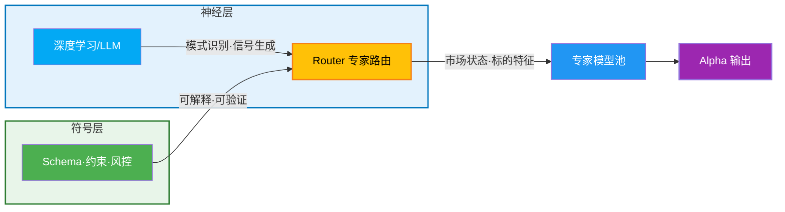
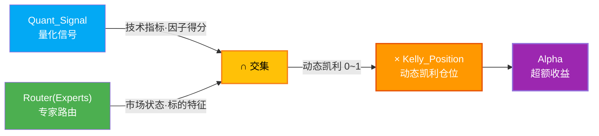

# L1 · 一句话定义与核心价值

> [!NOTE] **[TRACEBACK] 顶层概念锚点**
> - **本文档**: L1 层级，定义项目根本定位
> - **同层**: [战略目标与ROI](./02_战略目标与ROI.md) | [双轨制与VC-Agent](./03_双轨制与VC-Agent.md) | [金融开源项目调查](./04_金融开源项目调查.md) | [优先借鉴的十大开源选型](./05_谛听优先借鉴的十大开源选型.md)

## 一句话定义

**谛听 (Diting)**：一个**双轨制（Barbell）**的分布式智能交易系统——**现金奶牛轨（约 80% 资金）**在「不可能三角」（胜率 ≥ 85%、年化复利 ≥ 45%、回撤 < 12%）约束下提供生存与现金流，**长期捕手轨（约 20% 资金）**在逻辑证伪与大周期反转规则下捕捉时代级牛股；两轨共用 Neuro-Symbolic MoE 架构与核心公式 $Alpha = (Quant \cap Router) \times Kelly$，通过协议 `TimeHorizon` 在判官层做规则分流，实现以短养长与情绪对冲。

## 设计哲学

### 双轨制（Barbell）与两轨分工

谛听采用**双轨制（The Barbell Strategy）**，将资金与目标拆分为两条并行轨道，在不推翻核心公式与 MoE 的前提下兼顾「生存」与「趋势捕获」：

| 轨道 | 策略 | 资金比例 | 定位 | 核心逻辑 |
|------|------|---------|------|----------|
| **现金奶牛轨（Strategy A）** | 现有谛听短线策略 | 约 80% | 生存与现金流 | 高胜率、严止损、可解释标的；受「不可能三角」约束 |
| **长期捕手轨（Strategy B）** | VC-Agent / 信仰专家 | 约 20%（或 A 轨利润输血） | 时代级牛股捕获 | 逻辑证伪止损、基本面驱动、买入锁仓至大周期反转；**不受** 2% 硬止损与现金拖累监控 |

**两轨协同价值**：
- **以短养长**：现金奶牛轨在震荡与泡沫破裂期提供稳定现金流，供长期捕手轨在龙头回调时加仓。
- **情绪对冲**：市场崩盘时长线仓位承压，短线轨（含可选做空）的盈利可提供心理缓冲，便于拿住长线仓位。
- **伪 AI 过滤**：短线轨的 Risk Shield 在趋势证伪时快速止损，保护本金；长线轨仅在对产业趋势与基本面持续看好时锁仓。

**与 MoE 的关系**：核心公式与三角约束**默认作用于现金奶牛轨**；长期捕手轨通过协议中的 `TimeHorizon = LONG_TERM` 在判官（Module D）层做规则分流（豁免 2% 硬止损与现金拖累），实现细节见 [03_双轨制与VC-Agent](./03_双轨制与VC-Agent.md)。规则与模块按轨适用关系见 [03_双轨制与VC-Agent](./03_双轨制与VC-Agent.md)#AB轨规范边界。

### Neuro-Symbolic MoE（神经符号混合专家架构）

- **神经层**：使用深度学习/LLM 处理复杂模式识别、生成交易信号与策略建议
- **符号层**：使用符号规则（Schema、约束、风控规则）保证可解释性与可验证性
- **混合专家（MoE）**：通过 Router 机制动态选择最适合的专家模型处理不同市场状态与标的类型

三者协作链路见 L3 [核心公式与MoE架构规约](../03_原子目标与规约/_共享规约/01_核心公式与MoE架构规约.md#深度学习专家路由与约束封控的协作链路)。

## 核心公式

$$
Alpha = (Quant_{Signal} \cap Router(Experts)) \times Kelly_{Position}
$$

**公式说明**：
- **Quant_{Signal}**：量化信号（技术指标、因子得分）
- **Router(Experts)**：专家路由器的输出（根据市场状态与标的特征选择最优专家）
- **Kelly_{Position}**：动态凯利仓位（0.0-1.0）
- **Alpha**：超额收益 = （量化信号 ∩ 专家路由） × 仓位管理

**核心公式在两轨下的适用**：现金奶牛轨（A 轨）上，上述公式与「不可能三角」**全约束**生效；长期捕手轨（B 轨）通过协议字段 `TimeHorizon = LONG_TERM` 在判官（Module D）层做规则分流，豁免 2% 硬止损与现金拖累，公式仍用于信号与仓位 sizing，但不适用三角 KPI。详见 [03_双轨制与VC-Agent](./03_双轨制与VC-Agent.md)。

## 核心价值

### 1. 双轨制：生存与趋势兼得
- 现金奶牛轨保障生存与现金流，长期捕手轨捕捉时代级趋势；两轨分轨统计与追溯见 [03_双轨制与VC-Agent](./03_双轨制与VC-Agent.md)。

### 2. 文档即协议
- 所有实现仓库（代码仓、部署仓）都必须能在本文档仓中找到“为什么这样设计”的依据。

### 3. 神经符号一体
- 用神经网络/LLM 处理复杂模式识别、生成方案；  
- 用符号规则（Schema、约束、风控规则）保证可解释性与可验证性。

### 4. 可追溯性
- 从顶层概念到具体实现，每一层都能向上溯源到战略目标与核心价值。

### A 轨约束：不可能三角（The Impossible Triangle）

**适用范围**：以下三项约束**仅适用于现金奶牛轨（Strategy A）**。长期捕手轨（Strategy B）不受本三角约束，见「双轨制与两轨分工」及 [03_双轨制与VC-Agent](./03_双轨制与VC-Agent.md)。

| 维度 | 约束条件 | 说明 |
|------|---------|------|
| **认知边界 (Certainty)** | 胜率 ≥ 85% | 放弃全知全能，只做能被特定领域逻辑解释的 10% 标的，锁定高胜率以支撑 45% 复利目标 |
| **复利增长 (Growth)** | 年化复利 ≥ 45% | 通过多策略池并发挖掘 + 现金拖累监控，强制锁定复利目标 |
| **生存底线 (Survival)** | 回撤 < 12% | 严控回撤，任何无法解释的风险直接平仓 |

**实现层风控约束**（如单笔风险上限、盈亏比下限等）由 L3 规约与验收标准约定，不在此写具体数值；权威数值与验收见 [09_核心模块架构规约 Module E](../03_原子目标与规约/_共享规约/09_核心模块架构规约.md)「A 轨实现层风控约束」及 [02_验收标准](../05_成功标识与验证/02_验收标准.md)。

**三角关系**：
- 高胜率（认知边界）与高复利（增长）的平衡：通过多策略池并发挖掘，在保持高胜率的前提下提高资金利用率
- 高复利（增长）与低回撤（生存）的平衡：通过动态凯利公式与现金拖累监控，在追求复利的同时严格控制风险
- 高胜率（认知边界）与低回撤（生存）的平衡：只做可解释的标的，任何无法解释的风险直接平仓

*说明：上图约束仅适用于现金奶牛轨（Strategy A）；长期捕手轨（Strategy B）不受本三角约束。*

**另**：防御性复利「年化达 30% 触发利润保护」与上述不可能三角 45% 目标不同，详见 [ADR-005 防御性复利模式](../06_追溯与审计/ADR/005-defensive-compound-mode.md)。

## 项目定位

- **文档仓库**：`diting-doc`（当前仓库）
- **代码仓库**：`diting-core`（业务源码）
- **部署仓库**：`diting-infra`（IaC/运维脚本）

## 下一步

→ 参见 [02_战略目标与ROI](./02_战略目标与ROI.md)、[03_双轨制与VC-Agent](./03_双轨制与VC-Agent.md)
