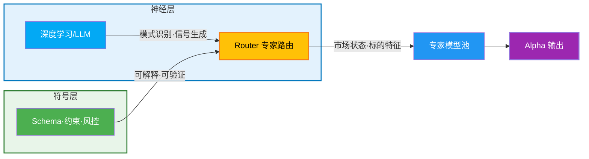
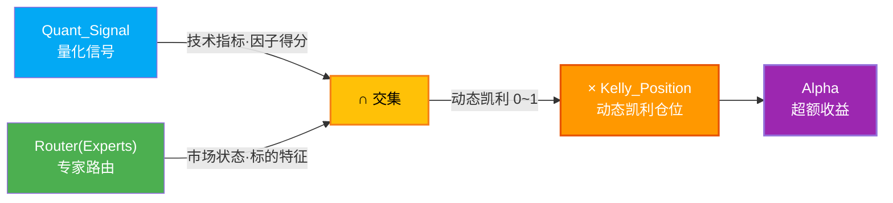
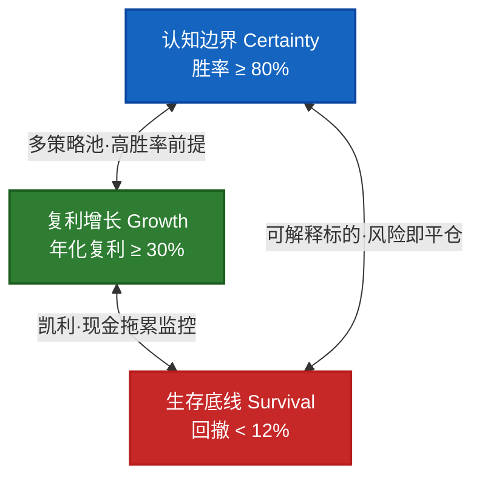

# L1 · 一句话定义与核心价值

> [!NOTE] **[TRACEBACK] 顶层概念锚点**
> - **本文档**: L1 层级，定义项目根本定位

## 一句话定义

**谛听 (Diting)**：一个通过 **Neuro-Symbolic MoE 架构**将量化信号与专家路由强制交集，并用动态凯利公式最大化复利效率的**分布式智能交易系统**，在胜率 ≥ 80%、年化复利 ≥ 30%、回撤 < 12% 的“不可能三角”约束下运行。

## 设计哲学

### Neuro-Symbolic MoE（神经符号混合专家架构）

- **神经层**：使用深度学习/LLM 处理复杂模式识别、生成交易信号与策略建议
- **符号层**：使用符号规则（Schema、约束、风控规则）保证可解释性与可验证性
- **混合专家（MoE）**：通过 Router 机制动态选择最适合的专家模型处理不同市场状态与标的类型

三者协作链路见 L3 [核心公式与MoE架构规约](../03_原子目标与规约/01_核心公式与MoE架构规约.md#深度学习专家路由与约束封控的协作链路)。

## 核心公式

$$
Alpha = (Quant_{Signal} \cap Router(Experts)) \times Kelly_{Position}
$$

**公式说明**：
- **Quant_{Signal}**：量化信号（技术指标、因子得分）
- **Router(Experts)**：专家路由器的输出（根据市场状态与标的特征选择最优专家）
- **Kelly_{Position}**：动态凯利仓位（0.0-1.0）
- **Alpha**：超额收益 = （量化信号 ∩ 专家路由） × 仓位管理

## 核心价值

### 1. 文档即协议
- 所有实现仓库（代码仓、部署仓）都必须能在本文档仓中找到“为什么这样设计”的依据。

### 2. 神经符号一体
- 用神经网络/LLM 处理复杂模式识别、生成方案；  
- 用符号规则（Schema、约束、风控规则）保证可解释性与可验证性。

### 3. 可追溯性
- 从顶层概念到具体实现，每一层都能向上溯源到战略目标与核心价值。

### 4. 不可能三角（The Impossible Triangle）

谛听系统必须同时满足以下三项约束，形成“不可能三角”：

| 维度 | 约束条件 | 说明 |
|------|---------|------|
| **认知边界 (Certainty)** | 胜率 ≥ 80% | 放弃全知全能，只做能被特定领域逻辑解释的 10% 标的，锁定高胜率 |
| **复利增长 (Growth)** | 年化复利 ≥ 30% | 通过多策略池并发挖掘 + 现金拖累监控，强制锁定复利目标 |
| **生存底线 (Survival)** | 回撤 < 12% | 严控回撤，任何无法解释的风险直接平仓 |

**三角关系**：
- 高胜率（认知边界）与高复利（增长）的平衡：通过多策略池并发挖掘，在保持高胜率的前提下提高资金利用率
- 高复利（增长）与低回撤（生存）的平衡：通过动态凯利公式与现金拖累监控，在追求复利的同时严格控制风险
- 高胜率（认知边界）与低回撤（生存）的平衡：只做可解释的标的，任何无法解释的风险直接平仓

## 项目定位

- **文档仓库**：`diting-doc`（当前仓库）
- **代码仓库**：`diting-core`（业务源码）
- **部署仓库**：`diting-infra`（IaC/运维脚本）

## 下一步

→ 参见 [02_战略目标与ROI.md](./02_战略目标与ROI.md)
