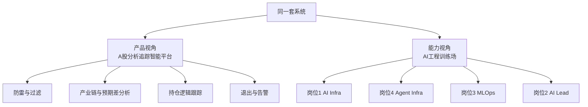

# L1 · 一句话定义与核心价值

> [!NOTE] **[TRACEBACK] 顶层概念锚点**
> - **本文档**: L1 层级，定义项目新的根本定位
> - **同层**: [战略目标与ROI](./02_战略目标与ROI.md) | [双目标系统与架构分层](./03_双轨制与VC-Agent.md) | [产品目标系统概念与目标](./04_B轨系统概念与目标.md) | [个人能力训练系统概念与目标](./05_C轨系统概念与目标.md)
> - **说明**: 旧的“三轨交易系统”叙事已降级为历史阶段设计；当前 L1 主轴切换为“副业产品 + 个人 AI 技术训练”的双目标系统

## 一句话定义

**谛听（Diting）**：一个以 **A 股分析追踪智能平台** 为外部价值、以 **AI Infra / Agent Infra 实战训练场** 为内部价值的双目标系统；同一套代码同时服务两个结果：一边产出真实可用的投研与跟踪能力，一边沉淀年底跳槽到 **AI 基础设施、Agent 基础设施、MLOps、AI 技术负责人** 岗位所需的硬核工程证据。

## 项目不再是什么

- 不再把自己定义为“纯交易系统”或“纯量化系统”
- 不再把顶层设计建立在旧的 A/B/C 轨资金分配叙事上
- 不再把“自动下单”视为第一阶段核心价值
- 不再为了业务而回避 Infra，也不再为了练 Infra 做完全脱离业务的问题

## 顶层定位

### 1. 外部目标：做一个真正有用的 AI 投研平台

平台首先解决的是**研究与跟踪效率**，而不是炫技：

- 自动采集和组织财报、公告、新闻、行业、产业链、价格与成交数据
- 将“防雷、找预期差、跟踪逻辑、提醒退出”做成可复用工作流
- 让系统输出结构化结论、证据链、待跟踪指标和风险告警
- 逐步从“辅助研究工具”升级到“半自动分析与追踪平台”

### 2. 内部目标：把副业做成岗位训练营

这个项目不是普通 side project，而是**简历驱动但不简历造假**的工程训练体系：

- 对 **岗位 1：AI 基础设施研发工程师**，练 `vLLM`、`Kubernetes`、推理网关、可观测性、FinOps
- 对 **岗位 4：智能体基础设施工程师**，练沙箱、长任务状态管理、多租户、隔离、成本控制
- 对 **岗位 3：MLOps**，补上评测、部署、回滚、CT（Continuous Training）闭环
- 对 **岗位 2：AI 技术负责人**，补上业务抽象、Prompt/Workflow、RAG/Agent 设计、产品视角

### 3. 双目标的关系

这不是两个彼此分离的项目，而是一个系统的两种视角：

```mermaid
flowchart TB
  A[同一套系统]
  A --> B[产品视角<br/>A股分析追踪智能平台]
  A --> C[能力视角<br/>AI工程训练场]

  B --> B1[防雷与过滤]
  B --> B2[产业链与预期差分析]
  B --> B3[持仓逻辑跟踪]
  B --> B4[退出与告警]

  C --> C1[岗位1 AI Infra]
  C --> C2[岗位4 Agent Infra]
  C --> C3[岗位3 MLOps]
  C --> C4[岗位2 AI Lead]
```

## 核心价值

### 1. 一套系统，两个回报

- **产品回报**：提高研究效率、降低踩雷概率、增强跟踪纪律
- **职业回报**：把抽象的 AI 技术能力变成可讲、可演示、可量化的项目经历

### 2. 以战代练，而不是闭门造车

所有技术训练必须挂到真实业务问题上：

- 为什么要做 `RAG`：因为财报、公告、研报需要可检索与可引用
- 为什么要做 `vLLM`：因为后续需要切换到自托管推理与成本治理
- 为什么要做沙箱：因为要让 Agent 安全执行模型生成代码
- 为什么要做 `CT / Eval`：因为系统需要随着纠错和复盘逐步进化

### 3. 产品优先，但允许“有目的的过度设计”

商业上看，很多基础设施设计属于过度设计；但在本项目里，只要同时满足以下两条，就属于**合理过度设计**：

1. 它服务于未来真实产品演进方向  
2. 它直接训练年底跳槽所需岗位能力

### 4. 岗位 1 和岗位 4 是主线

四类岗位里，当前主攻顺序明确为：

1. **岗位 1：AI 基础设施研发工程师**
2. **岗位 4：智能体基础设施工程师**
3. **岗位 3：MLOps**
4. **岗位 2：AI 技术负责人**

含义不是放弃 2/3，而是让 2/3 成为 1/4 的自然外溢结果。

## 顶层设计原则

### 原则一：先跑通业务闭环，再下沉底座

第一阶段优先验证：

- 数据是否能采到
- 研究流程是否真能帮自己做决策
- 哪些结论是高价值的
- 哪些地方值得为之投入基础设施复杂度

### 原则二：每一层复杂度都要有双重收益

任何新增复杂度都要回答两个问题：

1. 它提升了什么产品能力？
2. 它训练了什么岗位能力？

答不上来，就暂缓。

### 原则三：把历史“三轨”降级为业务策略实例

旧的 A/B/C 轨不再作为 L1 主轴；如果后续需要保留短线、中线、长线或不同研究模式，它们应当作为**业务层的策略模板或研究模板**存在，而不是再主导顶层架构。

### 原则四：系统从“单用户可用”演进到“平台化可复用”

第一性目标是先让自己用起来；但设计上要保留向下列能力演进的可能：

- 多 Agent 协同
- 自托管推理
- 沙箱执行
- 多租户
- CT / Eval / 回滚
- SaaS / 开源资产化

## 项目定位

- **文档仓库**：`diting-doc`
- **代码仓库**：`diting-core`
- **部署仓库**：`diting-infra`

## 一致性检查表

- [x] L1 主叙事已从“三轨交易系统”切换为“双目标系统”
- [x] 已明确区分“产品目标”和“个人能力训练目标”
- [x] 已将岗位 1、4 设为主训练方向，岗位 2、3 作为补充覆盖
- [x] 已把旧的轨道资金叙事降级为业务层可选策略实例

## 下一步

→ 参见 [02_战略目标与ROI](./02_战略目标与ROI.md)、[03_双目标系统与架构分层](./03_双轨制与VC-Agent.md)
