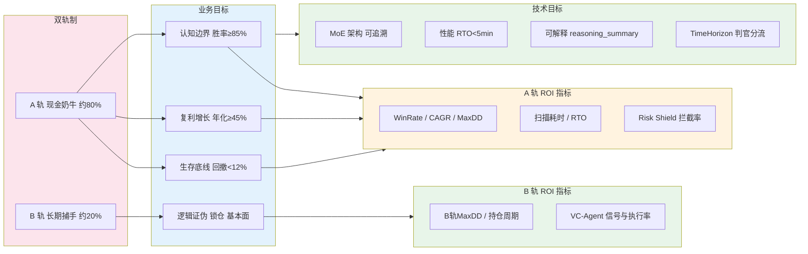

# L1 · 战略目标与 ROI

> [!NOTE] **[TRACEBACK] 顶层概念锚点**
> - **顶层概念**: [一句话定义与核心价值](./01_一句话定义与核心价值.md) | [双轨制与VC-Agent](./03_双轨制与VC-Agent.md) | [金融开源项目调查](./04_金融开源项目调查.md) | [优先借鉴的十大开源选型](./05_谛听优先借鉴的十大开源选型.md)
> - **本文档**: L1 层级，定义战略目标与投资回报

## 战略目标

谛听采用**双轨制（Barbell）**：**现金奶牛轨（Strategy A，约 80% 资金）**负责生存与稳定现金流，受不可能三角约束；**长期捕手轨（Strategy B，约 20% 资金或 A 轨利润输血）**负责捕捉时代级牛股，采用差异化规则。两轨目标与实现如下。

### 现金奶牛轨（A 轨）战略目标

基于 **不可能三角（The Impossible Triangle）** 的约束，A 轨核心业务目标：

1. **认知边界（Certainty）**  
   - 目标：锁定 ≥ 85% 胜率（以更好支撑 45% 年化复利）
   - 策略：放弃全知全能，只做能被特定领域逻辑解释的 10% 标的
   - 实现：通过 Neuro-Symbolic MoE（混合专家）架构，确保每个交易信号都有可解释的逻辑支撑

2. **复利增长（Growth）**  
   - 目标：强制锁定 ≥ 45% 年化复利
   - 策略：多策略池并发挖掘 + 现金拖累监控
   - 实现：通过 Router(Experts) 动态选择最优策略，Cash Drag Monitor 监控空仓时长并动态调整阈值

3. **生存底线（Survival）**  
   - 目标：严控回撤 < 12%
   - 策略：任何无法解释的风险直接平仓
   - 实现：硬编码风控规则（单笔风险 < 2%，盈亏比 > 1.5），实时监控与自动平仓机制

### 长期捕手轨（B 轨）战略目标

B 轨**不受**不可能三角与 A 轨硬止损/现金拖累约束，目标与实现如下：

- **目标**：捕捉时代级大牛股（如 AI 龙头），容忍途中大幅回撤与早期「不可解释」阶段；以短养长、情绪对冲。
- **策略**：逻辑证伪止损（产业趋势未破则不止损，必要时加仓）；基本面驱动（接入财报、营收增速、研发占比等，如 AkShare）；买入即锁仓，仅在大周期反转（Major Trend Reversal）时止盈。
- **实现**：Repo-I 中 **VC-Agent（信仰专家）**；协议中 `TimeHorizon = LONG_TERM`；Module D（判官）对 LONG_TERM 信号**豁免** 2% 硬止损与现金拖累监控，仅施加逻辑证伪与大周期反转规则。详见 [03_双轨制与VC-Agent](./03_双轨制与VC-Agent.md)。

### 两轨协同

以短养长：A 轨在震荡与泡沫破裂期提供稳定现金流，供 B 轨在龙头回调时加仓。情绪对冲：市场崩盘时 B 轨承压，A 轨（含可选做空）盈利提供心理缓冲，便于拿住长线仓位。两轨指标分轨统计，不混用 A 轨标准评估 B 轨，见 [03_双轨制与VC-Agent](./03_双轨制与VC-Agent.md)。

### 技术目标

1. **架构目标**  
   - 实现 Neuro-Symbolic MoE 架构，支持量化信号与专家路由的智能融合
   - 建立可追溯的决策链路：从量化信号 → 专家路由 → 凯利仓位 → 风控拦截
   - **支持双轨引擎**：A 轨沿用现有 MoE + 凯利 + 风控；B 轨通过协议 `TimeHorizon = LONG_TERM` 在判官（Module D）层做差异化规则（豁免 2% 硬止损与现金拖累，仅施加逻辑证伪与大周期反转），见 [03_双轨制与VC-Agent](./03_双轨制与VC-Agent.md)

2. **性能目标**  
   - 全市场扫描 + 推理 < 30 分钟
   - RTO（恢复时间目标）< 5 分钟（竞价实例恢复）
   - 超时或部分失败时的处理策略（如降级、熔断、重试）由 L3 规约约定，见 [10_运营治理与灾备规约](../03_原子目标与规约/_共享规约/10_运营治理与灾备规约.md) 性能与可用性边界

3. **可解释性目标（按轨）**  
   - **A 轨**：不可能三角可追溯（胜率/年化/回撤对应认知边界、复利增长、生存底线）；每个交易信号包含 `reasoning_summary`（AI 白盒逻辑）；决策可追溯到量化信号、专家选择与风控规则。
   - **B 轨**：逻辑证伪与大周期反转规则可追溯；基本面驱动可追溯（财报、营收增速、研发占比等数据来源）；**不适用** 2% 硬止损与不可能三角 KPI，见 [03_双轨制与VC-Agent](./03_双轨制与VC-Agent.md)#AB轨规范边界

## 战略目标与 ROI 逻辑链路

## ROI（投资回报）

### 预期收益

基于核心公式 $Alpha = (Quant_{Signal} \cap Router(Experts)) \times Kelly_{Position}$ 的预期：

- **超额收益（Alpha）**：通过量化信号与专家路由的交集，最大化复利效率
- **风险控制**：通过严格的风控规则与回撤控制，保证资金安全
- **可扩展性**：MoE 架构支持动态添加新专家，持续优化策略池
- **双轨协同**：A 轨提供稳定现金流与心理缓冲，B 轨追求时代级非线性回报；以短养长、情绪对冲，两轨指标分轨评估

### A 轨关键指标

以下指标**仅针对现金奶牛轨（A 轨）**，与不可能三角一一对应。

| 指标类别 | 指标名称 | 目标值 | 测量方法 |
|---------|---------|--------|---------|
| **认知边界** | 胜率（WinRate） | ≥ 85% | 回测统计（与 L1 一致） |
| **复利增长** | 年化收益率（CAGR） | ≥ 45% | 回测与实盘统计 |
| **生存底线** | 最大回撤（MaxDD） | < 12% | 回测与实盘监控 |
| **工程性能** | 全市场扫描+推理耗时 | < 30 分钟 | 系统监控 |
| **工程性能** | RTO | < 5 分钟 | 故障演练 |
| **风控** | Risk Shield 拦截率 | 100% | 高波动模拟测试 |

### B 轨关键指标

B 轨指标**分轨统计**，不与 A 轨混用；复盘与归因时与 A 轨分开评估，**不得用 A 轨不可能三角标准误评 B 轨**。

| 指标类别 | 指标名称 | 说明 |
|---------|---------|------|
| **风险** | B 轨 MaxDD | 可高于 12%，按策略约定；单独统计 |
| **持仓** | 平均持仓周期 | 长线锁仓典型周期 |
| **信号** | VC-Agent 信号数与执行率 | 信仰专家触发与落地情况 |
| **归因** | 逻辑证伪/大周期反转触发记录 | 可追溯止盈/止损原因 |

详见 [03_双轨制与VC-Agent](./03_双轨制与VC-Agent.md) 分账与复盘分轨约定。

## 下一步

→ 参见 [02_战略维度/](../02_战略维度/) 目录下的战略维度文档
