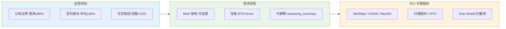

# L1 · 战略目标与 ROI

> [!NOTE] **[TRACEBACK] 顶层概念锚点**
> - **顶层概念**: [一句话定义与核心价值](./01_一句话定义与核心价值.md)
> - **本文档**: L1 层级，定义战略目标与投资回报

## 战略目标

### 业务目标

基于 **不可能三角（The Impossible Triangle）** 的约束，谛听系统的核心业务目标：

1. **认知边界（Certainty）**  
   - 目标：锁定 ≥ 80% 胜率
   - 策略：放弃全知全能，只做能被特定领域逻辑解释的 10% 标的
   - 实现：通过 Neuro-Symbolic MoE（混合专家）架构，确保每个交易信号都有可解释的逻辑支撑

2. **复利增长（Growth）**  
   - 目标：强制锁定 ≥ 30% 年化复利
   - 策略：多策略池并发挖掘 + 现金拖累监控
   - 实现：通过 Router(Experts) 动态选择最优策略，Cash Drag Monitor 监控空仓时长并动态调整阈值

3. **生存底线（Survival）**  
   - 目标：严控回撤 < 12%
   - 策略：任何无法解释的风险直接平仓
   - 实现：硬编码风控规则（单笔风险 < 2%，盈亏比 > 1.5），实时监控与自动平仓机制

### 技术目标

1. **架构目标**  
   - 实现 Neuro-Symbolic MoE 架构，支持量化信号与专家路由的智能融合
   - 建立可追溯的决策链路：从量化信号 → 专家路由 → 凯利仓位 → 风控拦截

2. **性能目标**  
   - 全市场扫描 + 推理 < 30 分钟
   - RTO（恢复时间目标）< 5 分钟（竞价实例恢复）

3. **可解释性目标**  
   - 每个交易信号都包含 `reasoning_summary`（AI 白盒逻辑）
   - 所有决策可追溯到对应的量化信号、专家选择与风控规则

## 战略目标与 ROI 逻辑链路

## ROI（投资回报）

### 预期收益

基于核心公式 $Alpha = (Quant_{Signal} \cap Router(Experts)) \times Kelly_{Position}$ 的预期：

- **超额收益（Alpha）**：通过量化信号与专家路由的交集，最大化复利效率
- **风险控制**：通过严格的风控规则与回撤控制，保证资金安全
- **可扩展性**：MoE 架构支持动态添加新专家，持续优化策略池

### 关键指标

| 指标类别 | 指标名称 | 目标值 | 测量方法 |
|---------|---------|--------|---------|
| **认知边界** | 胜率（WinRate） | ≥ 75% | 回测统计（双重验证后目标 ≥ 80%） |
| **复利增长** | 年化收益率（CAGR） | ≥ 30% | 回测与实盘统计 |
| **生存底线** | 最大回撤（MaxDD） | < 12% | 回测与实盘监控 |
| **工程性能** | 全市场扫描+推理耗时 | < 30 分钟 | 系统监控 |
| **工程性能** | RTO | < 5 分钟 | 故障演练 |
| **风控** | Risk Shield 拦截率 | 100% | 高波动模拟测试 |

## 下一步

→ 参见 [02_战略维度/](../02_战略维度/) 目录下的战略维度文档
