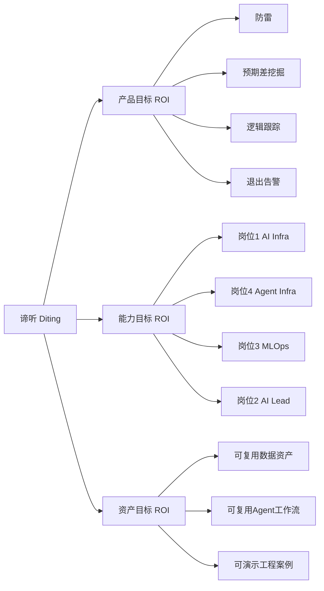

# L1 · 战略目标与 ROI

> [!NOTE] **[TRACEBACK] 顶层概念锚点**
> - **顶层概念**: [一句话定义与核心价值](./01_一句话定义与核心价值.md) | [双目标系统与架构分层](./03_双轨制与VC-Agent.md) | [产品目标系统概念与目标](./04_B轨系统概念与目标.md) | [个人能力训练系统概念与目标](./05_C轨系统概念与目标.md)
> - **本文档**: L1 层级，定义双目标系统的战略目标、阶段性 ROI 与优先级

## 战略目标

谛听的战略目标不再是“只做收益最大化的交易系统”，而是同时追求三类回报：

1. **产品 ROI**：让系统真实提升 A 股分析、跟踪、决策纪律与信息穿透效率  
2. **能力 ROI**：让副业持续训练岗位 1/4 为主、2/3 为辅的 AI 工程能力  
3. **资产 ROI**：让代码、数据、工作流、评测体系逐步沉淀为可复用、可开源、可 SaaS 化的资产

## 一、双目标总览

```mermaid
flowchart LR
  A[谛听 Diting]
  A --> B[产品目标 ROI]
  A --> C[能力目标 ROI]
  A --> D[资产目标 ROI]

  B --> B1[防雷]
  B --> B2[预期差挖掘]
  B --> B3[逻辑跟踪]
  B --> B4[退出告警]

  C --> C1[岗位1 AI Infra]
  C --> C2[岗位4 Agent Infra]
  C --> C3[岗位3 MLOps]
  C --> C4[岗位2 AI Lead]

  D --> D1[可复用数据资产]
  D --> D2[可复用Agent工作流]
  D --> D3[可演示工程案例]
```

## 二、产品目标

### 1. 第一目标：建立“确定性防御”能力

系统先解决“少踩雷”，而不是“立刻赚快钱”：

- 财报与公告风险识别
- 高管、业务逻辑、行业位置的异常抽取
- 负面新闻与核心假设冲突检测
- 将“一票否决项”做成结构化规则与 Agent 审查流

### 2. 第二目标：建立“产业爆发力”识别能力

系统需要帮助发现真正有赔率的标的：

- 产业链位置与定价权分析
- 景气度、政策、产能、订单、渗透率等结构化跟踪
- 将新闻、研报、财报、价格与产业数据合并为“预期差视图”
- 给出“为什么值得跟踪/为什么不值得”的证据链

### 3. 第三目标：建立“逻辑跟踪与退出矩阵”

系统不是一次性给结论，而是持续跟踪：

- 为每个标的定义核心假设与观测指标
- 当指标偏离时自动提醒
- 将退出原因拆成“逻辑破坏 / 估值过热 / 机会成本替换 / 风险事件”
- 所有退出都必须有证据与记录

### 4. 第四目标：建立“系统自进化飞轮”

- 把你的纠错、复盘、人工反馈沉淀为训练数据
- 用评测体系检验 Prompt、RAG、Agent 工作流是否真的变好
- 让系统逐步形成自己的知识底座、规则底座和评测底座

## 三、能力目标

### 主线目标：岗位 1 + 岗位 4

#### 岗位 1：AI 基础设施研发工程师

需要在项目中练到：

- 自托管推理网关：`vLLM`
- 推理服务编排：`Kubernetes`
- 观测与成本：`Prometheus`、`Grafana`、FinOps
- 模型切换与服务治理：多模型 / 多 LoRA / 灰度发布

#### 岗位 4：智能体基础设施工程师

需要在项目中练到：

- Agent 运行时隔离
- 沙箱或轻量虚拟化
- 长任务生命周期管理
- 多租户与资源配额
- 安全、观测、冷启动与成本控制

### 辅线目标：岗位 3 + 岗位 2

#### 岗位 3：MLOps

项目中自然覆盖：

- 模型版本管理
- Eval 与回归验证
- 部署、回滚、灰度
- CT（Continuous Training）闭环

#### 岗位 2：AI 技术负责人

项目中自然覆盖：

- 业务抽象能力
- Prompt / Workflow / RAG / Agent 设计
- “先业务价值后技术复杂度”的产品判断
- 面向真实用户问题的 AI 能力包装

## 四、阶段性 ROI 设计

### Phase 1：业务闭环 ROI

目标：尽快让系统对你自己有用。

成功标志：

- 能自动采集关键数据
- 能生成有参考价值的研究结论
- 能为关注标的建立跟踪卡片与提醒
- 你愿意每天或每周实际使用

### Phase 2：推理基础设施 ROI

目标：从“调 API”升级到“掌握推理底座”。

成功标志：

- 至少有一条核心能力迁移到自托管模型
- 能比较不同模型、参数、部署方式的成本与效果
- 可以把这部分经验作为岗位 1 面试案例讲清楚

### Phase 3：Agent Runtime ROI

目标：让 Agent 不只是会说，还能安全地做。

成功标志：

- LLM 能生成结构化动作或代码
- 动作/代码在隔离环境里运行
- 支持长任务、失败恢复、状态跟踪
- 可以把这部分经验作为岗位 4 面试案例讲清楚

### Phase 4：MLOps / Eval ROI

目标：让系统能够被评测、发布、回滚、进化。

成功标志：

- 形成最小评测集
- 形成版本与回滚策略
- 形成基于反馈的数据闭环
- 可以把这部分经验作为岗位 3 面试案例讲清楚

## 五、ROI 衡量方式

### 产品 ROI 指标

- 研究准备时间是否显著下降
- 风险标的是否更早暴露
- 跟踪是否更连续、更纪律化
- 每次结论是否有更完整的证据链

### 能力 ROI 指标

- 是否形成 3-5 个能写进简历的硬核项目条目
- 是否形成 2-3 个可演示的技术模块
- 是否能用岗位语言解释项目设计与取舍
- 是否能在面试中清晰回答“你为什么这样设计”

### 资产 ROI 指标

- 是否形成可复用的数据资产与知识库
- 是否形成可复用的 Prompt / Workflow / Eval 模板
- 是否形成可独立发布的开源或 SaaS 雏形

## 六、优先级原则

1. **产品价值优先于架构炫技**
2. **主线能力训练优先于边缘特性补全**
3. **先让自己成为用户，再考虑多租户扩展**
4. **先手工辅助闭环，再做自动化闭环**

## 一致性检查表

- [x] 已从单一“收益目标”重构为“产品 ROI + 能力 ROI + 资产 ROI”
- [x] 已明确岗位 1、4 为主线，岗位 2、3 为辅线
- [x] 已把阶段目标改成适配副业与年底跳槽的路线
- [x] 已去除旧的 A/B/C 轨顶层 ROI 叙事

## 下一步

→ 参见 [02_战略维度/](../02_战略维度/) 目录下的新战略维度总览
