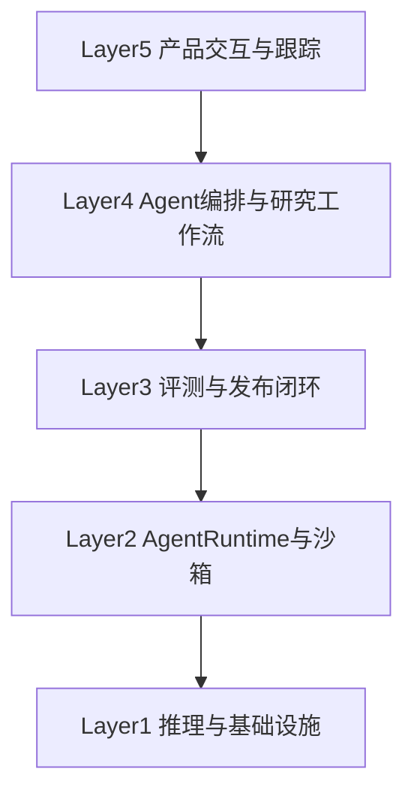

# L1 · 双目标系统与五层架构

> [!NOTE] **[TRACEBACK] 顶层概念锚点**
> - **顶层概念**: [项目定义与核心价值](./01_项目定义与核心价值.md) | [战略目标与回报设计](./02_战略目标与回报设计.md)
> - **相关文档**: [A股分析追踪平台目标与边界](./04_A股分析追踪平台目标与边界.md) | [个人AI成长目标与训练节奏](./05_个人AI成长目标与训练节奏.md) | [L3 产品分层设计与双目标实现路径规约](../03_原子目标与规约/平台与产品/02_产品分层设计与双目标实现路径规约.md)
> - **本文档**: 定义产品系统五层架构；个人目标单独在 05 文档维护

## 为什么需要五层架构

本项目最容易出的问题，是“功能堆砌”和“架构失焦”。五层架构的目的，是让产品价值在同一套系统中分层落地、逐层验收。

在本项目中，五层架构承载四大战略维度的落地：

- 极寒防御（先避雷，再谈进攻）
- 纵深进攻（拼图形成预期差）
- 状态机监控（逻辑可观测、可迁移）
- 超级个体进化（反馈反哺系统）

## 五层架构

### Layer 5：产品交互与跟踪
- 候选池、研究卡片、thesis 卡片、退出提醒
- 聚焦用户可见价值：发现、跟踪、复盘
- 必须绑定指标字典与上线门禁

### Layer 4：Agent 编排与研究工作流
- 财报 Agent、新闻 Agent、产业链 Agent、RAG 与结构化输出
- 聚焦流程稳定性与可追溯结论
- 必须提供结构化输出和失败可恢复机制

### Layer 3：评测与发布闭环
- Eval、版本管理、灰度、回滚、CT
- 聚焦“能跑”到“可上线、可回滚”的过渡
- 必须对每次发布留下评测证据与门禁记录

### Layer 2：Agent Runtime 与沙箱
- 动作/代码执行、隔离、长任务、多租户、状态恢复
- 聚焦隔离执行、会话恢复与资源回收
- 必须有安全边界与异常处置证据

### Layer 1：推理与基础设施
- 自托管模型、vLLM、K8s、资源治理、FinOps
- 聚焦性能、成本、稳定性三类底座指标
- 必须有压测、优化与恢复演练记录

## 开发顺序

正确顺序不是从底层开始，而是：

1. 先验证 Layer 5 + Layer 4 的业务闭环
2. 再替换 Layer 1 的推理底座
3. 再引入 Layer 2 的 Runtime / 沙箱能力
4. 最后系统化 Layer 3 的评测与发布闭环

## 说明

个人岗位能力矩阵、训练顺序和技能清单不在本文档维护，统一在 [05_个人AI成长目标与训练节奏](./05_个人AI成长目标与训练节奏.md) 和 `岗位-技术提升/` 管理。
