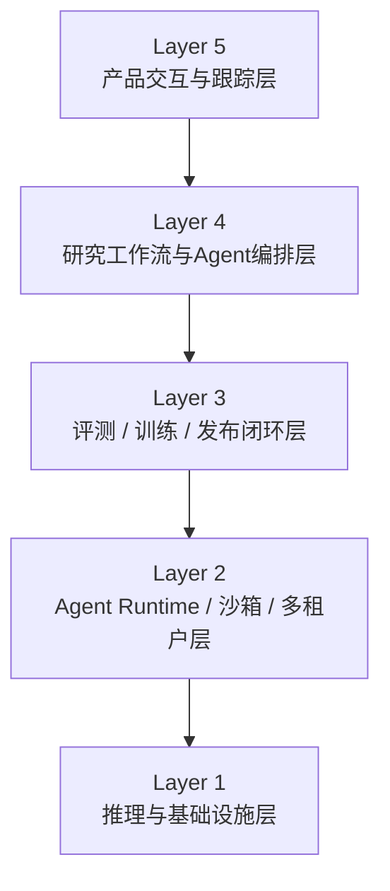

# L1 · 双目标系统与架构分层

> [!NOTE] **[TRACEBACK] 顶层概念锚点**
> - **顶层概念**: [01_一句话定义与核心价值](./01_一句话定义与核心价值.md) | [02_战略目标与ROI](./02_战略目标与ROI.md)
> - **相关文档**: [产品目标系统概念与目标](./04_B轨系统概念与目标.md) | [个人能力训练系统概念与目标](./05_C轨系统概念与目标.md)
> - **本文档**: L1 层级，定义“双目标系统”的统一架构分层
> - **说明**: 文件名保留历史命名以兼容旧链接，文档内容已不再使用旧的“三轨制”主叙事

## 一、为什么要有这份文档

在新的项目叙事里，最重要的问题不是“资金分几轨”，而是：

1. **什么能力是产品必须具备的？**
2. **什么能力是年底跳槽必须练出来的？**
3. **这两类能力如何在同一套系统中复用，而不是互相打架？**

这份文档回答的就是第三个问题。

## 二、统一架构分层

谛听采用“五层架构”，上面两层偏产品价值，下面三层偏工程训练价值：

### Layer 5：产品交互与跟踪层

这一层直接对应产品使用价值：

- 标的池、研究卡片、逻辑假设、跟踪看板
- 风险提醒、逻辑破坏提醒、退出建议
- 面向你自己或未来用户的可视化入口

对应岗位能力：

- 主要覆盖 **岗位 2（AI 技术负责人）** 的业务抽象与产品判断

### Layer 4：研究工作流与 Agent 编排层

这一层负责把“原始数据”变成“结构化结论”：

- 财报分析 Agent
- 新闻 / 产业链 / 公告分析 Agent
- RAG 检索与证据引用
- 多 Agent 工作流与状态编排
- 结构化输出与人工复核点

对应岗位能力：

- 覆盖 **岗位 2**
- 为 **岗位 3** 的评测与发布提供对象

### Layer 3：评测 / 训练 / 发布闭环层

这一层负责“让系统变得更准、更稳、更可回滚”：

- Eval 数据集
- Prompt / Workflow 回归测试
- 模型版本管理
- 微调或配置更新后的灰度发布
- CT（Continuous Training）闭环

对应岗位能力：

- 主要覆盖 **岗位 3（MLOps）**
- 也支撑 **岗位 2** 的 AI 产品治理能力

### Layer 2：Agent Runtime / 沙箱 / 多租户层

这一层是岗位 4 的核心战场：

- 模型生成代码或动作的隔离执行
- 沙箱、容器、轻量虚拟化
- 长任务与异步状态管理
- 多租户、资源配额、会话隔离
- 全链路观测、成本追踪与失败恢复

对应岗位能力：

- 主要覆盖 **岗位 4（智能体基础设施工程师）**

### Layer 1：推理与基础设施层

这一层是岗位 1 的核心战场：

- 自托管推理服务
- `vLLM` / 多模型管理 / LoRA 动态加载
- `Kubernetes` 编排
- GPU / CPU / 网络 / 存储资源治理
- 观测、告警、扩缩容、FinOps

对应岗位能力：

- 主要覆盖 **岗位 1（AI 基础设施研发工程师）**

## 三、岗位映射总表

| 架构层 | 产品价值 | 训练重点岗位 | 是否当前主线 |
|---|---|---|---|
| Layer 5 产品交互与跟踪 | 让系统真正可用 | 岗位 2 | 否 |
| Layer 4 Agent 编排 | 把研究工作流做成系统 | 岗位 2 / 3 | 次主线 |
| Layer 3 Eval / CT / 发布 | 让系统可进化 | 岗位 3 | 次主线 |
| Layer 2 Runtime / 沙箱 / 多租户 | 让 Agent 安全可运行 | 岗位 4 | **主线** |
| Layer 1 推理与基础设施 | 让模型服务可控可扩展 | 岗位 1 | **主线** |

## 四、开发顺序不是从最底层开始，而是从最短反馈回路开始

正确顺序不是“先把最难的 infra 全搭好”，而是：

1. **先验证 Layer 5 + Layer 4 的业务闭环**
2. 再替换 Layer 1 的推理底座
3. 再补 Layer 2 的安全执行与长任务运行时
4. 最后系统化 Layer 3 的评测、训练和发布闭环

原因很简单：  
如果没有业务闭环，你不知道该优化什么；如果没有用户价值，Infra 训练就会失去锚点。

## 五、关于“过度设计”的边界

允许为岗位 1/4 做一定程度的架构前置，但必须满足以下任一条件：

- 它是未来产品 6-12 个月内大概率会走到的方向
- 它能产出岗位 1/4 面试中可讲清楚的技术故事
- 它不会拖垮当前业务闭环的实现速度

反过来，如果某项设计：

- 既不提升产品价值
- 也不提升岗位训练价值
- 还会显著拖慢当前进展

那就属于应删掉的冗余设计。

## 六、统一术语

当前项目顶层统一使用以下术语：

- **产品目标系统**：面向 A 股分析追踪平台的那一面
- **个人能力训练系统**：面向岗位训练与简历沉淀的那一面
- **五层架构**：产品层、编排层、闭环层、Runtime 层、Infra 层

以下术语降级为历史阶段概念，不再作为 L1 主轴：

- A 轨 / B 轨 / C 轨
- 现金奶牛 / 长期捕手 / 三轨资金分配

## 一致性检查表

- [x] 已用“五层架构”替代旧的三轨/双轨主叙事
- [x] 已把岗位 1/4 映射到系统底层主线
- [x] 已把岗位 2/3 映射到编排、评测与产品治理层
- [x] 已明确“先业务、再下沉 infra”的实际顺序

## 下一步

→ [产品目标系统概念与目标](./04_B轨系统概念与目标.md)  
→ [个人能力训练系统概念与目标](./05_C轨系统概念与目标.md)
