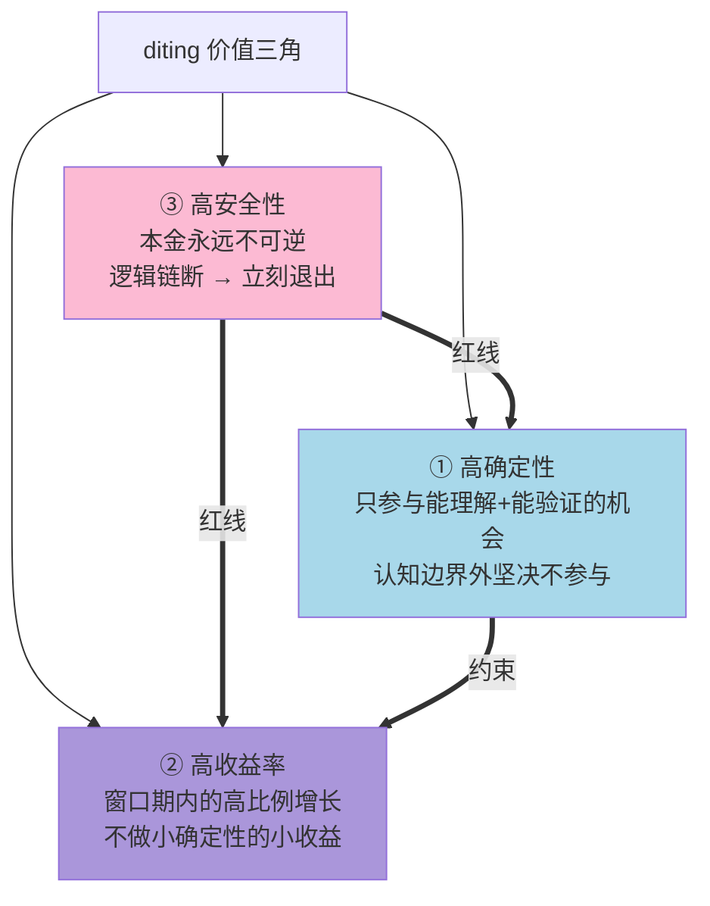
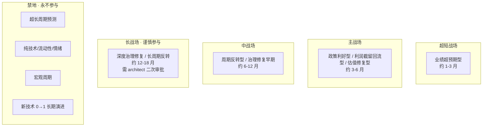

# L1 · 投资哲学体系总纲

> [!IMPORTANT] **本文档是整个 diting 项目的"地基"**。所有维度（零/一/二/三/四/五）、所有引擎、所有数据采集与训练、所有用户体验设计、所有评判与归因，**最终判据都来自本文档**。任何其他设计与本文档冲突，以本文档为准。

> [!CAUTION] **L1 性质声明（重要）**
> - 本文档**只承载哲学性陈述**：为什么、是什么、什么算正确、什么算失败、不做什么。
> - 本文档**不写**：具体阈值数字、规则矩阵、Python 实现、参数表、DNA YAML 配置。
> - 所有"怎么做、用什么参数、按什么矩阵决策、用什么代码实现"的内容，**统一归 L2 实践策略规划层**（见 §七 与 L2/L3/L4 的衔接）。
> - L1 与 L2 的边界判据：若一条内容回答"为什么/是什么/算不算正确"，则属 L1；若回答"用什么数字/按什么步骤/写什么代码"，则属 L2 及以下。

> [!NOTE] **[TRACEBACK] 顶层概念锚点**
> - **同层**: [项目定义与核心价值](./01_项目定义与核心价值.md) | [战略目标与回报设计](./02_战略目标与回报设计.md) | [双目标系统与五层架构](./03_双目标系统与五层架构.md) | [A股分析追踪平台目标与边界](./04_A股分析追踪平台目标与边界.md) | [个人AI成长目标与训练节奏](./05_个人AI成长目标与训练节奏.md)
> - **被引用**: 本文档被 02_战略维度 全 6 维度、03_原子目标与规约、04_阶段规划与实践 全文档引用为"判据来源"

---

## 目录

- [一、为什么需要这份哲学总纲](#一为什么需要这份哲学总纲)
- [二、9 块基石（哲学边界）](#二9-块基石哲学边界)
  - **【根基层 · 全项目通用】**
  - [基石 ①·价值三角](#基石-价值三角)
  - [基石 ②·认知论套利的工程化](#基石-认知论套利的工程化)
  - [基石 ③·时间边界](#基石-时间边界)
  - [基石 ④·决策正确性的八象限判定](#基石-决策正确性的八象限判定)
  - **【维度层 · 5 个维度专属哲学边界】**
  - [基石 ⑤·防御哲学边界（维度一·极寒防御）](#基石-防御哲学边界维度一极寒防御)
  - [基石 ⑥·进攻哲学边界（维度二·纵深进攻）](#基石-进攻哲学边界维度二纵深进攻)
  - [基石 ⑦·持仓监控哲学边界（维度三·持仓监控）](#基石-持仓监控哲学边界维度三持仓监控)
  - [基石 ⑧·卖出决策哲学边界（维度四·卖出决策）](#基石-卖出决策哲学边界维度四卖出决策)
  - [基石 ⑨·演进进化哲学边界（维度五·演进飞轮）](#基石-演进进化哲学边界维度五演进飞轮)
- [三、失败的明确定义（哲学层）](#三失败的明确定义哲学层)
- [四、决策类型谱（哲学层）](#四决策类型谱哲学层)
- [五、对各维度的哲学性强约束](#五对各维度的哲学性强约束)
- [六、本哲学不解决什么](#六本哲学不解决什么)
- [七、与 L2/L3/L4 的衔接](#七与-l2l3l4-的衔接)

---

## 一、为什么需要这份哲学总纲

> **没有哲学的工程是漂泊的。** diting 是一个 5+1 维度、~50 引擎、3 阶段演进、12 个月长周期的复杂系统。如果没有一份明文哲学作为地基：
> - 每个维度都会按各自最方便的方式定义"成功"；
> - 推送内容会被技术细节支配，丢失对用户的真实意义；
> - 用户用了一段时间后，无法回答"它到底有没有价值"；
> - 系统优化方向会被短期价格波动绑架，背离"认知论套利"的初心。

本文档是把所有这些回到**同一套判据**上的"宪法"。

---

## 二、9 块基石（哲学边界）

> **结构**：①-④ 是**根基层**（全项目通用哲学）；⑤-⑨ 是**维度层**（每个维度的专属哲学边界）。
>
> **每个基石的内部统一为 4 个子节**：
> 1. **核心立场**（哲学性陈述：1-2 句话）
> 2. **哲学边界**（我们做什么 / 不做什么 / 边界内外的定义）
> 3. **哲学性判据**（什么算对 / 什么算错的原则性定义，不含具体参数）
> 4. **实践规划承接位置**（→ L2 文档路径 + L3 规约路径 + DNA 键提示）

---

### 基石 ①·价值三角

#### 1.1 核心立场

整个 diting 项目存在的根本目的，是为用户（个人投资者）创造**三角型价值**：**高确定性 + 高收益率 + 高安全性**——三者优先级有序，不可平等。

#### 1.2 哲学边界



**优先级铁律**：

```
安全性 (Safety)  >  确定性 (Certainty)  >  收益率 (Return)
```

> **冲突时永远以安全性为准**——本金亏掉就再也回不来。

#### 1.3 哲学性判据

| 角 | 何为"在边界内" | 何为"在边界外" |
|---|---|---|
| **高确定性** | 决策的逻辑链清晰、可被验证、在能力圈内 | 凭直觉、消息、情绪、形态做出的决策 |
| **高收益率** | 窗口期内可期高比例收益 | 小确定性的小收益、长周期低斜率 |
| **高安全性** | 任意一条强约束失效即触发退出纪律 | 因"舍不得"或"等回本"违反退出纪律 |

> 具体的"收益率门槛是多少%"、"安全系数取多少"——属 L2 实践参数，**不在 L1 定义**。

#### 1.4 实践规划承接位置（→ L2）

| 承接对象 | 文档路径 |
|---|---|
| 维度零·价值账本 | `02_战略维度/00_维度零_AI投资副驾驶/03_价值账本与决策日志.md` |
| 各维度强约束实践 | 见基石 ⑤-⑨ 各自的 §X.4 |
| DNA 落地 | `03_原子目标与规约/_System_DNA/global_const.yaml` → `investment_philosophy.triangle` |

---

### 基石 ②·认知论套利的工程化

#### 2.1 核心立场

> **我们赚的是"市场对一只标的的认知差"——不是"价格波动差"**。
> 并把"认知差识别"从"少数大师才有的能力"工程化为可批量、可重复、可迭代的 AI 流水线。

#### 2.2 哲学边界

| ✅ 我们赚的钱 | ❌ 我们不赚的钱 |
|---|---|
| 信息已公开但未被市场充分理解的认知差 | 短期价格涨跌 |
| 跨源信息整合后才能看出的逻辑机会 | 庄家拉升、大资金硬充 |
| 长周期叙事一致性被市场短视忽略的机会 | 政策驱动的瞬时投机 |
| 弱信号汇聚为强信号后才能识别的暴雷 | 内幕消息、未公开信息 |

#### 2.3 哲学性判据

**工程化的成果应该是**：每个 thesis 卡都是"工业级研究报告"——不依赖运气、不依赖直觉、可被外部审计、可被回放。

**"在边界内" vs "在边界外"**：

```
在边界内: 公开数据 → ETL → 多 Agent 推理 → LoRA 路由 → thesis 卡（含逻辑链节点）→ SLI 探针监控
在边界外: 任何无法被工程化、无法被外部审计、无法被回放的"机会"
```

**断言级原则（2026-05-27 增）**：

> **任何具体事实 / 因果 / 关系 / 数字断言，必须有至少两个独立可信源相互印证**；单源 LLM 输出不可作为「事实」直接用于决策；缺源的断言降一档处理或拒绝写库；时效过期的断言自动失效需重验。
> 该原则不是「数据洁癖」，而是认知论套利的**保护带**——一旦系统据「未经验证的断言」做了决策，本质上是把「价格波动差」伪装成了「认知差」，从根本上违反基石 ② 的核心立场。

#### 2.4 实践规划承接位置（→ L2/L3）

| 承接对象 | 文档路径 |
|---|---|
| 工程化流水线设计 | `02_战略维度/06_跨维度协作/01_5维度协作关系图.md` |
| **标的深度分析与阶段判定（含多源验证 + 戴维斯 + market_phase）** | **`02_战略维度/06_跨维度协作/06_标的深度分析与阶段判定实践规划.md`** |
| **多源验证 fact_gate 工程化** | **`03_原子目标与规约/_共享规约/22_事实交叉验证与防幻觉规约.md`** + DNA `shared/dna_fact_gate.yaml` |
| LoRA 路由与 Agent 架构 | `03_原子目标与规约/`（待 L3 接续） |
| DNA 落地 | `_System_DNA/global_const.yaml` → `investment_philosophy.arbitrage_methodology` |

---

### 基石 ③·时间边界

#### 3.1 核心立场

> 时间边界定义"我们参与哪类时间窗口的认知套利"——**有窗口才有 alpha；超出窗口的预测 = 赌博**。

#### 3.2 哲学边界

**5 战场的存在性**（哲学性命名 + 范围；**具体资源比例属 L2**）：



> 战场的**具体天数边界、资源分配比例、最低收益门槛**——属 L2 实践规划层（见 §3.4 承接位置）。L1 仅承诺"5 战场的存在性、命名、相对关系、禁地的边界"。

#### 3.3 哲学性判据

| 哲学性原则 | 含义 |
|---|---|
| **窗口必须显式声明** | 每张 thesis 必须显式声明属于哪个战场 |
| **超出窗口 = 系统失败** | 窗口期到期未达战场预期收益门槛 = 系统决策失败（即使后续涨了也不翻盘）|
| **窗口内未达门槛 ≠ 必须卖** | 收益门槛是**系统评估指标**，不是**自动卖出触发器**——若逻辑链仍强，达到门槛后继续持仓不算错 |
| **禁地永不参与** | 即使表面机会极大，触碰禁地 = 违反方法论 = 即使赚到也算失败 |

#### 3.4 安全边界（哲学性红线）

| 不参与 | 理由 |
|---|---|
| 关键价值链不存在 | 没有可套利的"认知差" |
| 价值链存在但无法理解或验证 | 超出认知能力 = 赌博 |
| 价值链存在但 SLI 探针无法持续监控 | 不能被工程化追踪 |
| 时间窗口超出长战场上限 | 超出当前能力域 |
| 价值链节点要素涉及内幕信息 | 法律红线 + 不可重复 |
| 长战场标的占总仓位超过哲学上限 | 流动性风险 + 长期不确定性 |

> **决策纪律**：触碰任何一条 = 即使后来涨 200% 也认为我们的"不参与"决策是正确的。
> 反之，如果违反纪律去赌了，**即使赚了也是失败**——因为方法论破坏了，下一次必输。

#### 3.5 实践规划承接位置（→ L2）

> **以下内容全部由 L2 实践规划层承接**，L1 不定义：
> - 每个战场的具体天数边界（如 30-90 天、90-180 天 …）
> - 战场资源分配比例（如 30/40/25/5/0）
> - 每个战场的最低收益门槛（如 15%/20%/30%/50%）
> - 战场分配的健康浮动范围与告警阈值
> - 战场分配的执行与再平衡机制

| 承接对象 | 文档路径 |
|---|---|
| **战场参数与分配** | `02_战略维度/03_维度三_持仓监控/04_持仓策略与战场分配实践规划.md`（哲学落地，主载） |
| **战场×thesis 类型矩阵** | `02_战略维度/02_维度二_纵深进攻/04_进攻实践策略规划.md`（待建） |
| **L3 规约（thesis 卡 schema 含 battlefield 字段）** | `03_原子目标与规约/_共享规约/`（待建） |
| **DNA 落地** | `_System_DNA/global_const.yaml` → `investment_philosophy.battlefields` |

---

### 基石 ④·决策正确性的八象限判定

#### 4.1 核心立场

> **决策正确性 = 逻辑链状态 + 价格状态 + 时间窗口的三维联合判定，而不是单看价格涨跌**。

#### 4.2 哲学边界

8 象限矩阵的**存在性与哲学含义**（具体打分权重 / 加减分数值属 L2）：

|  | **逻辑链 ✅ 被验证** | **逻辑链 ❌ 已破裂** |
|---|---|---|
| **价格涨**（窗口内）| **A·完美决策**<br/>逻辑被市场验证 | **B·假阳性涨**<br/>非我们能力（庄家/拉升）；不算功劳 |
| **价格平/小波动**（窗口内）| **C·正常等待**<br/>价值链对，等爆发 | **D·延迟暴露**<br/>逻辑已断但价格未反映；必须立刻退出 |
| **价格小跌**（窗口内）| **E·正常波动**<br/>逻辑未破，可能洗盘 | **F·避雷成功**<br/>系统判 reject/sell 救了用户 |
| **价格大跌**（窗口期到 / 超出止损）| **G·窗口失败**<br/>逻辑没错但时间错 | **H·真失败**<br/>逻辑错 + 时间错 |

#### 4.3 哲学性判据

| 反直觉的判定 | 哲学解释 |
|---|---|
| **B**：涨了但不算系统功劳 | 庄家拉升不在我们能力圈内——"赚到"是运气，下次同类机会会输 |
| **D**：价格没动但算高级能力 | 早期识别 + 主动退出 = 避免了未来的暴跌 |
| **G**：涨了但算窗口失败 | 窗口期内未达战场门槛 = 模型估错窗口期，**需要校准** |
| **H** vs **B** | 同样是"系统判错"，结果天差地别——因为决策正确性看的是**逻辑判断的质量**，不是结果 |

#### 4.4 实践规划承接位置（→ L2）

> **L2 承接的具体内容**：
> - 每个象限的具体打分权重（如 A=+100, F=+100, D=+50 …）
> - 归因算法的具体实现
> - 飞轮训练数据的象限路由策略

| 承接对象 | 文档路径 |
|---|---|
| **象限归因与系统能力分** | `02_战略维度/00_维度零_AI投资副驾驶/03_价值账本与决策日志.md` |
| **飞轮训练的象限路由** | `02_战略维度/05_维度五_演进飞轮/04_演进实践策略规划.md`（待建）|
| **DNA 落地** | `_System_DNA/global_const.yaml` → `investment_philosophy.decision_quadrant` |

---

### 基石 ⑤·防御哲学边界（维度一·极寒防御）

#### 5.1 核心立场

> 防御不是"什么都防"，而是**用宁可错杀的纪律守住本金的不可逆性**。

#### 5.2 哲学边界

| ✅ 我们防 | ❌ 我们不防 |
|---|---|
| 本金的**永久性**损失（财务造假、暴雷、退市、跑路） | 短期股价波动（不是我们能力域，且无法防）|
| 可识别的暴雷类型（财务、治理、关联交易、商誉、质押、监管、海外、舆情、行业系统性 10 类）| 庄家 / 游资行为（不可工程化、不可重复）|
| 多源弱信号汇聚为强信号的"暴雷前兆" | 纯技术形态破坏（不是认知论套利的范畴）|
| 在我们能力圈外、无法理解的"机会" | 投资者情绪 / 心理波动（用户自己负责）|

**"四不为"**：

```
❌ 不基于 K 线技术形态防御（不是我们的能力）
❌ 不基于个人情绪 / 行业偏见防御（不是数据驱动）
❌ 不在缺失数据时强行判定（数据缺失 → 标记 unknown）
❌ 不为已持仓站台（持仓利益冲突 → 必须客观评估）
```

#### 5.3 哲学性判据

**防御的哲学纪律**（不含具体数值阈值，数值属 L2）：

| 哲学性原则 | 含义 |
|---|---|
| **宁可错杀，不可放过** | FN 远比 FP 严重——Recall 的优先级高于 Precision |
| **多源弱信号 > 单源强信号** | 不依赖单一引擎；多引擎汇聚增强可信度 |
| **决策不可逆** | 黑名单永久化；解除必须人工签字 |
| **认知边界外优先 reject 而非 pass** | 不可理解的标的 → 强制 reject |
| **防御的"不过度"原则** | reject 不能无限扩张，否则系统失去价值 |

**"三种正确的防御决策"**：

| 类型 | 哲学含义 |
|---|---|
| **F·避雷成功** | 标的被判 reject 且后来确实暴雷——纯系统功劳 |
| **D·早期识别** | 标的被判 reject，价格虽未跌但逻辑链已断 |
| **F'·防御性 pass** | 不可理解的标的被 pass，后来涨了但不在能力圈——决策正确但不算系统功劳 |

**防御失败的哲学定义**：

| 类型 | 哲学定义 |
|---|---|
| **H·真失败** | 标的被判 pass，后来发生本金永久损失 |
| **B·假阳性 reject** | 标的被判 reject，后续未发生暴雷且涨了——单次属正常误差；连续多次 = 引擎过敏 |

> **反例（不算失败）**：标的被判 reject，几个月后涨了 30%——只要逻辑判断时点上证据充分，**不算失败**（很可能是庄家拉升或运气）。

#### 5.4 实践规划承接位置（→ L2）

> **L2 承接的具体内容**：
> - Recall / Precision 的具体阈值（如 ≥0.95 / ≥0.70）
> - reject 总数上限（如 ≤50%）
> - 多源汇聚的具体规则（几个源触发 degrade、几个触发 reject）
> - 黑名单解除的具体审计流程

| 承接对象 | 文档路径 |
|---|---|
| **防御实践策略** | `02_战略维度/01_维度一_极寒防御/04_防御实践策略规划.md`（待建）|
| **引擎实现（10 个暴雷类型）** | `02_战略维度/01_维度一_极寒防御/engines/` |
| **DNA 落地** | `_System_DNA/global_const.yaml` → `investment_philosophy.defense` |

---

### 基石 ⑥·进攻哲学边界（维度二·纵深进攻）

#### 6.1 核心立场

> 进攻不是"找涨的标的"，而是**找被市场错误定价的、能被我们的逻辑链解释的、能被 SLI 探针持续验证的机会**。

#### 6.2 哲学边界

| ✅ 我们攻 | ❌ 我们不攻 |
|---|---|
| 可被认知套利的机会（认知差 + 信息整合） | 消息面追涨（已经被市场定价完了）|
| 多源信息拼图后才能看出的预期差 | 技术派形态突破 |
| 跨产业链信息整合后的高赔率机会 | 纯赔率赌博（无逻辑链支撑）|
| 业绩 / 政策 / 周期 / 治理可被预期的修复机会 | 内幕信息 / 小道消息 / 群聊推荐 |
| **物理可证伪的硬性供需错配**（产能/能耗/带宽/物理极限）| **被营收基数稀释的大盘组装厂**（业务增量无法显著拉动整体毛利与净利润翻倍）|

#### 6.3 哲学性判据

**"5 元素必填"硬约束**（哲学性，具体数值属 L2）：

| # | 元素 | 哲学含义 |
|---|---|---|
| 1 | **逻辑链节点** | 必须有显式节点；缺失 = 拍脑袋决策 |
| 2 | **SLI 探针映射** | 每个节点必须可持续监控；不可监控 = 不可验证 |
| 3 | **战场窗口期** | 必须显式声明属于哪个战场；不声明 = 时间维度漂移 |
| 4 | **最低收益门槛** | 必须显式声明系统评估门槛；不声明 = 无法判失败 |
| 5 | **认知边界检查** | 必须在能力圈内；超出 = 赌博 |

**"宁少不滥"纪律**（哲学性原则；具体上限属 L2）：

```
推荐频率应有上限——用户认知带宽有限，推荐过多 = 噪声
持仓数量应有上限——集中持仓便于深度跟踪；分散 = 失控
置信度应有门槛——低置信度不进推荐池
赔率与胜率应有双门槛——只满足赔率不行，必须叠加胜率
```

**"四先四后"**：

```
1. 先确认认知边界（在能力圈内） → 后判断收益
2. 先建立逻辑链（必填 5 元素）   → 后看价格便宜与否
3. 先过维度一安检（一票否决）   → 后进入推荐池
4. 先设定窗口与门槛             → 后跟踪兑现
```

**进攻失败的哲学定义**：

| 类型 | 哲学定义 |
|---|---|
| **G·窗口失败** | 推荐后窗口期到，收益未达战场门槛——窗口期/目标价模型需校准 |
| **H·真失败** | 推荐后逻辑链快速破裂 + 大跌——该类逻辑识别能力不足 |

> **反例（不算失败）**：推荐后窗口期内已达门槛，后来回调到接近门槛——决策成功（窗口内已达标），与"卖出时点"是另一议题。

**"物理证伪 ≥ 财务证伪"原则**（哲学性，含 Lighthouse-Alpha 精髓）：

> diting 的"认知论套利"不只看研报和财报；研报与财报常常滞后于物理世界。所有进攻类逻辑链，**必须能映射到一个"物理可观测、可证伪"的源头**——而不是仅靠营收、净利润、PE 这类**已经被市场反复加工过的财务报表数字**。

| 哲学陈述 | 含义 |
|---|---|
| **物理优先于财务** | 当物理量（产能利用率、海关出口量、招标合同金额、能源消耗）与财务数字冲突时，**优先信物理量**——财报有 30~90 天披露滞后，物理量是"印在财报之前"的真实数据。|
| **物理硬性极限优先于软件优化** | 凡涉及物理硬性极限（如单机柜功耗、单位能耗、芯片良率、带宽密度）被触及时，相关需求是"生死线"级别的硬刚需，非"软件优化"或"工艺改良"可替代——这类机会的认知差最大。|
| **产能弹性优先于营收弹性** | 一个标的"营收能不能翻倍"取决于其细分业务的产能能否短期不可复制地放大；若产能扩张壁垒低（如纯组装/代工/已饱和的成熟产能），即便订单饱满，营收弹性也会被稀释。|
| **可证伪 ≥ 可证实** | 任何"物理量进攻型逻辑链"必须可被反向证伪——若 N 个月物理量观测**不达**约定阈值，本逻辑链应被显式标记为"破裂"，触发再评估；不可证伪 = 不可信任。|

> **本原则与基石 ⑨·决策可证伪闭环（演进哲学）一脉相承**：进攻侧的"物理证伪"是飞轮入料的关键素材类型，"物理证伪过的进攻成功 vs 失败"是训练库 Top-1 高价值象限。

#### 6.4 实践规划承接位置（→ L2）

| 承接对象 | 文档路径 |
|---|---|
| **进攻实践策略**（含 5 元素具体阈值、推荐上限、置信度阈值、赔率/胜率阈值）| `02_战略维度/02_维度二_纵深进攻/04_进攻实践策略规划.md`（待建）|
| **引擎与 thesis 卡 schema** | `02_战略维度/02_维度二_纵深进攻/engines/` |
| **DNA 落地** | `_System_DNA/global_const.yaml` → `investment_philosophy.offense` |

---

### 基石 ⑦·持仓监控哲学边界（维度三·持仓监控）

#### 7.1 核心立场

> 持仓监控不只是"追踪逻辑链状态"，而是**整合逻辑链追踪 + 持仓比例策略 + 战场分配执行 + 动态调仓**的综合决策中枢。
>
> **职责三柱**：
> 1. **逻辑链状态追踪**——节点状态机的持续推进
> 2. **持仓比例策略与战场分配执行**——基石③定义比例，本维度执行审计与再平衡
> 3. **动态调仓建议**——根据"逻辑链 × 收益"哲学矩阵给出调仓建议

#### 7.2 哲学边界

**A. 逻辑链追踪侧**：

| ✅ 我们监控 | ❌ 我们不监控 |
|---|---|
| thesis 卡的逻辑链节点状态机 | 单纯股价涨跌（不作为主判据）|
| 节点对应的 SLI 探针读数 | 短线 K 线形态 |
| 强约束节点的"红线" | 投资者情绪 / 论坛热度 |
| thesis 整体健康度评分 | 大盘指数（不作为持仓决策依据）|
| **物理量探针读数**（招标合同金额 / 海关 HS Code 出口量 / 产能利用率 / 大宗能源消耗）| 财报披露后才知道的"已加工财务数字"（这类是结果而非证伪源）|

**"三不为"**：

```
❌ 不替代用户的最终决策（监控提供建议，不强制执行）
❌ 不预测短期价格（只评估逻辑链状态）
❌ 不基于"持仓时间长就该卖"判定（持仓时长 ≠ 卖出依据）
```

**B. 持仓比例策略侧**：

> 战场分配的**具体比例**在基石③定义、由本维度**执行**。

| 哲学性边界 | 含义 |
|---|---|
| **战场分配执行归本维度** | 月度审计、超配/欠配预警、再平衡建议归维度三 |
| **再平衡不强制立刻执行** | 动态趋近目标，不刚性约束 |
| **新 thesis 建仓须考虑战场容量** | 进入超配战场 → 降低建仓比例建议 |
| **退出资金优先填补欠配战场** | 止盈/止损回收资金 → 流向欠配战场（建议）|

**C. 收益仓库控制边界（新增哲学概念）**：

> **核心定义**：收益仓库不是"账面浮盈"，而是**被逻辑链验证过的、在认知边界内的、可解释的累积决策成果**。

| 概念 | 哲学定义 |
|---|---|
| **收益仓库（Gain Vault）** | 已实现 + 未实现收益中，可被象限 A/F 归因的部分（排除象限 B 的"运气钱"）|
| **能力圈内收益** | 收益来自我们理解 + 验证 + 监控的逻辑链 |
| **安全仓库阈值** | 收益仓库达到本金某倍数后可承担更多实验性头寸（具体倍数属 L2）|
| **锁定收益** | 止盈实现的收益 + 已入账的分红 |

**铁律**：**本金不可用于实验**——实验性头寸只能来自收益仓库。

#### 7.3 哲学性判据

**"5 大监控规则"**：

| # | 规则 | 哲学含义 |
|---|---|---|
| 1 | **监控对象是节点状态机，不是价格** | 价格异动只触发"二次审查"，不直接触发卖出 |
| 2 | **监控频率事件驱动 + 周度收拢** | 节点 SLI 自带 schedule |
| 3 | **强约束节点 = 红线** | 强约束 broken → 立刻退出流程 |
| 4 | **持仓诚实，不为已持仓背书** | 已持仓的 thesis 健康度评估必须客观 |
| 5 | **沉没成本豁免** | 评估只看当下逻辑链，不看持仓成本价 |

**"持仓诚实"原则**（最反人性的一条）：

```
已持仓的 thesis，必须用与未持仓时同样严苛的标准评估:
  case: 一只持仓中的票，如果它今天才出现，系统会推荐买入吗？
        → 否 → 立刻 review（也许该减仓）
        → 是 → 继续持有
```

**动态调仓哲学**：

> 调仓依据是"**逻辑链当前状态 × 收益情况**"的矩阵判定，**不是**单一因素触发。

**"三先三后"调仓哲学**：

```
1. 先看逻辑链（状态机）  → 后看收益（金额）
2. 先保本金（止损纪律）  → 后追收益（加仓冲击）
3. 先锁定部分收益       → 后留仓博更高
```

> **哲学原则**：**涨得再多，逻辑链断了也要跑；跌得再狠，逻辑链强就不慌**。

#### 7.4 实践规划承接位置（→ L2）

> **L2 承接的具体内容**：
> - 战场分配的具体百分比（30/40/25/5/0）、健康浮动范围、告警阈值数字
> - 战场分配审计的具体实现思路与频率
> - 健康度计算公式与具体阈值（如 0.3 / 0.5 / 0.8）
> - 4×3 调仓矩阵的具体动作（强×高 → 加仓 / 弱×高 → 减仓 50%+ …）
> - 收益仓库的具体安全阈值倍数、实验头寸具体百分比
> - 与维度四的交接 schema 与触发条件

| 承接对象 | 文档路径 |
|---|---|
| **持仓策略与战场分配实践规划** | `02_战略维度/03_维度三_持仓监控/04_持仓策略与战场分配实践规划.md`（本次创建，主载）|
| **逻辑链监控规约** | `02_战略维度/00_维度零_AI投资副驾驶/05_逻辑链监控规约.md`（已存）|
| **DNA 落地** | `_System_DNA/global_const.yaml` → `investment_philosophy.monitor` |

---

### 基石 ⑧·卖出决策哲学边界（维度四·卖出决策）

#### 8.1 核心立场

> 卖出不是"价格止损"，而是**当决策的逻辑前提改变时，方法论强制要求的退出**。

#### 8.2 哲学边界

**4 类正确卖出**：

| 类型 | 触发条件（哲学层）| 归因 |
|---|---|---|
| **止盈** | 达到 thesis 目标价 / 战场门槛收益 | A·完美决策 |
| **逻辑断退出** | 强约束节点 broken 或健康度低于退出阈值 | F·避雷成功 |
| **机会成本重置** | 同等风险下出现明显更优机会 | A 或 C |
| **战场失败退出** | 窗口期到且未达门槛 | G·窗口失败 |

**1 类错误卖出**：

| 类型 | 触发条件 | 为什么错 |
|---|---|---|
| **价格止损（无逻辑断）** | 单纯因为价格跌破止损线，但逻辑链仍然成立 | 短期波动不是退出依据 → 大概率"卖在地板" |

#### 8.3 哲学性判据

**5 条铁律**（哲学性原则，具体参数属 L2）：

| # | 铁律 | 哲学含义 |
|---|---|---|
| 1 | **不基于价格止损（除非逻辑同时断）** | 只跌破价格、节点全 active → 不卖 |
| 2 | **节点 broken 后有缓冲期** | 给"假信号"反转机会，过期未恢复 → 强制卖（具体天数属 L2）|
| 3 | **部分撤退 vs 全部撤退** | 健康度低于警戒值 → 减仓；低于退出值 → 全清（具体值属 L2）|
| 4 | **卖出后不"看回头戏"** | 卖完后涨了不算失败（前提：卖时逻辑链确实断）|
| 5 | **卖出 = 方法论的胜利** | 心理上不要把卖出当"失败"——它是基石⑧ 的体现 |

**"卖飞"豁免规则**（哲学性）：

```
卖出时逻辑链确实断 + 后续涨了 → "庄家拉升不在我们能力圈内"，决策依然正确
卖出时逻辑链确实断 + 后续跌了 → "F·避雷成功"，决策正确
卖出时只看价格止损（违反方法论）→ 错误（无论后续涨跌）
```

**卖出失败的哲学定义**：

| 类型 | 哲学定义 |
|---|---|
| **延迟退出** | 节点 broken 后超过缓冲期才卖（造成超额损失）|
| **价格止损（无逻辑断）** | 仅因价格触发止损卖出，违反方法论 |

> **反例（不算失败）**：节点 broken 第 3 天卖出，第 4 天该票涨——卖出决策**正确**（因为节点确实断了），与后续价格无关。

#### 8.4 实践规划承接位置（→ L2）

> **L2 承接的具体内容**：
> - 节点 broken 后的具体缓冲天数（如 5 个交易日）
> - 部分撤退 / 全部撤退的具体健康度区间
> - 卖出优先级的具体执行规则
> - "卖飞"豁免的具体评估窗口

| 承接对象 | 文档路径 |
|---|---|
| **卖出实践策略规划** | `02_战略维度/04_维度四_卖出决策/04_卖出实践策略规划.md`（待建）|
| **与维度三协作 schema** | `02_战略维度/03_维度三_持仓监控/04_持仓策略与战场分配实践规划.md` §与维度四协作 |
| **DNA 落地** | `_System_DNA/global_const.yaml` → `investment_philosophy.exit` |

---

### 基石 ⑨·演进进化哲学边界（维度五·演进飞轮）

#### 9.1 核心立场

> 飞轮不是"用更多数据训练更大模型"，而是**用决策象限驱动的小步快跑式认知能力增长**。

#### 9.2 哲学边界

| ✅ 我们演进 | ❌ 我们不演进 |
|---|---|
| LoRA 微调（基于我们的 verified 数据） | 基座模型预训练（始终用开源基座）|
| DPO 偏好对齐（基于失败案例 + 用户偏好）| 通用能力训练（不和大厂卷）|
| Agent 工作流的节点优化 | 自己研发新模型架构 |
| SLI 探针调度策略 | 算力堆砌（始终在性价比内）|

**"不演进"边界**：

```
❌ 不做基座模型预训练（成本高 + 不在能力域）
❌ 不追求"通用能力"（diting 是垂直领域工具，不是 ChatGPT）
❌ 不为提升某项指标牺牲其他象限指标（避免"指标特种部队"）
❌ 不向用户隐瞒"模型不确定性"（每个建议必带置信度）
```

#### 9.3 哲学性判据

**6 条铁律**（哲学性原则，具体参数属 L2）：

| # | 铁律 | 哲学含义 |
|---|---|---|
| 1 | **训练标签必须是"决策象限"，不是"价格涨跌"** | 不允许把价格涨跌作为标签训练 |
| 2 | **按象限路由，不一锅端** | 不同象限对应不同训练库与策略 |
| 3 | **必须 architect verified 才进训练** | AI 自标数据不进训练（防偏差放大）|
| 4 | **任何 LoRA 必须有上一版作为快速回滚** | 灰度发布 + 永久回滚版本 |
| 5 | **宁慢不错** | 守门失败 → 不更新 |
| 6 | **演进必须可量化** | 月度系统能力分必须呈现"逐月或不跌" |

**演进失败的哲学定义**：

| 类型 | 哲学定义 |
|---|---|
| **灾难性遗忘** | 新 LoRA 在 Holdout 上的关键指标退化 |
| **指标偏科** | 综合 Accuracy 升但系统能力分降 → 训练目标错位 |
| **数据污染** | Holdout 案例进入训练集 |
| **架构师 verified 一致性下降** | 月度 Kappa 低于阈值 → 架构师疲劳/标准漂移 |

**"不影响人类判断"原则**：

```
所有 AI 建议必须显示：
  - 置信度
  - 训练数据规模
  - 上一次 Holdout 评测得分
  - 上一次 architect verified 时间

用户在 Web 上始终能 override AI 建议，且 override 进决策日志
```

#### 9.4 实践规划承接位置（→ L2）

> **L2 承接的具体内容**：
> - 各象限的具体训练库映射（A→gold, F→gold, G→window_calibration …）
> - 单次 LoRA 训练成本上限、月度演进预算上限
> - 回滚版本数量、灰度发布策略
> - Kappa 阈值、Holdout 指标退化阈值
> - 每月演进成本上限

| 承接对象 | 文档路径 |
|---|---|
| **演进实践策略规划** | `02_战略维度/05_维度五_演进飞轮/04_演进实践策略规划.md`（待建）|
| **训练资产路径** | `02_战略维度/05_维度五_演进飞轮/03_训练与评测资产路径.md`（已存）|
| **DNA 落地** | `_System_DNA/global_const.yaml` → `investment_philosophy.evolution` |

---

## 三、失败的明确定义（哲学层）

> **必须明文化"什么算失败"，否则评判永远主观**。L1 只定义失败的哲学类型，具体判定参数与代码在 L2/L3 实现。

### 3.1 单次决策失败的哲学类型

| 类型 | 哲学定义 | 反例（不算失败）|
|---|---|---|
| **窗口超期 + 收益不足** | 持有期超出 thesis 窗口且收益未达战场门槛 | — |
| **逻辑链断 + 未及时退出** | 强约束节点 broken 但超过缓冲期才卖 | 缓冲期内退出 |
| **认知边界外的决策** | 在能力圈外做决策（即使赚了也算失败）| 在能力圈内的决策（即使亏了，方法论正确不算失败）|
| **违反退出纪律** | 仅因价格触发止损（无逻辑断） | 因逻辑断退出（后续涨跌无关）|

**不算失败的反例**：

- 逻辑链断 + 及时退出（即使后来这只票涨了）→ 不算失败
- 安全边界外不参与（即使后来涨了 200%）→ 不算失败
- 窗口内小跌 + 逻辑未破 → 不算失败（继续等）

### 3.2 系统能力失败的哲学信号

| 信号 | 系统该做什么 |
|---|---|
| 同一窗口期类型多次出现"G·窗口失败" | 窗口期估计模型有问题 → 用窗口校准库重训 |
| 同一类逻辑链频繁出现"H·真失败" | 该类逻辑链识别能力不足 → DPO 偏好对增强 |
| "B·假阳性涨"占比超过阈值 | 推荐模型在赌庄家行为 → 暂停 + 排查数据污染 |
| 月度 A+F 占比低于阈值 | 系统能力整体不足 → 暂停升级新维度 |

> 具体阈值（"多次"、"占比"、"低于"的数字）—— **属 L2**，见各维度的实践规划文档。

---

## 四、决策类型谱（哲学层）

> **不同决策类型用不同象限来评判**——一个 reject 决策的"成功"长得和一个 recommend 决策的"成功"完全不同。

| 决策类型 | 来自维度 | "成功"主要象限 | "失败"主要象限 |
|---|---|---|---|
| **reject**（避雷） | 维度一 | F·避雷成功；D·早期识别 | H·真失败；B·假阳性 reject |
| **recommend**（推荐买入） | 维度二 | A·完美决策；C·等待中 | G·窗口失败；H·真失败 |
| **hold**（持仓） | 维度三 | A/C·正常持有 | D·必须退出；H·真失败 |
| **sell**（卖出） | 维度四 | F·正确止盈/止损 | "卖飞"——但只要逻辑链断，不算失败 |
| **pass**（不参与） | 维度一/二 | 所有象限都不算"系统能力" | 不评判（在能力圈外） |

> **关键纪律**：sell 决策的判定**绝对不能用"卖飞"作为失败判定**。只要卖出时逻辑链确实断了（被 SLI 探针验证），即使后来涨了 200%，决策依然正确——那是另一种 alpha，不在我们方法论范围内。

---

## 五、对各维度的哲学性强约束

> 本节为"地基对地上建筑"的明文约束。**只列哲学性约束**——具体参数表、矩阵动作、Python 代码均在 L2 实践规划文档承接。

### 5.1 维度零·AI 投资副驾驶

| 哲学性强约束 | 体现位置 |
|---|---|
| 价值账本必须用八象限归因 | L2 `02_战略维度/00_维度零_AI投资副驾驶/03_价值账本与决策日志.md` |
| 推送主体是"逻辑链状态变更"，不是价格异动 | L2 `02_主动通道设计.md` |
| 月报必须显示"系统能力分"趋势 | L2 价值账本 |
| 失败定义必须明文展示给用户 | L2 价值账本 |
| 不显示超长窗口外的"长期跟踪" | L2 产品形态 |
| Web 必须显示"战场分配"实时审计 | L2 产品形态 |
| 推送必须含 thesis 战场类型 + 收益门槛 | L2 主动通道设计 |

### 5.2 维度一·极寒防御（叠加基石⑤）

| 哲学性强约束 | 体现位置 |
|---|---|
| 必须有"认知边界引擎"在顶层守门 | L2 `01_维度一_极寒防御/01_引擎全景与优先级.md` |
| 暴雷类型 + 不可验证 → 双重 reject | L2 引擎规划 |
| reject 决策必须区分 F vs B 归因 | L2 防御实践策略规划（待建）|
| 宁可错杀的纪律强制（Recall 优先） | L2 防御实践策略规划 |
| 多源弱信号汇聚机制 | L2 防御实践策略规划 |
| 黑名单永久化 + 解除审计 | L2 防御实践策略规划 |
| reject 总数上限（不过度） | L2 防御实践策略规划 |

### 5.3 维度二·纵深进攻（叠加基石⑥）

| 哲学性强约束 | 体现位置 |
|---|---|
| 每张 thesis 卡必须含 5 必填元素 | L2 `02_维度二_纵深进攻/04_进攻实践策略规划.md`（待建）|
| 必须显式标注战场类型 + 收益门槛 | L2 进攻实践策略规划 |
| 必须先过维度一安检（一票否决） | L2 进攻实践策略规划 |
| 宁少不滥纪律（推荐与持仓上限） | L2 进攻实践策略规划 |
| 置信度门槛 + 赔率/胜率双门槛 | L2 进攻实践策略规划 |

### 5.4 维度三·持仓监控（叠加基石⑦）

| 哲学性强约束 | 体现位置 |
|---|---|
| 监控对象是"逻辑链节点状态机"，不是价格 | L2 `03_维度三_持仓监控/04_持仓策略与战场分配实践规划.md`（本次创建）|
| 强约束节点失效 → 立刻退出流程 | L2 持仓策略实践规划 |
| 持仓诚实 + 沉没成本豁免 | L2 持仓策略实践规划 |
| **战场分配执行归本维度** | L2 持仓策略实践规划 |
| **收益仓库控制边界** | L2 持仓策略实践规划 |
| **动态调仓矩阵判定** | L2 持仓策略实践规划 |
| 与维度四的协作边界 | L2 持仓策略实践规划 §与维度四协作 |

### 5.5 维度四·卖出决策（叠加基石⑧）

| 哲学性强约束 | 体现位置 |
|---|---|
| 卖出建议必须基于"逻辑链节点状态" | L2 `04_维度四_卖出决策/04_卖出实践策略规划.md`（待建）|
| 卖出后的"卖飞"不算失败 | L2 卖出实践策略规划 |
| 区分 4 类正确卖出 + 1 类错误卖出 | L2 卖出实践策略规划 |
| 节点 broken 后有缓冲期 | L2 卖出实践策略规划 |
| 部分撤退 vs 全部撤退 | L2 卖出实践策略规划 |
| 价格止损必须叠加逻辑断条件 | L2 卖出实践策略规划 |

### 5.6 维度五·演进飞轮（叠加基石⑨）

| 哲学性强约束 | 体现位置 |
|---|---|
| 训练标签必须是决策象限，不是价格涨跌 | L2 `05_维度五_演进飞轮/04_演进实践策略规划.md`（待建）|
| 按象限路由训练，不一锅端 | L2 演进实践策略规划 |
| AI 自标数据不进训练（架构师 verified 必备） | L2 演进实践策略规划 |
| LoRA 必须留前序版本可回滚 | L2 演进实践策略规划 |
| 演进必须可量化（月度系统能力分） | L2 演进实践策略规划 |
| 总演进成本上限 | L2 演进实践策略规划 |
| 基座模型只用开源 | L2 演进实践策略规划 |

---

## 六、本哲学不解决什么

> 边界明确才能聚焦。以下事项 **diting 主动不参与**：

| 不参与 | 哲学理由 |
|---|---|
| 短线（< 1 个月）价格预测 | 不是认知论套利的战场 |
| 高频量化 | 与流动性/算力赌博，不是我们的能力 |
| 庄家行为追踪 | 不可重复、不可工程化、违反方法论 |
| 内幕信息套利 | 法律红线 |
| 多市场扩张 | 第一阶段聚焦 A 股；后期再说 |
| 自动下单 | 第一/二阶段不做；第三阶段限额版 |
| 长期（超出长战场上限）宏观预测 | 超出当前认知能力 |
| 情绪短线 / 题材炒作 | 与认知论套利方向冲突 |

---

## 七、与 L2/L3/L4 的衔接

### 7.1 分层职责（**本协议核心**）

| 层级 | 在哲学体系中的职责 | 不允许做什么 |
|---|---|---|
| **L1**（本文档）| 哲学边界 + 何为成功/失败的判据 + 不做什么 | **不写具体参数、矩阵、代码、DNA YAML** |
| **L2**（战略维度）| 基于 L1 哲学，做**周全的实践策略规划**（具体阈值、矩阵动作、健康范围、告警规则） | 不写代码实现细节、不写 schema 字段类型 |
| **L3**（原子规约）| 基于 L2 实践规划，做**接口/协议/规约/DNA YAML 设计** | 不写单次迭代步骤 |
| **L4**（阶段实践）| 基于 L3 规约，做**实施情况记录** | 不重新设计规约 |

### 7.2 每个基石对应的 L2 实践规划承接位置（汇总表）

| 基石 | L1 章节 | L2 实践规划承接 | L3 DNA 键 |
|---|---|---|---|
| ① 价值三角 | §基石① | 维度零·价值账本（已存）| `investment_philosophy.triangle` |
| ② 认知论套利的工程化 | §基石② | 跨维度协作（已存）| `investment_philosophy.arbitrage_methodology` |
| ③ 时间边界 | §基石③ | **维度三·持仓策略与战场分配实践规划**（本次创建，主载）+ 维度二·进攻实践（待建）| `investment_philosophy.battlefields` |
| ④ 八象限判定 | §基石④ | 维度零·价值账本（已存）+ 维度五·演进实践（待建）| `investment_philosophy.decision_quadrant` |
| ⑤ 防御哲学 | §基石⑤ | **维度一·防御实践策略规划**（待建）| `investment_philosophy.defense` |
| ⑥ 进攻哲学 | §基石⑥ | **维度二·进攻实践策略规划**（待建）| `investment_philosophy.offense` |
| ⑦ 持仓监控哲学 | §基石⑦ | **维度三·持仓策略与战场分配实践规划**（本次创建）| `investment_philosophy.monitor` |
| ⑧ 卖出决策哲学 | §基石⑧ | **维度四·卖出实践策略规划**（待建）| `investment_philosophy.exit` |
| ⑨ 演进进化哲学 | §基石⑨ | **维度五·演进实践策略规划**（待建）| `investment_philosophy.evolution` |

### 7.3 DNA 衔接原则

- **L1 不写 DNA YAML 配置**——只列"DNA 键名提示"指明落地位置。
- **L2 实践规划负责定义 DNA 键的具体值**（如健康阈值 0.3、缓冲天数 5、Recall ≥ 0.95 等）。
- **L3 `_System_DNA/global_const.yaml`** 作为最终 YAML 落地位置，参数来源于 L2 实践规划。
- **L4 阶段实践**通过引用 DNA 键 + 工作目录 + 验证命令，记录实施情况。

### 7.4 与 L4 实施记录的衔接

L4 阶段实践文档须满足：

| 要求 | 体现 |
|---|---|
| 每条实施步骤可追溯到 L3 规约 | `[Ref: 03_xx]` 注释 |
| 每条 L3 规约可追溯到 L2 实践规划 | L3 规约的 [TRACEBACK] |
| 每条 L2 实践规划可追溯到 L1 哲学基石 | L2 实践规划文档的 [TRACEBACK] |

---

## 修订记录

| 日期 | 触发 | 内容 |
|---|---|---|
| 2026-05-13 | 用户 review 维度零价值账本时指出"不能用短期价格判定决策正确性"；提出三角目标、时间边界、认知边界、四象限判定 | 新建本文档作为 L1 哲学地基（4 块基石） |
| 2026-05-14 | 用户指出：(1) 时间边界"1-3 月"只是比喻，需基于 A 股数据精化；(2) 4 块基石不够，必须为 5 个维度各加一块"专属哲学边界基石"|（1）基石③ 时间边界精化为 5 战场分级；（2）新增 5 块维度专属基石：⑤防御 / ⑥进攻 / ⑦持仓监控 / ⑧卖出决策 / ⑨演进进化；（3）§五 强约束按"基石叠加"全面更新；（4）§八 DNA 配置扩充 |
| 2026-05-14 | 用户指出：战场分配执行应归维度三；收益门槛是系统评估指标非卖出触发器；需新增"收益仓库控制边界"；基石应明确映射维度 | 战场分配执行权交基石⑦；收益门槛澄清；新增 7.6-7.9 节（持仓策略 + 收益仓库 + 动态调仓 + 协作边界） |
| 2026-05-14 | 用户指出：L1 哲学层与 L2 实践层混淆，具体参数表/矩阵/代码应属 L2 | **L1 全面精简重构**：（1）每个基石统一为 4 个子节（核心立场 / 哲学边界 / 哲学性判据 / 实践规划承接位置）；（2）移除所有具体阈值表、Python 代码、4×3 矩阵详细动作、DNA YAML 配置；（3）新增 §七「与 L2/L3/L4 的衔接」明确分层职责；（4）所有"具体怎么做"内容移交 L2 实践策略规划文档承接 |
