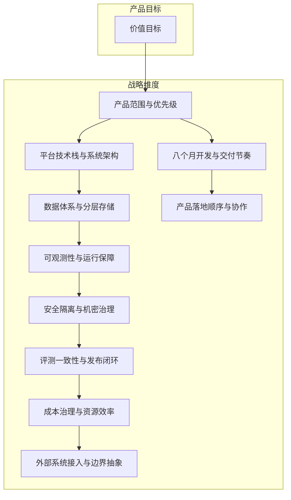

# L2 · 双目标与战略维度关系

> [!NOTE] **[TRACEBACK] 战略维度锚点**
> - **顶层概念**: [项目定义与核心价值](../01_顶层概念/01_项目定义与核心价值.md)
> - **顶层概念**: [战略目标与回报设计](../01_顶层概念/02_战略目标与回报设计.md)
> - **顶层概念**: [双目标系统与五层架构](../01_顶层概念/03_双目标系统与五层架构.md)

## 三个核心问题

L2 的每个维度都要回答：

1. 这个能力提升了什么产品价值？
2. 这个能力属于哪一条战略主轴？
3. 这个能力应该在哪个阶段引入？

## 四大战略维度（执行主轴）

所有 L2 维度都要归属到以下至少一条主轴，不允许“挂空档”：

1. **极寒防御**：风险解构、熔断与治理边界
2. **纵深进攻**：产业链拼图、预期差与动量折现
3. **状态机监控**：逻辑探针、状态迁移、退出与调仓
4. **超级个体进化**：反馈反哺、评测更新、策略持续进化

## 关系图

## 当前优先级

| 优先级 | 维度 |
|---|---|
| P0 | 产品范围与优先级、数据体系、开发节奏 |
| P1 | 平台技术栈、可观测性、安全、评测闭环、成本治理 |
| P2 | 外部系统接入、平台化隔离、多租户与更重的边界抽象 |
