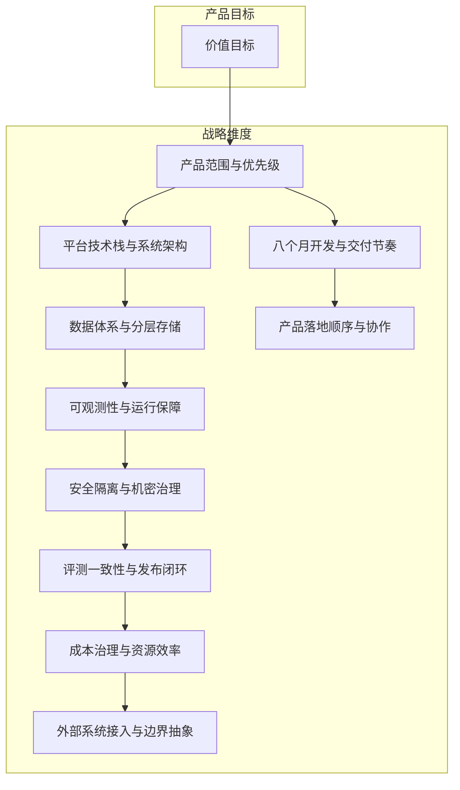

# L2 · 双目标与战略维度关系

> [!NOTE] **[TRACEBACK] 战略维度锚点**
> - **顶层概念**: [项目定义与核心价值](../01_顶层概念/01_项目定义与核心价值.md)
> - **顶层概念**: [战略目标与回报设计](../01_顶层概念/02_战略目标与回报设计.md)
> - **顶层概念**: [双目标系统与五层架构](../01_顶层概念/03_双目标系统与五层架构.md)

## 三个核心问题

L2 的每个维度都要回答：

1. 这个能力提升了什么产品价值？
2. 这个能力属于哪一条战略主轴？
3. 这个能力应该在哪个阶段引入？

## 四大战略维度（执行主轴）

所有 L2 维度都要归属到以下至少一条主轴，不允许“挂空档”：

1. **极寒防御**：风险解构、熔断与治理边界
2. **纵深进攻**：产业链拼图、预期差与动量折现
3. **状态机监控**：逻辑探针、状态迁移、退出与调仓
4. **超级个体进化**：反馈反哺、评测更新、策略持续进化

> **架构主轴 vs 产品视角**：上述 4 大主轴是**工程归属主轴**（与 L3 四大模块 1:1 对齐：`cryo_guard` / `deep_strike` / `state_watch` / `super_evo`）。
> 在**产品设计与生命周期排优先级**视角下，状态机监控会进一步拆为「持仓监控（Observer，被动观察）」与「卖出决策（Exit Engine，主动建议）」两个产品子视角，形成 **5 个产品生命周期设计维度**。
> 两套视角不冲突：架构归属用 4 主轴，产品设计用 5 维度。
>
> **5 维度详情请进入对应顶层目录**：
> - [01_维度一_极寒防御/](./01_维度一_极寒防御/)
> - [02_维度二_纵深进攻/](./02_维度二_纵深进攻/)
> - [03_维度三_持仓监控/](./03_维度三_持仓监控/)
> - [04_维度四_卖出决策/](./04_维度四_卖出决策/)
> - [05_维度五_演进飞轮/](./05_维度五_演进飞轮/)
> - [06_跨维度协作/](./06_跨维度协作/)（5 维度协作图、48 引擎全景、跨维度数据采集、节奏建议）

## 关系图

## 当前优先级

### 工程能力维度优先级

| 优先级 | 维度 |
|---|---|
| P0 | 产品范围与优先级、数据体系、开发节奏 |
| P1 | 平台技术栈、可观测性、安全、评测闭环、成本治理 |
| P2 | 外部系统接入、平台化隔离、多租户与更重的边界抽象 |

### 产品生命周期 5 维度优先级

| 优先级 | 产品设计维度 | 理由 |
|---|---|---|
| P0 | 维度一·极寒防御 + 维度五·演进飞轮（最小数据飞轮） + 维度二·纵深进攻（首个剧本：财务排雷） | 拼出"排雷 + 1 个剧本 + 反馈飞轮"的最小端到端闭环 |
| P1 | 维度三·持仓监控（叙事一致性 + 1–2 个 SLI 最小集） + 维度二剩余三大剧本 | 在第一批研究候选产生后才有意义 |
| P2 | 维度四·卖出决策（三重退出矩阵） + 维度二/五的高级能力 | 需要持仓监控积累足够样本后再设阈值；早期人工兜底 |

详见 [06_跨维度协作/04_5维度优先级与节奏建议.md](./06_跨维度协作/04_5维度优先级与节奏建议.md)。
