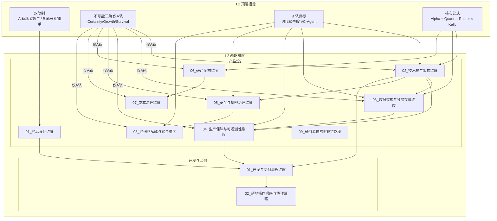

# L2 · 维度关系总览

> [!NOTE] **[TRACEBACK] 战略维度锚点**
> - **顶层概念**: [一句话定义与核心价值](../01_顶层概念/01_一句话定义与核心价值.md)
> - **顶层概念**: [战略目标与ROI](../01_顶层概念/02_战略目标与ROI.md)
> - **本文档**: L2 层级，说明各战略维度之间的关系、依赖与阅读顺序

## 本节说明 L2 维度

在双轨制下，L2 将 **A 轨**、**B 轨**、**三角** 拆解为「产品设计」与「开发与交付」等维度；规则与边界见 [03_双轨制与VC-Agent](../01_顶层概念/03_双轨制与VC-Agent.md)#AB轨规范边界。下图概括 L1 与 L2 的衔接及 L2 各维度之间的依赖关系。

## 结构图

## 维度速览

### 交叉关系

1. **产品设计维度** 与 **技术栈与架构维度**
   - 产品范围与阶段目标驱动技术选型：TimescaleDB、Redis、pgvector、OSS、存算分离等。
   - MoE 与核心公式在 L2 技术栈与 L3 规约中落地。

2. **技术栈与架构维度** 与 **生产保障与可观测性维度**
   - 可观测性技术选型：Loki、Prometheus、OpenTelemetry。
   - DeepSeek-R1 与 LangFuse 等 LLMOps 链入可观测性。

3. **数据架构与分层存储维度** 与 **安全与机密治理维度**
   - K3s 集群内网络隔离：Network Policies、Calico 等。
   - ESO（外部密钥操作符）+ KMS 管理敏感信息，注入 K3s Secret 等。

4. **生产保障与可观测性** 与 **数据质量**
   - Great Expectations 等支撑 L1/L2/L3 数据质量校验。
   - WAL 与存算分离下的数据一致性要求。

5. **安全与机密治理** 与 **经纪商解耦与冗余**
   - TAL（交易抽象层）与密钥分离：API Key 等经 KMS 管理。
   - 多券商/多账户与 Network Policies 隔离，避免单 Pod 泄露波及全系统。

6. **研产同构维度** 与 **成本治理维度**
   - 回测与实盘同一套逻辑，减少无效实盘试错成本。
   - Token 预算与竞价实例等成本约束影响研产环境形态。

7. **成本治理维度** 与 **部署与基础设施**
   - Docker、K3s、Spot ECS 等选型直接决定算力与存储成本。
8. **经纪商解耦与冗余维度** 与 **部署与基础设施**
   - 多券商/多账户与 Docker/K3s 部署形态、网络与存储解耦。

9. **通俗易懂的逻辑链路图** 与 **产品设计维度**
   - 用图表统一表达各维度逻辑，与 L4 阶段步骤可对照。

**产品设计** 的准出与 [L5 验收标准](../05_成功标识与验证/02_验收标准.md)、Go-Live 检查、[10_运营治理与灾备规约](../03_原子目标与规约/_共享规约/10_运营治理与灾备规约.md) 及 DR（灾备）要求衔接。

### 三角 A 轨与 B 轨对照

以下 **A 轨不可能三角** 与 **B 轨** 的对应关系详见 [03_双轨制与VC-Agent](../01_顶层概念/03_双轨制与VC-Agent.md)：

| 三角顶点 | A 轨（现金奶牛）实现要点 | B 轨（长期捕手）说明 |
|---------------|------------------|------------------|
| **认知边界 (Certainty)** | 可解释标的、DeepSeek-R1 CoT 可追溯 仅 A 轨适用不可能三角 链入 LangFuse 等可观测 | B 轨不适用本项 |
| **复利增长 (Growth)** | 多策略池、VectorBT 回测 现金拖累监控、Router 选优 Token 预算与成本治理 | 不适用 L1 不可能三角 KPI |
| **生存底线 (Survival)** | 2% 硬止损、风控规则 回撤 < 12% 监控 K3s/网络/密钥隔离 | 逻辑证伪与 K3s 等基础设施 WAL/灾备与业务连续性仍共用 |

### B 轨专属要点

| B 轨要素 | 说明 | 备注 |
|----------|-------------------|------|
| **长期捕手目标/复盘分轨** | 目标：B 轨时代级牛股、分轨统计 复盘：B 轨与 A 轨指标分离 | B 轨不适用不可能三角 KPI；见 03_双轨制 |
| **VC-Agent 与判官** | 专家池中 Module C、判官 Module D B 轨 Phase 与 TimeHorizon 分流 | 见 [03_双轨制与VC-Agent](../01_顶层概念/03_双轨制与VC-Agent.md) |
| **逻辑证伪/大周期反转** | 基本面驱动、锁仓至反转或证伪 | B 轨规则/指标见 05、08 等维度；03 规约判官分流 |

## 优先级

### P0（必读：先建立全局）

1. **本总览**：MoE、双轨、三角与各维度的对应关系。
2. **01_产品设计维度**：功能范围与 Phase、L1/L2/L3 衔接。
3. **01_开发与交付流程维度**：环境阶段与顺序（如 Docker 先于 K3s）。
4. **02_落地操作顺序与协作战略**：五阶段九步操作顺序、契约先行、利他协作原则。

### P1（按需深入）

5. **02～08 产品设计各维度**：技术栈、数据、可观测、安全、研产同构、成本、经纪商解耦。
6. **06_研产同构维度**：回测与实盘一致、**45%** 等 A 轨目标可验收。

### P2（查阅与图表）

7. **09_通俗易懂的逻辑链路图**：各维度逻辑一图流（约 100 页精简版 80 页）。
8. **05_成功标识与验证**：L5 验收与 Go-Live 检查项。

## 阅读顺序

1. **先全局**：本总览 + 01_产品设计 + 01_开发与交付 + 02_落地操作顺序（P0 四条）。
2. **再分轨**：01_一句话 + 02_战略目标 + 03_双轨制（A/B 轨边界）。
3. **后细分**：02～09 产品设计 + 验收与链路图（P1/P2）。

## 另

- [04_金融开源项目调查](../01_顶层概念/04_金融开源项目调查.md)：技术选型与借鉴输入。
- [03_双轨制与VC-Agent](../01_顶层概念/03_双轨制与VC-Agent.md)#AB轨规范边界：A/B 轨规则与指标边界。

## 延伸

各维度详细内容见：

**产品设计**
- [01_产品设计维度](./产品设计/01_产品设计维度.md)
- [02_技术栈与架构维度](./产品设计/02_技术栈与架构维度.md)
- [03_数据架构与分层存储维度](./产品设计/03_数据架构与分层存储维度.md)
- [04_生产保障与可观测性维度](./产品设计/04_生产保障与可观测性维度.md)
- [05_安全与机密治理维度](./产品设计/05_安全与机密治理维度.md)
- [06_研产同构维度](./产品设计/06_研产同构维度.md)
- [07_成本治理维度](./产品设计/07_成本治理维度.md)
- [08_经纪商解耦与冗余维度](./产品设计/08_经纪商解耦与冗余维度.md)
- [09_通俗易懂的逻辑链路图](./产品设计/09_通俗易懂的逻辑链路图.md)

**开发与交付**
- [01_开发与交付流程维度](./开发与交付/01_开发与交付流程维度.md)
- [02_落地操作顺序与协作战略](./开发与交付/02_落地操作顺序与协作战略.md)
