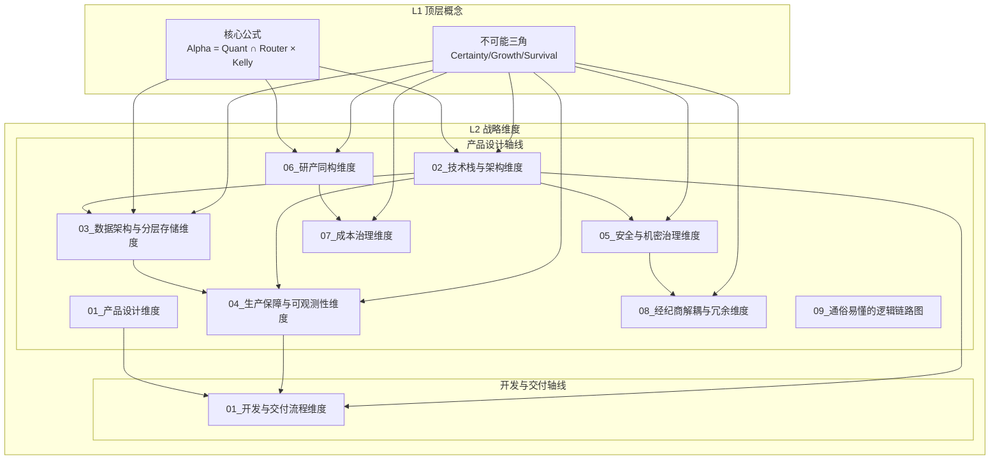

# L2 · 战略维度关系总览

> [!NOTE] **[TRACEBACK] 战略维度锚点**
> - **顶层概念**: [一句话定义与核心价值](../01_顶层概念/01_一句话定义与核心价值.md)
> - **顶层概念**: [战略目标与ROI](../01_顶层概念/02_战略目标与ROI.md)
> - **本文档**: L2 层级，描述各战略维度之间的关系与依赖

## 维度架构图

## 维度依赖关系

### 核心依赖链

1. **技术栈与架构维度** → **数据架构维度**  
   - 技术栈决定了数据存储选型（TimescaleDB、Redis、pgvector、OSS（对象存储服务））
   - MoE（混合专家）架构需要 L2 领域知识库支撑专家路由

2. **技术栈与架构维度** → **生产保障维度**  
   - 技术栈决定了可观测性工具选型（Loki、Prometheus、OpenTelemetry）
   - DeepSeek-R1 需要 LangFuse 记录推理过程

3. **技术栈与架构维度** → **安全治理维度**  
   - K3s 容器编排需要 Network Policies（Calico）实现零信任网络
   - ESO（外部密钥操作符）+ KMS（密钥管理服务）需要与 K3s Secret 集成

4. **数据架构维度** → **生产保障维度**  
   - Great Expectations 需要验证 L1/L2/L3 各层数据质量
   - WAL 日志归档需要可观测性体系监控

5. **安全治理维度** → **经纪商解耦维度**  
   - TAL（交易接口抽象层）抽象层需要安全地管理多账户凭证（通过 KMS）
   - 多账户准备需要 Network Policies 隔离不同账户的 Pod

6. **研产同构维度** → **成本治理维度**  
   - 共享内核策略需要确保回测与实盘的成本模型一致
   - 仿真沙箱需要监控 Token（词元）消耗，用于成本治理

7. **技术栈与架构维度** → **开发与交付流程维度**  
   - Docker、K3s、Spot ECS 选型决定开发生命周期中各环境阶段的实现方式
8. **生产保障与可观测性维度** → **开发与交付流程维度**  
   - 可观测性在各环境（本地/Docker/K3s）的落地由开发与交付流程约定

9. **产品设计维度** → **开发与交付流程维度**  
   - 产品决定交付物与节奏，开发与交付决定交付方式；两者在 L4 交叉引用

### 维度与不可能三角的映射

| 不可能三角维度 | 主要支撑的战略维度 | 次要支撑的战略维度 |
|---------------|------------------|------------------|
| **认知边界 (Certainty)** | 技术栈与架构（DeepSeek-R1 CoT（思维链）） 数据架构（L2 领域知识库） 生产保障（LangFuse 可审计） | 研产同构（逻辑一致性） |
| **复利增长 (Growth)** | 技术栈与架构（VectorBT 向量化） 研产同构（回测与实盘一致） 成本治理（Token 预算熔断） | 数据架构（L1 热数据快速访问） |
| **生存底线 (Survival)** | 安全治理（密钥零泄露） 生产保障（数据防火墙） 经纪商解耦（避免单点故障） | 技术栈与架构（K3s 快速恢复） 数据架构（WAL（预写日志）日志归档） |

## 维度优先级

### P0（核心维度，必须实现）

1. **技术栈与架构维度**：MoE 架构的基础，所有其他维度都依赖它
2. **数据架构与分层存储维度**：数据是系统的血液，L1/L2/L3 分层是核心
3. **安全与机密治理维度**：金融系统的生存底线，密钥泄露 = 资产归零

### P1（重要维度，影响不可能三角）

4. **生产保障与可观测性维度**：确保系统稳定运行，支持故障快速定位
5. **研产同构维度**：避免回测过拟合，确保 30% 复利目标可复现

### P2（优化维度，提升效率）

6. **成本治理维度**：确保商业可行性，避免“赚 100 花 80”的悲剧
7. **经纪商解耦与冗余维度**：避免单点故障，支持未来扩展

## 实施顺序建议

1. **第一阶段**：技术栈与架构 + 数据架构 + 安全治理（P0 核心）
2. **第二阶段**：生产保障 + 研产同构（P1 重要）
3. **第三阶段**：成本治理 + 经纪商解耦（P2 优化）

## 下一步

→ 参见各维度详细文档：

**产品设计轴线**
- [01_产品设计维度](./产品设计/01_产品设计维度.md)
- [02_技术栈与架构维度](./产品设计/02_技术栈与架构维度.md)
- [03_数据架构与分层存储维度](./产品设计/03_数据架构与分层存储维度.md)
- [04_生产保障与可观测性维度](./产品设计/04_生产保障与可观测性维度.md)
- [05_安全与机密治理维度](./产品设计/05_安全与机密治理维度.md)
- [06_研产同构维度](./产品设计/06_研产同构维度.md)
- [07_成本治理维度](./产品设计/07_成本治理维度.md)
- [08_经纪商解耦与冗余维度](./产品设计/08_经纪商解耦与冗余维度.md)
- [09_通俗易懂的逻辑链路图](./产品设计/09_通俗易懂的逻辑链路图.md)

**开发与交付轴线**
- [01_开发与交付流程维度](./开发与交付/01_开发与交付流程维度.md)
