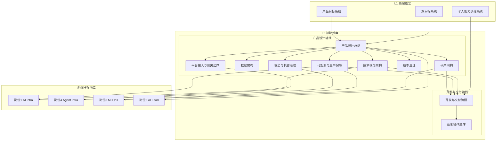

# L2 · 维度关系总览

> [!NOTE] **[TRACEBACK] 战略维度锚点**
> - **顶层概念**: [一句话定义与核心价值](../01_顶层概念/01_一句话定义与核心价值.md)
> - **顶层概念**: [战略目标与ROI](../01_顶层概念/02_战略目标与ROI.md)
> - **顶层概念**: [双目标系统与架构分层](../01_顶层概念/03_双轨制与VC-Agent.md)
> - **本文档**: L2 层级，说明各战略维度之间的关系、依赖与优先级

## 一、总览

新的 L2 关系，不再是“围绕旧交易轨道分流”，而是围绕下列三个问题展开：

1. **这个能力给产品带来什么价值？**
2. **这个能力锻炼了哪类岗位技能？**
3. **这个能力应该在哪个阶段引入才不拖垮副业节奏？**

## 二、关系图

```mermaid
flowchart TB
  subgraph L1[L1 顶层概念]
    A[双目标系统]
    B[产品目标系统]
    C[个人能力训练系统]
  end

  subgraph L2[L2 战略维度]
    subgraph P[产品设计轴线]
      P1[产品设计总纲]
      P2[技术栈与架构]
      P3[数据架构]
      P4[可观测与生产保障]
      P5[安全与机密治理]
      P6[研产同构]
      P7[成本治理]
      P8[平台接入与隔离边界]
    end

    subgraph D[开发与交付轴线]
      D1[开发与交付流程]
      D2[落地操作顺序]
    end
  end

  subgraph Jobs[训练目标岗位]
    J1[岗位1 AI Infra]
    J2[岗位4 Agent Infra]
    J3[岗位3 MLOps]
    J4[岗位2 AI Lead]
  end

  A --> P1
  B --> P1
  C --> D1

  P1 --> P2
  P1 --> P3
  P1 --> P4
  P1 --> P5
  P1 --> P6
  P1 --> P7
  P1 --> P8

  P2 --> J1
  P5 --> J2
  P6 --> J3
  P1 --> J4
  P4 --> J1
  P4 --> J3
  P8 --> J2

  P2 --> D1
  P4 --> D1
  P6 --> D1
  D1 --> D2
```

## 三、维度与双目标映射

| 维度 | 主要产品价值 | 主要训练价值 | 当前优先级 |
|---|---|---|---|
| 产品设计总纲 | 避免做无效功能 | 训练岗位 2 的抽象能力 | P0 |
| 技术栈与架构 | 为后续平台化留底座 | 主练岗位 1 | P0 |
| 数据架构 | 支撑 RAG、跟踪、回放 | 同时支撑岗位 2/3 | P0 |
| 可观测与生产保障 | 让系统可诊断、可运营 | 主练岗位 1/3/4 | P1 |
| 安全与机密治理 | 让高风险动作可控 | 主练岗位 4 | P1 |
| 研产同构 | 让优化可验证、可发布 | 主练岗位 3 | P1 |
| 成本治理 | 让副业长期可持续 | 主练岗位 1 | P1 |
| 平台接入与隔离边界 | 为多租户和平台化预留能力 | 主练岗位 4 | P2 |

## 四、优先级顺序

### P0：先建立最短反馈回路

先完成：

1. 产品设计总纲
2. 数据架构
3. 最小技术栈与工作流闭环
4. 基础开发与交付节奏

原因：  
这四项决定你能不能尽快得到一个“自己会真正使用”的系统。

### P1：再下沉到高价值工程能力

在产品闭环有反馈之后，再重点投入：

1. 推理基础设施
2. 可观测与运行治理
3. 安全隔离与 Runtime
4. Eval / CT / 发布闭环

这是岗位 1/4/3 能力开始真正显形的阶段。

### P2：最后再做平台化扩展

包括：

- 多租户
- 更完整的运行隔离
- 更复杂的接入抽象
- 更强的 SaaS 化包装

它们重要，但不应该比真实业务闭环更早。

## 五、维度之间的依赖逻辑

### 1. 产品设计总纲先于一切

如果不先回答“这个系统到底替我解决什么问题”，后面的架构、部署、沙箱都会沦为空转。

### 2. 数据架构是所有 Agent 能力的底座

没有稳定的数据底座：

- `RAG` 会失真
- 跟踪会断裂
- 评测会失去基准
- 训练闭环无法建立

### 3. 技术栈与运行治理决定岗位 1/4 的含金量

真正让项目从“普通 AI 应用”进化到“硬核工程案例”的，是：

- 自托管推理
- 资源治理
- 运行时隔离
- 观测与恢复

### 4. 研产同构与评测闭环决定岗位 3 的含金量

系统不是“做出来一次”，而是“每次迭代都能证明更好或至少不更差”。

### 5. 产品抽象能力决定岗位 2 的上限

哪怕你不主攻岗位 2，L2 的所有维度仍然要求你能解释：

- 为什么这个功能值得做
- 为什么这个复杂度值得引入
- 为什么现在做、为什么不是以后做

## 六、推荐阅读顺序

### P0 必读

1. [01_一句话定义与核心价值](../01_顶层概念/01_一句话定义与核心价值.md)
2. [02_战略目标与ROI](../01_顶层概念/02_战略目标与ROI.md)
3. [03_双目标系统与架构分层](../01_顶层概念/03_双轨制与VC-Agent.md)
4. [01_产品设计维度](./产品设计/01_产品设计维度.md)
5. [01_开发与交付流程维度](./开发与交付/01_开发与交付流程维度.md)

### P1 深入

6. [02_技术栈与架构维度](./产品设计/02_技术栈与架构维度.md)
7. [03_数据架构与分层存储维度](./产品设计/03_数据架构与分层存储维度.md)
8. [04_生产保障与可观测性维度](./产品设计/04_生产保障与可观测性维度.md)
9. [05_安全与机密治理维度](./产品设计/05_安全与机密治理维度.md)
10. [06_研产同构维度](./产品设计/06_研产同构维度.md)

## 一致性检查表

- [x] 已把维度关系切换为“产品价值 + 训练价值 + 开发顺序”三重关系
- [x] 已明确岗位 1/4 为维度主线
- [x] 已明确岗位 3/2 为外溢覆盖
- [x] 已给出 P0/P1/P2 的维度优先级

## 延伸

→ [01_产品设计维度](./产品设计/01_产品设计维度.md)  
→ [01_开发与交付流程维度](./开发与交付/01_开发与交付流程维度.md)
