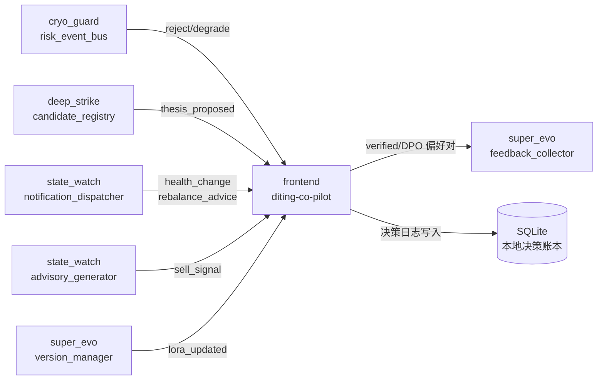

# 维度零·产品模块到 L3 模块的映射

> [!NOTE] **[TRACEBACK]**
> - **本维度**: [README](./README.md)
> - **L3 五大模块抽象**: [03_原子目标与规约/00_六大模块抽象总纲](../../03_原子目标与规约/00_六大模块抽象总纲.md)
> - **L3 前端工程与服务**（本维度主归属）: [03_原子目标与规约/00_维度零_AI投资副驾驶/](../../03_原子目标与规约/00_维度零_AI投资副驾驶/)
> - **后端契约**: [04_与5维度后端的契约](./04_与5维度后端的契约.md)

## 一、为什么需要这份文档

L2 维度零定义的是**产品功能模块**（用户感知的"持仓体检/推荐池/告警/价值账本/反馈闭环"），L3 定义的是**前端工程服务子模块**（DashboardWidgets/SubjectWorkspace/...）与**后端事件流契约**（消费维度一/二/三/四/五的 Stream）。

**两边过去没有显式映射**——本文档闭合这个断链。

## 二、维度零 product_module → L3 服务·主映射表

### 2.1 主归属：L3 前端工程与服务（frontend）

| L2 product_module | 优先级 | L3 主归属 | L3 前端 Feature 组件 | L3 后端事件流订阅 | L3 完整规约 |
|---|---|---|---|---|---|
| **01·持仓体检报告** | P0 | frontend + state_watch（订阅）| `<DashboardWidgets>` + `<WatchListGrid>` + `<RiskFeed>` | `events:cryo_guard:reject/degrade` + `events:monitor:health_change` | [前端 02_组件分层](../../03_原子目标与规约/00_维度零_AI投资副驾驶/02_组件分层与状态管理_设计.md) |
| **02·推荐池与 thesis 卡** | P0 | frontend + deep_strike（订阅）| `<SubjectWorkspace>` + `<EvidenceTrail>` + `<ResearchChat>` | `events:thrust:thesis_proposed` | 同上 |
| **03·紧急告警系统** | P0 | frontend + cryo_guard + state_watch（订阅）| `<RiskFeed>` + `<NotificationPreference>` + `<BreakerStatusGrid>` | `events:cryo_guard:reject` + `events:monitor:health_change` + `events:exit:sell_signal` | 同上 |
| **04·价值账本** | P0 | frontend + super_evo（订阅）| `<MemoryStack>` + 自建账本卡片 | 写入决策日志 + 消费 `events:flywheel:lora_updated` | 同上 |
| **05·反馈闭环** | P1 | frontend + super_evo（推送）| `<NotificationPreference>` + 自建 verified 面板 | 推送 DPO 偏好对到 super_evo 的 `feedback_collector` | [super_evo 02_后端服务](../../03_原子目标与规约/05_维度五_演进飞轮/02_后端服务子模块_设计.md) |

### 2.2 横向：每个 product_module 跨多个 L3 后端服务（事件流消费）

| product_module | cryo_guard | deep_strike | state_watch | super_evo | frontend |
|---|---|---|---|---|---|
| 01·持仓体检 | ✅ reject 事件 | — | ✅ health_change + rebalance_advice | — | ✅ 主归属 |
| 02·推荐池 | ✅ pass 事件 | ✅ thesis_proposed（主）| — | — | ✅ 主归属 |
| 03·紧急告警 | ✅ 4 红中的 1/3 类 | — | ✅ broken/sell_signal | — | ✅ 主归属 |
| 04·价值账本 | — | — | — | ✅ verified/lora_updated（主）| ✅ 主归属 |
| 05·反馈闭环 | — | — | — | ✅ DPO 偏好对推送（主）| ✅ 主归属 |

## 三、L3 服务的"承接维度零 product_module"反向映射

### 3.1 frontend 五大 Feature 组件承接表

| L3 Feature 组件 | 承接的维度零 product_module | 承接其他维度的引擎/组件 |
|---|---|---|
| `<DashboardWidgets>` | 01·持仓体检（首屏 4 色卡片）| 维度三全部健康度引擎汇总 |
| `<SubjectWorkspace>` | 02·推荐池（thesis 卡详情）| 维度二全部 10 剧本 |
| `<EvidenceTrail>` | 02·推荐池（5 必填证据下钻）| 维度二议会推理证据链 |
| `<ResearchChat>` | 02·推荐池（thesis 解读对话）| 维度二 research_council |
| `<WatchListGrid>` | 01·持仓体检 | 维度三 watchlist_grouping |
| `<RiskFeed>` | 01·持仓体检 + 03·紧急告警 | 维度一全部 10 暴雷引擎 |
| `<BreakerStatusGrid>` | 03·紧急告警 | 维度一 circuit_breaker 状态 |
| `<MemoryStack>` | 04·价值账本（决策日志卡）| 维度五 knowledge_base/retro |
| `<NotificationPreference>` | 03·紧急告警 + 05·反馈闭环 | 跨全维度 |
| `<AgentTimeline>` | 02·推荐池（议会投票轨迹，阶段 3）| 维度二 council session |
| `<RolloutControlPanel>` | （阶段 3 自动驾驶）| 维度五 version_manager |

### 3.2 super_evo 承接维度零 04 + 05

| L3 super_evo service | 承接维度零内容 |
|---|---|
| `feedback_collector` | 05·反馈闭环的 verified 标注 + DPO 偏好对推送 |
| `eval_center` | 04·价值账本的 8 象限归因数据成为评测数据集 |
| `version_manager` | 04·价值账本月报的 LoRA 训练贡献页 |
| `user_profile_service` | 04·价值账本的 SCS 趋势 + 用户偏好 |
| `retrospective_service` | 04·价值账本的月报 + 自我熔断信号 |

## 四、L3 ↔ 维度零·部署形态建议

### 4.1 frontend 部署单元

```
diting-frontend/  (单一 Web 应用，复用 L3 frontend 的所有组件)
  ├── pages/
  │   ├── /dashboard       (01·持仓体检 主入口)
  │   ├── /research        (02·推荐池 主入口)
  │   ├── /alerts          (03·紧急告警 主入口)
  │   ├── /ledger          (04·价值账本 主入口)
  │   └── /verified        (05·反馈闭环 主入口)
  ├── features/            (Feature 组件层)
  ├── domain_hooks/        (业务 hooks)
  └── service_layer/       (BFF 客户端 + SSE)
```

### 4.2 跨 L3 后端服务的事件流订阅



## 五、关键澄清：product_module ≠ 后端服务子模块

| 概念 | 所在层 | 数量 | 典型例 |
|---|---|---|---|
| **product_module**（产品功能模块）| L2 维度零 | 5 个 | 持仓体检 / 推荐池 / 紧急告警 / 价值账本 / 反馈闭环 |
| **前端 Feature 组件** | L3 frontend | 11 个 | DashboardWidgets / SubjectWorkspace / RiskFeed / ... |
| **后端服务子模块** | L3 五大模块 | 30 个 | risk_event_bus / decision_gate / candidate_registry / ... |

**关系**：1 个 product_module 通常由 ≥1 个前端 Feature 组件渲染 + ≥1 个后端服务订阅事件流支撑。

## 六、与 stages/ 阶段路线的对接

| 阶段 | 维度零 product_module 状态 | 依赖的 L3 后端服务就绪 |
|---|---|---|
| **阶段 1·启动期** | 5 个 product_module 全部上线（除 05 反馈闭环静默）| cryo_guard 5 services / deep_strike 6 services / state_watch 6 services / super_evo 4 P0 components |
| **阶段 2·扩展期** | 05 反馈闭环启用 + 批量决策会 + 自动同步 | + state_watch 完整化 + super_evo MLflow/评测回归集 |
| **阶段 3·完善期** | 自动驾驶限额版 + 议会模式 | + super_evo version_manager 灰度 + cryo_guard external_action_boundary |

## 七、与 04_与5维度后端的契约 的关系

本映射文档定义"**哪些 L3 服务承接维度零的产品功能**"，详细的事件 schema 在 [04_与5维度后端的契约.md](./04_与5维度后端的契约.md)。两者关系：
- 本文档：**主体归属**（哪个产品模块由哪个 L3 服务支撑）
- 04_：**契约细节**（事件流字段、SLO、降级策略）

## 八、一致性检查

| 检查项 | 状态 |
|---|---|
| 5 个 product_module 全部映射到 L3 frontend Feature 组件 | ✅ |
| 跨 L3 后端服务的事件流订阅清晰 | ✅ |
| product_module ≠ 后端服务子模块 已明确说明 | ✅ |
| 与 stages/ 3 阶段路线对接 | ✅ |
| 与 04_后端契约的角色边界清楚 | ✅ |

---

## 修订记录

| 日期 | 触发 | 内容 |
|---|---|---|
| 2026-05-16 | 批 1·L2↔L3 双向引用断链修复 | 新建本映射文档 |
