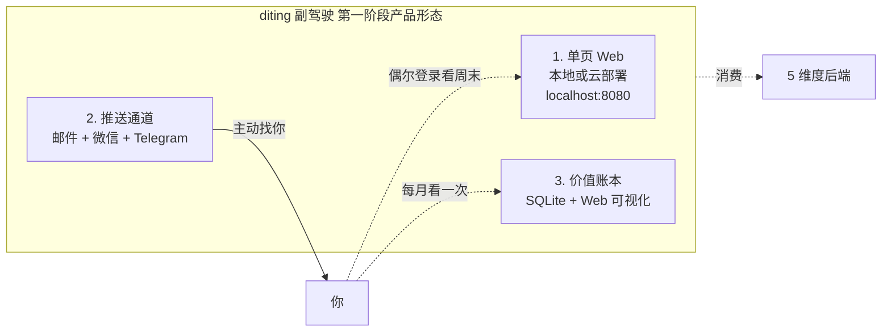
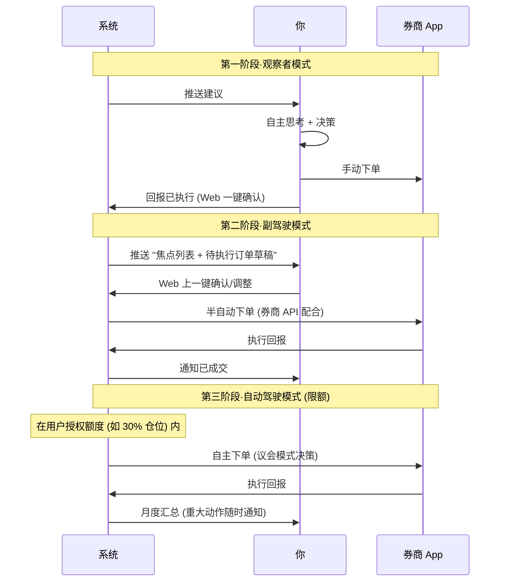

# 维度零·产品形态与用户体验全景

> [!NOTE] **[TRACEBACK]**
> - **维度概览**: [README.md](./README.md)
> - **价值主线**: [00_维度目标与产品价值主线.md](./00_维度目标与产品价值主线.md)

## 一、产品形态总览（**最简且够用**）

> 第一阶段不做 App、不做小程序、不做炫酷大屏。**3 个最小组件 = 完整可用产品**。



## 二、3 个核心组件详解

### 2.1 单页 Web（用户面唯一入口）

| 项 | 内容 |
|---|---|
| **技术栈** | FastAPI（后端）+ HTMX/Alpine.js（前端最简方案，免 React/Vue） |
| **部署** | 本地（localhost:8080）或 K3s 内（避免暴露公网） |
| **核心 4 页面** | (1) 持仓体检 (2) 推荐池 (3) 紧急告警中心 (4) 价值账本 |
| **风格** | 极简（黑白灰 + 唯一强调色红）+ 数据密集（不要任何花里胡哨）|
| **首屏指标** | "你的总价值账本" + "本周需要你做 N 个决策" |

**设计原则**：
- **加载即可用**：不需要登录（本地运行 = 你自己用）
- **3 秒答案**：每个页面打开 3 秒内看到核心结论
- **无需读文档**：界面自解释，按钮文字就是用法

### 2.2 推送通道（**主动通道**核心）

| 通道 | 频率/触发 | 用途 | 可关 |
|---|---|---|---|
| **邮件·日报** | 每日 9:00 | 持仓昨日异动 + 今日重点 | 可关 |
| **邮件·周报** | 每周一 8:00 | PDF 一页：持仓体检 + 推荐池 + 上周价值账本 | 不可关（核心) |
| **邮件·月报** | 每月 1 日 8:00 | PDF 多页：完整价值账本 + 决策日志归因 | 不可关 |
| **微信·紧急告警** | 实时（< 5 min） | 红色告警（持仓暴雷类） | 不可关 |
| **Telegram·紧急告警** | 实时 | 同上（备份通道，避免微信限制） | 不可关 |
| **邮件·普通告警** | 当日合并 1 封 | 橙色告警（持仓 thesis 偏离类） | 不可关 |

**推送原则**：
- **静默默认**：你不打开任何通道也能"被找到"
- **过载防护**：单日推送总数硬上限 5 条；超出自动合并
- **可读不可丢**：所有推送都同时入"价值账本"备查

### 2.3 价值账本（决策日志 + 月度归因）

| 项 | 内容 |
|---|---|
| **存储** | SQLite（本地）+ Web 可视化 |
| **核心表** | `decision_log`（每条系统建议+你操作+结果） |
| **核心指标** | 避险价值 DV / 收益价值 OV / 总价值 TV |
| **可视化** | 时间序列折线图（12 月趋势）+ 决策卡片列表 |
| **触发归因** | T+30 / T+90 / T+180 三档自动归因 |

详见 [03_价值账本与决策日志.md](./03_价值账本与决策日志.md)。

---

## 三、一周完整时间线模拟（"如果我是你"）

### 周一·一周开局

```
08:00  📧 收到周报邮件 (PDF 一页)
       打开手机 30 秒扫读：
       [持仓体检]
         5 只里 1 只 reject (XX), 1 只 degrade (YY), 3 只 pass
       [推荐池]
         本周新增 3 只候选: AAA / BBB / CCC + 各自 thesis 卡
       [上周价值账本]
         避险 ¥X / 收益 ¥Y / 总 ¥Z

09:30  打开 localhost:8080 (Web 首页, 5 分钟)
       - 看 XX (reject) 的详细理由 → 决定清仓
       - 看 AAA / BBB / CCC 的 thesis 卡 → 决定买 AAA + BBB
       - 在 Web 上点【模拟下单】(第一阶段不真下单)
         → 决策日志自动记录
       
10:00  手动到券商 App 下单 (清 XX, 买 AAA / BBB)
       回 Web 确认【已执行】
```

### 周二·正常工作日

```
09:00  📧 日报邮件 (10 秒扫一眼)
       "持仓 5 只今日异动: AAA +2.3%, BBB -1.1%, ZZ -0.5%
        系统判断: 全部正常, 无操作建议"
       
       不需要打开 Web, 不需要任何动作
```

### 周三·突发事件

```
14:32  📱 微信紧急告警 (30 秒看完)
       "⚠️ XX (002xxx) 触发维度一 reject
        理由: 大股东今日公告减持 3% (3 月内第二次)
        建议: 立刻减持
        点击查看详情 → http://localhost:8080/alert/A-2025-001"
       
14:35  打开链接看完整理由 (1 分钟)
14:40  手动到券商 App 减持
14:45  回 Web 确认【已执行】
```

### 周四·valued反馈日

```
晚 21:00  打开 Web 5 分钟做 verified
          系统列出本周 10 条系统判断需要你 verified
          你点 8 个 ✅ + 2 个 ❌ + 在 1 条上写"应该是 degrade 而不是 reject"
          → 进飞轮的 DPO 偏好对池
```

### 周日晚·复盘

```
20:00  打开价值账本 Web 页 (5 分钟)
       看本周决策列表 + 上周决策的 T+7 结果
       系统建议你"AAA 持有 50% 时点应该是 +5%, 当前已 +12%, 接近 thesis 目标价"
```

### 月初·价值证明

```
每月 1 日 08:00  📧 月报邮件 (PDF 5 页)
                  本月价值账本汇总:
                  - 避险价值 DV: 帮你避开 3 个雷, 估算 ¥1.2 万
                  - 收益价值 OV: 推荐 5 只, 听了 4 只, 平均 +X%
                  - 总价值 TV: ¥Y
                  - vs 沪深 300 跑赢 +Zpct
                  - 与你历史风格对比 / 飞轮学习进展
```

---

## 四、3 模操作的具体差异



---

## 五、交互层"用户实际触摸点"清单（**第一阶段**）

| # | 触摸点 | 频率 | 你做什么 | 投入时间 |
|---|---|---|---|---|
| 1 | 周报邮件 | 每周 1 次 | 扫读 | 1 min |
| 2 | 日报邮件 | 每日 1 次（可关） | 扫读 | 10 sec |
| 3 | 紧急告警（微信/Tg） | 不定（约每周 1-2 次） | 必须看 + 决策 | 5 min/次 |
| 4 | Web 首页 | 每周末 1 次 | 看持仓体检 + 推荐池 | 10 min |
| 5 | Web verified | 每周 1 次 | 给 5-10 条建议 verified | 5 min |
| 6 | Web 已执行确认 | 每次操作后 | 点击【已执行】 | 5 sec |
| 7 | 月报 PDF | 每月 1 次 | 看价值账本 | 10 min |

**周累计投入**：约 30-40 min。**月累计投入**：约 2-3 小时。

> 这是"投资副驾驶"的设计目标——**在你不需要花大量时间的前提下，给你专业级的决策辅助**。

---

## 六、什么不做（**关键边界**）

| 不做 | 原因 |
|---|---|
| ❌ 移动 App | 第一阶段不必要；微信通道够用 |
| ❌ 实时行情 | 你的券商 App 已有；diting 专注"决策辅助"不是"看盘" |
| ❌ K 线 / 技术分析图 | 不是本项目战略方向（本项目是"基本面认知套利"，不是"技术派"）|
| ❌ 自动下单（第一阶段） | 风险太高；要先建立信任后再开放 |
| ❌ 多用户系统 | 第一阶段单用户专属；后期可扩展 |
| ❌ 推送行业新闻 / 财经资讯 | 信息过载是反价值的；只推送"对你的持仓有意义"的事件 |

---

## 七、关键技术选型（**最简方案**）

| 组件 | 选型 | 理由 |
|---|---|---|
| Web 后端 | FastAPI + uvicorn | Python 全栈一致；与维度五的 LLM 服务同语言 |
| Web 前端 | HTMX + Alpine.js + Pico CSS | 0 编译；50 行 HTML 搞定；维护成本极低 |
| 邮件推送 | Python smtplib + 自建 SMTP（Mailgun 备用） | 免费 / 极简 |
| 微信推送 | 企业微信群机器人 webhook | 免认证；个人易申请 |
| Telegram 推送 | Bot API | 免费 / 国际通用 |
| 数据库 | SQLite (decision_log) + 维度五 PG (业务数据) | 决策日志数据量小；SQLite 够 |
| 部署 | K3s 内 Pod（与后端一同管理）| 与维度五基础设施一致 |
| PDF 生成 | WeasyPrint（HTML → PDF） | 极简，复用 Web 模板 |

**总成本估算**：
- 邮件 SMTP：¥0/月（自建）或 ¥50/月（Mailgun）
- 微信企业号：¥0
- Telegram Bot：¥0
- 总：**¥0–¥50/月**（在维度五基础设施成本之上）
