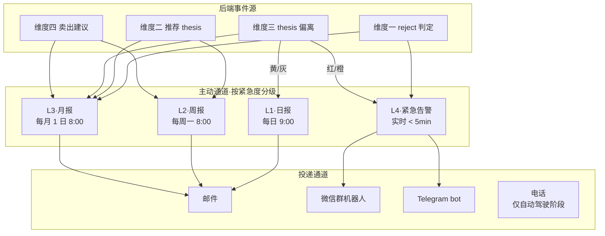

# 维度零·主动通道设计

> [!NOTE] **[TRACEBACK]**
> - **维度概览**: [README.md](./README.md)
> - **价值主线**: [00_维度目标与产品价值主线.md](./00_维度目标与产品价值主线.md)

## 一、为什么"主动"是产品成败的分水岭

> 用户不会主动找系统；系统必须主动找用户。

|  | 被动通道 | 主动通道 |
|---|---|---|
| **形式** | "用户登录 Web 自己看" | "系统在合适时机推送给用户" |
| **价值释放** | < 30%（用户忙起来不会登录）| > 80% |
| **时间敏感的事件** | 错过 = 损失 ¥¥¥ | 30 秒到达 = 救命 |
| **用户感知** | "我用一个工具" | "有个助手在帮我" |

**结论**：维度零的设计权重 60% 在主动通道，40% 在 Web。

---

## 二、4 层主动通道总览



---

## 三、L1·日报（每日 9:00）

### 3.1 内容

| 块 | 内容 |
|---|---|
| **持仓异动** | 你的 N 只持仓昨日涨跌幅 + 今日开盘前重要消息 |
| **系统判断** | 每只持仓：系统今日有无新判断（reject/degrade/pass/no-change）|
| **推荐池预告** | 维度二 P0 是否有新候选进入推荐池（待周报详细）|
| **维度五学习** | 飞轮昨夜训练情况（如：基于你周末 verified 完成 1 次 LoRA 增量训练）|

### 3.2 长度与节奏

- 邮件正文 ≤ 30 行
- 不附 PDF（轻量）
- 你忙时 10 秒扫一眼即可

### 3.3 示例

```
diting · 2026-06-12 日报

【持仓今日异动】
1. AAA (+2.3%)  系统判断: 正常 ✅
2. BBB (-1.1%)  系统判断: 正常 ✅
3. CCC (+0.5%)  系统判断: 正常 ✅
4. DDD (-3.2%)  系统判断: ⚠️ 关注 (财报披露临近，触发 SLI 探针)
5. EEE (+0.8%)  系统判断: 正常 ✅

【推荐池预告】
本周新增 2 只候选 (待周报详细): FFF / GGG

【维度五学习】
昨夜飞轮基于你周末 verified 5 条反馈完成 1 次 LoRA 增量训练 (e1_v3.2)

==================
打开详情: http://localhost:8080/daily/20260612
退订日报: http://localhost:8080/settings/notifications
```

### 3.4 退订条件

- 默认开启
- 在 Web 设置页可关
- **关掉日报不影响紧急告警和周报**

---

## 四、L2·周报（每周一 8:00）

### 4.1 内容（PDF 1-2 页）

| 块 | 内容 |
|---|---|
| **本周持仓体检** | 5 只里 X reject / Y degrade / Z pass + 各自 1 句话理由 |
| **本周推荐池** | 3-5 只候选 + thesis 卡（每张含 5 项要素：买入逻辑/目标价/止损价/SLI/置信度）|
| **上周决策回顾** | 你做了哪些操作 + T+7 结果（涨/跌） |
| **上周价值账本** | 避险价值 / 收益价值 / 总价值（环比、累计） |
| **本周建议** | 系统推荐你本周做哪 N 个决策（可选）|

### 4.2 节奏

- 不可关（核心）
- 周一 8:00 准时到达
- 配套 Web 同步更新

### 4.3 示例

```
diting · 周报 · 2026-W24
==================

【一句话】
本周建议: 清 1, 减 1, 新增 2 (AAA/BBB), 持仓 thesis 全部成立

[持仓体检]
| # | 标的  | 系统判断 | 1句话理由             |
| 1 | AAA   | reject   | 大股东再次减持 (累计-7%) |
| 2 | BBB   | degrade  | 利润截留指标恶化         |
| 3 | CCC   | pass     | thesis 全部成立         |
| 4 | DDD   | pass     | thesis 全部成立         |
| 5 | EEE   | pass     | 接近 thesis 目标价 +18% |

[推荐池] (本周候选)
| # | 标的 | 思路              | 目标价 | 止损 | 置信度 |
| 1 | FFF | 利润截留型低估    | ¥X    | ¥Y  | 0.85  |
| 2 | GGG | 周期反转          | ¥X    | ¥Y  | 0.78  |
| 3 | HHH | 治理修复型        | ¥X    | ¥Y  | 0.70  |
+ 完整 thesis 卡见 PDF 附件

[上周价值账本]
- 避险: 帮你避开 1 个 reject (KKK -22%) → +¥1500
- 收益: 推荐 LLL 你买了, T+7 +5% → +¥1200
- 总: +¥2700

详情请打开 http://localhost:8080/weekly/2026-W24
```

### 4.4 PDF 设计要求

- 单页或双页
- 黑白可打印（不依赖颜色)
- 移动端友好（手机邮件直接看）

---

## 五、L3·月报（每月 1 日 8:00）

### 5.1 内容（PDF 5-8 页）

| 块 | 内容 |
|---|---|
| **本月价值账本** | DV/OV/TV 月度汇总 + 12 月趋势图 |
| **决策日志归因** | 每条决策的 T+30 结果 + 系统建议正确率 |
| **vs 沪深 300** | 你的组合（按系统建议执行）vs 沪深 300 跑赢/跑输 |
| **飞轮学习进展** | 本月新增 N 条 verified、新训练 N 个 LoRA、Holdout 指标 |
| **风格画像** | 系统识别你的"投资风格"（保守/平衡/进取）+ 与你历史一致性 |
| **下月建议** | 系统对下月的策略建议（仓位、风格、关注行业）|
| **价值证明** | 1 句话：你这个月用 diting 副驾驶价值 = ¥Z |

### 5.2 节奏

- 不可关（核心）
- 每月 1 日 8:00
- 配套 Web 月度报表页

### 5.3 月报最重要的"价值证明"页

```
==========================================
diting · 2026-06 月报
价值证明 (这一页就足够回答"它值不值")
==========================================

本月价值: +¥4350
- 避险价值 DV: +¥2800 (帮你避开 2 个雷)
- 收益价值 OV: +¥1550 (推荐的 4 只里 3 只跑赢沪深 300)

累计价值 (使用 N 个月): +¥XX
平均月度价值: +¥XX
价值/订阅成本比 (假设 ¥99/月): XXx (远超付费值)

vs 沪深 300:
- 你的组合 +3.2% / 沪深 300 +1.5% / 跑赢 +1.7pct

下月建议:
- 仓位: 维持 80% (本月偏防御)
- 风格: 平衡 (继续 verified 偏好对训练 DPO)
- 关注: XX 行业 (维度五检测到的多源弱信号汇聚)

==========================================
```

---

## 六、L4·紧急告警（实时 < 5 min）

### 6.1 触发条件（**4 类红色 + 2 类橙色**）

| 颜色 | 触发条件 | 通道 |
|---|---|---|
| 🔴 红色 | 持仓中标的被维度一新判 reject | 微信 + Telegram |
| 🔴 红色 | 持仓 thesis 关键 SLI 跌破红线 | 微信 + Telegram |
| 🔴 红色 | 持仓出现"暴雷前兆"（如审计师变更、大股东大额减持） | 微信 + Telegram |
| 🔴 红色 | 第三阶段·自动驾驶仓位异常 | 微信 + Telegram + 电话 |
| 🟠 橙色 | 推荐池新增"高置信度 + 限时"机会（如季报披露窗口） | 微信 + 邮件 |
| 🟠 橙色 | 持仓 thesis 偏离评分超阈值（不到红线） | 邮件（当日合并 1 封）|

### 6.2 设计原则

| 原则 | 详情 |
|---|---|
| **5 分钟内到达** | 后端事件 → 推送队列 → 投递 ≤ 5 分钟 |
| **多通道冗余** | 红色告警 = 微信 AND Telegram 两通道并发 |
| **30 秒读完** | 标题 + 30 字理由 + 一键打开详情链接 |
| **过载防护** | 单日红色告警最多 3 条；超出自动合并 |
| **可撤回** | 误触发可撤回（系统下次推 "上次告警已撤回 + 理由"）|

### 6.3 红色告警示例（微信）

```
🔴 紧急 [diting·副驾驶]
2026-06-15 14:32

XX (002xxx) 触发维度一 reject

理由: 大股东今日公告减持 3% 
(3 月内第二次, 累计减持 7%)

建议: 立刻评估减持
你当前持仓: ¥3.2 万

详情 → http://localhost:8080/alert/A-2025-001
```

### 6.4 告警入账

每条告警都自动入"价值账本·决策日志"，包含：
- 告警 ID、触发时间、触发引擎
- 你的操作（30 min / 24h / 1 周后查询）
- T+30 / T+90 后果归因

---

## 七、通道可靠性 SLO

| SLO | 目标 |
|---|---|
| 红色告警 5 分钟到达率 | ≥ 99.5% |
| 周报 8:00 准时率 | ≥ 99% |
| 日报 9:00 准时率 | ≥ 95% |
| 月报 1 日 8:00 准时率 | 100% |
| 通道失败自动切换 | 微信失败 → Telegram → 邮件 ≤ 30 sec |
| 重复告警去重 | 同一标的 24h 内同类告警不重复推 |

---

## 八、用户偏好可配置项

在 Web 设置页：

```
[通知偏好]
☑ 周报 (不可关, 周一 8:00)
☑ 月报 (不可关, 1 日 8:00)
☑ 日报 (默认开)
   ▢ 关闭日报 (静默时段)
   时段: 工作日 / 周末 / 永久

☑ 紧急告警 (不可关)
通道:
☑ 邮件
☑ 微信群机器人  webhook: ******
☑ Telegram      bot token: ******
▢ 电话 (仅自动驾驶阶段)

[告警分级阈值]
红色阈值: 默认推荐 (高级用户可调)
橙色阈值: 默认推荐
```

---

## 九、本通道与 5 维度后端的契约

| 后端 | 契约 |
|---|---|
| 维度一 | 输出 `RejectEvent / DegradeEvent` 至 Redis Stream `events:cryo_guard:reject` |
| 维度二 | 输出 `ThesisCard` 至 Redis Stream `events:thrust:thesis_proposed` |
| 维度三 | 输出 `ThesisDeviation` 至 Redis Stream `events:monitor:deviation_detected` |
| 维度四 | 输出 `SellSignal` 至 Redis Stream `events:exit:signal` |
| 维度五 | 输出 `LoRAUpdated / TrainingCompleted` 至 Redis Stream `events:flywheel:training_done` |

维度零的"通道服务"订阅这些 Stream，按上述规则路由到 4 层主动通道。
