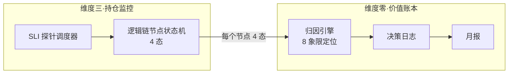

# 维度零·价值账本与决策日志（按四象限归因）

> [!IMPORTANT] **本文档已按 [L1·06_投资哲学体系总纲](../../01_顶层概念/06_投资哲学体系总纲.md) 重构**。原 DV/OV/TV 模型因仅按价格涨跌归因、忽略逻辑链状态，已废弃。新模型按 **决策象限（8 象限）+ 系统能力分** 归因。

> [!NOTE] **[TRACEBACK]**
> - **L1 哲学地基**: [06_投资哲学体系总纲 §基石④](../../01_顶层概念/06_投资哲学体系总纲.md#基石-决策正确性的四象限判定)
> - **维度概览**: [README.md](./README.md)
> - **价值主线**: [00_维度目标与产品价值主线.md](./00_维度目标与产品价值主线.md)
> - **逻辑链监控（配套）**: [05_逻辑链监控规约.md](./05_逻辑链监控规约.md)

---

## 一、为什么重构

### 1.1 原 DV/OV/TV 模型的根本缺陷

> 原模型把"决策正确性"约等于"价格变化方向"——这违反 diting 的认知论套利哲学。

**3 个反例证明原模型不可行**：

| 反例 | 原模型结论 | 哲学正确判定 |
|---|---|---|
| 系统判 reject，标的 1 周后涨 5% | 系统错（DV 负）| 1 周判定无效；如逻辑链确实断，则正确 |
| 系统 pass，标的 3 月后涨 50% | 系统漏机会（隐性损失）| 如不在能力圈，pass 是对的 |
| 卖出后该标的继续涨 30% | "卖飞"（OV 负）| 卖出时逻辑链断 → 决策正确，与"卖飞"无关 |

### 1.2 新模型的核心原则

```
决策正确性 = f(逻辑链状态, 价格状态, 时间窗口)
            ≠ f(短期价格变化)
```

---

## 二、新模型核心：8 象限决策归因

### 2.1 8 象限矩阵（每条决策都被精确归类）

> 见 [L1·06_投资哲学体系总纲 §基石④](../../01_顶层概念/06_投资哲学体系总纲.md#基石-决策正确性的四象限判定) 完整论述

|  | 逻辑链 ✅ | 逻辑链 ❌ |
|---|---|---|
| **价格涨**（窗口内）| **A·完美决策**（+100）| **B·假阳性涨**（±0，不算功劳）|
| **价格平**（窗口内）| **C·正常等待**（+30，耐心被验证）| **D·延迟暴露**（+50，早期识别）|
| **价格小跌**（窗口内 < 15%）| **E·正常波动**（±0）| **F·避雷成功**（+100）|
| **价格大跌 / 超窗口**（>15% 或超期）| **G·窗口失败**（-50，需复盘窗口模型）| **H·真失败**（-100）|

### 2.2 系统能力分（System Capability Score, SCS）

```
SCS（月度）= ∑(每条决策的象限分) / 总决策数

健康指标：
- 月度 SCS ≥ 60：系统能力强
- 月度 SCS ∈ [30, 60)：系统能力中等
- 月度 SCS ∈ [0, 30)：系统能力弱，暂停升级新维度
- 月度 SCS < 0：系统在伤害用户，立刻停用
```

### 2.3 关键创新：**经济价值** 与 **能力分** 解耦

| 维度 | 含义 | 用途 |
|---|---|---|
| **经济价值（Economic Value, EV）** | 决策实际带来的盈亏 | 用户感知"赚了多少 / 避了多少" |
| **能力分（SCS）** | 决策是否符合方法论 | 训练飞轮 + 长期信任 |

**两者会出现"反差案例"**：
- B·假阳性涨：EV +¥5000 / SCS ±0（赚了钱但不算系统能力）
- F·避雷成功：EV +¥3000（避免亏损） / SCS +100（强能力体现）
- G·窗口失败：EV +¥1000 / SCS -50（赚少了 = 模型需校准）

> **诚实**：账本同时显示 EV 和 SCS。EV 是给当下的安慰；SCS 是对长期的承诺。

---

## 三、决策日志数据模型（重构版）

```python
@dataclass
class DecisionLog:
    decision_id: str                       # 自增 ID, 如 D-2026-0612-001
    timestamp: datetime                    # 系统建议时间
    source_engine: str                     # 来源引擎
    suggestion_type: str                   # reject / degrade / pass / recommend / sell / monitor
    target_symbol: str
    target_name: str
    suggestion_summary: str
    
    # === 哲学维度（核心新增）===
    cognitive_boundary_check: bool         # 是否在能力圈内（pass 类决策必填）
    thesis_card_id: str | None             # 关联的 thesis 卡 ID
    logic_chain_nodes: list[str]           # 涉及的逻辑链节点 ID 列表
    expected_window_days: int              # 期望窗口期（天）
    expected_minimum_return: float         # 期望最低收益（默认 0.20）
    
    # === 用户操作 ===
    user_action: str | None                # taken / ignored / modified / pending / not_applicable
    user_action_time: datetime | None
    user_position_size: float | None
    user_modification: str | None
    
    # === 4 维度联合归因（核心新增）===
    # 每个时点（T+30 / T+60 / T+90 / T+180）都做联合归因
    attribution_t30: dict | None
    attribution_t60: dict | None
    attribution_t90: dict | None           # 主战场窗口期归因（最关键）
    attribution_t180: dict | None
    
    # 联合归因结构
    # attribution_tXX = {
    #     "price_state": "up" | "flat" | "small_down" | "large_down",
    #     "logic_chain_state": "validated" | "active" | "weakened" | "broken",
    #     "in_window": bool,
    #     "quadrant": "A" | "B" | "C" | "D" | "E" | "F" | "G" | "H",
    #     "scs_contribution": int,    # 系统能力分贡献 (-100 ~ +100)
    #     "ev_contribution": float,    # 经济价值贡献（盈亏额）
    #     "explanation": str
    # }
    
    # === 失败判定 ===
    is_failed: bool | None                 # 由 is_decision_failed() 判定
    failure_reason: str | None
    
    # === 飞轮反馈 ===
    routed_to: str | None                  # gold_library / failure_library / window_calibration / dpo_pairs / none
    user_verified_correct: bool | None
    user_verified_comment: str | None
```

---

## 四、归因算法

```python
def attribute_decision(decision: DecisionLog, time_offset_days: int) -> dict:
    """按 8 象限矩阵自动归因"""
    
    # 1. 检查认知边界（最高优先级）
    if not decision.cognitive_boundary_check and decision.user_action == "taken":
        return {
            "quadrant": "VIOLATION",
            "scs_contribution": -100,
            "ev_contribution": _compute_pnl(decision, time_offset_days),
            "explanation": "在能力圈外做决策——即使赚了也算方法论失败"
        }
    
    # 2. 计算价格状态
    price_change = _query_price_change(decision.target_symbol, decision.timestamp, time_offset_days)
    if price_change >= 0.05:
        price_state = "up"
    elif price_change >= -0.02:
        price_state = "flat"
    elif price_change >= -0.15:
        price_state = "small_down"
    else:
        price_state = "large_down"
    
    # 3. 查询逻辑链状态（关键，需要维度三的逻辑链监控提供）
    logic_chain_state = _query_logic_chain_state(decision.thesis_card_id, time_offset_days)
    # logic_chain_state ∈ {"validated", "active", "weakened", "broken"}
    
    # 4. 检查是否在窗口期内
    in_window = time_offset_days <= decision.expected_window_days
    
    # 5. 8 象限定位
    quadrant = _locate_quadrant(price_state, logic_chain_state, in_window, price_change, decision)
    
    # 6. 算 SCS 贡献
    scs = QUADRANT_SCORES[quadrant]
    
    # 7. 算 EV 贡献
    ev = _compute_pnl(decision, time_offset_days)
    
    return {
        "price_state": price_state,
        "price_change": price_change,
        "logic_chain_state": logic_chain_state,
        "in_window": in_window,
        "quadrant": quadrant,
        "scs_contribution": scs,
        "ev_contribution": ev,
        "explanation": _explain_quadrant(quadrant, decision)
    }


def _locate_quadrant(price_state, logic_chain_state, in_window, price_change, decision):
    """8 象限定位"""
    
    chain_ok = logic_chain_state in ("validated", "active")
    chain_broken = logic_chain_state == "broken"
    
    # H·真失败：超窗口 + 大跌 + 链断
    if not in_window and price_change < -0.15 and chain_broken:
        return "H"
    
    # G·窗口失败：超窗口（无论涨跌）+ 收益 < 20%
    if not in_window and price_change < decision.expected_minimum_return:
        return "G"
    
    # 窗口内的 6 象限
    if price_state == "up":
        return "A" if chain_ok else "B"
    if price_state == "flat":
        return "C" if chain_ok else "D"
    if price_state == "small_down":
        return "E" if chain_ok else "F"
    if price_state == "large_down":
        return "G" if chain_ok else "H"
    
    return "UNKNOWN"


QUADRANT_SCORES = {
    "A": +100,
    "B": 0,       # 关键：庄家拉升不算功劳
    "C": +30,
    "D": +50,
    "E": 0,
    "F": +100,
    "G": -50,
    "H": -100,
    "VIOLATION": -100,
}
```

---

## 五、Web 价值账本展示（重构版）

### 5.1 主页

```
┌──────────────────────────────────────────────────────────────┐
│ diting · 价值账本 · 2026-06                                  │
├──────────────────────────────────────────────────────────────┤
│                                                              │
│ ╔════════════════════════════════════════════╗              │
│ ║  系统能力分 (SCS)：72 ↑ vs 上月 +8         ║              │
│ ║  能力级别：强（≥ 60 阈值）                 ║              │
│ ╚════════════════════════════════════════════╝              │
│                                                              │
│ ╔════════════════════════════════════════════╗              │
│ ║  经济价值 (EV)：+¥4350                     ║              │
│ ║   ├─ 避雷价值：+¥2800                      ║              │
│ ║   └─ 收益价值：+¥1550                      ║              │
│ ╚════════════════════════════════════════════╝              │
│                                                              │
│ ─── 本月 12 条决策的象限分布 ───                            │
│  A·完美    : ████ 4   (+400 SCS)                            │
│  F·避雷    : ███  3   (+300 SCS)                            │
│  C·等待    : ██   2   (+60  SCS)                            │
│  D·早期    : █    1   (+50  SCS)                            │
│  E·波动    : █    1   (0)                                   │
│  G·窗口失败: █    1   (-50 SCS)  ← 需复盘窗口模型           │
│  H·真失败  : 0       (0)                                    │
│  B·假阳性  : 0       (0)                                    │
│                                                              │
│ ─── 系统建议 ───                                            │
│  ✅ 飞轮训练数据已自动入库（A/F → 金标库；G → 窗口校准库）  │
│  ⚠️  G 案例 1 起：建议 review 窗口期估计模型                │
└──────────────────────────────────────────────────────────────┘
```

### 5.2 决策详情页（举例）

```
Decision D-2026-0612-001
─────────────────────────────────────────────
建议：维度二推荐买入 002xxx 利润截留型低估
窗口期：90 天
最低收益门槛：20%
认知边界检查：✅ 通过

逻辑链节点：
  L1 (50%): 公司利润截留在子公司 X，待回流
  L2 (30%): 行业政策窗口期 2026 Q3 打开
  L3 (20%): 大股东未来 6 个月不会减持（强约束）

你的操作：taken（买入 ¥3 万）

─── 归因时间线 ───
T+30 (07-12)：
  价格 -5% / 链状态：L1 active, L2 weakened, L3 stable
  象限 E·正常波动 / SCS ±0
  解读：政策延迟，等待中

T+60 (08-12)：
  价格 +8% / 链状态：L1 validated, L2 active, L3 stable  
  象限 C·正常等待 → A 趋近
  解读：政策开始落地，价值链验证

T+90 (09-12)：
  价格 +35% / 链状态：L1 validated, L2 validated, L3 stable
  象限 A·完美决策 / SCS +100 / EV +¥10500
  解读：价值链验证 + 价格反映 = 完美

入库：A 象限 → 金标案例库（用于 SFT 强化）
```

---

## 六、月度归因报告（重构版 PDF）

```
封面：diting · 2026-06 价值证明月报

P.1 一图汇总
  系统能力分 SCS：72 ↑ +8
  经济价值 EV：+¥4350
  象限饼图（A/F 占比 58%）

P.2 决策日志（Top 10 高 SCS / Top 5 G/H 案例）
  
P.3 4 维度健康检查
  - A+F 占比：58% (≥ 50% 健康)
  - B 占比：0% (≤ 30% 健康)
  - H 占比：0% (≤ 10% 健康)
  - G 占比：8% (有 1 起，需复盘窗口模型)
  → 综合：健康

P.4 飞轮训练贡献
  - 4 起 A/F → 金标库（SFT 强化）
  - 1 起 G → 窗口校准库（待重训）
  - 0 起 H → 失败案例库
  - 用户 verified：8 条进 DPO 偏好对池

P.5 vs 沪深 300
  你的组合（系统建议执行）+3.2%
  沪深 300 +1.5%
  跑赢 +1.7pct（注：跑赢是结果，不是判据）

P.6 下月建议
  - 仓位维持
  - 重点：复盘 1 起 G 案例的窗口期估计
  - 飞轮：基于本月偏好对训练 LoRA v2.3

P.7 价值证明（核心页）
  累计 SCS 趋势：6 个月持续 ≥ 60 → 系统能力稳定
  累计 EV：+¥XX
  累计 EV / 累计成本比：XXx
  
  系统的诚实建议：继续使用（SCS 健康）
```

---

## 七、与维度三·逻辑链监控的强依赖

> 价值账本能否准确归因，**100% 依赖维度三能否持续提供逻辑链节点状态**。



**契约**：维度三必须为每个 thesis 节点提供 `(state, last_check_time, evidence)` API；维度零的归因引擎按 T+30/60/90/180 调用此 API。

详见 [05_逻辑链监控规约.md](./05_逻辑链监控规约.md)。

---

## 八、向飞轮的反馈（按象限路由，不再一锅端）

```yaml
quadrant_routing:
  A:
    library: gold_library
    use: SFT 强化训练（让模型见到更多"完美决策"样本）
  
  F:
    library: gold_library
    use: SFT 强化训练（避雷能力强化）
  
  D:
    library: early_signal_library
    use: 训练"提前预警"模型（早期识别能力）
  
  C:
    library: patience_library
    use: 训练"不被短期波动干扰"的能力（仅用于评测）
  
  G:
    library: window_calibration_library
    use: 训练优化"窗口期 / 目标价"估计模型
  
  H:
    library: failure_library
    use: DPO 偏好对（让模型学会避免类似错误）
  
  B:
    library: anomaly_isolation
    use: 异常隔离（不进训练；仅用于检测"赌庄家"风险）
  
  VIOLATION:
    library: violation_alert
    use: 立刻告警 + 暂停相关引擎 + 排查训练数据污染
```

---

## 九、用户在 Web 上看到的 4 句"价值证明"

每月 1 日邮件 + Web 首屏显示：

```
1️⃣  本月系统能力分：72 / 100  → 强
2️⃣  本月帮你做了 12 个决策，58% 完美 + 避雷
3️⃣  经济价值 +¥4350（避雷 ¥2800 + 收益 ¥1550）
4️⃣  系统的诚实建议：继续使用（连续 6 月 SCS ≥ 60）
```

> **这 4 句话回答了"它到底值不值得"——用四象限的工程化判定，而不是模糊的感觉。**

---

## 十、一致性检查表（本文档）

```markdown
## 一致性检查表
- [x] 已按 L1·06_投资哲学体系总纲 重构
- [x] 8 象限归因模型与哲学总纲一致
- [x] EV 与 SCS 解耦，避免短期价格绑架
- [x] 失败定义明文化（窗口超期+收益 < 20% / 链断未退 / 能力圈外）
- [x] 飞轮按象限路由，不再一锅端
- [x] 与维度三·逻辑链监控的接口契约清晰
- [x] 用户面 4 句话价值证明可立即识别
```
