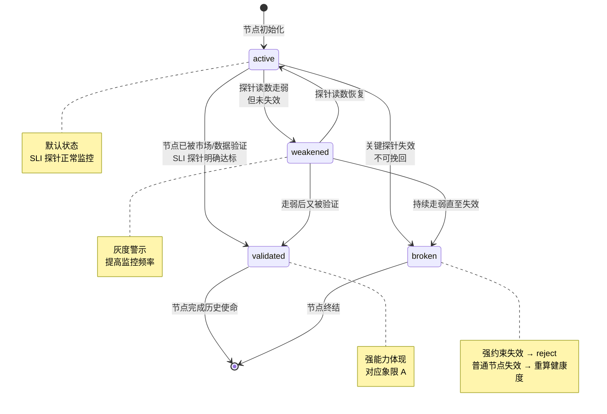
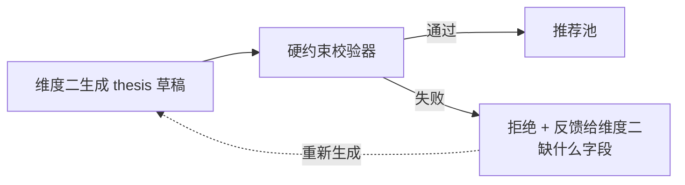
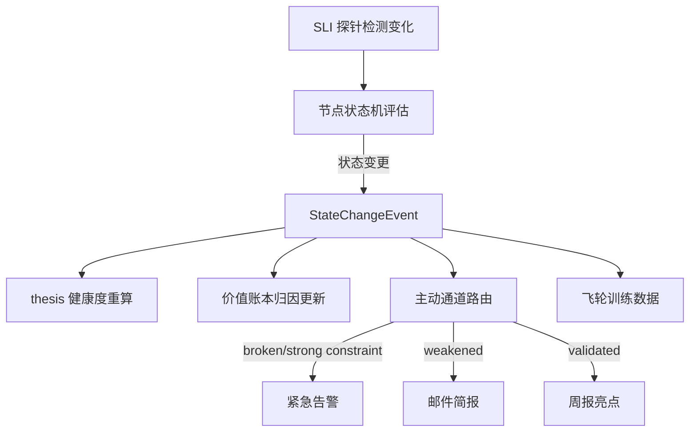

# 维度零·逻辑链监控规约

> [!IMPORTANT] **本文档定义"逻辑链节点状态机"——这是新哲学体系的核心机制**。所有 thesis 卡（来自维度二）必须含逻辑链节点；所有持仓监控（维度三）必须按节点状态机推进；所有决策归因（维度零·价值账本）必须基于节点状态。

> [!NOTE] **[TRACEBACK]**
> - **L1 哲学地基**: [06_投资哲学体系总纲](../../01_顶层概念/06_投资哲学体系总纲.md)
> - **维度概览**: [README.md](./README.md)
> - **价值账本**: [03_价值账本与决策日志.md](./03_价值账本与决策日志.md)
> - **下游消费方**: 维度三·持仓监控（监控对象）；维度零·价值账本（归因依据）

---

## 一、为什么必须有"逻辑链节点状态机"

### 1.1 没有它的世界（错误）

| 现象 | 原因 |
|---|---|
| "thesis 失效了"——什么时候失效的？谁判断的？ | 没有节点定义 |
| 持仓监控只能基于"价格 / 财务指标偏离" | 没有节点状态 |
| 价值账本归因被价格绑架 | 没有"逻辑链状态"输入 |
| 飞轮训练混淆 A/B/C/D | 没有"哪类决策成功 / 哪类失败"的细分 |

### 1.2 有它的世界（正确）

```
thesis 卡（含 N 个节点）
    ↓
每个节点 = (描述, SLI 探针, 当前状态, 历史轨迹)
    ↓
节点状态机持续运行（事件驱动 + 周度收拢）
    ↓
任意节点状态变更 → 触发：
   ├── 维度三：持仓监控告警 / 健康度重算
   ├── 维度零：决策归因更新 / 推送通知
   └── 维度五：训练数据生成
```

---

## 二、逻辑链节点的标准结构

### 2.1 节点字段

```yaml
logic_chain_node:
  node_id: L1                              # 节点 ID（thesis 卡内唯一）
  description: "公司利润截留在子公司 X，待回流"
  category: "fundamental"                  # fundamental / governance / industry / policy / behavioral
  
  # === 权重与约束 ===
  weight: 0.5                              # 在 thesis 健康度中的权重（总和 = 1.0）
  is_strong_constraint: false              # 是否强约束节点（强约束失效 = thesis 全部失效）
  
  # === SLI 探针映射 ===
  sli_probes:
    - probe_id: P-001
      probe_type: "financial_metric"
      probe_target: "subsidiary_x_cash_flow_qoq"
      threshold: ">10000000"               # 单位元
      check_frequency: "quarterly"
    - probe_id: P-002
      probe_type: "announcement_keyword"
      probe_target: "巨潮公告 - 子公司 X 利润分配"
      check_frequency: "event_driven"
  
  # === 时间约束 ===
  expected_validation_horizon: 90d         # 节点期望验证窗口
  hard_deadline: 180d                      # 节点超期判定
  
  # === 当前状态（运行时）===
  current_state: "active"                  # 4 态之一
  last_check_time: "2026-06-12T14:30:00Z"
  state_history:
    - {time: "2026-06-01", state: "active", trigger: "initial"}
  evidence:
    - {time: "2026-06-12", source: "Q2 财报", quote: "子公司 X 现金流环比 +15%"}
```

### 2.2 节点 4 态状态机



### 2.3 4 态详细定义

| 状态 | 触发条件 | 系统响应 | 用户感知 |
|---|---|---|---|
| **active**（成立中）| 节点初始化或最近 1 次探针正常 | 按 SLI 频率持续监控 | 默认状态，无推送 |
| **validated**（已验证）| 关键探针明确达标（如财报披露符合预期）| 锁定该节点 + 标记为"金标"贡献 | 周报里展示"逻辑被验证"|
| **weakened**（弱化）| 探针读数走弱但未跌破阈值 | 提高监控频率（事件驱动 → 实时）| 邮件简报："节点 LX 弱化"|
| **broken**（已失效）| 关键探针失效或强约束节点变 broken | 立刻触发 thesis 健康度重算 + 推送告警 | 微信紧急告警："节点 LX 失效"|

---

## 三、thesis 整体健康度算法

### 3.1 算法

```python
def compute_thesis_health(thesis_card) -> dict:
    """计算 thesis 整体健康度"""
    
    # 1. 检查强约束节点（任意失效 → 立刻 broken）
    for node in thesis_card.nodes:
        if node.is_strong_constraint and node.current_state == "broken":
            return {
                "health_score": 0.0,
                "status": "broken",
                "trigger_action": "强制退出",
                "reason": f"强约束节点 {node.node_id} 失效"
            }
    
    # 2. 加权计算健康度（普通节点）
    health_score = 0.0
    for node in thesis_card.nodes:
        node_score = STATE_TO_SCORE[node.current_state]
        health_score += node.weight * node_score
    
    # 3. 整体健康度阈值
    if health_score >= 0.8:
        status = "healthy"
        action = "continue_holding"
    elif health_score >= 0.5:
        status = "warning"
        action = "monitor_closely"
    elif health_score >= 0.3:
        status = "deteriorating"
        action = "consider_reduce"
    else:
        status = "broken"
        action = "force_exit"
    
    return {
        "health_score": health_score,
        "status": status,
        "trigger_action": action,
        "node_breakdown": {n.node_id: STATE_TO_SCORE[n.current_state] for n in thesis_card.nodes}
    }


STATE_TO_SCORE = {
    "validated": 1.0,
    "active": 0.8,
    "weakened": 0.4,
    "broken": 0.0,
}
```

### 3.2 触发动作矩阵

| 健康度 | 状态 | 系统动作 | 推送 |
|---|---|---|---|
| ≥ 0.8 | healthy | 继续持有 | 无 |
| [0.5, 0.8) | warning | 加密监控 | 邮件简报 |
| [0.3, 0.5) | deteriorating | 建议减仓 | 邮件 + 周报标注 |
| < 0.3 | broken | 强制退出 | 微信紧急告警 |
| 强约束失效 | broken | 立刻强制退出 | 微信紧急告警（最高优先级）|

---

## 四、SLI 探针调度

### 4.1 探针类型谱

| 类型 | 触发方式 | 例子 |
|---|---|---|
| **financial_metric** | 季度财报披露后自动 | 毛利率、ROE、现金流 QoQ |
| **announcement_keyword** | 公告实时流 | 大股东减持、高管离职、商誉减值 |
| **policy_event** | 政策追踪流 | 国务院/部委新政策落地 |
| **industry_signal** | 周度爬虫 | 行业产能利用率、价格指数 |
| **alternative_data** | 月度采集 | 招聘数、卫星图、用电量 |
| **price_anomaly** | 实时（仅作辅助）| 股价异常波动（不作为主判据，仅触发深度分析）|

### 4.2 探针调度策略

```yaml
probe_scheduling:
  default_strategy: "event_driven_with_weekly_sweep"
  
  event_driven:
    triggers:
      - financial_report_released
      - announcement_published
      - policy_event
      - sli_threshold_crossed
    response_time: "<5 minutes"
  
  weekly_sweep:
    schedule: "every Monday 03:00 AM"
    scope: "all active nodes"
    purpose: "防止事件驱动遗漏"
  
  emergency_check:
    triggers:
      - ai_engine_alert
      - user_manual_request
    response_time: "<1 minute"
```

### 4.3 探针失败的处理

| 失败类型 | 处理 |
|---|---|
| 数据源故障 | 切换备用源；24h 未恢复 → 告警 |
| 探针逻辑错误 | 自动隔离 + 写入异常日志 + 通知架构师 |
| 探针读数明显异常（异常值） | 标记 + 启动二次验证（人工/Teacher LLM） |
| 长期无变化（僵尸探针） | 月度审计自动检出 |

---

## 五、与维度三·持仓监控的接口契约

```yaml
api_contract:
  # 维度三向维度零提供
  - endpoint: "GET /api/thesis/{thesis_id}/nodes/{node_id}/state"
    response:
      state: "active" | "validated" | "weakened" | "broken"
      last_check_time: ISO8601
      evidence: list[Evidence]
  
  - endpoint: "GET /api/thesis/{thesis_id}/health"
    response:
      health_score: float
      status: "healthy" | "warning" | "deteriorating" | "broken"
      trigger_action: str
      node_breakdown: dict[str, float]
  
  - endpoint: "POST /api/thesis/{thesis_id}/nodes/{node_id}/state_change_event"
    body:
      from_state: str
      to_state: str
      trigger_evidence: Evidence
    consumed_by:
      - 维度零·价值账本（更新归因）
      - 维度零·主动通道（推送告警）
      - 维度五·飞轮（生成训练数据）
```

---

## 六、与维度二·thesis 卡的契约

> 维度二·纵深进攻的输出（thesis 卡）必须满足以下硬约束，否则不进入推荐池。

### 6.1 thesis 卡硬约束

```yaml
thesis_card_hard_constraints:
  - 必须有至少 3 个 logic_chain_node
  - 至少 1 个节点为 is_strong_constraint = true
  - 每个节点必须有至少 1 个 sli_probe
  - 必须显式声明 expected_window_days（≤ 365）
  - 必须显式声明 expected_minimum_return（≥ 0.20）
  - 必须通过 cognitive_boundary_check（在能力圈内）
```

### 6.2 校验流程



---

## 七、节点状态变更的"事件流"



---

## 八、用户面如何看到"逻辑链状态"

### 8.1 单只持仓的健康度卡片（Web）

```
┌──────────────────────────────────────────────────┐
│ 持仓：002xxx XX 股份                             │
│ 持仓金额：¥3.2 万 / 持仓 45 天 / 当前 +12%       │
│                                                  │
│ thesis 健康度：0.82 / healthy ✅                 │
│                                                  │
│ ─── 逻辑链节点 ───                              │
│  L1 (50%) 利润截留待回流  : ✅ validated         │
│         探针：子公司现金流 +18% (达标)           │
│                                                  │
│  L2 (30%) 政策窗口期       : ⚠️  weakened        │
│         探针：政策延后 1 季度落地                │
│                                                  │
│  L3 (20%) 大股东不减持     : ✅ active           │
│         探针：未发现减持公告                     │
│                                                  │
│ 系统建议：继续持有；关注 L2 是否进一步走弱        │
└──────────────────────────────────────────────────┘
```

### 8.2 紧急告警（微信）

```
🔴 紧急 [diting·副驾驶]
2026-06-15 14:32

XX (002xxx) thesis 强约束节点 L3 失效

节点：L3 大股东不减持 (强约束)
触发：2026-06-15 大股东公告减持 3% (3 月内第二次)
事实：累计减持 7%

thesis 整体健康度 → 0.0 (broken)
建议：立刻强制退出
你当前持仓：¥3.2 万

详情 → http://localhost:8080/alert/A-2025-001
```

---

## 九、本文档解决的"用户原始疑问"

| 用户原话 | 解决方式 |
|---|---|
| "周报里很难判断决策是否正确" | 周报展示"逻辑链节点状态"，不仅是价格涨跌 |
| "可能 90 天内跌 20% 但 4 个月后涨 200%" | 看节点状态——如果节点都 active/validated，跌 20% 是正常波动；不算失败 |
| "卖出后该标的继续涨" | 卖出时如果是节点 broken 触发，决策正确；后续涨与我们无关 |
| "系统 pass 但后来涨了" | pass 时若不在能力圈，决策正确；不算"漏机会" |
| "如何判断这次决策真正失败在哪里" | 按 8 象限定位 → G 是窗口模型问题，H 是能力问题，B 是赌庄家——不同象限不同复盘路径 |

---

## 十、第一阶段实现优先级

| 子项 | 优先级 | 第一阶段必做 |
|---|---|---|
| 节点 4 态状态机数据模型 | P0 | ✅ |
| thesis 卡硬约束校验器 | P0 | ✅ |
| SLI 探针 6 类基础调度 | P0 | ✅（先 financial_metric + announcement_keyword）|
| 健康度算法 | P0 | ✅ |
| 状态变更事件流 | P0 | ✅ |
| 与维度二/三 API 契约 | P0 | ✅ |
| 与维度零·价值账本归因接口 | P0 | ✅ |
| 异常探针检测 | P1 | 第二阶段补 |
| 探针自我评测 | P1 | 第二阶段补 |
| 多版本探针 A/B | P2 | 第三阶段补 |

---

## 十一、一致性检查表

```markdown
## 一致性检查表
- [x] 与 L1·06_投资哲学体系总纲 一致
- [x] 节点 4 态状态机定义清晰（active/validated/weakened/broken）
- [x] 强约束节点机制定义清晰
- [x] SLI 探针 6 类型谱与调度策略明确
- [x] 健康度算法可解释、可审计
- [x] 与维度二·thesis 卡硬约束契约清晰
- [x] 与维度三·持仓监控 API 契约清晰
- [x] 与维度零·价值账本归因接口清晰
- [x] 用户面卡片设计可视化
- [x] 解决了用户提出的所有原始疑问
```
