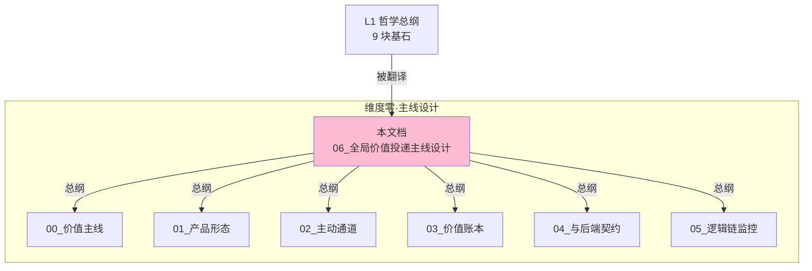
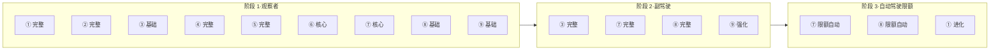
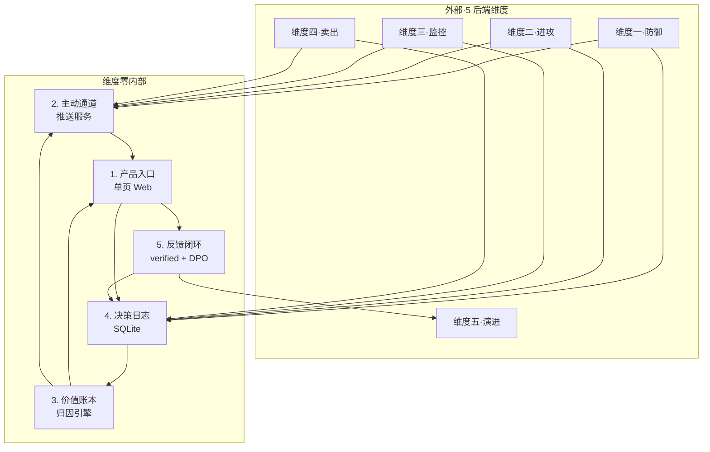

# 维度零 · 全局价值投递主线设计

> [!IMPORTANT] **本文档是维度零的"产品宪法"**，承接 L1 投资哲学体系 9 块基石的产品落地：把 5+1 维度的 AI 能力转化为用户能主动感知、可量化、可信任的投资副驾驶体验。
>
> **本文档的范围**：把哲学落到「**用户的每一次触碰**」上——什么时候系统会找你、找你看什么、你看到什么、你能做什么、你能确认什么。

> [!NOTE] **[TRACEBACK]**
> - **L1 哲学地基（全 9 块基石）**: [06_投资哲学体系总纲](../../01_顶层概念/06_投资哲学体系总纲.md)
> - **同维度引用**：[README](./README.md) | [00_价值主线](./00_维度目标与产品价值主线.md) | [01_产品形态](./01_产品形态与用户体验全景.md) | [02_主动通道](./02_主动通道设计.md) | [03_价值账本](./03_价值账本与决策日志.md) | [04_与后端契约](./04_与5维度后端的契约.md) | [05_逻辑链监控](./05_逻辑链监控规约.md)
> - **同层维度**：[维度三·持仓策略与战场分配实践规划](../03_维度三_持仓监控/04_持仓策略与战场分配实践规划.md)
> - **下沉 DNA**: `_System_DNA/global_const.yaml` → `investment_philosophy.*`（全 9 块基石的产品侧落地）

---

## 目录

- [一、本文档的层级定位与作用](#一本文档的层级定位与作用)
- [二、L1 9 块基石 × 产品形态 双向映射矩阵（核心）](#二l1-9-块基石--产品形态-双向映射矩阵核心)
- [三、用户旅程 × 哲学触点全景](#三用户旅程--哲学触点全景)
- [四、3 阶段演进 × 哲学基石激活节奏](#四3-阶段演进--哲学基石激活节奏)
- [五、维度零内部 5 子模块协作契约](#五维度零内部-5-子模块协作契约)
- [六、价值证明的最小信任单元](#六价值证明的最小信任单元)
- [七、一致性检查](#七一致性检查)

---

## 一、本文档的层级定位与作用

> **维度零 = 产品骨架 + 价值翻译器**：所有 AI 能力都必须经过维度零的"翻译"才能成为用户可感知的产品价值。

| 层级 | 在本主线设计中的角色 |
|---|---|
| **L1 哲学**（9 块基石）| 定义"什么算正确/失败/不做"——本文档据此设计**用户能感知的产品触点** |
| **L2 维度零**（本文档）| 把 L1 哲学**翻译为用户旅程的每一次触碰、推送、确认、反馈** |
| **L2 其他维度**（一/二/三/四/五）| 提供后端 AI 能力，**通过事件流向维度零供给原料** |
| **L3 规约 / L4 实施** | 按本文档定义的"翻译契约"实现具体代码 |

### 1.1 本文档与维度零其他文档的关系



> **本文档是维度零的"总纲"**——其他维度零文档是本文档某个侧面的展开。

---

## 二、L1 9 块基石 × 产品形态 双向映射矩阵（核心）

> 这是本设计的**核心矩阵**：每块哲学基石都必须有明确的"产品落地触点"，否则视为哲学没有真正落地。

### 2.1 基石 → 产品触点映射（哲学找产品）

| L1 基石 | 哲学要旨 | 产品功能落地 | 主动通道落地 | 价值账本落地 | 紧急告警落地 |
|---|---|---|---|---|---|
| **① 价值三角**（安全>确定>收益）| 优先级有序 | Web 首屏永远先显示"安全状态"再显示"收益" | 紧急告警的"安全类">所有其他 | 月报展示"3 角达成度"雷达图 | 安全类红色告警优先级最高 |
| **② 认知论套利工程化** | 每张 thesis 是工业级报告 | thesis 卡含"逻辑链节点 + SLI 探针 + 置信度"5 必填字段 | 周报 PDF 附 thesis 卡 | 决策日志记录每条 thesis 的节点状态变化 | — |
| **③ 时间边界**（5 战场）| 显式声明窗口期 | thesis 卡显式显示"战场类型 + 窗口期 + 收益门槛" | 周报呈现持仓的战场分布 | 月报展示战场分布饼图 + 健康度 | 窗口期到的标的进周报 review |
| **④ 八象限决策归因** | 决策正确性 = 逻辑+价格+时间 | Web 决策详情页显示当前象限 | 月报象限分布柱状图 | **核心**：每条决策按 T+30/60/90 自动归因 8 象限 | — |
| **⑤ 防御哲学**（宁可错杀）| 安全 > 进攻 | Web 持仓体检页面用红/橙/黄/绿四色标记 | 紧急告警的 4 类红色优先 | 月报展示"避雷价值 (EV from F 象限)" | 持仓中标的被新判 reject → 红色告警 |
| **⑥ 进攻哲学**（宁少不滥）| 推荐有上限 | Web 推荐池每周新增 ≤ 5 个 | 周报推荐池 3-5 只候选 | 月报展示"推荐采纳率 + 平均回报" | 高置信度限时机会 → 橙色告警 |
| **⑦ 持仓监控哲学**（逻辑链 + 持仓策略 + 调仓）| 综合决策中枢 | Web 持仓页显示每只票的健康度 + 调仓建议 | 日报扫一眼当日异动 | 月报展示"战场分配审计 + 调仓历史" | 强约束 broken → 红色告警 |
| **⑧ 卖出决策哲学**（4 类正确/1 类错误）| 不基于价格止损 | Web 卖出建议页显式标注"4 类之一" | 紧急告警的卖出建议附"卖出类型" | 月报展示"卖飞豁免案例"对照表 | 节点 broken 后缓冲期到 → 红色告警 |
| **⑨ 演进进化哲学**（按象限路由训练）| 模型每月进步 | Web 设置页显示"当前 LoRA 版本 + Holdout 分" | 月报附"飞轮学习进展"页 | 月报展示"系统能力分 SCS 月度趋势" | LoRA 守门失败 → 橙色告警通知架构师 |

### 2.2 产品触点 → 基石映射（产品找哲学）

> **反向验证**：每个产品功能必须能追溯到至少一块哲学基石；找不到 → 该功能可能是"无关价值"，应删除。

| 产品功能 | 主要承接的基石 | 次要承接的基石 |
|---|---|---|
| Web 首屏"系统能力分 + 经济价值"双指标 | ④ 八象限 | ② 工程化、⑨ 演进 |
| Web 持仓体检（4 色） | ⑤ 防御、⑦ 持仓监控 | ① 价值三角 |
| Web 推荐池（thesis 卡） | ⑥ 进攻、② 工程化 | ③ 时间边界 |
| Web 卖出建议（4 类标注） | ⑧ 卖出决策 | ⑦ 持仓监控 |
| Web 战场分配饼图 | ③ 时间边界、⑦ 持仓监控 | ① 价值三角 |
| Web verified 反馈面板 | ⑨ 演进 | ④ 八象限 |
| 日报邮件（持仓异动）| ⑦ 持仓监控 | — |
| 周报邮件（推荐 + 体检 + 价值）| ⑥ 进攻、⑤ 防御、④ 八象限 | ① 价值三角 |
| 月报 PDF（SCS 趋势 + 象限分布）| ④ 八象限、⑨ 演进 | ① 价值三角 |
| 紧急告警（4 类红色 + 2 类橙色）| ⑤ 防御、⑦ 持仓监控、⑧ 卖出 | ① 价值三角 |
| 价值账本（DV/OV/EV/SCS）| ④ 八象限、① 价值三角 | ⑨ 演进 |
| 决策日志（含八象限归因）| ④ 八象限 | ② 工程化 |
| 收益仓库可视化（Gain Vault）| ⑦ 持仓监控（7.7 节）| ① 价值三角 |
| 调仓矩阵建议（4×4 健康×收益）| ⑦ 持仓监控（7.8 节）| ⑧ 卖出 |
| LoRA 版本展示 + Holdout 分 | ⑨ 演进 | — |

### 2.3 反向验证清单：**没有哲学的产品功能 = 必须删除**

| 候选功能 | 是否应保留 | 哲学依据 |
|---|---|---|
| 实时行情看盘 | ❌ 删除 | 无哲学依据（基石⑥"不做技术派"）|
| K 线技术分析 | ❌ 删除 | 同上 |
| 推送行业新闻 | ❌ 删除 | 无哲学依据（信息过载反价值）|
| 持仓 thesis 健康度 | ✅ 保留 | ⑦ 持仓监控 |
| 卖出建议标注 4 类 | ✅ 保留 | ⑧ 卖出决策 |
| 战场分配饼图 | ✅ 保留 | ③ 时间边界、⑦ 持仓监控 |
| 系统能力分 SCS | ✅ 保留 | ④ 八象限、⑨ 演进 |

---

## 三、用户旅程 × 哲学触点全景

> 把 9 块基石"嵌入"用户每日/每周/每月的真实使用旅程。

### 3.1 每日触点（哲学激活节奏）

| 时段 | 用户动作 | 系统触点 | 激活的哲学基石 |
|---|---|---|---|
| **09:00** | 收到日报邮件 | 持仓异动 + 系统判断 | ⑦ 持仓监控（逻辑链追踪） |
| **盘中**（如有事件） | 收到红色告警 | 微信 + Telegram + 邮件 | ⑤ 防御 ⑦ 监控 ⑧ 卖出（依事件类型） |
| **盘中**（如有事件） | 收到橙色告警 | 邮件 | ⑥ 进攻（高置信度机会）|

### 3.2 每周触点

| 时段 | 用户动作 | 系统触点 | 激活的哲学基石 |
|---|---|---|---|
| **周一 08:00** | 收到周报 | PDF 含持仓体检 + 推荐池 + 价值账本 | ① ③ ⑤ ⑥ ⑦（全战线展示）|
| **周一 09:30** | 打开 Web 做"批量决策会" | 看 thesis 卡 + 做 5 个决策 | ② ⑥（每条 thesis 含 5 必填元素）|
| **周中**（如有事件） | 收到告警 | 同每日 | 同每日 |
| **周日 20:00** | 打开 Web 做 verified | 给 5-10 条建议 verified | ⑨ 演进（飞轮入料）|

### 3.3 每月触点

| 时段 | 用户动作 | 系统触点 | 激活的哲学基石 |
|---|---|---|---|
| **每月 1 日 08:00** | 收到月报 PDF | 5-8 页：SCS 趋势 + 象限分布 + 飞轮进展 + 价值证明 | 全 9 块基石（最完整体现）|
| **每月 1 日 10:00**（自动）| 战场分配审计 | Web 显示战场分布 vs 健康范围 | ③ 时间边界、⑦ 持仓监控 |
| **每季度末**（自动）| 飞轮 LoRA 增量训练 | Web 通知 + 邮件 | ⑨ 演进 |
| **每半年**（自动）| Holdout 全量评估 | 邮件 + 架构师 verified Kappa 复审 | ⑨ 演进、② 工程化 |

### 3.4 哲学激活密度热力图

```
用户旅程时间线 ──────────────────────────────────────→
              每日   每周   每月   每季   每半年
基石 ① 价值三角     ●●●   ●●●●  ●●●●●  ●●     ●
基石 ② 工程化       ●     ●●●   ●●●●   ●●     ●●●
基石 ③ 时间边界     ●●    ●●●   ●●●●   ●●     ●
基石 ④ 八象限       ●     ●●    ●●●●●  ●●●    ●●●
基石 ⑤ 防御         ●●●   ●●●●  ●●●    ●      ●
基石 ⑥ 进攻         ●     ●●●●  ●●●    ●●     ●
基石 ⑦ 持仓监控     ●●●●  ●●●●  ●●●●   ●●     ●
基石 ⑧ 卖出决策     ●●    ●●    ●●●    ●      ●
基石 ⑨ 演进         ●     ●●    ●●●●   ●●●●   ●●●●●
```

> **设计原则**：日/周高密度触点必须覆盖"风险类"基石（①⑤⑦⑧）；月/季/半年高密度触点必须覆盖"学习类"基石（②④⑨）。

---

## 四、3 阶段演进 × 哲学基石激活节奏

> 不是所有基石在第一阶段都能完整呈现——按阶段渐进激活。

### 4.1 阶段 1·观察者模式（0-3 月）

| 基石 | 激活状态 | 用户感知 |
|---|---|---|
| ① 价值三角 | **完整激活** | Web 首屏 + 月报核心页 |
| ② 工程化 | **完整激活** | thesis 卡 5 必填字段 |
| ③ 时间边界 | **基础激活** | thesis 显式战场类型；战场审计需 3 个月持仓积累后才有意义 |
| ④ 八象限 | **完整激活** | 决策日志按 T+30/60/90 归因 |
| ⑤ 防御 | **完整激活**（核心）| 10 类暴雷引擎全部上线 |
| ⑥ 进攻 | **核心激活** | 5 必填字段 thesis + 推荐上限 |
| ⑦ 持仓监控 | **核心激活** | 逻辑链节点状态机 + 健康度 |
| ⑧ 卖出决策 | **基础激活** | 4 类卖出建议；用户手动执行 |
| ⑨ 演进 | **基础激活** | verified 反馈进入飞轮；首次 LoRA 训练在第 2-3 月 |

### 4.2 阶段 2·副驾驶模式（3-9 月）

| 基石 | 激活强化 |
|---|---|
| ③ 时间边界 | **完整激活**：战场分配审计已有 3 月数据基础，开始触发动态再平衡建议 |
| ⑦ 持仓监控 | **完整激活**：7.6-7.9 全部功能上线（收益仓库、4×4 调仓矩阵）|
| ⑧ 卖出决策 | **完整激活**：4 类卖出协议 + 卖飞豁免规则上线 |
| ⑨ 演进 | **强化激活**：象限路由训练库正常运转；月度 SCS 趋势可视化 |

### 4.3 阶段 3·自动驾驶模式·限额版（9-12 月）

| 基石 | 激活强化 |
|---|---|
| ⑦ 持仓监控 | **限额自动执行**：30% 仓位的调仓建议可自动执行（限额内）|
| ⑧ 卖出决策 | **限额自动执行**：30% 仓位的卖出建议可自动执行 |
| ① 价值三角 | **进化**：用户开始把更多本金交给副驾驶 |

### 4.4 阶段 × 基石激活矩阵（一图汇总）



---

## 五、维度零内部 5 子模块协作契约

> 维度零内部 5 个子模块（产品入口/主动通道/价值账本/决策日志/反馈闭环）之间的事件流与 SLO。

### 5.1 子模块依赖图



### 5.2 5 子模块协作契约（事件 + SLO）

| 协作对 | 事件 | SLO |
|---|---|---|
| **主动通道 → 决策日志** | 每条推送的"建议"必须先入决策日志再发送 | < 100ms 写入 SQLite |
| **决策日志 → 价值账本归因引擎** | 每条决策在 T+30/60/90/180 自动触发归因 | 调度延迟 ≤ 1 分钟 |
| **价值账本 → 产品入口（Web）**| Web 首屏的 SCS 和 EV 实时来自价值账本 | Web 刷新 < 1s |
| **价值账本 → 主动通道**| 月报数据来自价值账本 | 月初 1 日 06:00 前完成全部归因 + 月报生成 |
| **产品入口 → 决策日志** | 用户在 Web 上的【已执行】【已忽略】【已修改】立刻入决策日志 | < 500ms |
| **产品入口 → 反馈闭环** | 用户的 verified 操作进 DPO 偏好对池 | < 200ms |
| **反馈闭环 → 维度五** | DPO 偏好对每周批量推送给维度五 | 每周日 23:00 |
| **反馈闭环 → 决策日志** | 用户 verified 结果回写决策日志 | < 100ms |

### 5.3 子模块的 SLO 总览

| 子模块 | SLO 指标 | 目标 |
|---|---|---|
| **产品入口**（Web）| 首屏加载 | < 1s |
| **产品入口**（Web）| 任意操作响应 | < 500ms |
| **主动通道**（推送）| 红色告警 5 分钟到达率 | ≥ 99.5% |
| **主动通道**（推送）| 周报准时率 | ≥ 99% |
| **价值账本**（归因）| T+30 归因延迟 | ≤ 1 小时 |
| **价值账本**（归因）| 月报生成 | 月 1 日 06:00 前 |
| **决策日志**（写入）| 写入延迟 | < 500ms |
| **反馈闭环**（verified）| 写入延迟 | < 200ms |
| **反馈闭环**（DPO 批量）| 每周推送 | 周日 23:00 |

---

## 六、价值证明的最小信任单元

> 用户每个月只需要看到 **5 句话** 就能判断"系统是否真的有价值"。

### 6.1 5 句话价值证明（月报核心页）

```
1️⃣  本月系统能力分（SCS）：72 / 100  → 强（连续 6 月 ≥ 60）
2️⃣  本月做了 12 个决策：A+F 占比 58%（完美 + 避雷）
3️⃣  经济价值（EV）：+¥4350（避雷 ¥2800 + 收益 ¥1550）
4️⃣  价值三角达成度：安全 ✅ / 确定 ✅ / 收益 ✅
5️⃣  系统的诚实建议：继续使用（无停用信号）
```

### 6.2 价值证明的 4 个不可妥协的设计原则

| 原则 | 体现 |
|---|---|
| **诚实**：EV 和 SCS 解耦展示 | "赚到了 + 系统能力 ±0" 也照实说 |
| **可验证**：每条决策可追溯 8 象限归因 | 用户点 SCS 数字可下钻到 12 条决策 |
| **可比较**：与沪深 300 对照 | 跑赢 / 跑输 都标注 |
| **可放弃**：可显示"停用建议" | 连续 3 月 SCS < 30 → 月报建议"暂停使用" |

### 6.3 价值证明触发停用的"自我熔断"

```
连续指标         → 系统自动建议用户暂停使用
─────────────────────────────────────────────
SCS < 30 连续 2 月 → 月报弹出"暂停建议"
H 象限占比 > 20%   → 紧急邮件"系统能力受损"
B 象限占比 > 30%   → 紧急邮件"在赌庄家行为，立刻暂停"
EV / 累计成本 < 1 (使用 3 月后) → 月报建议"重新评估价值"
```

> **核心价值观**：宁可让用户主动暂停，也不让用户因"舍不得"而被无用工具消耗时间。

---

## 七、一致性检查

| 检查项 | 状态 |
|---|---|
| L1 9 块基石每块都有产品触点映射 | ✅ |
| 每个产品功能都能反向追溯到至少一块基石 | ✅ |
| 用户每日/每周/每月触点覆盖全 9 块基石 | ✅ |
| 3 阶段演进的基石激活节奏清晰 | ✅ |
| 维度零内部 5 子模块的协作契约 + SLO 完整 | ✅ |
| 价值证明的最小信任单元（5 句话）可在 Web/月报展示 | ✅ |
| 自我熔断机制存在（连续坏指标 → 建议暂停）| ✅ |
| [TRACEBACK] 链完整（L1 → 本文档 → 子模块 → 后端维度）| ✅ |
| 不写代码实现细节（仅 schema 与契约） | ✅ |
| 不重新定义哲学边界（哲学引用 L1） | ✅ |

---

## 修订记录

| 日期 | 触发 | 内容 |
|---|---|---|
| 2026-05-14 | 用户提出"维度零贯穿全局产品用户价值主动投递设计" | 新建本文档，承接 L1 9 块基石的产品落地，包含哲学×产品双向映射矩阵、用户旅程哲学触点全景、3 阶段演进激活节奏、5 子模块协作契约、价值证明最小信任单元 |
