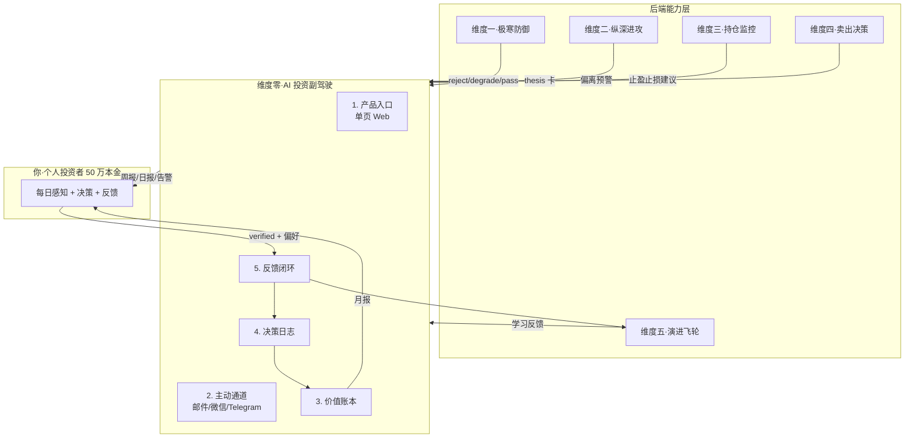

# 维度零·AI 投资副驾驶（The Co-Pilot）

> [!IMPORTANT] **本维度是"产品骨架"，不是后端引擎**。它把维度一/二/三/四/五的所有 AI 能力**翻译成你（个人投资者）能感知的产品体验、主动通道和价值反馈**。所有判据来自 **[L1·06_投资哲学体系总纲](../../01_顶层概念/06_投资哲学体系总纲.md)**——价值三角（安全>确定>收益）+ 8 象限决策归因 + 逻辑链监控。

> [!NOTE] **[TRACEBACK] 战略维度锚点**
> - **L1 哲学地基（最高权威）**: [06_投资哲学体系总纲](../../01_顶层概念/06_投资哲学体系总纲.md)
> - **顶层概念**: [项目定义与核心价值](../../01_顶层概念/01_项目定义与核心价值.md)
> - **顶层概念**: [双目标系统与五层架构](../../01_顶层概念/03_双目标系统与五层架构.md)
> - **同层引用**: [双目标与战略维度关系](../00_双目标与战略维度关系.md)
> - **消费的后端**: 维度一/二/三/四 的所有引擎判定 + 维度五 的反馈基础设施
> - **L3 工程承载（前端为主）**: [前端工程与服务（frontend）](../../03_原子目标与规约/00_维度零_AI投资副驾驶/README.md) + [06_L2 落地清单](../../03_原子目标与规约/00_维度零_AI投资副驾驶/06_L2落地清单_设计.md)

## 一、维度速览

| 项目 | 内容 |
|---|---|
| **一句话定位** | 把 5 维度后端能力转化为"主动陪伴 + 量化价值"的真实投资副驾驶 |
| **战略目标** | 让一个 50 万本金的个人投资者**每天打开就有用、每月看到具体价值、永远不会被它伤害** |
| **核心使命** | 解决"AI 引擎再强大但用户用不起来"的产品落地难题 |
| **服务对象** | 你（架构师）+ 未来扩展的同好用户 |
| **L3 模块** | 跨多个 L3（包含 `notification`, `co_pilot_ui`, `value_ledger`, `decision_log`） |
| **核心子模块** | 5 个（产品入口 / 主动通道 / 价值账本 / 决策日志 / 反馈闭环） |
| **当前优先级** | **P0**（与维度一、维度五并列第一） |

## 二、双视角入口

| 视角 | 入口 | 用途 | 适合谁 |
|---|---|---|---|
| **按阶段切**（推荐先看） | [stages/](./stages/) | "第一/二/三阶段我能用什么、得到什么价值"——一眼看清产品演进路线 | 你做月度计划、决定何时升级使用模式 |
| **按产品子模块切** | [product_modules/](./product_modules/) | 单个产品功能（如"价值账本"）的完整规约 | 该模块的实现者 |

> **快速导航**：
> - 想知道"50 万本金，第一阶段这个产品对我有什么用"→ [stages/stage_1_启动期/README.md](./stages/stage_1_启动期/README.md)
> - 想知道"系统如何主动找我、不打扰我又不漏关键信息"→ [02_主动通道设计.md](./02_主动通道设计.md)
> - 想知道"系统到底有没有给我赚到/避到钱"→ [03_价值账本与决策日志.md](./03_价值账本与决策日志.md)

## 三、本目录文件索引

| 文件 | 内容 |
|---|---|
| [00_维度目标与产品价值主线.md](./00_维度目标与产品价值主线.md) | 战略目标 + 50 万本金的具体价值 + 三模演进 |
| [01_产品形态与用户体验全景.md](./01_产品形态与用户体验全景.md) | 单页 Web + 邮件 + 微信 = 完整产品形态 + 一周时间线 |
| [02_主动通道设计.md](./02_主动通道设计.md) | 日报/周报/月报 + 紧急告警 4 层主动通道 |
| **[03_价值账本与决策日志.md](./03_价值账本与决策日志.md)** | **★ 已按 L1 哲学重构**：8 象限归因 + 系统能力分（SCS）+ 经济价值（EV）双轨 |
| **[04_与5维度后端的契约.md](./04_与5维度后端的契约.md)** | **★ 已完整化**：5 维度事件流 schema + Stream 命名 + SLO + 降级策略 |
| **[05_逻辑链监控规约.md](./05_逻辑链监控规约.md)** | 节点 4 态状态机 + SLI 探针调度 + 健康度算法 |
| **[06_全局价值投递主线设计.md](./06_全局价值投递主线设计.md)** | **★ 维度零产品宪法**：L1 9 块基石 × 产品形态 双向矩阵 + 用户旅程 × 哲学触点 + 3 阶段激活节奏 + 5 子模块协作契约 + 价值证明最小信任单元 |
| **[stages/](./stages/)** | **★ 已完整化**：3 阶段 × 4 文档 = 12 份阶段切片 + stages/README，按阶段切看产品演进 |
| **[product_modules/](./product_modules/)** | **★ 已完整化**：5 个**产品功能子模块**完整规约（持仓体检 / 推荐池 / 紧急告警 / 价值账本 / 反馈闭环）。**注意**：这是用户感知的"产品功能模块"，与 L3 frontend/ 的"前端工程服务子模块"为**不同概念**。两者关系详见本目录下 `00_产品模块到L3模块的映射.md` |
| **[00_产品模块到L3模块的映射.md](./00_产品模块到L3模块的映射.md)** | **★ 新增（2026-05-16）**：5 product_modules → L3 frontend Feature 组件 + 跨四大模块（cryo_guard/deep_strike/state_watch/super_evo）事件流订阅的双向映射 |

## 四、本维度子模块清单（5 个）

| # | 子模块 | 优先级 | 文档 |
|---|---|---|---|
| 1 | **持仓体检报告**（一页 Web） | **P0** | [product_modules/01_持仓体检报告.md](./product_modules/01_持仓体检报告.md) |
| 2 | **推荐池与 thesis 卡**（周报） | **P0** | [product_modules/02_推荐池与thesis卡.md](./product_modules/02_推荐池与thesis卡.md) |
| 3 | **紧急告警系统**（微信 + Telegram + 邮件） | **P0** | [product_modules/03_紧急告警系统.md](./product_modules/03_紧急告警系统.md) |
| 4 | **价值账本与决策日志**（月报） | **P0** | [product_modules/04_价值账本.md](./product_modules/04_价值账本.md) |
| 5 | **反馈闭环**（verified + DPO 偏好对采集） | P1 | [product_modules/05_反馈闭环.md](./product_modules/05_反馈闭环.md) |

## 五、与其他维度的关系

## 六、协作约定

- **本维度是产品骨架，不直接做投资决策**：所有"建议"都来自后端 5 维度
- **永远保留人工最终否决权**：在第三阶段引入"自动驾驶"前，所有动作都需用户确认
- **价值透明**：所有"系统建议 → 你的操作 → 后续结果"都进决策日志，月报可查
- **可解释**：每条建议都有 thesis card 解释"为什么"，不做黑盒
- **不打扰**：默认推送频率 = 1 周报 + 1 月报 + 紧急时事件告警；日报可关
