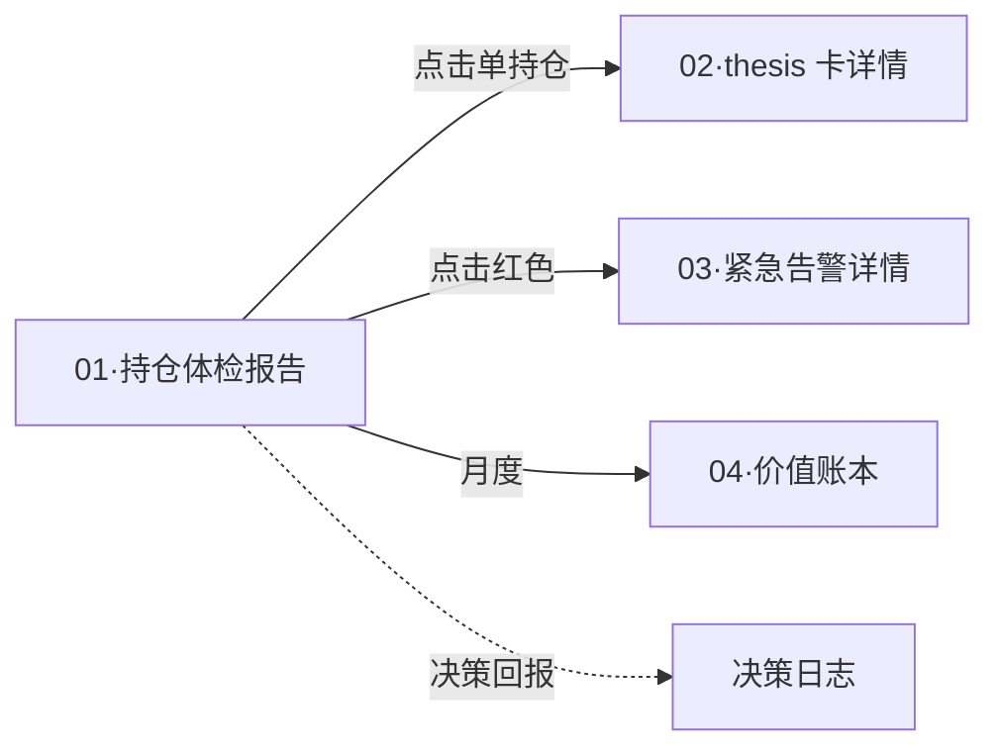

# 维度零·子模块 01·持仓体检报告

> [!NOTE] **[TRACEBACK]**
> - **维度概览**: [../README.md](../README.md)
> - **产品价值主线**: [../00_维度目标与产品价值主线.md](../00_维度目标与产品价值主线.md)
> - **全局价值投递主线**: [../06_全局价值投递主线设计.md](../06_全局价值投递主线设计.md)
> - **承接 L1 哲学基石**: ⑤防御 + ⑦持仓监控 + ①价值三角
> - **消费的后端**: 维度一 reject/degrade/pass · 维度三 health_change/rebalance_advice

## 一、子模块定位

| 项 | 内容 |
|---|---|
| **一句话定位** | Web 首屏唯一固定面板：5 秒看清当前持仓的"安全 + 价值"全景 |
| **优先级** | **P0**（与推荐池、紧急告警并列第一）|
| **使用频率** | 用户每周末打开 1 次（≈ 10 min）+ 紧急告警链接跳转（即时） |
| **L1 承接** | 基石⑤防御（4 色风险标记）+ 基石⑦持仓监控（节点健康度）+ 基石①价值三角（先看安全） |
| **核心价值** | 把后端"健康度数字"翻译为"红/橙/黄/绿"四色卡片，3 秒认知 |

## 二、用户感知层（Web 页面规约）

### 2.1 一屏式总览

```
┌──────────────────────────────────────────────────────┐
│ 持仓体检 · 2026-06-12 · 共 5 只持仓                 │
├──────────────────────────────────────────────────────┤
│ 🟢 系统能力分: 72/100 (强)  💰 经济价值: +¥4350     │
├──────────────────────────────────────────────────────┤
│ 🔴 1 只 reject (XX 002xxx)  立即查看 →              │
│ 🟠 1 只 degrade (YY 002yyy)  本周关注 →             │
│ 🟡 0 只 健康度走弱                                   │
│ 🟢 3 只 全部 thesis 节点正常                        │
└──────────────────────────────────────────────────────┘
```

### 2.2 4 色风险标记规则

| 颜色 | 触发 | 用户应做 |
|---|---|---|
| 🔴 红色 | 维度一新判 reject **OR** 维度三强约束节点 broken | 立即评估清仓（看详情）|
| 🟠 橙色 | 维度一 degrade **OR** 维度三 health ∈ [0.30, 0.50) | 本周内 review |
| 🟡 黄色 | 维度三 health ∈ [0.50, 0.80) | 关注但不必行动 |
| 🟢 绿色 | health ≥ 0.80 **AND** 全部节点 active/validated | 持有 |

### 2.3 单持仓详情卡（点击展开）

| 字段 | 来源 |
|---|---|
| 标的代码 + 名称 + 持仓金额 + 持仓占比 | 用户绑定的持仓数据 |
| **战场类型 + 入场时间 + 剩余窗口** | thesis_card_id 查询 |
| **当前健康度 + 历史曲线（30 天）** | 维度三 |
| **thesis 节点状态**（每个节点 4 态） | 维度三 |
| **系统建议**（持有/减仓/卖出） | 维度三 RebalanceAdvice |
| **价格涨跌 + 八象限定位** | 维度零归因引擎 |

## 三、数据接入契约

### 3.1 消费的后端事件流

| Stream | 用途 | 频率 |
|---|---|---|
| `events:cryo_guard:reject` | 红色卡片（持仓被新判 reject）| 事件驱动 |
| `events:cryo_guard:degrade` | 橙色卡片 | 事件驱动 |
| `events:monitor:health_change` | 健康度变化 → 4 色实时更新 | 节点状态变化时 |
| `events:monitor:rebalance_advice` | 调仓建议 → 详情卡显示 | 健康度变化触发 |
| `events:exit:sell_signal` | 卖出建议 → 红色卡片 | 事件驱动 |

### 3.2 内部数据需求

| 数据 | 来源 | 用途 |
|---|---|---|
| 用户持仓清单 | 用户手动维护（Web 维护页）/ 第二阶段接券商 API | 渲染体检列表 |
| 持仓的 thesis_card_id 关联 | 决策日志（用户买入时关联）| 追溯 thesis 节点 |
| 历史健康度时序 | 维度三 PG 表 `health_history` | 30 天曲线 |

## 四、3 阶段演进

| 阶段 | 实现范围 |
|---|---|
| **阶段 1·启动期** | Web 首屏 4 色卡片 + 单持仓详情卡 + 节点状态展示 |
| **阶段 2·扩展期** | + 自动从券商 API 同步持仓 + 历史曲线 90 天 + 调仓建议详情 |
| **阶段 3·完善期** | + 自动驾驶仓位分区显示 + 战场分配饼图 + 收益仓库可视化 |

## 五、SLO 与可用性

| SLO | 目标 |
|---|---|
| 首屏加载时间 | < 1 秒 |
| 健康度数据延迟（事件触发到 Web 显示）| < 10 秒 |
| 4 色卡片视觉一致性 | 100%（颜色与维度一/三事件 push_level 严格映射）|
| 误标率（颜色与后端实际状态不一致）| < 0.1% |

## 六、与 L1 9 块基石的双向映射

| 基石 | 在本模块的体现 |
|---|---|
| ① 价值三角 | 总览栏永远先显示"安全状态"（红/橙数量），后显示经济价值 |
| ② 工程化 | 详情卡每个节点的 SLI 探针可下钻看证据 |
| ③ 时间边界 | 详情卡显式显示"战场 + 剩余窗口" |
| ④ 八象限 | 详情卡显示当前八象限定位 |
| ⑤ 防御 | 4 色风险标记 |
| ⑥ 进攻 | （不在本模块体现）|
| ⑦ 持仓监控 | 健康度 + 节点 4 态状态机 |
| ⑧ 卖出决策 | 红色卡片可跳转到卖出建议详情 |
| ⑨ 演进 | 详情卡可看到"当前使用的 LoRA 版本" |

## 七、关键技术选型

| 项 | 选型 | 理由 |
|---|---|---|
| 前端框架 | HTMX + Alpine.js + Pico CSS | 0 编译；与维度零产品形态一致 |
| 实时更新 | Server-Sent Events（SSE）订阅 Redis Stream | 简单可靠，无需 WebSocket |
| 健康度图表 | Chart.js（轻量） | 30 天曲线足够 |
| 移动端兼容 | 响应式 CSS | 手机能扫读 |

## 八、与其他子模块的关系



## 九、一致性检查

| 检查项 | 状态 |
|---|---|
| 与维度一/三事件流契约对齐 | ✅ |
| 4 色规则与 push_level 映射严格一致 | ✅ |
| 承接 L1 基石⑤⑦① | ✅ |
| SLO 与维度零产品形态总 SLO 一致（< 1s 加载）| ✅ |
| 3 阶段演进对应基石激活节奏 | ✅ |

---

## 修订记录

| 日期 | 触发 | 内容 |
|---|---|---|
| 2026-05-15 | 补全维度零 modules/ 缺失文档 | 新建本子模块规约 |
