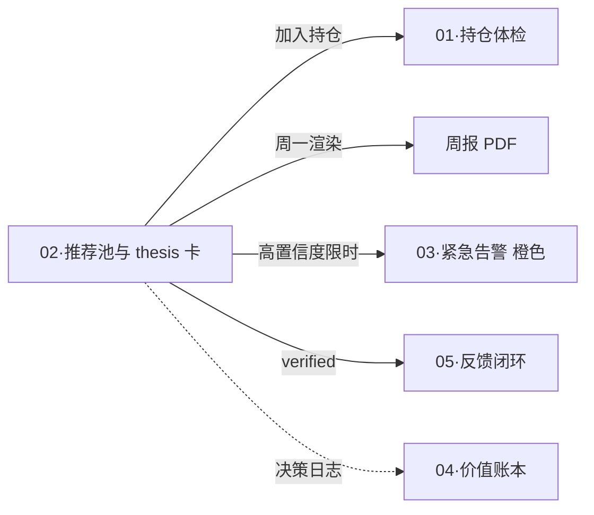

# 维度零·子模块 02·推荐池与 thesis 卡

> [!NOTE] **[TRACEBACK]**
> - **维度概览**: [../README.md](../README.md)
> - **产品价值主线**: [../00_维度目标与产品价值主线.md](../00_维度目标与产品价值主线.md)
> - **承接 L1 哲学基石**: ⑥进攻 + ②工程化 + ③时间边界
> - **消费的后端**: 维度二 `events:thrust:thesis_proposed`
> - **同源 L2 规约**: [维度二·进攻实践策略规划](../../02_维度二_纵深进攻/04_进攻实践策略规划.md#二thesis-卡-5-必填元素-schema-完整版)

## 一、子模块定位

| 项 | 内容 |
|---|---|
| **一句话定位** | 把维度二的"5 必填元素 thesis 卡"渲染为人类可读决策卡 |
| **优先级** | **P0** |
| **使用频率** | 周一上午（周报）+ 临时高置信度机会推送（即时） |
| **L1 承接** | 基石⑥进攻（宁少不滥）+ 基石②工程化（5 必填元素）+ 基石③时间边界（显式战场）|
| **核心价值** | 把维度二的工业级 thesis 工业报告转化为"5 分钟做决策"的卡片 |

## 二、用户感知层

### 2.1 推荐池 Web 页面布局

```
┌──────────────────────────────────────────────────────┐
│ 推荐池 · 2026-W24 · 本周新增 3 只候选               │
├──────────────────────────────────────────────────────┤
│ 战场分布: 超短 1 / 主战场 2 / 中战场 0              │
│ 平均 confidence: 0.78 · 平均赔率: 2.4               │
├──────────────────────────────────────────────────────┤
│ ▍AAA  002xxx  ★★★★☆ 0.85                          │
│   战场: 主战场 / 90 天 / 目标 +28%                 │
│   思路: 利润截留型低估                              │
│   [查看完整 thesis 卡 →] [收藏到决策池]            │
│                                                      │
│ ▍BBB  002yyy  ★★★★☆ 0.78                          │
│   ...                                                │
└──────────────────────────────────────────────────────┘
```

### 2.2 单 thesis 卡详情页（核心）

```
┌─ AAA 002xxx · 利润截留型低估 ──────────────────────┐
│                                                      │
│ 【元素 ③ 战场窗口期】                               │
│   战场: 主战场 (90-180 天)                         │
│   入场后 90 天目标: +28% (信心 0.85)               │
│                                                      │
│ 【元素 ④ 收益门槛 + 价格】                          │
│   目标价: ¥32.50 (+28%)                            │
│   止损价: ¥22.00 (-13%, 仅参考)                    │
│   最低收益门槛: +20% (主战场)                       │
│                                                      │
│ 【元素 ⑤ 认知边界检查 ✅】                          │
│   5 维全部通过 (行业/数据/SLI/历史/复杂度)         │
│                                                      │
│ 【元素 ① 逻辑链节点】(3 个,1 个强约束)              │
│   L1 (50%, 强约束): 子公司 X 利润截留待回流        │
│      SLI: 子公司利润同比 / 关联应收账款            │
│      check_freq: 季度                              │
│                                                      │
│   L2 (30%): 行业政策窗口 2026 Q3 打开              │
│      SLI: 部委公告 / 补贴落地                      │
│      check_freq: 事件                              │
│                                                      │
│   L3 (20%): 大股东 6 月内不减持                    │
│      SLI: 持股变动公告                             │
│      check_freq: 事件                              │
│                                                      │
│ 【量化指标】                                         │
│   confidence: 0.85 · 赔率: 2.5 · 历史胜率: 0.65    │
│                                                      │
│ 【元素 ② SLI 探针映射】完成 ✅                     │
│   ↓                                                  │
│ 用户操作: [💗 加入持仓] [⏸ 待考虑] [❌ 不感兴趣]    │
└──────────────────────────────────────────────────────┘
```

### 2.3 推荐池决策操作

| 用户动作 | 系统响应 |
|---|---|
| 💗 加入持仓 | 触发决策日志记录 + thesis_card 与持仓关联 + 维度三启动监控 |
| ⏸ 待考虑（标注后 24h 内决定）| 进 watchlist；24h 后未决策→邮件提醒 |
| ❌ 不感兴趣 | 进决策日志（用作偏好对训练）+ 7 天内不再推荐同标的 |
| 修改建议（在卡上写注释） | 进 DPO 偏好对池（维度五）|

## 三、数据接入契约

### 3.1 消费的后端事件流

| Stream | 用途 | 频率 |
|---|---|---|
| `events:thrust:thesis_proposed` | 新推荐进推荐池 | 单周 ≤ 5 个 |
| `events:cryo_guard:reject` | 持仓中标的被 reject → 同时降级该 thesis | 事件驱动 |
| `events:monitor:health_change` | 推荐池中标的 health 跌至 weakening → 自动从推荐池移除 | 事件驱动 |

### 3.2 5 必填元素的渲染契约

> 严格按维度二 04_ §二定义的 ThesisCard schema 渲染。任一元素缺失 → 直接退回事件源 + 告警。

```python
def render_thesis_card(thesis_event):
    """thesis 卡渲染契约"""
    # 强制 5 必填元素检查
    required_elements = [
        "logic_chain.nodes (≥3, ≥1 强约束)",
        "logic_chain.nodes[].sli_probes",
        "battlefield + window_days",
        "min_return_threshold + target_price",
        "cognitive_boundary_check.passed"
    ]
    for el in required_elements:
        assert thesis_event.has(el), f"5 必填缺失: {el}"
    
    # 三门槛检查（基石⑥）
    assert thesis_event.confidence >= 0.70
    assert thesis_event.expected_payoff_ratio >= 2.0
    assert thesis_event.historical_win_rate >= 0.55
    
    return render_template(thesis_event)
```

## 四、3 阶段演进

| 阶段 | 实现范围 |
|---|---|
| **阶段 1·启动期** | Web 推荐池页 + 单 thesis 卡详情 + 3 操作（加入/待考虑/不感兴趣）+ PDF 导出（用于周报）|
| **阶段 2·扩展期** | + 候选池横向比较（多 thesis 并排）+ 历史推荐回测可视化（"该模型上月推 5 只目前表现"）|
| **阶段 3·完善期** | + 自动驾驶仓位的"建议下单草稿"+ thesis 卡的 verified 闭环（用户标注质量 → 维度五 DPO）|

## 五、SLO 与可用性

| SLO | 目标 |
|---|---|
| thesis 卡详情页加载 | < 1 秒 |
| 推荐池每周新增上限（强约束）| ≤ 5 个（基石⑥）|
| 5 必填元素完整性 | 100% |
| PDF 导出（周报附件）成功率 | ≥ 99% |

## 六、与 L1 9 块基石的双向映射

| 基石 | 在本模块的体现 |
|---|---|
| ② 工程化 | 5 必填元素的强制展示；每节点 SLI 探针可下钻 |
| ③ 时间边界 | 战场类型 + 窗口期 + 最低收益门槛三件套 |
| ④ 八象限 | 历史推荐的象限分布柱状图（阶段 2）|
| ⑥ 进攻 | 推荐数量上限 ≤ 5；置信度/赔率/胜率三门槛强制展示 |

## 七、关键技术选型

| 项 | 选型 | 理由 |
|---|---|---|
| 卡片渲染 | Jinja2 模板 + Pico CSS | 与产品形态一致 |
| PDF 生成 | WeasyPrint | HTML → PDF，复用同模板 |
| 卡片版本管理 | 每张卡 thesis_card_id + version | 历史可追溯 |

## 八、与其他子模块的关系



## 九、一致性检查

| 检查项 | 状态 |
|---|---|
| 5 必填元素 schema 严格对齐维度二 04_ | ✅ |
| 三门槛（0.70/2.0/0.55）强制展示 | ✅ |
| 单周推荐数上限 ≤ 5 强约束 | ✅ |
| 承接 L1 基石⑥②③ | ✅ |
| PDF 导出复用 Jinja2 模板 | ✅ |

---

## 修订记录

| 日期 | 触发 | 内容 |
|---|---|---|
| 2026-05-15 | 补全维度零 modules/ 缺失文档 | 新建本子模块规约 |
