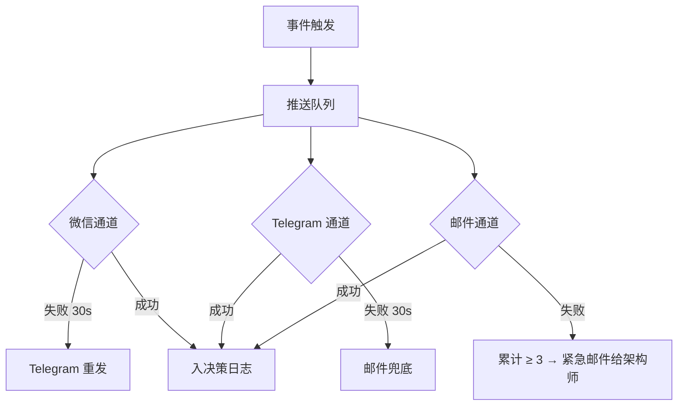
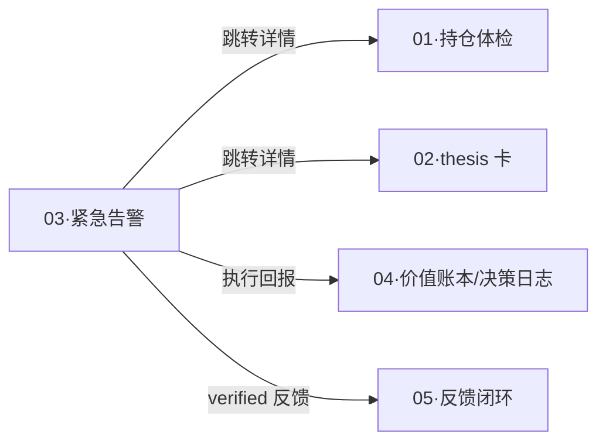

# 维度零·子模块 03·紧急告警系统

> [!NOTE] **[TRACEBACK]**
> - **维度概览**: [../README.md](../README.md)
> - **主动通道总览**: [../02_主动通道设计.md](../02_主动通道设计.md)
> - **承接 L1 哲学基石**: ⑤防御 + ⑦持仓监控 + ⑧卖出决策 + ①价值三角
> - **消费的后端**: 维度一 reject · 维度三 health_change · 维度四 sell_signal

## 一、子模块定位

| 项 | 内容 |
|---|---|
| **一句话定位** | 把后端"对你的持仓有重大影响"的事件，5 分钟内推到你的手机 |
| **优先级** | **P0**（与持仓体检并列第一，因为时间敏感）|
| **使用频率** | 不定（约每周 1-2 次红色 + 2-3 次橙色）|
| **L1 承接** | 基石⑤防御（持仓 reject）+ 基石⑦持仓监控（强约束 broken）+ 基石⑧卖出（卖出建议）|
| **核心价值** | 不在场也能被找到——30 秒内到达手机，5 分钟内做决策 |

## 二、用户感知层

### 2.1 4 类红色告警 + 2 类橙色告警

> 严格继承 [02_主动通道设计.md §六](../02_主动通道设计.md) 的告警分级规则，本节仅展开技术实现细节。

| 颜色 | 触发条件 | 通道 | 5 分钟到达率 SLO |
|---|---|---|---|
| 🔴 红色·1 | 持仓中标的被新判 reject | 微信 + Telegram + 邮件 | ≥ 99.5% |
| 🔴 红色·2 | 持仓 thesis 强约束节点 broken | 微信 + Telegram + 邮件 | ≥ 99.5% |
| 🔴 红色·3 | 持仓出现暴雷前兆（多源汇聚）| 微信 + Telegram + 邮件 | ≥ 99.5% |
| 🔴 红色·4 | 阶段 3 自动驾驶仓位异常 | 微信 + Telegram + **电话** | 100% |
| 🟠 橙色·1 | 高置信度限时机会（如季报披露窗口）| 微信 + 邮件 | ≥ 99% |
| 🟠 橙色·2 | 持仓 thesis 偏离评分超阈值（未到红线）| 邮件（当日合并 1 封）| ≥ 99% |

### 2.2 红色告警的微信卡片示例

```
🔴 紧急 [diting·副驾驶]
2026-06-15 14:32

⚠️ XX (002xxx) 触发维度一 reject

理由: 大股东今日公告减持 3%
(3 月内第二次, 累计减持 7%)
多源汇聚: 治理引擎 + 减持引擎

建议: 立刻评估减持
你当前持仓: ¥3.2 万 (占总仓 6.4%)

详情 → http://localhost:8080/alert/A-2025-001
[已查看] [稍后处理] [已执行]
```

### 2.3 用户回执（3 个按钮）

| 按钮 | 系统响应 |
|---|---|
| **已查看** | 记录已读 + 不再重推 + 等待用户行动 |
| **稍后处理** | 24h 后未行动 → 自动二次提醒（仅 1 次）|
| **已执行** | 立即入决策日志（含执行时间、价格、数量）|

## 三、数据接入契约

### 3.1 消费的后端事件流（按 push_level 路由）

| Stream | push_level | 路由通道 |
|---|---|---|
| `events:cryo_guard:reject` (持仓中) | emergency_red | 微信 + Telegram + 邮件 |
| `events:monitor:health_change` (broken + 强约束) | emergency_red | 同上 |
| `events:monitor:health_change` (health < 0.30) | regular_red | 同上 |
| `events:exit:sell_signal` (logic_break_exit) | emergency_red | 同上 |
| `events:thrust:thesis_proposed` (高置信度限时) | orange | 微信 + 邮件 |
| `events:monitor:health_change` (health [0.30, 0.50)) | orange | 邮件 |

### 3.2 通道冗余与降级



## 四、3 阶段演进

| 阶段 | 实现范围 |
|---|---|
| **阶段 1·启动期** | 4 红 + 2 橙告警类型全部上线 + 微信群机器人 + Telegram Bot + 邮件 |
| **阶段 2·扩展期** | + 用户偏好的"静默时段"配置（如周末/夜间橙色合并到次日 9 点）+ 告警上下文丰富（关联其他持仓影响）|
| **阶段 3·完善期** | + 阶段 3 自动驾驶电话告警 + 告警与自动执行联动（如 broken 强约束 → 缓冲期内系统询问后执行）|

## 五、SLO 与可用性

| SLO | 目标 |
|---|---|
| 红色告警 5 分钟到达率 | ≥ 99.5% |
| 单日红色告警上限（过载防护）| ≤ 3 条（超出合并）|
| 同标的 24h 内同类告警去重 | 100% |
| 通道失败自动切换 | ≤ 30 秒 |
| 误告警率（非真实事件）| < 0.1% |

## 六、与 L1 9 块基石的双向映射

| 基石 | 在本模块的体现 |
|---|---|
| ① 价值三角 | 安全类告警永远优先于其他类型 |
| ⑤ 防御 | 持仓 reject 触发红色 |
| ⑦ 持仓监控 | 强约束 broken 触发红色；健康度变化分级 |
| ⑧ 卖出决策 | sell_signal 按 sell_type 分级推送 |

## 七、过载防护机制

### 7.1 单日上限

```
单日红色告警 > 3 条:
  → 自动合并第 4 条起为"汇总告警"
  → 标题: "⚠️ 今日 5 条红色告警合并 - 请打开 Web"
```

### 7.2 误告警可撤回

```
后端撤回事件触发:
  系统下次推送时附加: "⚠️ 上次告警 ID:xxx 已撤回, 理由: [xxx]"
  原告警在 Web 上显示"已撤回"标记
```

### 7.3 告警节奏自适应

```
连续 7 天红色告警 > 5 条:
  → 邮件通知架构师"系统过敏审查"
  → 检查是否引擎过敏（维度一）或健康度算法过敏（维度三）
```

## 八、关键技术选型

| 项 | 选型 | 理由 |
|---|---|---|
| 推送队列 | Redis Streams + Sorted Set | 时间序去重 + 重试 |
| 微信通道 | 企业微信群机器人 webhook | 免认证，个人易申请 |
| Telegram 通道 | Bot API | 国际通用，备份 |
| 邮件通道 | smtplib（自建 SMTP）/ Mailgun | 免费或低成本 |
| 电话通道（阶段 3） | 阿里云语音通知 / Twilio | 仅自动驾驶仓位异常 |

## 九、与其他子模块的关系



## 十、一致性检查

| 检查项 | 状态 |
|---|---|
| 4 红 + 2 橙规则与 02_主动通道设计.md 严格一致 | ✅ |
| push_level 字段与后端契约对齐 | ✅ |
| 通道冗余 + 降级策略完整 | ✅ |
| 过载防护（单日 ≤ 3 红 + 合并 + 节奏自适应）| ✅ |
| 承接 L1 基石⑤⑦⑧① | ✅ |

---

## 修订记录

| 日期 | 触发 | 内容 |
|---|---|---|
| 2026-05-15 | 补全维度零 modules/ 缺失文档 | 新建本子模块规约 |
