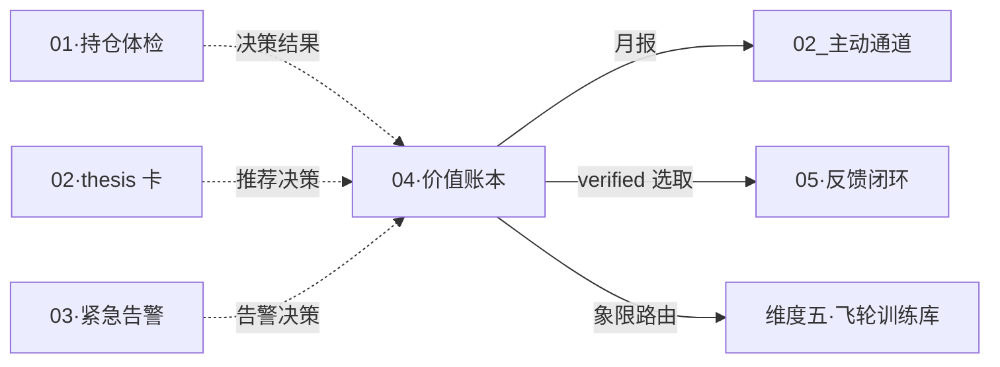

# 维度零·子模块 04·价值账本

> [!NOTE] **[TRACEBACK]**
> - **维度概览**: [../README.md](../README.md)
> - **核心规约**: [../03_价值账本与决策日志.md](../03_价值账本与决策日志.md)（本子模块的实现细节）
> - **承接 L1 哲学基石**: ④八象限 + ①价值三角 + ⑨演进
> - **消费的后端**: 所有 5 维度的事件 + 用户决策日志

## 一、子模块定位

| 项 | 内容 |
|---|---|
| **一句话定位** | 把每条系统建议 + 用户操作 + 后续结果转化为"SCS（系统能力分）+ EV（经济价值）"双轨账本 |
| **优先级** | **P0**（让用户能验证"系统值不值"）|
| **使用频率** | 用户每月初看 1 次月报（10 min）+ 周末复盘看周报（5 min）|
| **L1 承接** | 基石④八象限（决策正确性归因）+ 基石①价值三角（先看安全后看收益）+ 基石⑨演进（学习反馈）|
| **核心价值** | 5 句话价值证明 + 自我熔断（连续坏指标建议暂停）|

> **本文档不重复 [03_价值账本与决策日志.md](../03_价值账本与决策日志.md) 的算法细节**，仅作为子模块产品规约。算法细节看 03_。

## 二、用户感知层

### 2.1 Web 首页核心面板

```
┌──────────────────────────────────────────────────────┐
│ 价值账本 · 2026-06 月度                              │
├──────────────────────────────────────────────────────┤
│ ┃ 系统能力分 SCS: 72/100 (强)  ↑ +8 vs 上月         │
│ ┃ 连续 6 月 ≥ 60 → 健康                              │
│                                                      │
│ ┃ 经济价值 EV: +¥4350                                │
│ ┃   ├─ 避雷价值 DV: +¥2800 (来自 F 象限)             │
│ ┃   └─ 收益价值 OV: +¥1550 (来自 A 象限)             │
│                                                      │
│ ┃ 本月象限分布:                                       │
│ ┃   A·完美:    ████ 4   F·避雷: ███ 3                │
│ ┃   C·等待:    ██   2   D·早期: █   1                │
│ ┃   G·窗口失败: █  1    H·真失败: 0                  │
│ ┃                                                    │
│ ┃ 价值三角达成度: 安全 ✅ / 确定 ✅ / 收益 ✅         │
└──────────────────────────────────────────────────────┘
```

### 2.2 单决策详情下钻

```
点击任意决策 → 详情页:
  D-2026-0612-001 · AAA · 维度二推荐
    - 建议时间: 2026-06-12 08:00
    - 用户操作: taken (¥3 万)
    - T+30 归因: E·正常波动 / SCS ±0
    - T+60 归因: C·正常等待 → A 趋近
    - T+90 归因: A·完美决策 / SCS +100 / EV +¥10500
    - 逻辑链状态时序图
    - 入库去向: A 象限 → gold_library (维度五 SFT 强化)
```

### 2.3 决策列表过滤

| 过滤维度 | 用途 |
|---|---|
| 按象限（A/B/.../H）| 看本月哪些决策类型多 |
| 按战场（短/主/中/长）| 看战场分布 |
| 按来源维度（一/二/三/四）| 看哪个维度贡献多 |
| 按时点（T+30/60/90/180）| 看不同时点的归因 |

## 三、5 句话价值证明（产品核心）

> 严格继承 [06_全局价值投递主线设计.md §六](../06_全局价值投递主线设计.md#六价值证明的最小信任单元)。

```
1️⃣  本月系统能力分（SCS）: 72/100 → 强（连续 6 月 ≥ 60）
2️⃣  本月做了 12 个决策: A+F 占比 58%（完美 + 避雷）
3️⃣  经济价值（EV）: +¥4350（避雷 ¥2800 + 收益 ¥1550）
4️⃣  价值三角达成度: 安全 ✅ / 确定 ✅ / 收益 ✅
5️⃣  系统的诚实建议: 继续使用（无停用信号）
```

## 四、月报 PDF（5-8 页）

> 严格继承 [02_主动通道设计.md §五](../02_主动通道设计.md) 的 PDF 内容规约。

| 页 | 内容 |
|---|---|
| 封面 | 价值证明月报 |
| P.1 | 5 句话价值证明 + 一图汇总 |
| P.2 | 决策日志（Top 10 高 SCS + Top 5 G/H 案例）|
| P.3 | 4 维度健康检查（A+F 占比 / B / H / G）|
| P.4 | 飞轮训练贡献（维度五入库统计）|
| P.5 | vs 沪深 300 对比 |
| P.6 | 下月建议（含调仓矩阵建议）|
| P.7 | 诚实建议（含自我熔断信号）|

## 五、自我熔断机制

| 触发 | 系统响应 |
|---|---|
| SCS < 30 连续 2 月 | 月报封面弹"暂停建议"+ 邮件 |
| H 象限占比 > 20% | 紧急邮件"系统能力受损" |
| B 象限占比 > 30% | 紧急邮件"在赌庄家行为，立刻暂停" |
| EV / 累计成本 < 1 (使用 3 月后) | 月报建议"重新评估价值" |

## 六、数据接入契约

### 6.1 写入路径

| 触发 | 写入对象 |
|---|---|
| 任何后端事件流推送 | decision_log（建议入库）|
| 用户在 Web 上点【已执行】 | decision_log.user_action |
| 用户在 Web 上点【已忽略】 | decision_log.user_action |
| 维度三逻辑链节点状态变化 | decision_log.attribution_tXX（归因引擎触发）|
| 价格数据 T+30/60/90/180 抓取 | decision_log.attribution_tXX |

### 6.2 归因调度

```python
# 决策日志归因调度器（每分钟扫描）
def attribution_scheduler():
    for decision in pending_attributions():
        for offset in [30, 60, 90, 180]:
            if (today - decision.timestamp).days >= offset \
               and not decision.has_attribution(offset):
                attribution = attribute_decision(decision, offset)
                save_attribution(decision, offset, attribution)
                
                # 按象限路由（基石⑨）
                if attribution.quadrant in ["A", "F"]:
                    route_to_gold_library(decision)
                elif attribution.quadrant == "H":
                    route_to_failure_library_for_dpo(decision)
                elif attribution.quadrant == "G":
                    route_to_window_calibration_library(decision)
                # ...
```

## 七、3 阶段演进

| 阶段 | 实现范围 |
|---|---|
| **阶段 1·启动期** | SCS + EV 双指标 + 8 象限归因 + 月报 PDF + 自我熔断 |
| **阶段 2·扩展期** | + 战场分配饼图 + 调仓矩阵建议历史 + 决策日志按战场过滤 |
| **阶段 3·完善期** | + 自动驾驶仓位 vs 手动仓位的对比账本 + 跨季度趋势对比 |

## 八、SLO 与可用性

| SLO | 目标 |
|---|---|
| 决策日志写入延迟 | < 500ms |
| T+30 归因延迟 | ≤ 1 小时 |
| 月报生成（月 1 日 06:00 前）| 100% |
| Web 首页 SCS/EV 实时刷新 | < 1 秒 |
| 决策日志可追溯（任意决策点 ID）| 100% |

## 九、与 L1 9 块基石的双向映射

| 基石 | 在本模块的体现 |
|---|---|
| ① 价值三角 | 价值三角达成度雷达图 |
| ④ 八象限 | 8 象限分布柱状图 + 单决策象限定位 |
| ⑥ 进攻 | 推荐采纳率 + 平均回报指标 |
| ⑤ 防御 | 避雷价值 DV (F 象限聚合) |
| ⑨ 演进 | 飞轮训练贡献页（按象限路由数）|

## 十、关键技术选型

| 项 | 选型 | 理由 |
|---|---|---|
| 存储 | SQLite (decision_log) | 本地数据量小（年 ≤ 10000 条）|
| 归因调度 | APScheduler（Python）| 简单 cron 触发 |
| 月报 PDF | WeasyPrint + Chart.js → 图嵌入 | 复用 Web 模板 |
| 图表 | Chart.js | 轻量、移动端友好 |

## 十一、与其他子模块的关系



## 十二、一致性检查

| 检查项 | 状态 |
|---|---|
| 与 03_价值账本与决策日志.md 算法严格一致 | ✅ |
| 5 句话价值证明字段齐全 | ✅ |
| 自我熔断 4 个触发条件齐全 | ✅ |
| T+30/60/90/180 归因调度齐全 | ✅ |
| 承接 L1 基石④①⑨ | ✅ |
| 决策日志可追溯（按决策 ID） | ✅ |

---

## 修订记录

| 日期 | 触发 | 内容 |
|---|---|---|
| 2026-05-15 | 补全维度零 modules/ 缺失文档 | 新建本子模块规约（产品视角，算法细节引用 03_）|
