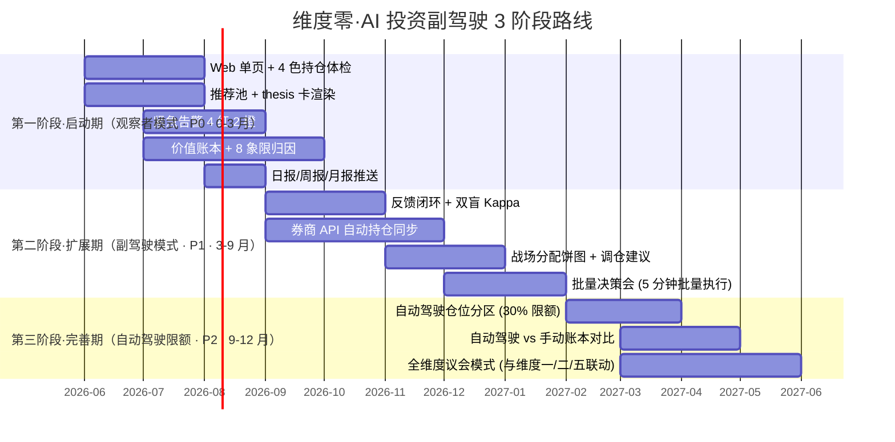

# 维度零·阶段切片视图

> [!NOTE] **[TRACEBACK]**
> - **维度概览**: [../README.md](../README.md)
> - **价值主线（俯视图）**: [../00_维度目标与产品价值主线.md](../00_维度目标与产品价值主线.md)
> - **产品形态（俯视图）**: [../01_产品形态与用户体验全景.md](../01_产品形态与用户体验全景.md)
> - **全局价值投递主线**: [../06_全局价值投递主线设计.md](../06_全局价值投递主线设计.md)

## 一、为什么有这一层

维度零含 5 个子模块（持仓体检、推荐池、紧急告警、价值账本、反馈闭环），每个子模块自身又有 3 阶段进化路径——容易"按子模块看清单个模块、却看不见全维度某一阶段的产品全景"。

**本目录回答 4 个问题**：
1. 第一阶段（0-3 月）做哪些子模块？产品最终长什么样？用户能得到什么价值？
2. 第二阶段（3-9 月）新增哪些子模块能力？已有模块扩展什么？
3. 第三阶段（9-12 月）做什么？什么时候开启自动驾驶？
4. 阶段之间的"通关条件"是什么？

## 二、3 阶段时间轴

## 三、跨阶段子模块追踪表（最关键的一张表）

> 横看各子模块的"全生命周期演化"；竖看各阶段的"全模块全貌"。

| # | 子模块 | 第一阶段·启动期 | 第二阶段·扩展期 | 第三阶段·完善期 |
|---|---|---|---|---|
| 1 | **持仓体检报告** | Web 首屏 4 色卡片 + 单持仓详情 | + 自动从券商 API 同步 + 90 天历史曲线 | + 自动驾驶仓位分区显示 + 战场饼图 |
| 2 | **推荐池与 thesis 卡** | Web 推荐池 + 单 thesis 卡详情 + 3 操作 | + 候选池横向比较 + 历史回测可视化 | + 自动驾驶下单草稿 |
| 3 | **紧急告警系统** | 4 红 + 2 橙 + 微信/Telegram/邮件 | + 静默时段配置 + 上下文丰富 | + 电话告警 + 自动执行联动 |
| 4 | **价值账本** | SCS + EV 双指标 + 8 象限 + 月报 PDF | + 战场饼图 + 调仓矩阵历史 | + 自动 vs 手动账本对比 |
| 5 | **反馈闭环** | — | 周末 verified + DPO 推送维度五 + 双盲 Kappa | + 自动驾驶决策的 verified |

## 四、跨阶段哲学基石激活追踪表

> 严格对齐 [06_全局价值投递主线设计.md §四](../06_全局价值投递主线设计.md#四3-阶段演进--哲学基石激活节奏)。

| L1 基石 | 第一阶段·启动期 | 第二阶段·扩展期 | 第三阶段·完善期 |
|---|---|---|---|
| ① 价值三角 | 完整激活（Web 首屏 + 月报）| 维持 | 进化（用户开始让 AI 接管更多本金）|
| ② 工程化 | 完整激活（thesis 5 必填）| 维持 | 维持 |
| ③ 时间边界 | 基础激活（thesis 显式战场）| 完整激活（战场分配审计触发） | 维持 |
| ④ 八象限 | 完整激活（决策日志归因）| 维持 | 维持 |
| ⑤ 防御 | 完整激活（10 暴雷引擎）| 维持 | 维持 |
| ⑥ 进攻 | 核心激活（推荐池 + 5 必填）| 维持 | 维持 |
| ⑦ 持仓监控 | 核心激活（健康度 + 节点 4 态）| 完整激活（7.6-7.9 全功能上线） | 限额自动执行 |
| ⑧ 卖出决策 | 基础激活（4 类卖出建议）| 完整激活（4 类协议 + 卖飞豁免） | 限额自动执行 |
| ⑨ 演进 | 基础激活（首次 LoRA 训练）| 强化激活（象限路由 + 月度 SCS）| 维持 |

## 五、跨阶段数据/契约依赖追踪表

| # | 依赖项 | 第一阶段 | 第二阶段 | 第三阶段 |
|---|---|---|---|---|
| 1 | 维度一 reject/degrade 事件流 | 实时消费 | 实时消费 | 实时消费 |
| 2 | 维度二 thesis_proposed 事件流 | 实时消费 | 实时消费 | + 用于自动下单草稿 |
| 3 | 维度三 health_change 事件流 | 实时消费 | + rebalance_advice | + 限额内自动执行 |
| 4 | 维度四 sell_signal 事件流 | 实时消费 | 实时消费 | + 限额内自动执行 |
| 5 | 维度五 lora_updated 事件流 | 实时消费 | + 月度趋势分析 | 维持 |
| 6 | 用户持仓数据 | 手动维护（Web 维护页）| **自动同步（券商 API）** | 维持 |
| 7 | 用户 verified 数据 | — | 启动 verified 流程 | 含自动驾驶决策 verified |
| 8 | 价格行情数据 | T+0 收盘价（每日 1 次抓取）| T+0 实时（盘中 5 分钟刷新）| 维持 |
| 9 | 告警通道 | 微信 + Telegram + 邮件 | + 静默时段调度 | + 电话（仅自动驾驶异常）|

## 六、阶段之间的"通关条件"

| 通关 | 通关条件 | 阻断条件 |
|---|---|---|
| 第一阶段 → 第二阶段 | (1) 5 子模块（不含反馈闭环）全部 SLO 达标连续 4 周 (2) 月度 SCS ≥ 60 连续 2 月 (3) 用户连续 12 周持续使用不放弃 (4) 月度避险价值 ≥ ¥3000 (5) 不漏 1 个紧急告警（5 分钟到达率 ≥ 99.5%） | 任一 SLO 退化 > 20% / SCS < 30 连续 2 月 / 用户主动暂停使用 |
| 第二阶段 → 第三阶段 | (1) 反馈闭环 + 券商 API 同步上线 (2) 双盲 Kappa ≥ 0.85 连续 1 季度 (3) 副驾驶批量决策会 ≤ 5 分钟（用户验证）(4) 副驾驶建议接受率 ≥ 50% (5) 月度收益价值 ≥ ¥2000 | Kappa < 0.85 / 用户接受率 < 30% / 副驾驶批量决策会 > 10 分钟 |
| 第三阶段 → 议会模式 | (1) 自动驾驶 30% 仓位跑赢手动 70% 仓位 ≥ 1 季度 (2) 总价值（避险+收益）/ 年 ≥ ¥10 万 (3) 全维度议会模式跑通（与维度一/二/五联动）| 自动驾驶跑输手动 / Holdout 退化 |

## 七、文件索引

| 阶段 | 子目录 | 主要文件 |
|---|---|---|
| 第一阶段·启动期 | [stage_1_启动期/](./stage_1_启动期/) | README + 01_本阶段产品模块清单 + 02_数据接入与契约清单 + 03_用户场景与价值验证 |
| 第二阶段·扩展期 | [stage_2_扩展期/](./stage_2_扩展期/) | 同上 |
| 第三阶段·完善期 | [stage_3_完善期/](./stage_3_完善期/) | 同上 |

## 八、双视角入口

- **按阶段切**（你正在看）：`stages/` —— 适合"我现在在哪个阶段、要建什么、用户得到什么"
- **按产品子模块切**：`product_modules/` —— 适合"这个产品功能子模块的全生命周期是什么"

---

## 修订记录

| 日期 | 触发 | 内容 |
|---|---|---|
| 2026-05-15 | 补全维度零 stages/ 缺失文档 | 新建 stages 总览，对齐维度一模板 + 维度零产品骨架特性 |
