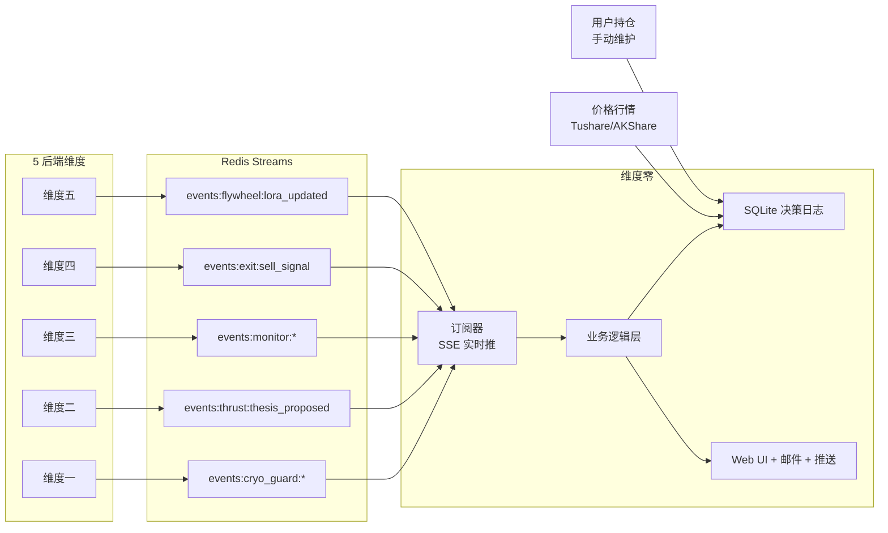
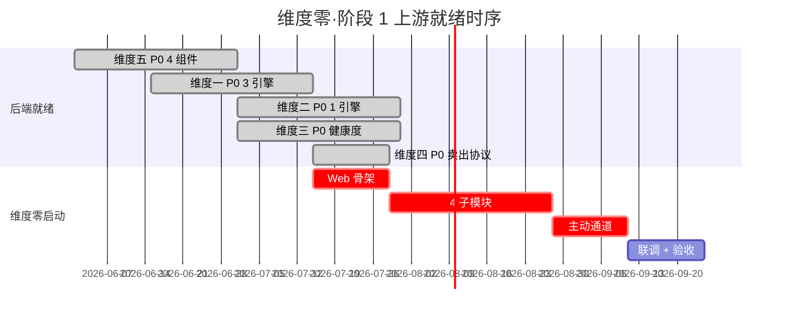

# 维度零·第一阶段·本阶段数据接入与契约清单

> [!NOTE] **[TRACEBACK]**
> - **阶段速览**: [README.md](./README.md)
> - **本阶段配套**: [01_本阶段产品模块清单.md](./01_本阶段产品模块清单.md) | [03_本阶段用户场景与价值验证.md](./03_本阶段用户场景与价值验证.md)
> - **后端契约总览**: [../../04_与5维度后端的契约.md](../../04_与5维度后端的契约.md)

## 一、本阶段数据接入全景



## 二、Redis Stream 订阅清单

| Stream | 阶段 1 用途 | 消费频率 | 关键字段 |
|---|---|---|---|
| `events:cryo_guard:reject` | 持仓体检 + 紧急告警 + 决策日志 | 实时（事件驱动）| symbol, reject_type, severity, push_level, is_in_holdings, current_position_value |
| `events:cryo_guard:degrade` | 持仓体检（橙色）| 实时 | symbol, degrade_reasons, push_level |
| `events:cryo_guard:pass` | 仅记录到决策日志（不主动推送）| 实时 | symbol, defense_score |
| `events:thrust:thesis_proposed` | 推荐池渲染 + 周报 PDF | 实时 | thesis_card_id, 5 必填元素, confidence/payoff/win_rate |
| `events:monitor:health_change` | 持仓体检 4 色更新 + 紧急告警 | 实时（节点状态变化时）| thesis_card_id, previous_health, current_health, health_level, changed_nodes, push_level |
| `events:monitor:rebalance_advice` | 仅记录到决策日志（阶段 1 不在 UI 突出，阶段 2 启用）| 实时 | matrix_cell, action, suggested_ratio |
| `events:exit:sell_signal` | 紧急告警 + 决策日志 | 实时 | sell_type, recommendation, sell_fly_immunity |
| `events:flywheel:lora_updated` | 月报飞轮进展页 | 月度 | engine_name, new_version, holdout_metrics |

> 完整 schema 见 [04_与5维度后端的契约.md](../../04_与5维度后端的契约.md)。

## 三、外部数据接入

### 3.1 价格行情数据

| 项 | 详细 |
|---|---|
| **数据源** | Tushare（主）+ AKShare（备）|
| **抓取频率** | 每日 17:00 后抓取当日收盘价 |
| **覆盖范围** | A 股全市场（用于推荐池 + 价值账本归因）|
| **存储** | PG 表 `price_daily`（同维度五数据湖共用）|
| **就绪条件** | Tushare/AKShare API token 配置 + 抓取调度器跑通 |

### 3.2 用户持仓数据

| 项 | 详细 |
|---|---|
| **维护方式** | **手动**（Web 维护页 + Excel 导入工具）|
| **不做的** | 阶段 1 不接券商 API（→ 阶段 2）|
| **字段** | symbol, name, position_value, cost_basis, buy_date, thesis_card_id_associated, current_share_count |
| **更新频率** | 用户操作触发（买入/卖出后手动更新）|
| **就绪条件** | 维护页（10 行 HTML 表单）+ Excel 导入工具就绪 |

### 3.3 用户偏好配置

| 项 | 详细 |
|---|---|
| **存储** | SQLite `user_preferences` 表 |
| **关键配置** | 通知偏好（日报开关 / 静默时段）/ 通道（微信 webhook / Telegram bot token / 邮件）/ 告警阈值 |
| **默认值** | 全开启；红色阈值"默认推荐" |

## 四、内部数据契约

### 4.1 决策日志表（核心）

```sql
CREATE TABLE decision_log (
    -- 基础字段
    decision_id TEXT PRIMARY KEY,
    timestamp DATETIME NOT NULL,
    source_engine TEXT NOT NULL,
    suggestion_type TEXT NOT NULL,
    target_symbol TEXT NOT NULL,
    target_name TEXT NOT NULL,
    suggestion_summary TEXT,
    
    -- 哲学维度（基石②工程化）
    cognitive_boundary_check BOOLEAN,
    thesis_card_id TEXT,
    logic_chain_nodes TEXT,  -- JSON array
    expected_window_days INTEGER,
    expected_minimum_return REAL,
    
    -- 用户操作
    user_action TEXT,  -- taken / ignored / modified / pending / not_applicable
    user_action_time DATETIME,
    user_position_size REAL,
    user_modification TEXT,
    
    -- 4 时点归因（基石④八象限）
    attribution_t30 TEXT,  -- JSON
    attribution_t60 TEXT,
    attribution_t90 TEXT,
    attribution_t180 TEXT,
    
    -- 失败判定
    is_failed BOOLEAN,
    failure_reason TEXT,
    
    -- 飞轮反馈（基石⑨）
    routed_to TEXT,
    user_verified_correct BOOLEAN,  -- 阶段 1 不启用，阶段 2 启动
    user_verified_comment TEXT
);

CREATE INDEX idx_decision_timestamp ON decision_log(timestamp);
CREATE INDEX idx_decision_symbol ON decision_log(target_symbol);
CREATE INDEX idx_decision_thesis ON decision_log(thesis_card_id);
```

### 4.2 用户持仓表

```sql
CREATE TABLE user_holdings (
    holding_id TEXT PRIMARY KEY,
    symbol TEXT NOT NULL,
    name TEXT NOT NULL,
    position_value REAL NOT NULL,
    cost_basis REAL NOT NULL,
    buy_date DATE NOT NULL,
    current_share_count INTEGER,
    thesis_card_id_associated TEXT,
    battlefield TEXT,  -- short/main/mid/long
    status TEXT  -- active / sold / partial
);
```

### 4.3 告警日志表

```sql
CREATE TABLE alert_log (
    alert_id TEXT PRIMARY KEY,
    timestamp DATETIME NOT NULL,
    color TEXT NOT NULL,  -- red / orange / yellow
    source_stream TEXT NOT NULL,
    push_level TEXT NOT NULL,
    target_symbol TEXT,
    title TEXT,
    body TEXT,
    channels TEXT,  -- JSON: [wechat, telegram, email]
    delivery_status TEXT,  -- pending / delivered / failed
    delivery_time DATETIME,
    user_acknowledged BOOLEAN,
    user_action TEXT  -- viewed / postponed / executed
);
```

## 五、就绪检查清单

| 项 | 就绪标志 | 检查方式 |
|---|---|---|
| Redis Streams（5 后端事件流） | 维度一/二/三/四/五 P0 全部跑通 + Stream 配置就绪 | `redis-cli XINFO STREAM events:cryo_guard:reject` 返回正常 |
| 维度一 reject 事件可触达维度零 | 模拟推送 → 微信收到 | 端到端 5 分钟内收到 |
| 维度二 thesis 5 必填元素 schema | thesis_proposed 事件含全部 5 必填字段 | JSON schema 校验通过 |
| 维度三逻辑链节点状态 API | 节点 4 态可查 | API 响应 < 1s |
| 价格行情抓取 | 每日 17:00 后 PG 表 `price_daily` 含当日 | SQL 检查行数 |
| 用户持仓维护页 | Web 表单可增删改 + Excel 导入 | 手动测试 5 条数据 |
| SQLite 决策日志表 | 表结构就绪 + 索引创建 | `.schema decision_log` |
| 推送通道（微信 + Telegram + 邮件）| 三通道分别发送测试消息成功 | 模拟红色告警端到端 |
| Tushare/AKShare API token | 抓取脚本能成功获取 1 个标的的价格 | 命令行测试 |
| WeasyPrint PDF 生成 | 月报模板渲染为 PDF 成功 | 测试模板渲染 |

## 六、数据质量与治理

| 项 | 规则 |
|---|---|
| **决策日志写入延迟** | < 500ms（同步写入 SQLite） |
| **trace_id 全链路保留** | 任一事件可从后端追到 Web 显示 |
| **数据隔离** | 决策日志在 SQLite（本地）；事件流在 Redis（与维度五共用基础设施）|
| **备份策略** | SQLite 每日 03:00 自动备份到 PG 备份库 + 每周一次远程归档 |
| **隐私** | 用户密码 / API token 加密存储（不进 git） |
| **审计** | 用户的每次操作（点击、修改、verified）入审计日志 |

## 七、本阶段不接入的数据/事件

| 不做 | 理由 |
|---|---|
| ❌ 券商 API 自动持仓同步 | → 阶段 2（先用手动维护降低复杂度） |
| ❌ 实时盘中行情 | → 阶段 2（先用 T+0 收盘价） |
| ❌ 用户 verified 反馈 → 维度五 | → 阶段 2（反馈闭环子模块开启时启用） |
| ❌ 双盲 Kappa 标定数据 | → 阶段 2 |

## 八、与维度一/二/三/四/五的依赖时序



---

## 修订记录

| 日期 | 触发 | 内容 |
|---|---|---|
| 2026-05-15 | 补全维度零 stages 文档 | 新建第一阶段数据接入与契约清单 |
