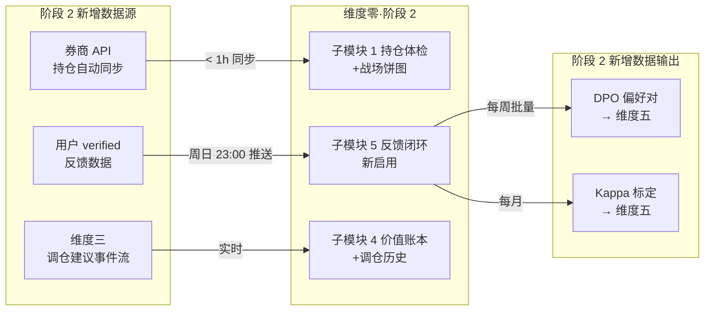

# 维度零·第二阶段·本阶段数据接入与契约清单

> [!NOTE] **[TRACEBACK]**
> - **阶段速览**: [README.md](./README.md)
> - **本阶段配套**: [01_本阶段产品模块清单.md](./01_本阶段产品模块清单.md) | [03_本阶段用户场景与价值验证.md](./03_本阶段用户场景与价值验证.md)
> - **承接阶段 1**: [../stage_1_启动期/02_本阶段数据接入与契约清单.md](../stage_1_启动期/02_本阶段数据接入与契约清单.md)

## 一、本阶段数据接入新增全景



## 二、新增 Stream 订阅

| Stream | 阶段 2 用途 | 关键字段（新增）|
|---|---|---|
| `events:monitor:rebalance_advice` | Web 突出显示调仓建议 + 价值账本调仓历史 | matrix_cell, action, suggested_ratio, reason |
| `events:monitor:battlefield_audit` | 月度战场分配饼图 + 月报 | distribution, healthy, alerts, gain_vault |

> 完整 schema 见 [04_与5维度后端的契约.md §四](../../04_与5维度后端的契约.md#四维度三--维度零监控调仓事件)。

## 三、新增数据源：券商 API 持仓同步

### 3.1 接入选型

| 项 | 选型 | 理由 |
|---|---|---|
| 接入方式 | 个人版券商 API（如华泰、东财、广发开放的查询接口）| 阶段 2 仅查询，不下单 |
| 同步频率 | 每 1 小时（盘中 + 盘后）| < 1h SLO |
| 数据格式 | JSON（券商标准）| 通过 adapter 层转换为内部 schema |
| 失败处理 | 单次失败重试 3 次；连续失败 1h → 邮件告警 + 回退到手动维护 |

### 3.2 同步 schema

```python
@dataclass
class BrokerSyncedHolding:
    sync_time: datetime
    broker_name: str
    account_id: str  # 加密
    symbol: str
    name: str
    share_count: int
    avg_cost_basis: float
    current_price: float
    market_value: float
    profit_loss: float
    profit_loss_pct: float
    # 与现有 user_holdings 表合并，保留 thesis_card_id_associated
```

### 3.3 同步冲突处理

```
冲突场景: 用户手动维护的 thesis_card_id 与同步数据匹配不上
处理:
  1. 优先保留手动数据 (用户对 thesis 关联有最终解释权)
  2. 标记为"待用户确认关联"
  3. Web 上弹出"以下标的同步发现新持仓, 请关联 thesis"
```

## 四、新增数据源：用户 verified 数据

### 4.1 verified 数据采集

| 项 | 详细 |
|---|---|
| 采集方式 | Web 周末 verified 面板 + 紧急告警 24h 内即时 verified |
| 数据格式 | JSON（decision_id + verified_type + comment）|
| 存储 | SQLite `verified_log` 表 |
| 推送频率 | 周日 23:00 批量推送维度五 + 每月 1 日 Kappa 计算 |

### 4.2 verified 数据 schema

```sql
CREATE TABLE verified_log (
    verified_id TEXT PRIMARY KEY,
    decision_id TEXT NOT NULL,  -- 关联 decision_log
    verified_time DATETIME NOT NULL,
    verified_type TEXT NOT NULL,  -- agree / disagree / partial / blind_label
    user_label TEXT,  -- (双盲) 用户独立的判断标签
    user_comment TEXT,
    routed_to TEXT,  -- gold_library / failure_library_for_dpo / kappa_calibration_pool
    FOREIGN KEY (decision_id) REFERENCES decision_log(decision_id)
);
```

### 4.3 双盲 Kappa 数据 schema

```sql
CREATE TABLE double_blind_labels (
    blind_id TEXT PRIMARY KEY,
    decision_id TEXT NOT NULL,
    sample_time DATETIME NOT NULL,
    user_label TEXT,  -- 用户独立标注 (系统未显示结论时)
    system_label TEXT,  -- 系统原结论
    revealed_at DATETIME,
    is_consistent BOOLEAN,
    period_id TEXT,  -- 第几期标定
    FOREIGN KEY (decision_id) REFERENCES decision_log(decision_id)
);
```

## 五、新增数据输出：DPO 偏好对到维度五

### 5.1 推送 schema

```yaml
# 周日 23:00 批量推送
DPOPreferencePairs:
  batch_id: str
  generated_at: datetime
  source: maintenance_zero_feedback
  pairs:
    - chosen: text          # 用户认可的结论
      rejected: text        # 系统结论（用户不认可时）
      decision_id: str
      verified_type: enum   # disagree / partial
      reason: str
      thesis_card_id: str
      symbol: str
```

### 5.2 推送 SLO

| SLO | 目标 |
|---|---|
| 周日 23:00 推送准时率 | 100% |
| 单周推送量 | 5-50 条（视用户 verified 活跃度）|
| 推送失败重试 | 3 次，失败 → 邮件告警 |

## 六、新增 SQLite 表

### 6.1 调仓建议历史表

```sql
CREATE TABLE rebalance_advice_log (
    advice_id TEXT PRIMARY KEY,
    advice_time DATETIME NOT NULL,
    thesis_card_id TEXT,
    symbol TEXT NOT NULL,
    matrix_cell TEXT NOT NULL,  -- strong_high / weakening_on_target / ...
    action TEXT NOT NULL,  -- hold_or_add / partial_take_profit / ...
    suggested_ratio REAL,
    reason TEXT,
    user_accepted BOOLEAN,
    user_action_ratio REAL,  -- 实际操作比例
    t30_outcome TEXT,  -- T+30 命中评估
    is_hit BOOLEAN
);
```

### 6.2 战场审计历史表

```sql
CREATE TABLE battlefield_audit_log (
    audit_id TEXT PRIMARY KEY,
    audit_date DATE NOT NULL,
    short_ratio REAL,
    main_ratio REAL,
    mid_ratio REAL,
    long_ratio REAL,
    healthy BOOLEAN,
    alerts TEXT,  -- JSON
    gain_vault_value REAL,
    gain_vault_status TEXT
);
```

### 6.3 用户偏好配置扩展

```sql
ALTER TABLE user_preferences ADD COLUMN silent_period_config TEXT;  -- JSON
ALTER TABLE user_preferences ADD COLUMN broker_api_config TEXT;  -- JSON (encrypted)
```

## 七、新增数据治理规则

| 项 | 规则 |
|---|---|
| **券商 API 凭证** | 加密存储 + 不进 git + 失败时自动撤销凭证刷新 |
| **verified 数据保留期** | 永久（用于飞轮训练）|
| **双盲数据隔离** | 标定中的数据不进任何业务查询（防止结论泄露）|
| **Kappa 月度计算** | 每月 1 日 04:00 自动计算 + 写入 calibration_history 表 |
| **调仓建议命中率** | T+30 后自动计算 + 月报展示 |

## 八、就绪检查清单（阶段 2 新增）

| 项 | 就绪标志 |
|---|---|
| 券商 API 接入 | 测试同步 10 个标的 < 1h 完成 + 失败重试机制 |
| `events:monitor:rebalance_advice` 订阅 | 模拟事件触发 → 价值账本调仓历史可见 |
| `events:monitor:battlefield_audit` 订阅 | 月度审计事件 → 战场饼图渲染 |
| verified 面板 | Web 表单功能 + 数据进 verified_log |
| 双盲标定面板 | 系统结论隐藏 + 用户独立标注 + Kappa 计算 |
| DPO 偏好对推送 | 周日 23:00 cron 跑通 + 维度五接收成功 |
| 调仓建议历史表 | 表结构 + 命中率统计逻辑 |
| 静默时段调度 | 测试夜间橙色合并 + 次日 9:00 推送 |

## 九、本阶段不接入的数据/事件

| 不做 | 理由 |
|---|---|
| ❌ 实时 Tick 行情 | 永不（基石⑥ 不做技术派）|
| ❌ 自动下单 API | → 阶段 3（仅自动驾驶限额）|
| ❌ 多用户共享 verified | → 阶段 3 之后 |

---

## 修订记录

| 日期 | 触发 | 内容 |
|---|---|---|
| 2026-05-15 | 补全维度零 stages 文档 | 新建第二阶段数据接入与契约清单 |
