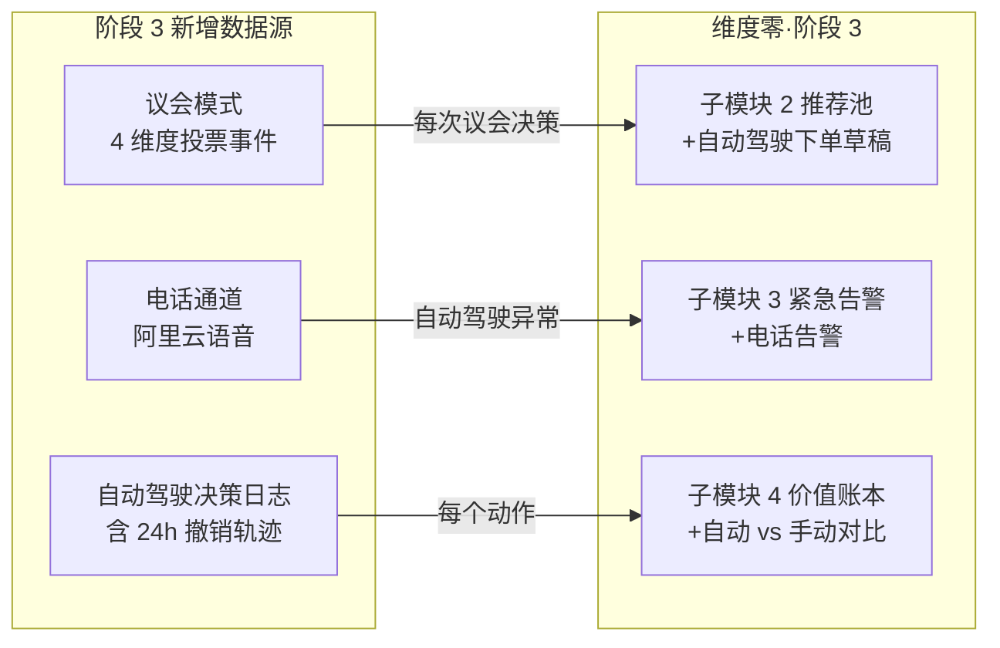

# 维度零·第三阶段·本阶段数据接入与契约清单

> [!NOTE] **[TRACEBACK]**
> - **阶段速览**: [README.md](./README.md)
> - **本阶段配套**: [01_本阶段产品模块清单.md](./01_本阶段产品模块清单.md) | [03_本阶段用户场景与价值验证.md](./03_本阶段用户场景与价值验证.md)

## 一、本阶段数据接入新增全景



## 二、新增 Stream 订阅

| Stream | 阶段 3 用途 | 关键字段 |
|---|---|---|
| `events:flywheel:lora_updated` | 议会模式投票更新（维度一/二/三/四 任一更新触发议会重新校准）| engine_name, new_version, gatekeeper_passed |
| `events:autopilot:parliament_decision` | 议会决策入决策日志 | session_id, dimension_votes, final_decision, executed |
| `events:autopilot:order_draft` | 自动驾驶下单草稿生成 | draft_id, symbol, quantity, 24h_expiry |
| `events:autopilot:order_executed` | 自动驾驶订单执行成功 | order_id, broker_confirmation, slippage |
| `events:autopilot:anomaly` | 自动驾驶仓位异常（P&L 偏差大）| anomaly_type, severity → 触发电话告警 |

## 三、新增数据源：议会模式投票

### 3.1 议会模式事件流

```yaml
ParliamentDecisionEvent:
  session_id: str
  triggered_at: datetime
  symbol: str
  proposed_action: enum            # buy | sell | hold | reduce | add
  source_engine: str
  
  # 4 维度独立投票
  dimension_votes:
    d1_defense:
      vote: enum                   # approve | reject | abstain
      confidence: float
      reasoning: str
      veto_used: bool              # 维度一可一票否决
    d2_offense:
      vote: enum
      confidence: float
      reasoning: str
    d3_monitor:
      vote: enum
      confidence: float
      reasoning: str
    d4_exit:
      vote: enum
      confidence: float
      reasoning: str
  
  # 最终决策
  final_decision: enum             # approve | reject | abstain
  decision_reason: str
  
  # 执行
  draft_generated: bool
  draft_id: str | null
```

### 3.2 议会模式 SQL 表

```sql
CREATE TABLE parliament_log (
    session_id TEXT PRIMARY KEY,
    triggered_at DATETIME NOT NULL,
    symbol TEXT NOT NULL,
    proposed_action TEXT NOT NULL,
    source_engine TEXT,
    
    -- 4 维度投票（JSON）
    d1_vote TEXT NOT NULL,
    d2_vote TEXT NOT NULL,
    d3_vote TEXT NOT NULL,
    d4_vote TEXT NOT NULL,
    
    final_decision TEXT NOT NULL,
    decision_reason TEXT,
    
    -- 执行
    draft_generated BOOLEAN,
    draft_id TEXT,
    executed BOOLEAN,
    executed_at DATETIME,
    
    -- T+30 验证
    t30_outcome TEXT,
    is_hit BOOLEAN
);

CREATE INDEX idx_parliament_symbol ON parliament_log(symbol);
CREATE INDEX idx_parliament_time ON parliament_log(triggered_at);
```

## 四、新增数据源：自动驾驶决策日志

### 4.1 自动驾驶订单草稿表

```sql
CREATE TABLE autopilot_order_draft (
    draft_id TEXT PRIMARY KEY,
    parliament_session_id TEXT NOT NULL,
    generated_at DATETIME NOT NULL,
    expiry_at DATETIME NOT NULL,     -- 24h 撤销窗口
    
    symbol TEXT NOT NULL,
    action TEXT NOT NULL,
    quantity INTEGER NOT NULL,
    estimated_value REAL,
    
    -- 限额检查
    autopilot_position_after REAL,    -- 操作后总自动驾驶仓位
    single_order_ratio REAL,           -- 单笔比例
    passes_limits BOOLEAN,
    
    -- 用户响应
    user_revoked BOOLEAN,
    user_revoke_time DATETIME,
    user_revoke_reason TEXT,
    
    -- 执行
    executed BOOLEAN,
    executed_at DATETIME,
    broker_order_id TEXT,
    actual_price REAL,
    slippage_pct REAL,
    
    FOREIGN KEY (parliament_session_id) REFERENCES parliament_log(session_id)
);
```

### 4.2 自动驾驶 vs 手动账本分区

```sql
ALTER TABLE user_holdings ADD COLUMN pilot_mode TEXT DEFAULT 'manual';
-- pilot_mode: 'manual' | 'autopilot'

ALTER TABLE decision_log ADD COLUMN pilot_mode TEXT DEFAULT 'manual';

-- 月度 SCS / EV 计算时分别聚合
CREATE VIEW monthly_pilot_comparison AS
SELECT 
    strftime('%Y-%m', d.timestamp) AS month,
    d.pilot_mode,
    COUNT(*) AS decision_count,
    AVG(json_extract(d.attribution_t30, '$.scs_contribution')) AS avg_scs,
    SUM(json_extract(d.attribution_t30, '$.ev_contribution')) AS total_ev
FROM decision_log d
WHERE d.attribution_t30 IS NOT NULL
GROUP BY month, d.pilot_mode;
```

## 五、新增数据源：电话告警通道

### 5.1 电话通道选型

| 项 | 选型 | 理由 |
|---|---|---|
| 服务商 | 阿里云语音通知 / 腾讯云 / Twilio | 国内 / 国际备份 |
| 触发条件 | 仅 4 类：自动驾驶 P&L 异常 / 自动驾驶 abstain 连续 / 议会失效 / 阶段 3 红色 4 |
| 单日上限 | ≤ 2 次 |
| 静默时段 | 用户配置（默认 22:00-08:00 不打）|
| 成本预算 | ¥100/月（按 30 次电话） |

### 5.2 电话告警 SQL 表

```sql
CREATE TABLE phone_alert_log (
    phone_alert_id TEXT PRIMARY KEY,
    alert_log_id TEXT NOT NULL,
    call_time DATETIME NOT NULL,
    call_duration_seconds INTEGER,
    user_answered BOOLEAN,
    voice_input TEXT,                -- 用户语音输入（如"是 / 否"）
    user_response TEXT,              -- 解析后的指令
    FOREIGN KEY (alert_log_id) REFERENCES alert_log(alert_id)
);
```

## 六、就绪检查清单（阶段 3 新增）

| 项 | 就绪标志 |
|---|---|
| 议会模式 4 维度 LoRA | 每个维度独立 LoRA 训练完成 + Holdout 达标 |
| Judge LLM 路由 | 集成测试通过 + 路由准确率 ≥ 0.90 |
| 议会模式投票合议 | 模拟 10 个标的，投票一致性 ≥ 75% |
| 自动驾驶订单草稿生成 | 议会通过 → 24h 内自动写入 draft 表 |
| 24h 撤销窗口 | 用户撤销 → 订单草稿状态变更 |
| 自动驾驶仓位限额检查 | 测试 30% 仓位 / 10% 单笔上限 |
| 电话通道接入 | 测试电话拨打 + 语音识别 + 用户回执 |
| 自动 vs 手动账本对比页 | 数据库 view 创建 + Web 渲染 |
| 自动驾驶启用条款 | Web 签字流程 + PG 表 `autopilot_consent` |
| 3 天观察期 | 模拟下单不真执行 + 监控逻辑 |

## 七、本阶段不接入的数据/事件

| 不做 | 理由 |
|---|---|
| ❌ 完全自动驾驶（100% 仓位）| 永不（基石⑤防御 + 保留人工最终否决权）|
| ❌ T+0 高频策略 | 永不（基石⑥ 不做技术派）|
| ❌ 衍生品（期权/期货）| 永不（认知边界外）|
| ❌ 跨市场（美股/港股）| → 远期阶段 |

## 八、数据治理升级（阶段 3）

| 项 | 规则 |
|---|---|
| **议会决策永久保留** | 用于后续审计 + 议会模式优化 |
| **自动驾驶撤销窗口审计** | 用户撤销原因永久保留 |
| **电话录音** | 不录音（隐私）；仅记录用户回执文字 |
| **自动 vs 手动严格隔离** | 不同 pilot_mode 持仓的盈亏不可混算 |
| **议会失效预警** | abstain 占比 > 50% → 紧急 review |

## 九、跨阶段数据一致性

| 项 | 阶段 1 | 阶段 2 | 阶段 3 |
|---|---|---|---|
| decision_log | SQLite | SQLite + 关联 verified_log | + pilot_mode 字段 |
| user_holdings | 手动维护 | + 券商 API 自动同步 | + pilot_mode 分区 |
| 议会决策 | — | — | parliament_log（新表）|
| 自动驾驶草稿 | — | — | autopilot_order_draft（新表）|
| 电话告警 | — | — | phone_alert_log（新表）|

---

## 修订记录

| 日期 | 触发 | 内容 |
|---|---|---|
| 2026-05-15 | 补全维度零 stages 文档 | 新建第三阶段数据接入与契约清单 |
