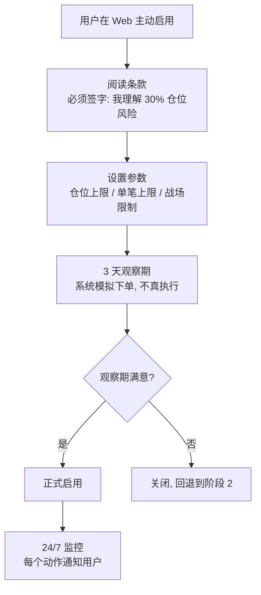
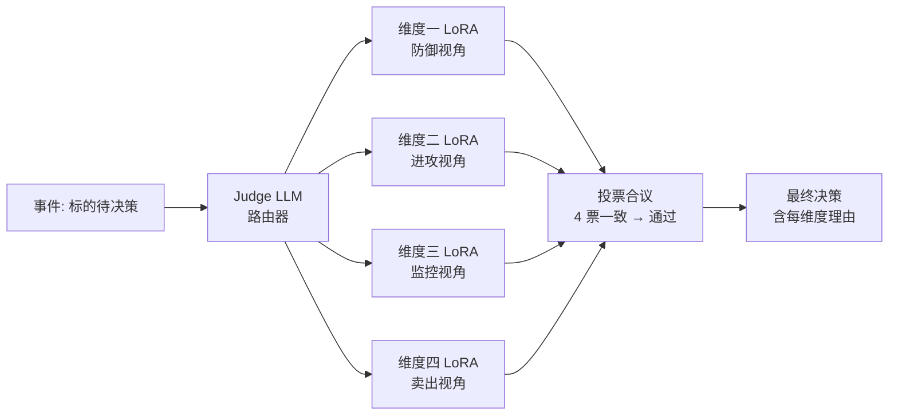

# 维度零·第三阶段（完善期 · 自动驾驶限额版 · P2）一页式速览

> [!NOTE] **[TRACEBACK]**
> - **维度概览**: [../../README.md](../../README.md)
> - **阶段总览**: [../README.md](../README.md)
> - **本阶段产品详细**: [01_本阶段产品模块清单.md](./01_本阶段产品模块清单.md)
> - **本阶段数据详细**: [02_本阶段数据接入与契约清单.md](./02_本阶段数据接入与契约清单.md)
> - **本阶段验证详细**: [03_本阶段用户场景与价值验证.md](./03_本阶段用户场景与价值验证.md)

## 一、本阶段一句话目标

**开放自动驾驶限额（30% 仓位 / 15 万）**——让 AI 24/7 在限额内自主调仓，70% 仓位仍人类决策；引入全维度议会模式（多 LoRA 投票），月度对比"自动 vs 手动"账本，证明 AI 的价值边界。

| 项 | 内容 |
|---|---|
| **时间盒** | 9–12 个月（90 天） |
| **产品模式** | 自动驾驶限额版（用户授权 30% 仓位由 AI 自主决策 + 重大动作通知）|
| **维度地位** | 与维度五 V2 演进（议会模式）+ 维度一/二/三/四的"议会节点"对接 |
| **依赖前置** | 阶段 2 全部 SLO 达标 + 双盲 Kappa ≥ 0.85 连续 3 月 + 用户主动同意启用自动驾驶 |
| **成本预算** | 同阶段 2 + 电话通道 ¥100/月（阿里云语音） |

## 二、本阶段子模块演进清单（速查表）

| # | 子模块 | 第三阶段新增能力 | 准入条件 | 验收主指标 |
|---|---|---|---|---|
| 1 | **持仓体检** | + 自动驾驶仓位分区显示（70% 手动 / 30% 自动）+ 战场饼图增强 | 阶段 2 战场饼图稳定运行 | 分区显示一致性 100% |
| 2 | **推荐池与 thesis 卡** | + 自动驾驶仓位的"建议下单草稿"（用户授权后自动执行）+ verified 闭环增强 | Kappa ≥ 0.85 + 自动驾驶授权 | 草稿生成 < 5 min |
| 3 | **紧急告警** | + 电话告警（仅自动驾驶仓位异常）+ 与自动执行联动（broken 强约束 → 缓冲期内系统询问后执行）| 电话通道接入 | 电话告警 < 3 min 接通 |
| 4 | **价值账本** | + 自动驾驶 vs 手动账本对比 + 跨季度趋势对比 + 议会模式决策追溯 | 自动驾驶上线 30 天后启用对比页 | 对比页准确率 100% |
| 5 | **反馈闭环** | + 自动驾驶决策的事后 verified（用户赞/踩）+ 多用户 Kappa 一致性（首批扩展同好用户）| 阶段 2 反馈闭环稳定 | 自动驾驶 verified 接受率 ≥ 60% |

## 三、本阶段最大变化：自动驾驶限额开关

### 3.1 启用流程



### 3.2 自动驾驶约束（硬约束）

| 项 | 约束 |
|---|---|
| **最大仓位** | 30% 总仓位（≤ 15 万） |
| **单笔上限** | 10% 自动驾驶仓位（≤ 1.5 万） |
| **战场限制** | 仅超短战场 + 主战场（中/长战场仍手动） |
| **决策依据** | 必须通过议会模式（多 LoRA 投票一致） |
| **每个动作通知** | 红色告警 → 用户 24h 内可撤销 |
| **每月对比** | 自动 vs 手动账本，自动若跑输 3 月连续 → 暂停 |

## 四、本阶段新增：全维度议会模式

### 4.1 议会模式架构



### 4.2 议会模式投票规则

```python
def parliament_decision(symbol, action):
    """议会模式 4 维度投票"""
    votes = {
        "d1_defense": d1_lora.judge(symbol, action),   # 防御视角是否允许
        "d2_offense": d2_lora.judge(symbol, action),   # 进攻视角是否同意
        "d3_monitor": d3_lora.judge(symbol, action),   # 监控视角是否健康
        "d4_exit":    d4_lora.judge(symbol, action),   # 卖出视角是否符合 4 类
    }
    
    # 一票否决（基石⑤防御）
    if votes["d1_defense"] == "reject":
        return {"decision": "reject", "reason": "维度一一票否决"}
    
    # 4 票一致才通过（最严格）
    if all(v == "approve" for v in votes.values()):
        return {"decision": "approve", "votes": votes}
    
    # 否则不执行（保守策略）
    return {"decision": "abstain", "votes": votes, "reason": "议会未达成一致"}
```

### 4.3 议会模式决策追溯

| 字段 | 来源 |
|---|---|
| parliament_session_id | 每次议会决策唯一 ID |
| dimension_votes | 4 个维度的独立判断 |
| final_decision | approve / reject / abstain |
| executed | 是否真正执行 |
| t30_outcome | T+30 验证结果 |
| 入决策日志 | 进维度零 decision_log |

## 五、本阶段进入"完整稳定运行"的"通关条件"

✅ 必须满足全部（这是阶段 3 验收 = 项目第一个完整年度的里程碑）：
- [ ] 自动驾驶 30% 仓位跑赢手动 70% 仓位 ≥ 1 季度（≥ 5pct 年化）
- [ ] 议会模式决策一致性 ≥ 75%（4 票一致占比，否则 abstain）
- [ ] 总价值（避险 + 收益）/ 年 ≥ ¥10 万（≥ 本金 20%）
- [ ] 月度 SCS ≥ 70 连续 3 月
- [ ] 月度 A+F 占比 ≥ 60%
- [ ] 月度 H 占比 ≤ 5%
- [ ] 月度 B 占比 ≤ 15%
- [ ] 自动驾驶决策 verified 接受率 ≥ 60%
- [ ] 双盲 Kappa ≥ 0.85 连续 6 月
- [ ] 红色告警 5 分钟到达率 ≥ 99.5% 连续 12 月

❌ 阻断条件（任一触发 → 暂停自动驾驶 / 不进入下阶段）：
- 自动驾驶跑输手动 3 月连续 → 暂停自动驾驶
- 议会模式 abstain 占比 > 50% → 暂停议会模式
- 月度 SCS < 50 连续 2 月 → 暂停所有自动化
- Kappa < 0.85 → 暂停 LoRA 更新

## 六、本阶段责任与节奏自检

| 责任 | 内容 |
|---|---|
| **架构师** | 每月 1 次自动驾驶仓位 review + 每月双盲 Kappa + 每季度议会模式投票一致性审查 |
| **AI（产品实现）** | 自动驾驶交互 + 议会模式实现 + 电话告警接入 |
| **CI** | + 自动驾驶约束检查（≤ 30% 仓位 / ≤ 10% 单笔）+ 议会模式投票完整性检查 |
| **每月 1 日** | 自动 vs 手动账本对比 + 议会模式投票审查 + Kappa 趋势 |

## 七、本阶段的核心风险

| 风险 | 缓解 |
|---|---|
| 自动驾驶亏损用户本金 | 30% 硬上限 + 单笔 10% 硬上限 + 每个动作 24h 撤销窗口 + 跑输 3 月暂停 |
| 议会模式 abstain 太多 | 4 维度独立训练充分 + Judge LLM 路由优化 + 月度审查投票一致性 |
| 电话告警打扰用户 | 仅自动驾驶异常时使用 + 用户配置静默时段（夜间默认改邮件）|
| 自动驾驶 vs 手动账本失真 | 严格按持仓 ID 区分 + 不同战场不可混算 + 月报独立展示 |

## 八、文件索引

| 子文件 | 内容 |
|---|---|
| [01_本阶段产品模块清单.md](./01_本阶段产品模块清单.md) | 5 子模块升级 + 自动驾驶限额 + 议会模式 UI |
| [02_本阶段数据接入与契约清单.md](./02_本阶段数据接入与契约清单.md) | 议会模式事件流 + 电话通道 + 自动驾驶决策日志 |
| [03_本阶段用户场景与价值验证.md](./03_本阶段用户场景与价值验证.md) | 自动驾驶启用流程 + 议会模式端到端 + 跨季度账本对比 |

---

## 修订记录

| 日期 | 触发 | 内容 |
|---|---|---|
| 2026-05-15 | 补全维度零 stages 文档 | 新建第三阶段速览 |
