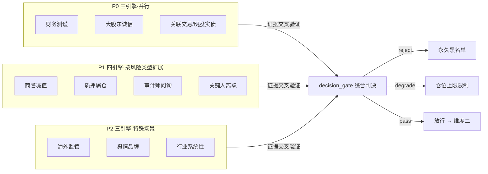

# 维度一·引擎全景与优先级

> [!NOTE] **[TRACEBACK]**
> - **维度概览**: [README](./README.md)
> - **目标边界**: [00_维度目标与能力边界](./00_维度目标与能力边界.md)
> - **数据梯次**: [02_数据依赖梯次总表](./02_数据依赖梯次总表.md)
> - **训练路径**: [03_训练与评测资产路径](./03_训练与评测资产路径.md)

> [!IMPORTANT] **本文档是"按引擎切的全景俯视图"**。如果你想看"某一阶段做哪些引擎、各引擎在该阶段实现到什么程度、需要哪些数据"，请进 [stages/](./stages/) 目录（**按阶段切的视角**）。

## 一、3 阶段切片矩阵（**新增·一眼看清各阶段全貌**）

> 横看各引擎的"全生命周期演化"；竖看各阶段的"全引擎全貌"。每个单元格用一句话概括"本阶段该引擎做到什么"。

| # | 引擎 | 第一阶段·启动期（0–3 月，P0）| 第二阶段·扩展期（3–9 月，P1） | 第三阶段·完善期（9–12 月，P2）|
|---|---|---|---|---|
| 1 | **财务测谎** | 30 案例 SFT，识别 6 类粉饰；Recall ≥ 0.95 | + DPO + 多 LoRA（金融/制造/科技/医药）；Precision ↑ 0.80 | + 议会模式（4 LoRA + Judge LLM 投票）|
| 2 | **大股东诚信** | RAG + 5 年公告比对；Recall ≥ 0.90 | + 司法/失信交叉验证 + DPO；Precision ↑ 0.80 | + 议会模式 |
| 3 | **关联交易** | 财报附注 OCR + 股权穿透；Recall ≥ 0.85 | + 隐性关联方识别 + DPO；Precision ↑ 0.78 | + 议会模式 |
| 4 | **商誉减值** | — | 全新引入：监控并购溢价、对赌履约；Recall ≥ 0.85 | + 多 LoRA 行业细分 + 议会 |
| 5 | **质押爆仓** | — | 全新引入：质押率、平仓预警线；Recall ≥ 0.90 | + 多源数据交叉 + 议会 |
| 6 | **审计师与问询** | — | 全新引入：审计师变更、问询函解析；Recall ≥ 0.88 | + LLM 解读问询/回复质量 + 议会 |
| 7 | **关键人离职** | — | 全新引入：高管离职公告 + 多源弱信号；Recall ≥ 0.80 | + 议会 |
| 8 | **海外监管** | — | — | 全新引入：SEC/FDA/欧盟；Recall ≥ 0.85 |
| 9 | **舆情品牌** | — | — | 全新引入：雪球/小红书/黑猫；Recall ≥ 0.78 |
| 10 | **行业系统性** | — | — | 全新引入：政策/反垄断/行业整治；Recall ≥ 0.80 |
| **议会模式** | — | — | — | ★ 全新引入：Judge LLM 仲裁；FN 率 ↓ 30% |
| **本阶段引擎数** | **3** | **3 升级 + 4 新增 = 7** | **7 升级 + 3 新增 + 议会 = 10 + 议会** |
| **本阶段数据增量** | D1–D6（6 类）| D7–D12（6 新增 + D5 v2）| D13–D15（3 新增 + D5 v3 + 议会数据）|
| **本阶段累计 LoRA 数** | 3 | 11（含行业细分）| 15+（含 Judge LoRA）|
| **详细文档** | [stages/stage_1_启动期/](./stages/stage_1_启动期/) | [stages/stage_2_扩展期/](./stages/stage_2_扩展期/) | [stages/stage_3_完善期/](./stages/stage_3_完善期/) |

## 二、10 引擎扩展计划（三阶段）

| 阶段 | # | 引擎名称 | 主要工作目标 | 能力边界（不做） |
|---|---|---|---|---|
| **P0** | 1 | **财务造假测谎引擎**（首引擎） | 识别存贷双高、现金流背离、研发资本化突变、应收/存货周转异动等 6 类典型粉饰手法；输出风险分（0–100）+ 触发线索 | 不做最终投资建议；不做估值判断 |
| **P0** | 2 | **大股东诚信验尸引擎** | 用 RAG 调取 5 年公开发言/承诺，与实际 CAPEX 流向、并购/减持记录交叉比对；识别"言行不一"指数 | 不做主观品德评价；不涉及未公开信息 |
| **P0** | 3 | **关联交易/明股实债识别引擎** | 通过股权穿透 + 财报附注，识别表外结构、关联方循环交易、隐藏负债 | 不做合规法律意见；仅给出风险标签 |
| **P1** | 4 | **商誉减值预警引擎** | 监控跨界并购溢价、商誉/总资产比例、被并购方业绩对赌履约率；触发减值早期预警 | 不预测减值具体金额 |
| **P1** | 5 | **质押爆仓与控制权稳定性引擎** | 监控大股东质押率、股价距平仓线、质权人纠纷诉讼 | 不做股价短期波动预测 |
| **P1** | 6 | **审计师与监管问询风险引擎** | 监控审计师变更/出具非标意见、交易所问询函密度与回复质量 | 不替代专业审计判断 |
| **P1** | 7 | **关键人离职/治理崩塌引擎** | 监控董秘/CFO/审计/独董短期内多人辞任、核心研发人员领英状态变化 | 不评判个人去留动机 |
| **P2** | 8 | **海外监管风险引擎**（中概股专用） | 扫描 SEC/FDA/欧盟监管警告、被列入观察名单、ADR 退市风险 | 仅覆盖海外上市/海外业务标的 |
| **P2** | 9 | **舆情与品牌信任崩盘引擎** | 监控雪球/小红书/微博的群体性差评、产品退坑率、维权群激增 | 不做情绪短线交易信号 |
| **P2** | 10 | **行业系统性风险引擎** | 监控政策/监管/反垄断/双减式黑天鹅，对持仓行业敞口预警 | 不预测政策本身；只在政策出后判断行业冲击 |

## 三、引擎实现优先级与排序理由

按"风险防御重要性 × 数据获取成本 × 历史防住的死局数量"综合排序：

| 排序 | 引擎 | 排序理由 |
|---|---|---|
| 1 | **财务测谎** | 防住康得新（300 亿现金造假）、康美（300 亿货币资金虚增）、瑞幸（22 亿营收造假）等死局；A 股 90% 的雷都是财务雷 |
| 2 | **关联交易/明股实债** | 防住乐视网、暴风、华谊兄弟等一系列资金腾挪型暴雷；财报附注就能看出端倪 |
| 3 | **大股东诚信** | 防住反复爽约的 CEO 类暴雷；只需要 RAG + 历史公告比对，工程门槛低 |
| 4 | **商誉减值** | 防住 2018 年商誉减值潮（创业板大量爆雷），单季计提即可吞掉 N 年利润 |
| 5 | **质押爆仓** | 防住爆仓引发的踩踏（如 2018 年民营龙头股权被强平） |
| 6 | **审计师与问询** | 审计师变更是经典领先信号（康美案审计师签字律师都被罚） |
| 7 | **关键人离职** | 解决信号弱、噪声大问题；但作为多源交叉验证依据极有价值 |
| 8 | **海外监管** | 仅覆盖少数中概/出海标的，但一旦发生影响极大（瑞幸/滴滴） |
| 9 | **舆情与品牌信任** | 数据噪声较大，需较强的 NLP 提纯；适合在飞轮成熟后引入 |
| 10 | **行业系统性风险** | 政策本身不可预测，但事后冲击的快速识别仍有价值（教培双减、地产三道红线） |

## 四、维度一引擎的协作约定

**核心约定**：
1. **任意单引擎触发 reject → 整体 reject**（一票否决）
2. **多引擎同时 degrade → 升级为 reject**（多源弱信号汇聚为强信号）
3. **所有判决写入 audit_log_service**，可被维度五的评测回放消费
4. **黑名单解除必须人工操作 + 写审计**，不允许 AI 自动解除
