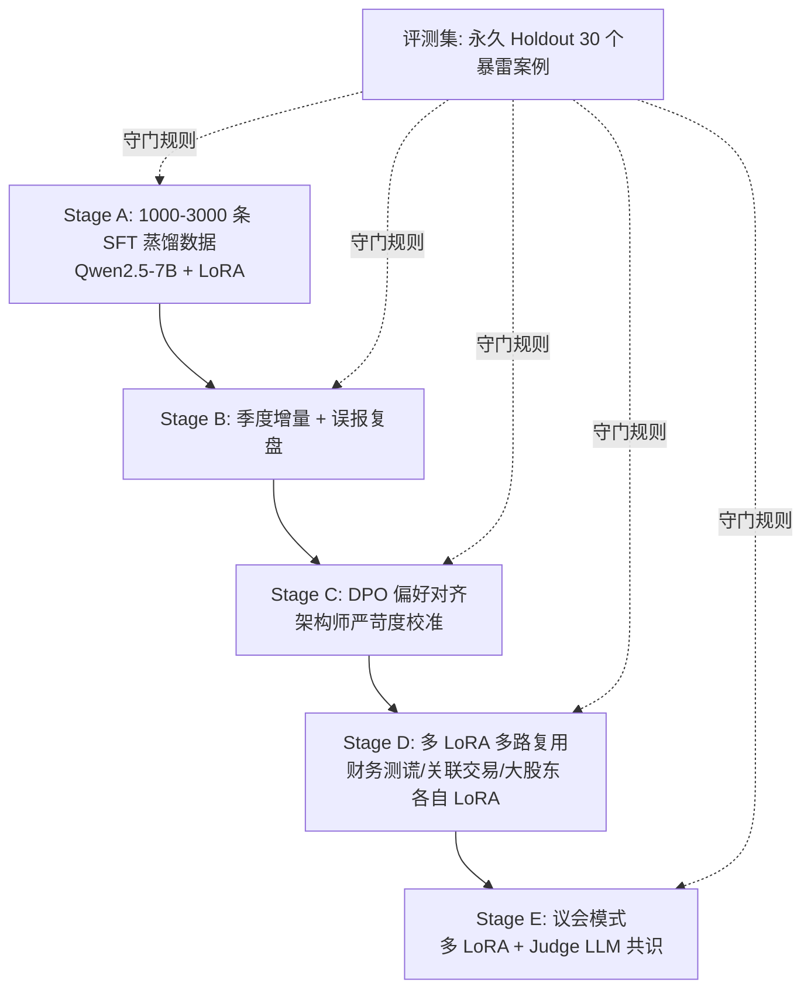

# 维度一·训练与评测资产路径

> [!NOTE] **[TRACEBACK]**
> - **维度概览**: [README](./README.md)
> - **跨维度训练范式**: [06_跨维度协作/02_5维度引擎全景与安全起步套餐](../06_跨维度协作/02_5维度引擎全景与安全起步套餐.md)

## 一、维度一通用 5 阶段训练范式

| 阶段 | 名称 | 关键动作 | 数据增量来源 | 训练方式 | 预期能力跃升 |
|---|---|---|---|---|---|
| **A** | 启动期·SFT 蒸馏 | 用 Teacher LLM（Claude 3.5 / GPT-4o）+ 30–50 个历史暴雷案例合成 1000–3000 条标注数据 | 历史暴雷案例库 + Teacher LLM 审讯式 prompt | LLaMA-Factory + LoRA 全参微调（基座 Qwen2.5-7B） | 能识别 80% 已知粉饰手法 |
| **B** | 增量·新增案例补强 | 增加近 1 年的新爆雷案例 + 误报 case 复盘 | 案例库季度增量 + 维度三/四的复盘反馈 | LoRA 增量微调（同基座） | 误报率下降，覆盖最新粉饰手法 |
| **C** | DPO·人类偏好对齐 | 收集"AI 判定 vs 真实结果"对子，用 DPO 拉齐"严苛度" | 人工 verified 偏好对（Label Studio 收集） | DPO 流水线 + 同基座 LoRA 增量 | 严苛度与架构师偏好对齐，减少漏判 |
| **D** | 多 LoRA 并行·专科细分 | 财务测谎、关联交易、大股东诚信各自独立 LoRA | 各专科训练集独立 | vLLM 多 LoRA 多路复用 | 单项准确率最大化，互不污染 |
| **E** | 议会模式·多模型投票 | 多个 LoRA 同时推理 + 投票/共识 + Judge LLM | 维度三/四的实盘数据增量 | 议会式 ensemble | 综合判决置信度提升，黑天鹅识别更准 |

## 二、首引擎（财务测谎）的"启动 → 议会"完整路径



## 三、永久 Holdout 评测集

| 项 | 内容 |
|---|---|
| **大小** | 30 个完整案例（**永久锁库，绝不进训练集**） |
| **构成** | 10 个财务造假（康得新/康美/瑞幸/...）+ 10 个关联交易/明股实债（乐视/暴风/...）+ 10 个治理崩塌（部分 ST 个股） |
| **主指标** | **召回率（Recall）≥ 0.95**——必须查出 30 个案例中至少 28 个，否则禁止上线 |
| **副指标** | **精确率（Precision）≥ 0.70**——避免误伤过多正常公司，触发产品体验差 |
| **第三指标** | **F1 ≥ 0.80** 综合平衡 |
| **守门规则** | 每次新版本上线前，**必须用 Holdout 集回放**；任意指标退化 > 5% → 自动阻断发布 |

## 四、训练数据资产组织

```
diting-data/cryo_guard/
├── case_library/                       # 历史暴雷案例库（人工 + Teacher LLM 标注）
│   ├── financial_fraud/                # 财务造假
│   │   ├── kang_de_xin_2018.json       # 康得新案例（含财报特征 + 暴雷时间线）
│   │   ├── kang_mei_2019.json
│   │   └── ...
│   ├── related_party/                  # 关联交易/明股实债
│   ├── governance_collapse/            # 治理崩塌
│   └── README.md                       # 案例库 schema 说明
│
├── sft_data/                           # SFT 训练数据（JSONL）
│   ├── financial_fraud_v1_3000.jsonl   # Stage A 启动数据
│   ├── financial_fraud_v2_4500.jsonl   # Stage B 增量
│   └── ...
│
├── dpo_pairs/                          # DPO 偏好对（Label Studio 导出）
│   └── ...
│
├── holdout/                            # 永久 Holdout（DVC 锁定）
│   └── eval_30_cases_v1.jsonl
│
└── README.md
```

## 五、评测自动化

- **每次训练完成 → 自动跑 Holdout → 写 MLflow tracking**
- **MLflow tracking 至少记录**：基座版本、LoRA 版本、Holdout 上的 Recall/Precision/F1、单个 case 是否查出
- **若 Recall < 0.95 → 自动 reject，发邮件告警**
- **若 Precision < 0.70 → 触发 case 复盘流程，要求人工排查 false positive**

## 六、维度一训练资产生命周期管理

| 阶段 | 周期 | 责任方 | 关键交付物 |
|---|---|---|---|
| Stage A | 2 个月 | 架构师亲自标注 50 个案例 | sft_data v1 + holdout_v1 + 财务测谎 LoRA v1 |
| Stage B | 3 个月（季度增量） | 架构师 + 维度五·Label Studio | sft_data v2/v3/... + LoRA v2/v3/... |
| Stage C | 持续 | 架构师 + DPO 流水线 | dpo_pairs + LoRA DPO 版 |
| Stage D | 6 个月起 | 架构师 + 维度五·多 LoRA 多路复用 | 各专科独立 LoRA |
| Stage E | 1 年起 | 架构师 + Judge LLM | 议会编排 + 共识规则 |
