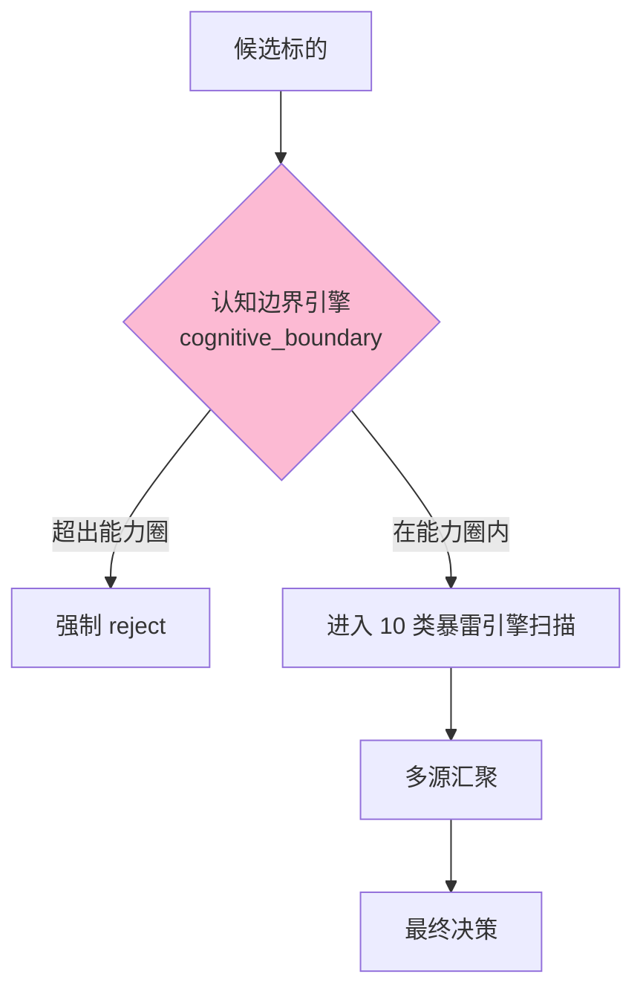

# L2 · 维度一 · 防御实践策略规划

> [!IMPORTANT] **本文档承接 L1 哲学基石 ⑤·防御哲学边界**的全部实践层规则。
>
> L1 只承诺"防御的核心立场、哲学边界、四不为、三种正确决策"；本文档**承接所有具体阈值、引擎触发规则、多源汇聚机制、黑名单生命周期、reject 配额管理**。

> [!NOTE] **[TRACEBACK]**
> - **L1 哲学地基**：[基石 ⑤·防御哲学边界](../../01_顶层概念/06_投资哲学体系总纲.md#基石-防御哲学边界维度一极寒防御)
> - **同层**：[维度一 README](./README.md) | [维度目标与能力边界](./00_维度目标与能力边界.md) | [引擎全景](./01_引擎全景与优先级.md) | [stages/](./stages/)
> - **协作维度**：[维度二·进攻实践规划](../02_维度二_纵深进攻/04_进攻实践策略规划.md)（一票否决对接）| [维度零·与后端契约](../00_维度零_AI投资副驾驶/04_与5维度后端的契约.md) §二
> - **下沉 L3 规约**：待 L3 创建（reject 决策协议、黑名单 schema、多源汇聚规约）
> - **下沉 DNA**：`_System_DNA/global_const.yaml` → `investment_philosophy.defense`

---

## 目录

- [一、本文档的层级定位](#一本文档的层级定位)
- [二、量化判据阈值（建议值）](#二量化判据阈值建议值)
- [三、多源弱信号汇聚规则](#三多源弱信号汇聚规则)
- [四、黑名单生命周期](#四黑名单生命周期)
- [五、认知边界引擎规约](#五认知边界引擎规约)
- [六、reject 配额管理](#六reject-配额管理)
- [七、10 类暴雷引擎参数表](#七10-类暴雷引擎参数表)
- [八、reject 归因（F vs B 判别）](#八reject-归因f-vs-b-判别)
- [九、DNA 键落地建议](#九dna-键落地建议)
- [十、一致性检查](#十一致性检查)

---

## 一、本文档的层级定位

| 层级 | 写什么 |
|---|---|
| **L1 哲学**（已存）| 防御的核心立场 + 哲学边界 + 四不为 + 三种正确决策 |
| **L2 实践规划**（本文档）| **具体阈值、引擎触发规则、多源汇聚机制、黑名单生命周期、reject 配额** |
| **L3 规约**（待建）| Schema、协议、接口 |
| **L4 实践**（待建）| 实施情况记录 |

---

## 二、量化判据阈值（建议值）

> 承接 L1 §5.3「宁可错杀」哲学纪律。

### 2.1 核心指标

| 指标 | 建议阈值 | 哲学理由 |
|---|---|---|
| **Recall**（召回率）| ≥ 0.95 | FN 远比 FP 严重（错放 1 个雷 ≫ 错杀 5 个机会）|
| **Precision**（精确率）| ≥ 0.70 | 不为提升 P 牺牲 R |
| **reject / 候选标的** | ≤ 0.50 | 防止"什么都不能买"（基石⑤·防御的不过度原则）|
| **认知边界 reject 率** | ≤ 0.30 | 防止认知边界过窄导致大量"无法理解"标签 |

### 2.2 单引擎触发阈值

| 引擎类型 | 单源信号强度阈值 | 单源直接 reject | 多源汇聚阈值 |
|---|---|---|---|
| **强约束类**（如审计师变更、立案调查）| ≥ 0.80 → reject | ✅ 直接 reject | — |
| **强信号类**（如商誉减值、大股东减持）| ≥ 0.70 → reject | ✅ 直接 reject | — |
| **弱信号类**（如审计费用异常、应收增速过快）| ≥ 0.60 → degrade | ❌ 不直接 reject | 2 个弱信号汇聚 → reject |

---

## 三、多源弱信号汇聚规则

> 承接 L1 §5.3「多源弱信号 > 单源强信号」哲学。

### 3.1 汇聚判定矩阵

```
单源弱信号 (signal_strength ∈ [0.60, 0.80))     → degrade
单源强信号 (signal_strength ≥ 0.80)              → reject
2 个弱信号同时触发（不同引擎）                    → reject
3 个弱信号同时触发                                → emergency_reject（红色告警）
1 强 + 1 弱（不同引擎）                          → reject + 升级红色
```

### 3.2 汇聚时间窗口

| 项 | 建议值 |
|---|---|
| **汇聚时间窗口** | 30 天（同一标的）|
| **去重逻辑** | 同一引擎对同一标的的重复信号在 7 天内只算 1 次 |
| **汇聚证据持久化** | 所有触发的引擎证据须永久存储（用于审计与回溯）|

### 3.3 汇聚事件 schema

```yaml
multi_source_aggregation:
  symbol: str
  aggregation_window_days: 30
  triggers:
    - engine_name: str
      signal_strength: float
      trigger_time: datetime
      evidence_link: str
  total_signal_score: float       # 加权汇总
  decision: enum                  # degrade | reject | emergency_reject
```

---

## 四、黑名单生命周期

> 承接 L1 §5.3「决策不可逆」哲学。

### 4.1 进入黑名单的 4 类情形

| 类型 | 进入条件 | 触发的告警 |
|---|---|---|
| **自动 reject 入榜** | 任何 RejectEvent | 红色告警 + 自动入榜 |
| **多源汇聚入榜** | 多源汇聚触发 reject | 红色告警 + 自动入榜 |
| **架构师手动入榜** | architect 在 Web 上手动添加 | 入决策日志 |
| **历史失败入榜** | 同一标的过去 12 月触发过 reject | 自动 |

### 4.2 解除黑名单的强制流程

```mermaid
flowchart TD
  A[标的请求解除黑名单] --> B{是否在能力圈内?}
  B -->|否| C[拒绝解除<br/>触发认知边界 reject]
  B -->|是| D{原触发引擎是否已澄清?}
  D -->|否| E[拒绝解除<br/>等待引擎澄清]
  D -->|是| F{多源汇聚证据是否已失效?}
  F -->|否| E
  F -->|是| G[人工签字必备<br/>架构师在 Web 上输入理由 + 密码]
  G --> H[写入审计日志<br/>永久保存解除原因]
  H --> I[标的进入"观察期"30 天]
  I --> J{观察期内是否再次触发?}
  J -->|是| K[永久封禁<br/>不可再解除]
  J -->|否| L[正式解除]
```

### 4.3 黑名单的存储与审计

| 项 | 建议值 |
|---|---|
| **存储位置** | PG `blacklist` 表 + 审计日志（不可删除）|
| **观察期** | 解除后 30 天观察期 |
| **二次违规** | 观察期内再触发 → 永久封禁 |
| **审计字段** | enter_reason / enter_time / engines_triggered / unlock_reason / unlock_architect / unlock_time / re_violation |

---

## 五、认知边界引擎规约

> 承接 L1 基石⑤「认知边界外优先 reject」哲学 + §5.2 维度一强约束「必须新增 1 个认知边界引擎」。

### 5.1 认知边界引擎的位置



### 5.2 认知边界的 5 维评估

| 维度 | 判定 | 阈值 |
|---|---|---|
| **行业理解度** | 行业是否在 L3 知识库的"已建模"列表内 | 已建模 = 可理解 |
| **数据可得性** | 财报、政策、产业链数据是否可持续采集 | 缺数据 = 不可理解 |
| **SLI 探针可建** | 关键逻辑链节点是否能找到可监控的探针 | 无探针 = 不可监控 |
| **历史回测数据** | 该行业是否有 ≥ 2 年的可回测历史 | < 2 年 = 不可验证 |
| **复杂度上限** | thesis 卡的节点数是否 ≤ 7 | > 7 = 过复杂 |

> **判定规则**：5 维中任意 2 维不通过 → 认知边界外 → reject。

### 5.3 认知边界白名单（首批已建模行业）

```
认知边界白名单（阶段 1）:
  - 消费电子
  - 新能源（电池/光伏/风电）
  - 医药（创新药/CRO）
  - 半导体（设备/材料/制造）
  - 金融（银行/保险）
  - 能源（油气/煤炭）
  - 食品饮料
  - 家电
  - 汽车（含整车/零部件）
  - 化工

阶段 2 扩展:
  - 房地产
  - 机械设备
  - 农业
```

---

## 六、reject 配额管理

> 承接 L1 §5.3「防御的不过度原则」哲学。

### 6.1 配额上限

| 项 | 建议上限 | 触发响应 |
|---|---|---|
| **日 reject 数** | ≤ 总候选 × 50% | 超出 → 暂停引擎 + 检查 |
| **周 reject 数** | ≤ 总候选 × 50% | 超出 → 触发 review |
| **月 reject 数** | ≤ 总候选 × 50% | 超出 → 触发引擎过敏审查 |
| **认知边界 reject 占比** | ≤ 30% | 超出 → 扩展白名单审查 |

### 6.2 配额超出时的行为

```
日配额超出:
  1. 暂停最近 1 小时 reject 的标的发送
  2. 邮件通知架构师
  3. 候选标的进入"待人工 review"队列

月配额超出:
  1. 暂停所有引擎 24 小时
  2. 触发"引擎过敏审查"
  3. architect 必须 review 后才能恢复
```

---

## 七、10 类暴雷引擎参数表

> 详细引擎实现见 [engines/](./engines/)；本节汇总参数。

| # | 引擎名 | 暴雷类型 | 单源 reject 阈值 | 弱信号下限 | 关键 SLI | 数据源 |
|---|---|---|---|---|---|---|
| 1 | financial_fraud | 财务造假 | ≥ 0.80 | 0.60 | 审计师变更、审计意见、应收/营收增速差 | 财报 + 公告 |
| 2 | governance | 公司治理 | ≥ 0.85 | 0.65 | 大股东减持、董事变动、关联交易暴增 | 公告 |
| 3 | related_party | 关联交易 | ≥ 0.75 | 0.60 | 关联交易占营收比、关联应收账款 | 财报 |
| 4 | goodwill | 商誉减值 | ≥ 0.80 | 0.65 | 商誉/净资产比、并购标的业绩承诺达成率 | 财报 |
| 5 | pledge | 股权质押 | ≥ 0.75 | 0.60 | 大股东累计质押比、质押率近期变化 | 公告 |
| 6 | regulatory | 监管处罚 | ≥ 0.90 | 0.70 | 立案调查、ST 风险预警 | 监管公告 |
| 7 | overseas | 海外业务风险 | ≥ 0.70 | 0.55 | 海外子公司亏损扩大、地缘政治暴露 | 财报 + 新闻 |
| 8 | sentiment | 舆情风险 | ≥ 0.70 | 0.55 | 多源新闻情感聚合、雪球/股吧热度 | 新闻 + 论坛 |
| 9 | systemic | 行业系统性 | ≥ 0.80 | 0.65 | 行业景气度、供给侧改革预警 | 行业报告 |
| 10 | cognitive_boundary | 认知边界 | 见 §5 | — | 5 维评估 | 内部 |

> 每个引擎的详细规约见 `engines/0X_*.md`。

---

## 八、reject 归因（F vs B 判别）

> 承接 L1 §5.4「三种正确防御决策」+ §5.5「防御失败的正确定义」。

### 8.1 reject 归因时点

| 时点 | 归因目标 | 用途 |
|---|---|---|
| **T+30** | 初次象限定位（F/B/D/G/H 候选）| 早期反馈 |
| **T+90** | 主战场窗口期归因 | 最关键 |
| **T+180** | 长战场窗口期归因 | 仅长战场 |

### 8.2 F vs B 判别规则

```python
def reject_attribution(reject_event, post_90d_outcome):
    """reject 决策的归因"""
    
    # F·避雷成功：标的后来确实暴雷
    if post_90d_outcome.max_drawdown >= 0.15:
        return {
            "quadrant": "F",
            "scs": +100,
            "library": "gold_library",
            "explanation": "F·避雷成功"
        }
    
    # D·早期识别：价格未跌但逻辑链已断
    if post_90d_outcome.logic_chain_state == "broken":
        return {
            "quadrant": "D",
            "scs": +50,
            "library": "early_signal_library",
            "explanation": "D·早期识别（避免了未来暴跌）"
        }
    
    # B·假阳性 reject：未暴雷且涨了
    if post_90d_outcome.price_change > 0:
        return {
            "quadrant": "B_reject",  # 防御类的 B
            "scs": 0,
            "library": "anomaly_isolation",  # 异常隔离，不进训练
            "explanation": "单次属正常误差；连续多次 = 引擎过敏"
        }
    
    # 中性：未暴雷也未涨
    return {
        "quadrant": "neutral_reject",
        "scs": 0,
        "library": "skip",
        "explanation": "无足够信号判断"
    }
```

### 8.3 引擎过敏触发条件

```
连续 3 次同一引擎的 reject → 后 90 天均未暴雷 + 价格涨幅 ≥ 10%
                            ↓
                       触发"引擎过敏审查"
                            ↓
              检查该引擎参数是否需要重新校准（提高阈值）
```

---

## 九、DNA 键落地建议

> 由 L3 `_System_DNA/global_const.yaml` 最终承接，本文档仅提建议。

```yaml
investment_philosophy:
  defense:
    # === 量化判据 ===
    recall_threshold: 0.95
    precision_threshold: 0.70
    reject_ratio_upper_bound: 0.50
    cognitive_boundary_reject_ratio_upper_bound: 0.30
    
    # === 多源汇聚 ===
    multi_source_aggregation:
      enabled: true
      window_days: 30
      dedup_window_days: 7
      thresholds:
        single_weak: [0.60, 0.80]
        single_strong: 0.80
        two_weak_aggregated: "reject"
        three_weak_aggregated: "emergency_reject"
        strong_plus_weak: "reject_red"
    
    # === 黑名单 ===
    blacklist:
      permanent: true
      unlock_requires_human: true
      unlock_observation_period_days: 30
      re_violation_permanent_ban: true
      audit_fields:
        - enter_reason
        - enter_time
        - engines_triggered
        - unlock_reason
        - unlock_architect
        - unlock_time
        - re_violation
    
    # === 认知边界 ===
    cognitive_boundary:
      dimensions: 5
      reject_if_failing: 2          # 5 维中失败 2 维 → reject
      whitelist_stage1:
        - consumer_electronics
        - new_energy
        - pharmaceuticals
        - semiconductors
        - financial
        - energy
        - food_beverage
        - home_appliances
        - automotive
        - chemicals
    
    # === reject 配额 ===
    reject_quota:
      daily_max_ratio: 0.50
      weekly_max_ratio: 0.50
      monthly_max_ratio: 0.50
      over_quota_action: "pause_engines_24h"
    
    # === 10 类暴雷引擎触发阈值 ===
    engines:
      financial_fraud:
        reject_threshold: 0.80
        weak_threshold: 0.60
      governance:
        reject_threshold: 0.85
        weak_threshold: 0.65
      related_party:
        reject_threshold: 0.75
        weak_threshold: 0.60
      goodwill:
        reject_threshold: 0.80
        weak_threshold: 0.65
      pledge:
        reject_threshold: 0.75
        weak_threshold: 0.60
      regulatory:
        reject_threshold: 0.90
        weak_threshold: 0.70
      overseas:
        reject_threshold: 0.70
        weak_threshold: 0.55
      sentiment:
        reject_threshold: 0.70
        weak_threshold: 0.55
      systemic:
        reject_threshold: 0.80
        weak_threshold: 0.65
    
    # === reject 归因 ===
    attribution:
      timepoints_days: [30, 90, 180]
      f_b_drawdown_threshold: 0.15
      engine_oversensitive_consecutive: 3
      engine_oversensitive_price_threshold: 0.10
```

---

## 十、一致性检查

| 检查项 | 状态 |
|---|---|
| L1 基石⑤ 已在本文档完整承接 | ✅ |
| 量化阈值、多源汇聚、黑名单、认知边界、reject 配额、10 引擎参数齐全 | ✅ |
| F vs B 归因算法明确 | ✅ |
| 引擎过敏触发条件明确 | ✅ |
| 与维度二的"一票否决"对接说明 | ✅（在事件流契约中 PassEvent / RejectEvent）|
| DNA 键落地建议完整 | ✅ |
| TRACEBACK 链完整（上溯 L1 / 同层 / 下沉 L3-DNA）| ✅ |
| 不写代码实现细节（仅伪代码思路）| ✅ |
| 不重新定义哲学边界（哲学引用 L1）| ✅ |

---

## 修订记录

| 日期 | 触发 | 内容 |
|---|---|---|
| 2026-05-14 | 用户要求"L2 实践策略规划"从占位变完整版 | 填充完整规则：量化判据、多源汇聚 5 档、黑名单生命周期含解除流程、认知边界 5 维评估、reject 配额管理、10 类暴雷引擎参数表、F/B 归因算法 |
