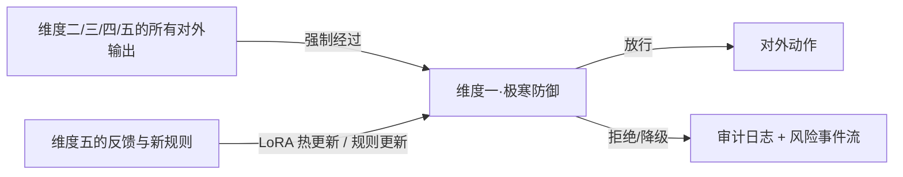

# 维度一·极寒防御（The Firewall）

> [!NOTE] **[TRACEBACK] 战略维度锚点**
> - **顶层概念**: [项目定义与核心价值](../../01_顶层概念/01_项目定义与核心价值.md)
> - **顶层概念**: [双目标系统与五层架构](../../01_顶层概念/03_双目标系统与五层架构.md)
> - **同层引用**: [双目标与战略维度关系](../00_双目标与战略维度关系.md)
> - **L3 对应模块**: [极寒防御（cryo_guard）](../../03_原子目标与规约/01_维度一_极寒防御/README.md) + [06_L2 落地清单](../../03_原子目标与规约/01_维度一_极寒防御/06_L2落地清单_设计.md)
> - **L3 工程映射**: [00_引擎到L3模块的映射](./00_引擎到L3模块的映射.md)

## 一、维度速览

| 项目 | 内容 |
|---|---|
| **一句话定位** | L1 全局安检防火墙 / 一票否决的最高优先级层 |
| **战略目标** | 彻底根绝本金的永久性损失（避雷退市、财务造假、管理层跑路、商业逻辑伪命题） |
| **核心使命** | A 股能 100% 防住死局，就战胜了 90% 的投资者 |
| **L3 模块** | `cryo_guard` |
| **引擎数量** | 10 引擎（P0:3 / P1:4 / P2:3） |
| **当前优先级** | **P0**（与维度五并列第一） |

## 二、双视角入口（**新增·重要**）

本目录提供两种互补视角，按需选择：

| 视角 | 入口 | 用途 | 适合谁 |
|---|---|---|---|
| **按阶段切**（推荐先看） | [stages/](./stages/) | "第一/二/三阶段做什么、需要什么数据、验收什么"——**一眼看清当前阶段全貌** | 架构师每周节奏检查；新人快速上手；做月度计划 |
| **按引擎切** | [engines/](./engines/) | 单个引擎"从生到死"全生命周期参考手册 | 该引擎的实现者；做引擎专题 review |

> **快速导航**：
> - 想知道"现在该做什么"→ [stages/README.md](./stages/README.md) 看 3 阶段总览 + 跨阶段引擎追踪表
> - 想知道"第一阶段做哪 3 引擎、要什么数据"→ [stages/stage_1_启动期/README.md](./stages/stage_1_启动期/README.md)
> - 想深入某个引擎全生命周期 → [engines/0X_*.md](./engines/)

## 三、本目录文件索引

| 文件 | 内容 |
|---|---|
| [**00_引擎到L3模块的映射.md**](./00_引擎到L3模块的映射.md) | **★ L2 ↔ L3 双向映射**：10 引擎映射到 L3 cryo_guard 哪些后端服务 |
| [00_维度目标与能力边界.md](./00_维度目标与能力边界.md) | 战略目标、决策机制、能力边界、L3 子模块映射 |
| [01_引擎全景与优先级.md](./01_引擎全景与优先级.md) | 10 个引擎全景 + **3 阶段切片矩阵**（俯视图）|
| [02_数据依赖梯次总表.md](./02_数据依赖梯次总表.md) | 维度级数据采集清单（前/中/后期） |
| [03_训练与评测资产路径.md](./03_训练与评测资产路径.md) | 维度级 5 阶段训练范式 + Holdout 守门规则 |
| **[stages/](./stages/)** | **★ 按阶段切的视角**：3 阶段 × 4 文档 = 12 份阶段切片文档 + stages/README |
| [engines/](./engines/) | 按引擎切的视角：10 引擎完整规约（每个含 8 节模板）|

## 四、本维度引擎清单

| # | 引擎名称 | 优先级 | 文档 |
|---|---|---|---|
| 1 | 财务造假测谎引擎 | **P0**（首引擎） | [engines/01_财务造假测谎.md](./engines/01_财务造假测谎.md) |
| 2 | 大股东诚信验尸引擎 | **P0** | [engines/02_大股东诚信验尸.md](./engines/02_大股东诚信验尸.md) |
| 3 | 关联交易/明股实债识别引擎 | **P0** | [engines/03_关联交易明股实债识别.md](./engines/03_关联交易明股实债识别.md) |
| 4 | 商誉减值预警引擎 | P1 | engines/04_商誉减值预警.md（待 P1 阶段补全） |
| 5 | 质押爆仓与控制权稳定性引擎 | P1 | engines/05_质押爆仓与控制权.md（待 P1 阶段补全） |
| 6 | 审计师与监管问询风险引擎 | P1 | engines/06_审计师与监管问询.md（待 P1 阶段补全） |
| 7 | 关键人离职/治理崩塌引擎 | P1 | engines/07_关键人离职治理.md（待 P1 阶段补全） |
| 8 | 海外监管风险引擎（中概股专用） | P2 | engines/08_海外监管风险.md（待 P2 阶段补全） |
| 9 | 舆情与品牌信任崩盘引擎 | P2 | engines/09_舆情品牌信任.md（待 P2 阶段补全） |
| 10 | 行业系统性风险引擎 | P2 | engines/10_行业系统性风险.md（待 P2 阶段补全） |

## 五、协作约定

- **本维度是全局熔断器，不是某个串行步骤**：任何其他维度的对外输出都必须先过本维度的决策门禁
- **一票否决制**：命中任意防御红线 → 写入永久黑名单；解除需要架构师手动覆盖
- **本维度不产生研究结论**（属于维度二）；不维护状态机生命周期（属于维度三/四）；不直接执行外部动作（属于维度五的"外部动作边界"）

## 六、与其他维度的关系

