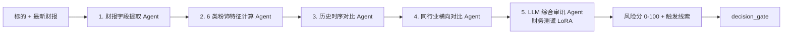
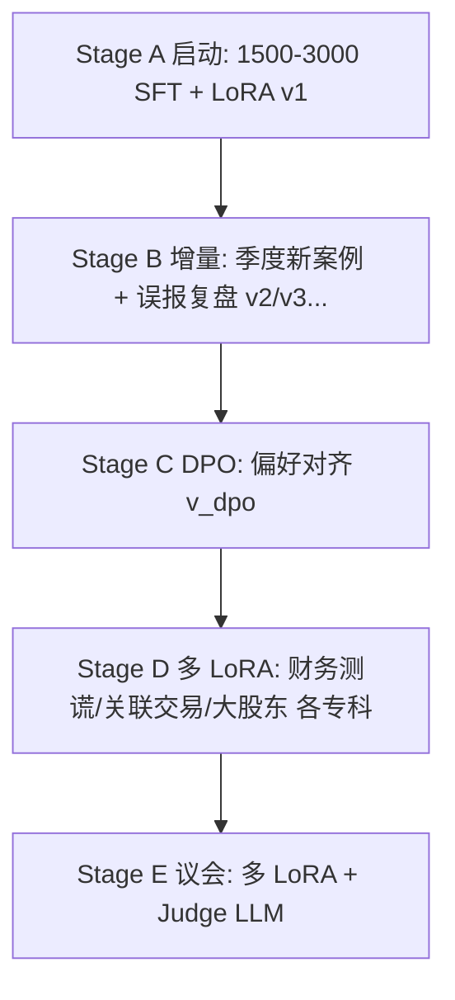

# 引擎 01：财务造假测谎引擎（首引擎）

> [!NOTE] **[TRACEBACK]**
> - **维度概览**: [README](../README.md)
> - **维度目标**: [00_维度目标与能力边界](../00_维度目标与能力边界.md)
> - **L3 子模块**: `cryo_guard.fraud_detector`
> - **DNA 配置键**: `_System_DNA/cryo_guard/engines/fraud_detector.yaml`

## 一、引擎定位与目标

| 项 | 内容 |
|---|---|
| **一句话定位** | 维度一首引擎，识别财报"粉饰/造假"的早期信号 |
| **战略目标** | 防住康得新（300 亿现金造假）、康美（300 亿货币资金虚增）、瑞幸（22 亿营收造假）等死局 |
| **优先级** | **P0**（维度一第 1 个引擎） |
| **决策机制** | 风险分 0–100；≥ 80 → reject；50–79 → degrade；< 50 → pass |
| **能力边界** | 不做投资建议；不做估值判断；不替代专业审计 |

## 二、AI 工作流设计

### 2.1 工作流程图



### 2.2 输入契约

```yaml
input:
  symbol: "002450.SZ"
  report_period: "2018Q4"
  fields:
    revenue: 14.83
    operating_cost: 8.20
    cash_balance: 153.16
    interest_income: 0.42
    short_term_debt: 49.81
    accounts_receivable: 23.46
    inventory: 7.82
    rd_capitalization_ratio: 0.85
    # ... 其他 30+ 字段
```

### 2.3 输出契约

```yaml
output:
  symbol: "002450.SZ"
  risk_score: 92
  decision: "reject"
  triggers:
    - feature: "存贷双高"
      severity: "critical"
      evidence: "现金 153 亿但同期短期借款 49 亿，且利息收入仅 0.42 亿，明显异常"
    - feature: "研发资本化突变"
      severity: "warning"
      evidence: "研发资本化比例从 0.20 突变到 0.85，疑似利润操纵"
  llm_explanation: "..."
  reference_cases: ["kang_de_xin_2018", "kang_mei_2019"]
```

### 2.4 6 类典型粉饰特征

| # | 特征 | 计算逻辑 | 阈值 |
|---|---|---|---|
| 1 | **存贷双高** | 货币资金/总资产 > 30% AND 有息负债/总资产 > 25% AND 利息收入/货币资金 < 1.5% | 同时满足 → critical |
| 2 | **现金流与净利润背离** | (净利润 - 经营现金流)/净利润 > 50% 持续 ≥ 4 季度 | warning |
| 3 | **应收账款异常增长** | 应收账款增速 > 营收增速 × 1.5 持续 ≥ 4 季度 | warning |
| 4 | **存货积压** | 存货周转天数同比增长 > 30% | warning |
| 5 | **研发资本化突变** | 研发资本化比例 > 0.50 OR 同比突变 > 30% | warning |
| 6 | **毛利率异常** | 毛利率显著高于行业均值 + 2σ | warning |

### 2.5 与其他引擎的协作点

- **上游**：消费"维度二的 thesis 卡片提议进入持仓的标的"，对其做二次校验
- **下游**：reject → 写入维度一的永久黑名单 + 风险事件流；维度二接到 reject 后立即 discard 对应 thesis
- **跨维度**：与维度一的"关联交易/明股实债识别"互为印证（多源弱信号汇聚为强信号）

### 2.6 L3 子模块映射

- `cryo_guard.fraud_detector.field_extractor`：财报字段提取
- `cryo_guard.fraud_detector.feature_calculator`：6 类粉饰特征计算
- `cryo_guard.fraud_detector.peer_comparator`：同行业横向对比
- `cryo_guard.fraud_detector.llm_inquisitor`：LLM 综合审讯（基于财务测谎 LoRA）
- `cryo_guard.fraud_detector.decision_aggregator`：综合决策

## 三、首次训练数据合成方案（Stage A · 启动期）

### 3.1 Step 1：圈定 30–50 个历史暴雷案例库

| 类别 | 案例 | 暴雷类型 |
|---|---|---|
| 现金造假 | 康得新（002450）2018 | 货币资金虚增 122 亿 |
| 现金造假 | 康美药业（600518）2019 | 货币资金虚增 299 亿 |
| 营收造假 | 瑞幸咖啡 2020 | 虚增营收 22 亿 |
| 收入跨期 | 银广夏（000557）2001 | 虚增利润 7.45 亿 |
| 关联交易 | 蓝田股份（600709）2002 | 虚构销售 |
| 资本化 | 乐视网（300104）2017 | 研发资本化 + 关联交易 |
| 商誉减值 | 大族激光（002008）2018 | 商誉减值后业绩变脸 |
| 应收造假 | 雏鹰农牧（002477）2018 | 应收账款虚增 + 存货异常 |
| 存货虚构 | 獐子岛（002069）2014 | 存货异常死亡 |
| ... | ... | ... |

**目标 30–50 个案例**，覆盖各类典型粉饰手法。

### 3.2 Step 2：抓取案发前/成功前原始语料

每个案例采集：
- 暴雷前 4–8 个季度的完整财报（资产负债表 / 现金流量表 / 利润表 / 附注 / MD&A）
- 暴雷前的所有公告（PDF + HTML）
- 暴雷时间线（哪一年/季度被举报、被立案、被处罚）
- 暴雷后的处罚决定书（证监会、交易所）

数据源：巨潮资讯网 + 自建 OCR Pipeline。

### 3.3 Step 3：Teacher LLM 审讯式 Prompt

**System Prompt**：
```
你是 PCAOB 注册的高级司法会计专家，擅长识别上市公司财报粉饰手法。
你的任务是分析以下财报文本，按照 6 类典型粉饰特征逐项审讯，输出审讯报告。

审讯规则：
1. 必须逐项给出"是否触发 + 证据 + 严重性等级"
2. 证据必须直接引用原文字段（如"货币资金 153.16 亿，短期借款 49.81 亿"）
3. 严重性等级：critical / warning / normal
4. 如果触发任意 critical 特征 → 综合判定 "reject"
5. 输出格式：JSON

特征清单：
1. 存贷双高（货币资金 / 总资产 > 30% AND 有息负债 / 总资产 > 25% AND 利息收入 / 货币资金 < 1.5%）
2. 现金流与净利润背离
3. 应收账款异常增长
4. 存货积压
5. 研发资本化突变
6. 毛利率异常
```

**User Prompt**：
```
请分析以下财报：
{财报全文 + 关键字段时序}
```

### 3.4 Step 4：Alpaca JSONL 格式化（示例）

```json
{
  "instruction": "请作为严格的财务审计员，分析以下财报文本是否存在潜在欺诈风险。",
  "input": "[抓取的康美药业 2018 年报关于货币资金的描述：货币资金期末余额 341.51 亿元，较期初增长 26.78%，主要由于...]\n[关联字段时序：2017Q1 货币资金 269.55 亿，2017Q4 269.31 亿，2018Q4 341.51 亿；同期短期借款 113.85 亿；利息收入 0.62 亿]",
  "output": "【高危预警】发现典型存贷双高特征。\n证据：账面货币资金 341.51 亿，但利息收入仅 0.62 亿（年化收益率 0.18%，远低于活期 0.30%），同时仍在大量发行短融（短期借款 113.85 亿），财务费用 12.4 亿。该货币资金存在被大股东挪用或凭空伪造的极大可能。\n触发特征：存贷双高（critical）\n建议：立即写入永久黑名单 + 启动维度一·关联交易引擎二次校验。"
}
```

### 3.5 Step 5：人工 verified 校验（Label Studio）

Label Studio 配置：
- 标注模板：3 个字段（是否同意 AI 判定 / 修正后的判定 / 修正理由）
- Quality Control：每 50 条样本随机抽 5 条架构师复核
- 验收：Cohen's Kappa ≥ 0.85（架构师与 AI 判定的一致性）

**架构师每周 2h 必做**：50 条样本 verified。

### 3.6 Step 6：第一次微调

| 配置 | 值 |
|---|---|
| 基座模型 | Qwen2.5-7B-Instruct |
| 微调方式 | LoRA（rank=16, alpha=32, dropout=0.05） |
| 训练数据 | 1500–3000 条 verified JSONL |
| Epochs | 3 |
| Learning Rate | 2e-4 |
| Batch Size | 8 |
| GPU | RTX 4090 单卡 |
| 评测目标 | Holdout Recall ≥ 0.95、Precision ≥ 0.70、F1 ≥ 0.80 |

## 四、多阶段进化路径（Stage A → E）



| 阶段 | 关键动作 | 数据增量来源 | 训练方式 | 预期能力跃升 |
|---|---|---|---|---|
| A | 30-50 案例 SFT 蒸馏 | 历史暴雷案例库 | LoRA 全参微调 | 识别 80% 已知粉饰 |
| B | 季度新案例 + 误报 case 复盘 | 案例库季度增量 + 维度一审计日志 | LoRA 增量 | 误报率 ↓ |
| C | DPO 偏好对齐 | 架构师 verified 偏好对 | DPO + LoRA 增量 | 严苛度对齐 |
| D | 多 LoRA 并行 | 各专科训练集独立 | vLLM 多 LoRA | 单项准确率 ↑ |
| E | 议会模式 | 实盘多源数据 | 议会式 ensemble | 综合判决置信度 ↑ |

## 五、数据依赖梯次表

| 阶段 | 数据类别 | 数据源 | 关键字段 | 采集频率 | 是否结构化 |
|---|---|---|---|---|---|
| 前期 | 财务三表全量 | Tushare、AKShare | 资产负债表 / 现金流量表 / 利润表 | 季度 | 结构化 |
| 前期 | 财报附注 OCR | 自建 OCR Pipeline | 关联交易明细、表外结构 | 季度 | 半结构化 |
| 前期 | 历史暴雷案例库 | 自建 + Teacher LLM | 暴雷类型、暴雷前财报特征 | 一次性 + 季度增量 | 结构化 |
| 中期 | 同行业财务对比 | Tushare 行业分类 | 同行业关键指标分位 | 季度 | 结构化 |
| 中期 | 处罚决定书库 | 证监会、交易所 | 处罚原因、金额 | 实时 | 半结构化 |
| 后期 | 雪球/讨论区舆情（辅助验证） | 各社区 | 对该标的的负面讨论密度 | 日度 | 非结构化 |
| 后期 | 第三方做空报告 | 自建 | 做空报告全文、做空机构 | 事件驱动 | 半结构化 |

## 六、永久 Holdout 评测集

| 项 | 内容 |
|---|---|
| **大小** | 30 个完整案例（永久锁库） |
| **构成** | 10 个现金造假 + 10 个营收造假 + 10 个综合粉饰 |
| **主指标** | **Recall ≥ 0.95**——必须查出至少 28/30 |
| **副指标** | **Precision ≥ 0.70**、F1 ≥ 0.80 |
| **守门规则** | 任意指标退化 > 5% → 自动 Block 上线 |

## 七、与上下游引擎的衔接

### 7.1 上游依赖

- 数据湖：财报、附注 OCR、案例库
- 维度二：thesis 卡片中提议的标的
- 维度五：Teacher LLM 蒸馏服务、Label Studio、LLaMA-Factory、vLLM 推理网关

### 7.2 下游消费方

- 维度一·decision_gate：综合决策
- 维度一·audit_log_service：审计日志
- 维度二：reject 后立刻 discard 对应 thesis
- 维度五：训练评测数据消费方

### 7.3 跨维度协作

- 与"关联交易/明股实债"互为印证
- 与"大股东诚信"互为印证（财务造假常伴随大股东不诚信）

## 八、L3 / L4 / L5 / DNA 映射

- **L3 子模块**: `cryo_guard.fraud_detector`
- **L4 阶段实践**: `04_阶段规划与实践/Stage3_模块实践/01_财务测谎引擎/`
- **L5 验收行 ID**: `l5-cryo-fraud-detector`
- **DNA 配置键**: `_System_DNA/cryo_guard/engines/fraud_detector.yaml`
- **代码仓路径**: `diting-src/cryo_guard/fraud_detector/`
- **训练数据路径**: `diting-data/cryo_guard/case_library/financial_fraud/` + `diting-data/cryo_guard/sft_data/financial_fraud_v*.jsonl`
