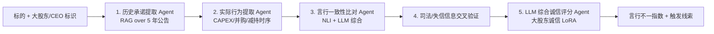

# 引擎 02：大股东诚信验尸引擎

> [!NOTE] **[TRACEBACK]**
> - **维度概览**: [README](../README.md)
> - **L3 子模块**: `cryo_guard.governance_inquisitor`
> - **DNA 配置键**: `_System_DNA/cryo_guard/engines/governance_inquisitor.yaml`

## 一、引擎定位与目标

| 项 | 内容 |
|---|---|
| **一句话定位** | 用 RAG 调取 CEO/大股东过去 5 年公开发言/承诺，与实际 CAPEX 流向、并购/减持记录交叉比对 |
| **战略目标** | 防住"反复爽约"的 CEO 类暴雷（如承诺增持后偷偷减持） |
| **优先级** | **P0**（维度一第 2 个引擎） |
| **决策机制** | 言行不一指数 0–100；≥ 70 → reject；40–69 → degrade；< 40 → pass |
| **能力边界** | 不做主观品德评价；不涉及未公开信息；不做法律意见 |

## 二、AI 工作流设计

### 2.1 工作流程图



### 2.2 输入契约

```yaml
input:
  symbol: "300104.SZ"
  shareholders:
    - name: "贾跃亭"
      role: "实际控制人"
      shareholding: 25.67
```

### 2.3 输出契约

```yaml
output:
  symbol: "300104.SZ"
  inconsistency_score: 87
  decision: "reject"
  triggers:
    - feature: "承诺增持后实际减持"
      severity: "critical"
      promise: "2017-01-15 公告承诺 6 个月内增持不少于 10 亿元"
      actual: "2017-05-10 至 2017-08-10 期间实际减持 50.92 亿元"
    - feature: "承诺不质押后实际质押"
      severity: "critical"
      promise: "2016-08-10 公告承诺不质押超过 50%"
      actual: "2017-04-10 实际质押率达到 99.06%"
  llm_explanation: "..."
```

### 2.4 言行不一的 5 类典型特征

| # | 特征 | 计算逻辑 |
|---|---|---|
| 1 | **承诺增持 vs 实际减持** | NLI 比对承诺文本与实际增减持公告 |
| 2 | **承诺不质押 vs 实际高质押** | 比对承诺与中登公司质押数据 |
| 3 | **承诺不卖出 vs 减持** | 比对锁定期承诺与减持公告 |
| 4 | **业绩承诺履约率** | 比对对赌承诺与实际业绩 |
| 5 | **战略承诺履约率** | 比对战略发布会承诺与实际 CAPEX 流向 |

### 2.5 与其他引擎的协作点

- **上游**：消费维度二的 thesis 卡片
- **下游**：与"财务测谎"互为印证；与"质押爆仓"互为印证
- **数据依赖**：跨多个维度（公告、CAPEX 流向、质押、减持、司法）

### 2.6 L3 子模块映射

- `cryo_guard.governance_inquisitor.promise_extractor`：承诺提取（RAG）
- `cryo_guard.governance_inquisitor.action_extractor`：实际行为提取
- `cryo_guard.governance_inquisitor.nli_comparator`：言行一致性比对
- `cryo_guard.governance_inquisitor.judicial_verifier`：司法/失信信息交叉
- `cryo_guard.governance_inquisitor.llm_aggregator`：LLM 综合（基于大股东诚信 LoRA）

## 三、首次训练数据合成方案（Stage A）

### 3.1 Step 1：圈定 30 个历史"言行不一"案例

| 案例 | 言行不一类型 |
|---|---|
| 乐视网·贾跃亭 | 承诺增持后大幅减持 + 高质押 |
| 暴风集团·冯鑫 | 承诺业绩对赌后变脸 |
| 安信信托·CEO | 多项承诺均未履约 |
| 华谊兄弟·王中军 | 承诺不减持后减持 |
| 天神娱乐·朱晔 | 承诺增持后减持 + 失联 |
| ...（共 30 个）| ... |

### 3.2 Step 2：抓取案发前 5 年原始公告

- 每个案例的所有承诺型公告（增持承诺、不减持承诺、对赌承诺、战略承诺）
- 同期的实际增减持公告、CAPEX 流向、质押公告、对赌履约公告
- 暴雷时间线 + 处罚决定书

### 3.3 Step 3：Teacher LLM 审讯式 Prompt

**System Prompt**：
```
你是 PCAOB 注册的高级公司治理审计专家，擅长识别"言行不一"的大股东/CEO 行为。
任务：对比该标的过去 5 年的承诺与实际行为，输出言行不一指数（0-100）。

审讯规则：
1. 必须把每条"承诺"与对应的"实际行为"明确配对
2. 配对失败的承诺标记为"未履约"
3. 严重性：critical（损害投资者利益）/ warning（轻微偏离）/ normal（履约）
4. 综合判定：critical 数量 ≥ 2 → reject；critical = 1 → degrade
5. 输出格式：JSON
```

### 3.4 Step 4：Alpaca JSONL 格式化（示例）

```json
{
  "instruction": "请作为公司治理审计专家，比对该公司大股东的历史承诺与实际行为，给出言行不一指数。",
  "input": "公司：乐视网\n大股东：贾跃亭\n承诺集合：\n[2017-01-15] 公告承诺 6 个月内增持不少于 10 亿元\n[2016-08-10] 公告承诺质押率不超过 50%\n[2015-12-20] 公告承诺战略上不退出影业\n实际行为时序：\n[2017-05-10 至 2017-08-10] 实际减持 50.92 亿元\n[2017-04-10] 质押率达到 99.06%\n[2017-07-15] 影业业务被剥离",
  "output": "【critical】言行不一指数：92/100\n触发：\n1. 承诺增持后大幅减持（critical）：承诺 6 个月内增持 10 亿，实际同期减持 50.92 亿，方向完全相反\n2. 承诺质押率 ≤ 50% 后实际 99.06%（critical）：违反承诺幅度极大\n3. 承诺战略不退影业后实际剥离（warning）：与战略宣告相违\n综合判定：reject\n建议：写入永久黑名单 + 通知架构师"
}
```

### 3.5 Step 5：人工 verified 校验

Label Studio 配置同财务测谎引擎；Cohen's Kappa ≥ 0.85。

### 3.6 Step 6：第一次微调

| 配置 | 值 |
|---|---|
| 基座模型 | Qwen2.5-7B-Instruct |
| 微调方式 | LoRA（rank=16） |
| 训练数据 | 1500 条 verified JSONL |
| Epochs | 3 |
| GPU | RTX 4090 |
| 评测目标 | Holdout Recall ≥ 0.90、Precision ≥ 0.70 |

## 四、多阶段进化路径（Stage A → E）

| 阶段 | 关键动作 | 数据增量来源 | 训练方式 | 预期能力跃升 |
|---|---|---|---|---|
| A | 30 案例 SFT 蒸馏 | 历史言行不一案例库 | LoRA | 识别 80% 已知言行不一 |
| B | 季度新案例 + 误报复盘 | 案例库季度增量 | LoRA 增量 | 误报率 ↓ |
| C | DPO 偏好对齐 | 架构师偏好对 | DPO | 严苛度对齐 |
| D | 多 LoRA（不同行业） | 各行业训练集 | vLLM 多 LoRA | 行业敏感度 |
| E | 议会模式 | 多源数据 | 议会式 ensemble | 综合判决置信度 ↑ |

## 五、数据依赖梯次表

| 阶段 | 数据类别 | 数据源 | 关键字段 | 采集频率 | 是否结构化 |
|---|---|---|---|---|---|
| 前期 | 公司公告全文 | 巨潮资讯网 | 承诺型公告、实际行为公告 | 实时 | 半结构化 |
| 前期 | 大股东持股 + 减持公告 | Tushare | 大股东名、增减持比例 | 实时 | 结构化 |
| 前期 | 历史言行不一案例库 | 自建 + Teacher LLM | 承诺 vs 实际配对 | 一次性 + 季度增量 | 结构化 |
| 中期 | 大股东质押明细 | 中登公司、Tushare | 质押率、平仓预警线 | 实时 | 结构化 |
| 中期 | 司法/诉讼/失信信息 | 中国裁判文书网、信用中国 | 诉讼标的、失信记录 | 周度 | 结构化 |
| 中期 | 业绩对赌履约 | 公告 + Tushare | 对赌目标 vs 实际业绩 | 半年度 | 结构化 |
| 后期 | CAPEX 流向 | 财报 + 关联交易附注 | 实际投向 vs 战略宣告 | 季度 | 半结构化 |

## 六、永久 Holdout 评测集

| 项 | 内容 |
|---|---|
| **大小** | 30 案例（永久锁库） |
| **构成** | 跨行业、跨年代 |
| **主指标** | **Recall ≥ 0.90** |
| **副指标** | **Precision ≥ 0.70**、Cohen's Kappa ≥ 0.80 |

## 七、与上下游引擎的衔接

- **上游**：维度二 thesis、巨潮公告、Tushare、企查查
- **下游**：维度一 decision_gate；与"财务测谎"、"质押爆仓"互为印证
- **跨维度**：维度三的"管理层信号"消费本引擎的 incremental output

## 八、L3 / L4 / L5 / DNA 映射

- **L3 子模块**: `cryo_guard.governance_inquisitor`
- **L4 阶段实践**: `04_阶段规划与实践/Stage3_模块实践/02_大股东诚信引擎/`
- **L5 验收行 ID**: `l5-cryo-governance-inquisitor`
- **DNA 配置键**: `_System_DNA/cryo_guard/engines/governance_inquisitor.yaml`
- **代码仓路径**: `diting-src/cryo_guard/governance_inquisitor/`
- **训练数据路径**: `diting-data/cryo_guard/case_library/governance_collapse/`
