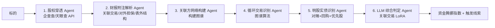

# 引擎 03：关联交易/明股实债识别引擎

> [!NOTE] **[TRACEBACK]**
> - **维度概览**: [README](../README.md)
> - **L3 子模块**: `cryo_guard.related_party_detector`
> - **DNA 配置键**: `_System_DNA/cryo_guard/engines/related_party_detector.yaml`

## 一、引擎定位与目标

| 项 | 内容 |
|---|---|
| **一句话定位** | 通过股权穿透 + 财报附注，识别表外结构、关联方循环交易、隐藏负债 |
| **战略目标** | 防住乐视、暴风、华谊兄弟等"资金腾挪型"暴雷；很多 A 股雷其实在财报附注里就能看出 |
| **优先级** | **P0**（维度一第 3 个引擎） |
| **决策机制** | 资金腾挪指数 0–100；≥ 70 → reject；40–69 → degrade；< 40 → pass |
| **能力边界** | 不做合规法律意见；仅给出风险标签 |

## 二、AI 工作流设计

### 2.1 工作流程图



### 2.2 输入契约

```yaml
input:
  symbol: "300027.SZ"  # 华谊兄弟
  report_period: "2018Q4"
```

### 2.3 输出契约

```yaml
output:
  symbol: "300027.SZ"
  embezzlement_score: 75
  decision: "reject"
  triggers:
    - feature: "关联方循环交易"
      severity: "critical"
      evidence: "公司 → 关联方 A → 关联方 B → 公司，资金往返 12 亿，无真实业务支撑"
    - feature: "明股实债"
      severity: "warning"
      evidence: "对外投资 5 亿元，但该投资有 5 年内回购 + 8% 固定收益条款，实质为债务"
  llm_explanation: "..."
```

### 2.4 4 类典型识别特征

| # | 特征 | 计算逻辑 |
|---|---|---|
| 1 | **关联方循环交易** | 图算法识别"3+ 节点的资金回路"（公司 → 关联方 → 关联方 → 公司） |
| 2 | **明股实债** | 财报附注中识别"对外投资带回购 + 固定收益"特征 |
| 3 | **隐藏负债** | 通过对外担保、共同控制权变更，识别表外负债规模 |
| 4 | **关联方占款** | 应收/其他应收 中的关联方占比 > 30% |

### 2.5 与其他引擎的协作点

- **上游**：消费维度二的 thesis 卡片
- **下游**：与"财务测谎"互为印证（许多财务造假伴随关联交易）
- **数据依赖**：图数据库（Neo4j）+ 财报附注 OCR

### 2.6 L3 子模块映射

- `cryo_guard.related_party_detector.equity_penetrator`：股权穿透
- `cryo_guard.related_party_detector.footnote_parser`：财报附注解析
- `cryo_guard.related_party_detector.graph_builder`：关联方图谱构建
- `cryo_guard.related_party_detector.cycle_detector`：循环交易识别
- `cryo_guard.related_party_detector.equity_debt_detector`：明股实债识别
- `cryo_guard.related_party_detector.llm_aggregator`：LLM 综合判定

## 三、首次训练数据合成方案（Stage A）

### 3.1 Step 1：圈定 30 个历史案例

| 案例 | 类型 |
|---|---|
| 乐视网 | 关联方循环交易 |
| 暴风集团 | 关联方占款 |
| 华谊兄弟 | 关联方占款 + 对外担保 |
| 安信信托 | 明股实债 |
| 中天金融 | 明股实债 + 关联交易 |
| ...（共 30 个）| ... |

### 3.2 Step 2：抓取案发前财报与附注

- 暴雷前 4 个季度的财报附注（关联交易、对外担保、对外投资）
- 同期股权穿透关系图（企查查 API 提取）

### 3.3 Step 3：Teacher LLM 审讯式 Prompt

**System Prompt**：
```
你是 PCAOB 注册的高级反舞弊专家，擅长从财报附注与股权穿透中识别"资金腾挪"模式。
任务：分析以下财报附注 + 股权穿透数据，识别 4 类典型特征，输出资金腾挪指数。

审讯规则：
1. 必须基于具体财报字段或股权关系，给出可追溯证据
2. 严重性：critical / warning / normal
3. 任意 critical → reject
4. 输出格式：JSON
```

### 3.4 Step 4：Alpaca JSONL 格式化（示例）

```json
{
  "instruction": "请作为反舞弊专家，分析以下公司的关联交易与股权结构，识别资金腾挪风险。",
  "input": "公司：乐视网\n关联方网络（部分）：\n- 乐视网（300104） → 乐视体育（关联方A，贾跃亭控股）→ 乐视致新（关联方B，贾跃亭控股）→ 乐视网\n- 资金流向：2016 年乐视网向乐视体育采购 18 亿；乐视体育向乐视致新采购 12 亿；乐视致新向乐视网回款 6 亿\n附注摘录：「公司向关联方乐视体育采购版权 18 亿元，本期已支付 12 亿元；其他应收款关联方占款 36 亿元；对外担保关联方乐视致新 25 亿元」",
  "output": "【critical】资金腾挪指数：85/100\n触发：\n1. 关联方循环交易（critical）：识别到 3 节点循环回路（乐视网 → 乐视体育 → 乐视致新 → 乐视网），资金往返 36 亿，无真实业务支撑\n2. 关联方占款（critical）：其他应收关联方占款 36 亿元，占其他应收 78%，远超 30% 警戒线\n3. 表外担保（warning）：对外担保关联方 25 亿，疑似隐藏负债\n综合判定：reject\n建议：写入永久黑名单 + 启动财务测谎引擎二次校验"
}
```

### 3.5 Step 5：人工 verified 校验

Label Studio 配置同上；架构师每周复核 50 条。

### 3.6 Step 6：第一次微调

| 配置 | 值 |
|---|---|
| 基座模型 | Qwen2.5-7B-Instruct |
| 微调方式 | LoRA（rank=16） |
| 训练数据 | 1500 条 verified JSONL |
| Epochs | 3 |
| GPU | RTX 4090 |
| 评测目标 | Holdout Recall ≥ 0.85、Precision ≥ 0.70 |

## 四、多阶段进化路径（Stage A → E）

| 阶段 | 关键动作 | 数据增量来源 | 训练方式 | 预期能力跃升 |
|---|---|---|---|---|
| A | 30 案例 SFT 蒸馏 | 历史案例库 | LoRA | 识别 70% 已知案例 |
| B | 季度新案例 + 误报复盘 | 案例库季度增量 | LoRA 增量 | 误报率 ↓ |
| C | DPO 偏好对齐 | 架构师偏好对 | DPO | 严苛度对齐 |
| D | 多 LoRA（识别图谱场景细分） | 各场景训练集 | vLLM 多 LoRA | 场景精度 ↑ |
| E | 议会模式 | 多源数据 | 议会式 ensemble | 综合判决置信度 ↑ |

## 五、数据依赖梯次表

| 阶段 | 数据类别 | 数据源 | 关键字段 | 采集频率 | 是否结构化 |
|---|---|---|---|---|---|
| 前期 | 财报附注 OCR | 自建 OCR Pipeline | 关联交易明细、对外担保、对外投资 | 季度 | 半结构化 |
| 前期 | 股权穿透 | 企查查 / 天眼查 API | 实控人、股东链、关联方 | 月度 | 结构化（图） |
| 前期 | 历史关联交易暴雷案例 | 自建 + Teacher LLM | 案例附注 + 股权图 | 一次性 + 季度增量 | 结构化 |
| 中期 | 中证指数关联方网络 | 第三方 API | 行业内潜在关联方 | 季度 | 结构化 |
| 中期 | 司法/诉讼信息 | 中国裁判文书网 | 关联方诉讼 | 周度 | 结构化 |
| 后期 | 隐性关联方识别 | 自建（基于历史地址、电话、注册信息） | 隐性关联方候选 | 月度 | 半结构化 |

## 六、永久 Holdout 评测集

| 项 | 内容 |
|---|---|
| **大小** | 30 案例（永久锁库） |
| **构成** | 10 循环交易 + 10 明股实债 + 10 综合 |
| **主指标** | **Recall ≥ 0.85** |
| **副指标** | **Precision ≥ 0.70**、F1 ≥ 0.78 |

## 七、与上下游引擎的衔接

- **上游**：维度二 thesis、企查查、巨潮附注 OCR、Tushare
- **下游**：维度一 decision_gate；与"财务测谎"、"商誉减值"互为印证
- **跨维度**：维度二的 thesis 提议必须经此引擎二次校验

## 八、L3 / L4 / L5 / DNA 映射

- **L3 子模块**: `cryo_guard.related_party_detector`
- **L4 阶段实践**: `04_阶段规划与实践/Stage3_模块实践/03_关联交易引擎/`
- **L5 验收行 ID**: `l5-cryo-related-party-detector`
- **DNA 配置键**: `_System_DNA/cryo_guard/engines/related_party_detector.yaml`
- **代码仓路径**: `diting-src/cryo_guard/related_party_detector/`
- **训练数据路径**: `diting-data/cryo_guard/case_library/related_party/`
