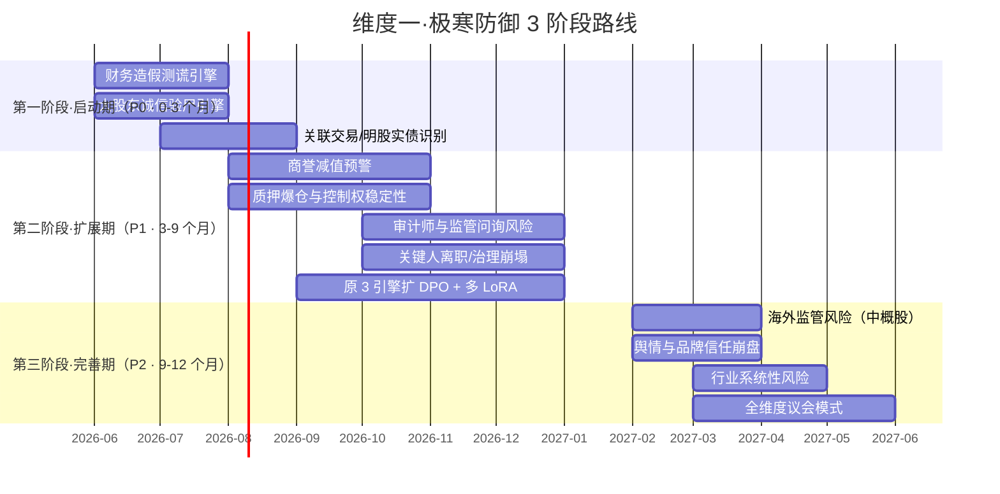

# 维度一·阶段切片视图

> [!NOTE] **[TRACEBACK]**
> - **维度概览**: [../README.md](../README.md)
> - **引擎全景（俯视图）**: [../01_引擎全景与优先级.md](../01_引擎全景与优先级.md)
> - **数据梯次（俯视图）**: [../02_数据依赖梯次总表.md](../02_数据依赖梯次总表.md)
> - **训练范式（俯视图）**: [../03_训练与评测资产路径.md](../03_训练与评测资产路径.md)

## 一、为什么有这一层

维度一含 10 引擎，每个引擎自身又有 5 阶段进化路径——容易"按引擎看清单个引擎、却看不见全维度某一阶段在做什么"。

**本目录回答 4 个问题**：
1. 第一阶段做哪些引擎？每个引擎实现到什么程度？需要哪些数据？验收什么？
2. 第二阶段新增哪些引擎？已有引擎扩展什么能力？需要哪些新数据？
3. 第三阶段新增哪些引擎？已有引擎扩到什么完整态？
4. 阶段之间的"通关条件"是什么？

## 二、3 阶段时间轴

## 三、跨阶段引擎追踪表（最关键的一张表）

> 横看各引擎的"全生命周期演化"；竖看各阶段的"全引擎全貌"。

| # | 引擎名称 | 第一阶段·启动期 | 第二阶段·扩展期 | 第三阶段·完善期 |
|---|---|---|---|---|
| 1 | **财务造假测谎** | 30 案例 SFT，识别 6 类粉饰；Recall ≥ 0.95 | + DPO 偏好对齐 + 多 LoRA 行业细分 | + 议会模式（多 LoRA 投票） |
| 2 | **大股东诚信验尸** | RAG + 5 年公告；识别承诺-减持对子 | + 司法/失信信息交叉 + DPO | + 议会模式 |
| 3 | **关联交易/明股实债** | 财报附注 OCR + 股权穿透；图算法识别循环交易 | + 隐性关联方识别 + DPO | + 议会模式 |
| 4 | **商誉减值预警** | — | 全新引入：监控并购溢价、对赌履约 | + 多 LoRA 行业细分 |
| 5 | **质押爆仓与控制权** | — | 全新引入：质押率、平仓预警线 | + 多源数据交叉 |
| 6 | **审计师与监管问询** | — | 全新引入：审计师变更、问询函解析 | + LLM 解读问询/回复质量 |
| 7 | **关键人离职/治理崩塌** | — | 全新引入：高管离职公告 + 领英追踪 | + 多源弱信号汇聚 |
| 8 | **海外监管风险**（中概股） | — | — | 全新引入：SEC/FDA/欧盟 |
| 9 | **舆情与品牌信任崩盘** | — | — | 全新引入：雪球/小红书/黑猫 |
| 10 | **行业系统性风险** | — | — | 全新引入：政策/反垄断/行业整治 |

## 四、跨阶段数据增量追踪表

| # | 数据类别 | 第一阶段 | 第二阶段 | 第三阶段 |
|---|---|---|---|---|
| 1 | 财务三表 | 全量历史回溯 + 季度增量 | 季度增量 | 季度增量 |
| 2 | 公司公告 | 实时增量 | 实时增量 | 实时增量 |
| 3 | 财报附注 OCR | 全量历史回溯 | 季度增量 | 季度增量 |
| 4 | 大股东持股/减持 | 实时增量 | 实时增量 | 实时增量 |
| 5 | 历史暴雷案例库 | 50 案例 v1 | + 30 新案例 v2 | + 20 新案例 v3 |
| 6 | 股权穿透 | 月度 | 月度 | 月度 |
| 7 | 商誉/并购历史 | — | 全量历史回溯 + 半年度增量 | 半年度增量 |
| 8 | 大股东质押明细 | — | 实时增量 | 实时增量 |
| 9 | 审计师变更 | — | 实时增量 | 实时增量 |
| 10 | 交易所问询函 | — | 实时增量 | 实时增量 |
| 11 | 高管离职公告 | — | 实时增量 | 实时增量 |
| 12 | 司法/诉讼/失信 | — | 周度增量 | 周度增量 |
| 13 | 海外监管动态 | — | — | 周度增量 |
| 14 | 舆情数据 | — | — | 日度增量 |
| 15 | 政策/监管动态 | — | — | 实时增量 |

## 五、阶段之间的"通关条件"

| 通关 | 通关条件 | 阻断条件 |
|---|---|---|
| 第一阶段 → 第二阶段 | 3 引擎 Holdout 全部达标（Recall ≥ 0.95/0.90/0.85） + DVC tag 全部锁定 + Label Studio Kappa ≥ 0.85 | 任一引擎 Recall 退化 > 5% → 阻断 |
| 第二阶段 → 第三阶段 | 7 引擎全部跑通 + DPO 完成 + 多 LoRA 路由就绪 + 季度评测全部达标 | 任一新引擎 Holdout < 阈值 → 阻断 |
| 第三阶段 → 议会模式 | 10 引擎全部跑通 + Judge LLM 集成 + 跨引擎共识规则定义 | Judge LLM 评测命中率 < 0.85 → 阻断 |

## 六、文件索引

| 阶段 | 子目录 | 主要文件 |
|---|---|---|
| 第一阶段·启动期 | [stage_1_启动期/](./stage_1_启动期/) | README + 01_引擎与工作流 + 02_数据采集任务 + 03_验证与守门 |
| 第二阶段·扩展期 | [stage_2_扩展期/](./stage_2_扩展期/) | 同上 |
| 第三阶段·完善期 | [stage_3_完善期/](./stage_3_完善期/) | 同上 |

## 七、双视角入口

- **按阶段切**（你正在看）：`stages/` —— 适合"我现在在哪个阶段、要做什么"
- **按引擎切**：`engines/` —— 适合"这个引擎的全生命周期是什么"
