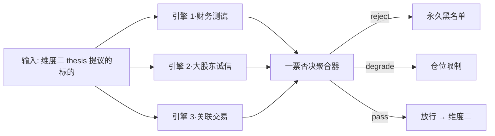
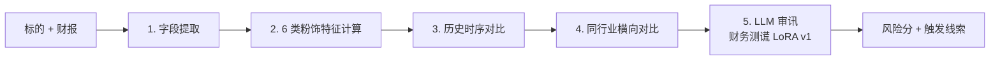
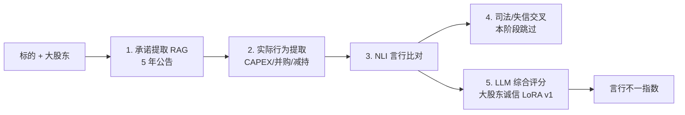
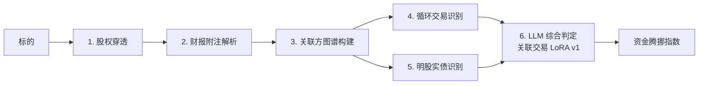

# 维度一·第一阶段·本阶段引擎与工作流

> [!NOTE] **[TRACEBACK]**
> - **本阶段速览**: [README.md](./README.md)
> - **数据采集**: [02_本阶段数据采集任务.md](./02_本阶段数据采集任务.md)
> - **验证守门**: [03_本阶段验证与守门.md](./03_本阶段验证与守门.md)

## 一、本阶段引擎与工作流总览



**本阶段一票否决规则**：
- 任意 1 个引擎判定 `reject` → 整体 `reject`
- 任意 2 个引擎判定 `degrade` → 升级为 `reject`
- 全部 `pass` → 放行

---

## 二、引擎 1·财务造假测谎（本阶段范围）

### 2.1 本阶段实现的能力（vs 全生命周期）

| 维度 | 本阶段（启动期） | 全生命周期对照 |
|---|---|---|
| 识别能力 | 6 类典型粉饰特征（存贷双高/现金流背离/应收异常/存货积压/研发资本化突变/毛利率异常） | 全生命周期会扩到 12+ 类 + 行业细分 LoRA |
| 模型 | 单 LoRA（Qwen2.5-7B + LoRA rank=16） | Stage D 多 LoRA / Stage E 议会模式 |
| Agent 节点 | 5 节点（字段提取 / 特征计算 / 时序对比 / 同行业对比 / LLM 审讯） | 全生命周期不变 |
| DPO | 不做（留待第二阶段） | Stage C 引入 |

### 2.2 本阶段工作流图（与全生命周期一致，但内置 LoRA 是 v1）



### 2.3 本阶段训练数据规模

| 项 | 数值 |
|---|---|
| SFT 案例库（Holdout 之外） | 30–50 个（如康得新/康美/瑞幸/银广夏/獐子岛...） |
| Teacher LLM 蒸馏 JSONL | 1500–3000 条 |
| Verified JSONL | ≥ 1000 条（架构师 verified） |
| Holdout（永久锁库） | 30 案例（10 现金造假 + 10 营收造假 + 10 综合粉饰） |

### 2.4 本阶段 Holdout 守门规则

- Recall ≥ 0.95；Precision ≥ 0.70；F1 ≥ 0.80
- 任意指标退化 > 5% → CI 自动 Block 上线

### 2.5 本阶段不做什么（明确边界）

- ❌ DPO 偏好对齐（→ 第二阶段）
- ❌ 多 LoRA 行业细分（→ 第二阶段）
- ❌ 议会模式（→ 第三阶段）
- ❌ 第 7 类粉饰特征及以上（→ 第二阶段按需加）

### 2.6 完整规约

→ [../../engines/01_财务造假测谎.md](../../engines/01_财务造假测谎.md)

---

## 三、引擎 2·大股东诚信验尸（本阶段范围）

### 3.1 本阶段实现的能力（vs 全生命周期）

| 维度 | 本阶段 | 全生命周期 |
|---|---|---|
| 识别能力 | 5 类典型言行不一（增持承诺/质押承诺/锁定期承诺/业绩对赌承诺/战略承诺） | 全生命周期会加司法/失信交叉验证 |
| 模型 | 单 LoRA + RAG（Qwen2.5-7B 32K 长上下文） | Stage D 多 LoRA |
| Agent 节点 | 5 节点（承诺提取 RAG / 实际行为提取 / NLI 比对 / 司法/失信交叉 → **本阶段先跳过**/ LLM 综合评分） | 全生命周期完整启用 |
| DPO | 不做 | Stage C 引入 |

### 3.2 本阶段工作流图



### 3.3 本阶段训练数据规模

| 项 | 数值 |
|---|---|
| 案例库 | 30 个（如乐视/暴风/安信/华谊/天神娱乐...） |
| Teacher 蒸馏 JSONL | 1500 条 |
| Verified | ≥ 800 条 |
| Holdout | 30 案例 |

### 3.4 本阶段 Holdout 守门规则

- Recall ≥ 0.90；Precision ≥ 0.70；Cohen's Kappa ≥ 0.80
- 任意退化 > 5% → CI Block

### 3.5 本阶段不做什么

- ❌ 司法/失信信息交叉验证（依赖中国裁判文书网采集，→ 第二阶段）
- ❌ DPO（→ 第二阶段）
- ❌ 议会模式（→ 第三阶段）

### 3.6 完整规约

→ [../../engines/02_大股东诚信验尸.md](../../engines/02_大股东诚信验尸.md)

---

## 四、引擎 3·关联交易/明股实债识别（本阶段范围）

### 4.1 本阶段实现的能力（vs 全生命周期）

| 维度 | 本阶段 | 全生命周期 |
|---|---|---|
| 识别能力 | 4 类典型特征（关联方循环交易/明股实债/隐藏负债/关联方占款） | 全生命周期会加隐性关联方识别 |
| 模型 | 单 LoRA + 图算法（Neo4j） | Stage D 多 LoRA |
| Agent 节点 | 6 节点（股权穿透 / 附注解析 / 图谱构建 / 循环交易识别 / 明股实债识别 / LLM 综合） | 全生命周期不变 |
| DPO | 不做 | Stage C 引入 |

### 4.2 本阶段工作流图



### 4.3 本阶段训练数据规模

| 项 | 数值 |
|---|---|
| 案例库 | 30 个（如乐视/暴风/华谊/安信/中天金融...） |
| Teacher 蒸馏 JSONL | 1500 条 |
| Verified | ≥ 800 条 |
| Holdout | 30 案例（10 循环交易 + 10 明股实债 + 10 综合） |

### 4.4 本阶段 Holdout 守门规则

- Recall ≥ 0.85；Precision ≥ 0.70；F1 ≥ 0.78
- 任意退化 > 5% → CI Block

### 4.5 本阶段不做什么

- ❌ 隐性关联方识别（依赖更复杂的特征工程，→ 第二阶段）
- ❌ DPO（→ 第二阶段）
- ❌ 议会模式（→ 第三阶段）

### 4.6 完整规约

→ [../../engines/03_关联交易明股实债识别.md](../../engines/03_关联交易明股实债识别.md)

---

## 五、3 引擎在本阶段的协作约定

### 5.1 一票否决聚合器

```python
def aggregate_p0(e1_score, e2_score, e3_score):
    decisions = []
    for engine, score in [("e1", e1_score), ("e2", e2_score), ("e3", e3_score)]:
        if score >= REJECT_THRESHOLD[engine]:
            decisions.append("reject")
        elif score >= DEGRADE_THRESHOLD[engine]:
            decisions.append("degrade")
        else:
            decisions.append("pass")
    
    if "reject" in decisions:
        return "reject"
    if decisions.count("degrade") >= 2:
        return "reject"  # 多个 degrade 升级为 reject
    if "degrade" in decisions:
        return "degrade"
    return "pass"
```

### 5.2 多源弱信号互验

| 场景 | 互验逻辑 |
|---|---|
| 财务造假常伴随关联交易 | 引擎 1 触发 + 引擎 3 触发 → 置信度 ↑ |
| 大股东不诚信常伴随关联交易 | 引擎 2 触发 + 引擎 3 触发 → 置信度 ↑ |
| 财务造假常伴随大股东不诚信 | 引擎 1 触发 + 引擎 2 触发 → 置信度 ↑ |

### 5.3 决策审计

每次聚合判决必须写入 `cryo_guard.audit_log_service` 表，含：
- 标的、判决时间、3 引擎各自评分、聚合判决、触发线索

## 六、本阶段不做的引擎（明确留给后续阶段）

| 引擎 | 留待阶段 | 原因 |
|---|---|---|
| 商誉减值预警 | 第二阶段 | 数据需要专门的商誉/并购历史采集（D7） |
| 质押爆仓与控制权 | 第二阶段 | 数据需要中登公司质押明细（D8） |
| 审计师与监管问询 | 第二阶段 | 数据需要审计师变更公告 + 问询函（D9, D10） |
| 关键人离职/治理崩塌 | 第二阶段 | 数据需要高管离职公告 + 领英追踪（D11） |
| 海外监管风险 | 第三阶段 | 数据需要 SEC/FDA/欧盟等海外源（D13） |
| 舆情与品牌信任 | 第三阶段 | 数据需要雪球/小红书/黑猫等舆情（D14） |
| 行业系统性风险 | 第三阶段 | 数据需要政策/反垄断/行业整治（D15） |
