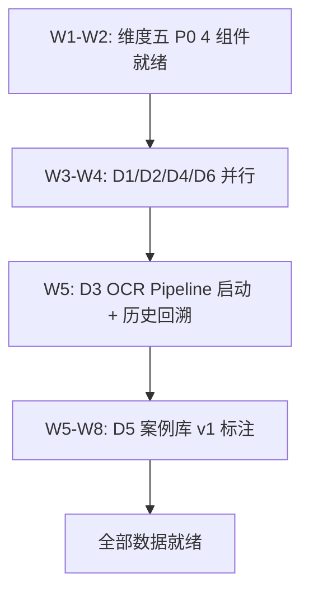

# 维度一·第一阶段·本阶段数据采集任务

> [!NOTE] **[TRACEBACK]**
> - **本阶段速览**: [README.md](./README.md)
> - **维度级数据梯次（俯视图）**: [../../02_数据依赖梯次总表.md](../../02_数据依赖梯次总表.md)
> - **跨维度数据去重视角**: [../../../06_跨维度协作/03_跨维度数据采集依赖总表.md](../../../06_跨维度协作/03_跨维度数据采集依赖总表.md)

## 一、本阶段数据采集 6 项总表

| # | 数据 | 主要数据源 | 采集量级 | 频率 | 服务的引擎 | 工程量估算 | 截止周次 |
|---|---|---|---|---|---|---|---|
| **D1** | 财务三表全量（10 年回溯） | Tushare、AKShare | 5000+ 标的 × 40 季度 | 季度 | E1（财务测谎） | 1 周（脚本 + 跑批） | W4 |
| **D2** | 公司公告全文 | 巨潮资讯网 | 5000+ 标的 × 历史全量 | 实时 | E2、E3 | 1 周（爬虫 + 反爬） | W4 |
| **D3** | 财报附注 OCR | 自建（PaddleOCR） | 5000+ 标的 × 10 年 PDF | 季度 | E1、E3 | 2 周（OCR + 抽样校验） | W5 |
| **D4** | 大股东持股 + 减持公告 | Tushare、东方财富 | 5000+ 标的 × 历史 | 实时 | E2 | 0.5 周（API 接入） | W4 |
| **D5** | 历史暴雷案例库 v1（30-50 案例） | 自建 + Teacher LLM | 50 案例（10 现金 + 10 营收 + 10 综合 + 30 其他） | 一次性 | E1（核心训练）、E2、E3 | 4 周（案例选 + 抓取 + Teacher 蒸馏 + verified） | W8 |
| **D6** | 股权穿透关系图 | 企查查 API | 5000+ 标的 + 关联方 | 月度 | E3（核心） | 1 周（API 接入 + 图谱构建） | W4 |

## 二、采集顺序与依赖

**关键依赖**：
- D5 必须在 D1+D2+D3 部分就绪后才能开始（因为 Teacher 蒸馏的"input"字段来自 D1+D2+D3）
- D6 可以独立启动（不依赖其他）

## 三、每项数据的具体采集计划

### D1·财务三表全量

| 项 | 内容 |
|---|---|
| **数据源** | Tushare Pro（pro_bar）、AKShare（备用） |
| **关键 API** | `pro.stock_basic()`, `pro.income()`, `pro.balancesheet()`, `pro.cashflow()` |
| **采集范围** | 全 A 股 5000+ 标的 × 2014–2026 共 12 年 × 4 季度 = 24 万条记录 |
| **存储路径** | `diting-data/cryo_guard/financial/{symbol}/{period}.parquet`（DVC 锁定） |
| **Great Expectations 规则** | `revenue >= 0`, `total_assets > 0`, `cash_balance >= 0`, 关键字段非 null |
| **容灾** | 失败重试 3 次 → 写失败队列 → 24h 内人工修复 |
| **责任人** | 架构师 |
| **截止** | W4 |

### D2·公司公告全文

| 项 | 内容 |
|---|---|
| **数据源** | 巨潮资讯网（cninfo.com.cn） |
| **抓取方式** | 自建 Selenium 爬虫 + cookie 池 + 代理池 |
| **采集范围** | 全 A 股 × 历史全量公告（PDF + HTML） |
| **存储路径** | `diting-data/cryo_guard/announcements/{symbol}/{date}_{type}.pdf` |
| **结构化字段** | symbol, date, announce_type, title, content_url, content_text |
| **存储规模** | 估算 200GB（10 年全量） |
| **容灾** | 反爬虫触发 → 切换代理；失败重试 → 写失败队列 |
| **责任人** | 架构师 |
| **截止** | W4 |

### D3·财报附注 OCR

| 项 | 内容 |
|---|---|
| **OCR 方案** | PaddleOCR（开源，本地 4090 跑批） |
| **采集范围** | 全 A 股 × 10 年财报 PDF（每标的约 40 份 PDF）|
| **关键提取字段** | 关联交易明细、对外担保、对外投资、表外结构、对赌条款 |
| **存储路径** | `diting-data/cryo_guard/footnotes_ocr/{symbol}/{period}.json` |
| **质量校验** | 随机抽 100 份对比原文，准确率 ≥ 95% 才算通过 |
| **工程量** | 4090 跑批约 200 小时（可分多周完成） |
| **责任人** | 架构师 + AI |
| **截止** | W5 启动 + W12 全量完成（持续后台跑） |

### D4·大股东持股 + 减持公告

| 项 | 内容 |
|---|---|
| **数据源** | Tushare（top10_holders, share_float）、东方财富（备用） |
| **采集范围** | 全 A 股 × 大股东季度持股变化 + 实时减持公告 |
| **存储路径** | `diting-data/cryo_guard/shareholders/{symbol}/{period}.parquet` |
| **Great Expectations 规则** | `holding_ratio >= 0`, `holder_name` 非 null |
| **容灾** | 同 D1 |
| **责任人** | 架构师 |
| **截止** | W4 |

### D5·历史暴雷案例库 v1（**核心训练数据**）

> 本数据是 3 个引擎首次微调的核心训练数据基底，质量决定一切。

| 项 | 内容 |
|---|---|
| **目标规模** | 50 案例（v1） |
| **构成** | 10 现金造假（康得新/康美/瑞幸/银广夏/...）+ 10 营收造假 + 10 综合粉饰 + 10 关联交易（乐视/暴风/华谊/...）+ 10 大股东不诚信（贾跃亭/冯鑫/...） |
| **每个案例的字段** | 案例 ID、暴雷类型、暴雷时间线、暴雷前 8 季度财报关键字段、原始公告 PDF 链接、Teacher LLM 蒸馏输出 JSONL、Verified 状态、是否 Holdout |
| **采集流程** | (1) 案例清单确定（W5）→ (2) 抓取案发前 8 季度财报与公告（W5–W6）→ (3) Teacher LLM 蒸馏（W6–W7）→ (4) Label Studio 推送（W7）→ (5) 架构师 verified（W7–W8） |
| **存储路径** | `diting-data/cryo_guard/case_library/v1/` |
| **DVC 锁定** | 完成后 `dvc add` + `dvc tag case_library_v1` |
| **架构师投入** | verified 50 条 × 5min/条 = 250min ≈ 4h（分 W7–W8 两周完成） |
| **Teacher LLM 成本** | ¥1500（一次性，蒸馏 2000 条 × ¥0.75/条） |
| **责任人** | 架构师（主） + AI（蒸馏） |
| **截止** | W8 |

### D6·股权穿透关系图

| 项 | 内容 |
|---|---|
| **数据源** | 企查查 API（首选） / 天眼查 API（备用） |
| **API 接入** | 申请 API Key + 套餐（约 ¥5000/年）|
| **采集范围** | 全 A 股 5000 标的 + 关联方 3 度穿透 |
| **存储方式** | Neo4j 图数据库 + 定期快照到 `diting-data/cryo_guard/equity_graph/{date}.json` |
| **图 schema** | (Company)-[:CONTROLLED_BY]->(Person)；(Company)-[:RELATED_TO]->(Company) |
| **更新频率** | 月度全量同步 + 实时增量（变更公告触发）|
| **责任人** | 架构师 |
| **截止** | W4 |

## 四、本阶段数据采集成本估算

| 项 | 成本 |
|---|---|
| Tushare Pro 订阅 | ¥2000/年（已计入维度五） |
| 企查查 API | ¥5000/年（共用，年初一次性付） |
| Teacher LLM（D5 蒸馏一次性） | ¥1500（一次性） |
| 数据湖 MinIO 存储 | ¥500/月（已计入维度五） |
| GPU 4090（D3 OCR 一次性） | 已计入维度五硬件 |
| **本阶段增量成本** | **¥1500 一次性 + ¥0/月** |

## 五、本阶段数据治理铁律

1. **DVC 强制锁定**：每一份训练用数据必须 `dvc add` + `git tag`
2. **Holdout 隔离 CI**：30 案例 Holdout 必须独立锁库，CI 自动检测训练集污染
3. **数据溯源**：D1–D6 中任何字段必须能溯源到原始公告/财报具体页码
4. **每日采集报告**：D1/D2/D4 实时采集任务每日生成报告 + 失败队列
5. **24h 容灾**：采集失败 24h 内未补全 → 自动告警

## 六、本阶段数据"就绪"判定

| 数据 | 就绪标志 |
|---|---|
| D1 | Great Expectations 全部通过 + DVC tag `financial_v1` |
| D2 | 历史全量抓取完成 + 实时流持续运行 ≥ 7 天无中断 |
| D3 | 抽样准确率 ≥ 95% + 历史回溯 ≥ 80% 完成（剩余持续后台跑） |
| D4 | 同 D1 |
| D5 | 50 案例全部 verified + DVC tag `case_library_v1` + Holdout 隔离 CI 通过 |
| D6 | 5000 标的图谱构建完成 + Neo4j 可查询 |

全部就绪 → 准入第一阶段引擎训练
