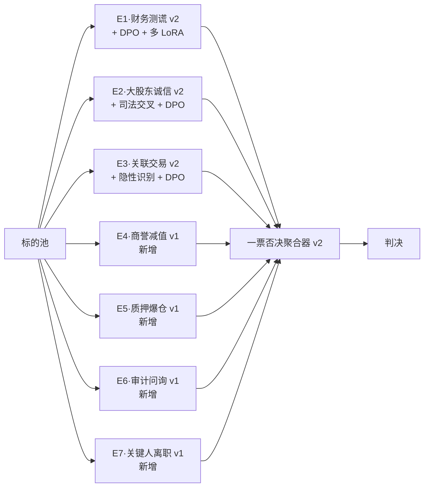
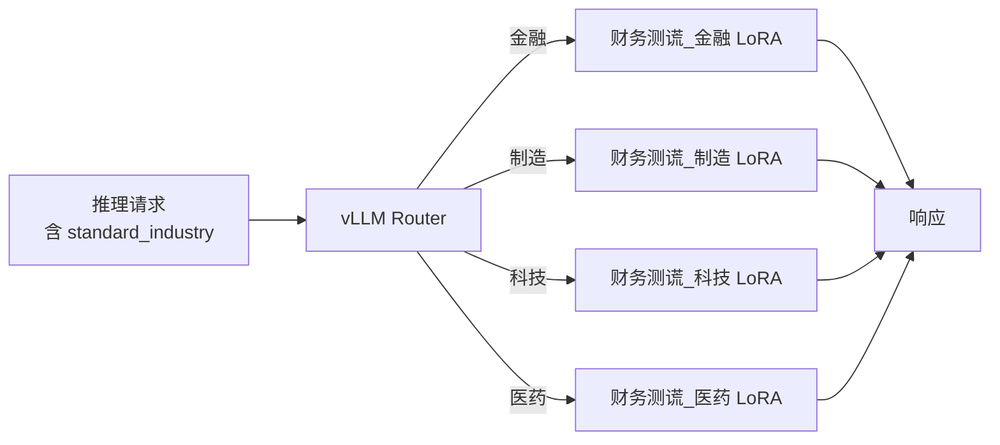

# 维度一·第二阶段·本阶段引擎与工作流

> [!NOTE] **[TRACEBACK]**
> - **本阶段速览**: [README.md](./README.md)
> - **数据采集**: [02_本阶段数据采集任务.md](./02_本阶段数据采集任务.md)
> - **验证守门**: [03_本阶段验证与守门.md](./03_本阶段验证与守门.md)

## 一、本阶段引擎全景（7 引擎并行）



---

## 二、新增引擎详情

### 2.1 引擎 4·商誉减值预警

| 项 | 内容 |
|---|---|
| **本阶段实现范围** | 监控并购溢价、商誉/总资产比例、对赌履约率；触发"商誉减值前 1–2 季度"早期预警 |
| **工作流（5 节点）** | 1. 商誉历史提取 2. 并购对赌追踪 3. 行业可比商誉对比 4. 减值前兆识别 5. LLM 综合（商誉减值 LoRA） |
| **训练数据** | 30 案例（如大族激光 2018、当代东方 2018、众应互联 2019 等"创业板商誉减值潮"案例） |
| **Holdout 守门** | Recall ≥ 0.85；Precision ≥ 0.65 |
| **本阶段不做** | 不预测减值具体金额（→ 第三阶段） |

### 2.2 引擎 5·质押爆仓与控制权稳定性

| 项 | 内容 |
|---|---|
| **本阶段实现范围** | 监控大股东质押率、股价距平仓线、质权人纠纷诉讼 |
| **工作流（4 节点）** | 1. 质押率提取 2. 平仓预警线计算 3. 质权人纠纷扫描 4. LLM 综合（质押爆仓 LoRA） |
| **训练数据** | 30 案例（如 2018 年质押爆仓潮：盾安/科达/天广中茂 等） |
| **Holdout 守门** | Recall ≥ 0.90；Precision ≥ 0.75 |
| **本阶段不做** | 不预测股价短期波动（不属于本维度） |

### 2.3 引擎 6·审计师与监管问询风险

| 项 | 内容 |
|---|---|
| **本阶段实现范围** | 监控审计师变更/出非标意见、问询函密度与回复质量 |
| **工作流（5 节点）** | 1. 审计师变更监控 2. 非标意见识别 3. 问询函密度计算 4. 回复质量 LLM 评分 5. 综合（审计问询 LoRA） |
| **训练数据** | 30 案例（康美案审计师变更、瑞华事件等） |
| **Holdout 守门** | Recall ≥ 0.88；Precision ≥ 0.70 |
| **本阶段不做** | 不替代专业审计判断（仅做信号） |

### 2.4 引擎 7·关键人离职/治理崩塌

| 项 | 内容 |
|---|---|
| **本阶段实现范围** | 监控董秘/CFO/审计/独董短期内多人辞任、领英状态变化 |
| **工作流（4 节点）** | 1. 离职公告聚合 2. 短期密度计算 3. 领英状态扫描 4. LLM 综合（关键人 LoRA） |
| **训练数据** | 30 案例（如某些 ST 公司治理崩塌前的"高管批量离职"信号） |
| **Holdout 守门** | Recall ≥ 0.80（弱信号容忍较高 FN）；Precision ≥ 0.60 |
| **本阶段不做** | 不评判个人去留动机；多源弱信号汇聚为强信号 |

---

## 三、原 3 引擎升级详情

### 3.1 引擎 1·财务测谎 v2 升级

| 升级动作 | 详细 |
|---|---|
| **新案例增量（v2）** | + 30 新案例（覆盖 2024–2025 新爆雷） |
| **DPO 偏好对齐** | 收集 500+ "AI 判定 vs 架构师 verified" 偏好对，DPO 训练 |
| **多 LoRA 行业细分** | 拆分为 4 个行业 LoRA（金融/制造/科技/医药），按标的行业自动路由 |
| **目标** | Precision 从 0.70 提升到 0.80（Recall 不退化） |

### 3.2 引擎 2·大股东诚信 v2 升级

| 升级动作 | 详细 |
|---|---|
| **新增 Agent 节点** | 引入"司法/失信交叉验证"节点（依赖 D12） |
| **新案例增量** | + 30 新案例 |
| **DPO** | 同上 |
| **目标** | Precision 从 0.70 提升到 0.80 |

### 3.3 引擎 3·关联交易 v2 升级

| 升级动作 | 详细 |
|---|---|
| **新增 Agent 节点** | 引入"隐性关联方识别"节点（基于历史地址/电话/注册信息特征工程） |
| **新案例增量** | + 30 新案例 |
| **DPO** | 同上 |
| **目标** | Precision 从 0.70 提升到 0.78 |

---

## 四、本阶段一票否决聚合器升级（v2）

```python
def aggregate_p1(scores):
    """
    scores: dict, key 是 e1-e7，value 是 (engine_score, decision)
    """
    decisions = [d for _, d in scores.values()]
    
    # 一票否决保持不变
    if "reject" in decisions:
        return "reject"
    
    # 多个 degrade 升级为 reject（阈值从第一阶段的 2 调到 3，因为 7 引擎容忍度变化）
    if decisions.count("degrade") >= 3:
        return "reject"
    
    # 关键引擎组合 degrade 也升级
    critical_pairs = [
        ("e1", "e3"),  # 财务造假 + 关联交易
        ("e1", "e2"),  # 财务造假 + 大股东不诚信
        ("e2", "e3"),  # 大股东 + 关联交易
        ("e1", "e4"),  # 财务造假 + 商誉减值
        ("e5", "e7"),  # 质押爆仓 + 关键人离职
    ]
    for a, b in critical_pairs:
        if scores[a][1] == "degrade" and scores[b][1] == "degrade":
            return "reject"
    
    if "degrade" in decisions:
        return "degrade"
    return "pass"
```

---

## 五、多 LoRA 多路复用架构



**架构约束**：
- 单 GPU 同时加载 7 LoRA 主版本 + 4 行业细分 LoRA = 11 LoRA
- 路由失败 → fallback 到通用 LoRA
- 路由日志全记录用于后续 Stage E 议会模式

---

## 六、本阶段不做的引擎（明确留给第三阶段）

| 引擎 | 留待第三阶段 | 原因 |
|---|---|---|
| 海外监管风险 | E8 | 数据需要 SEC/FDA/欧盟海外源（D13），独立工程量大 |
| 舆情与品牌信任 | E9 | 数据需要雪球/小红书/黑猫（D14），噪声大需要更成熟的 NLP |
| 行业系统性风险 | E10 | 数据需要政策/反垄断/行业整治（D15），信号事后验证为主 |
| 议会模式 | 全维度 Stage E | 需要 7+ 引擎的实盘数据积累 ≥ 6 个月 |
