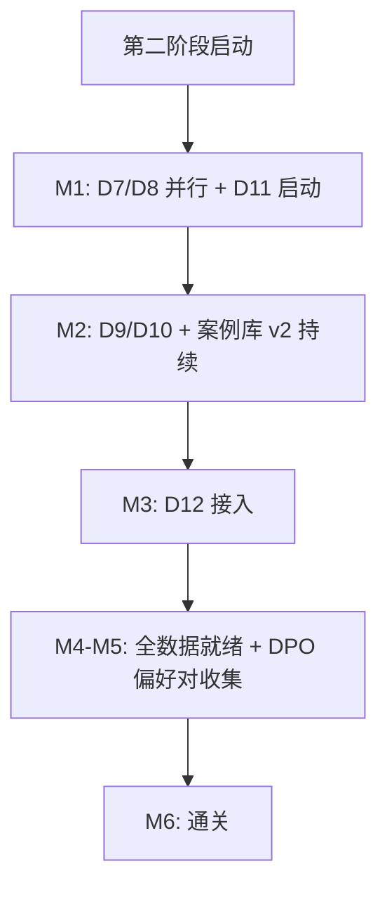

# 维度一·第二阶段·本阶段数据采集任务

> [!NOTE] **[TRACEBACK]**
> - **本阶段速览**: [README.md](./README.md)
> - **维度级数据梯次**: [../../02_数据依赖梯次总表.md](../../02_数据依赖梯次总表.md)

## 一、本阶段数据采集 6 类新增 + 6 类增量总表

### 1.1 新增数据（6 类，对应 4 新引擎 + 2 升级引擎）

| # | 数据 | 主要数据源 | 采集量级 | 频率 | 服务的引擎 | 工程量估算 | 截止月份 |
|---|---|---|---|---|---|---|---|
| **D7** | 商誉/并购历史 | Wind / Tushare（pro.fina_indicator）| 5000 标的 × 10 年 | 半年度 | E4（核心） | 1.5 周 | M1 |
| **D8** | 大股东质押明细 | 中登公司 + Tushare（pro.pledge_stat）| 2000+ 有质押标的 × 实时 | 实时 | E5（核心） | 2 周（数据源审批 + 接入）| M1 |
| **D9** | 审计师变更 + 非标意见 | 公告爬虫（巨潮，已在 D2 基础上提取）| 全 A 股 × 历史 | 实时 | E6（核心） | 1 周（提取规则） | M2 |
| **D10** | 交易所问询函 + 回复 | 互动易、巨潮 | 全 A 股 × 历史 | 实时 | E6（核心） | 1.5 周（爬虫 + 结构化）| M2 |
| **D11** | 高管离职/变更公告 | 公告爬虫 + 领英 API（可选）| 全 A 股 × 历史 | 实时 | E7（核心） | 1.5 周（含领英可选） | M2 |
| **D12** | 司法/诉讼/失信信息 | 中国裁判文书网 + 信用中国 | 5000 标的 + 关联方 | 周度 | E2 升级、E3 升级 | 2.5 周（含反爬）| M3 |

### 1.2 原数据增量

| # | 数据 | 增量动作 | 责任 |
|---|---|---|---|
| D1–D4 | 持续季度 / 实时增量 | 自动跑批 | CI |
| D5 案例库 v1 → v2 | + 30 新案例（含 4 新引擎案例） | 架构师 + AI | M1–M5 |
| D6 股权穿透 | 月度增量 | 自动跑批 | CI |

## 二、采集顺序与依赖

## 三、每项数据的具体采集计划

### D7·商誉/并购历史

| 项 | 内容 |
|---|---|
| **数据源** | Tushare（pro.fina_indicator）、Wind（备用） |
| **关键字段** | 商誉、商誉/总资产、并购历史、对赌条款、对赌履约率 |
| **存储路径** | `diting-data/cryo_guard/goodwill/{symbol}/{period}.parquet` |
| **Great Expectations** | 商誉 ≥ 0；商誉/总资产 ∈ [0, 1] |
| **责任人** | 架构师 |
| **截止** | M1 |

### D8·大股东质押明细

| 项 | 内容 |
|---|---|
| **数据源** | 中登公司（每日质押公告）+ Tushare（pro.pledge_stat） |
| **采集量级** | 2000 + 有质押标的 × 实时质押率变化 |
| **关键字段** | symbol, 大股东, 质押笔数, 质押股数, 质押率, 平仓预警价, 质权人 |
| **存储路径** | `diting-data/cryo_guard/pledge/{symbol}/{date}.parquet` |
| **存储规模** | 估算 5GB/年 |
| **数据源审批** | 中登公司部分数据需要付费订阅（约 ¥3000/年） |
| **责任人** | 架构师 |
| **截止** | M1 |

### D9·审计师变更 + 非标意见

| 项 | 内容 |
|---|---|
| **数据源** | 在 D2 公告基础上规则提取 |
| **提取规则** | (1) 标题含"审计机构变更"、"会计师事务所变更" → 审计师变更事件；(2) 年报审计意见类型字段 ≠ "标准无保留意见" → 非标 |
| **结构化字段** | symbol, change_date, prev_auditor, new_auditor, opinion_type, year |
| **存储路径** | `diting-data/cryo_guard/audit/{symbol}.parquet` |
| **责任人** | AI |
| **截止** | M2 |

### D10·交易所问询函 + 回复

| 项 | 内容 |
|---|---|
| **数据源** | 互动易、巨潮（"问询函"专项） |
| **结构化字段** | symbol, inquiry_date, inquiry_type, question_count, reply_date, reply_quality_score（待 LLM 评分） |
| **存储路径** | `diting-data/cryo_guard/inquiry/{symbol}/{inquiry_id}.json` |
| **存储规模** | 估算 20GB（10 年全量含 PDF） |
| **责任人** | AI |
| **截止** | M2 |

### D11·高管离职/变更公告

| 项 | 内容 |
|---|---|
| **数据源** | 巨潮公告（"高管变动"分类）+ 领英 API（可选，需付费且需 VPN） |
| **结构化字段** | symbol, change_date, person_name, position, change_type（任职/辞任/调任）|
| **存储路径** | `diting-data/cryo_guard/key_persons/{symbol}.parquet` |
| **领英可选** | 评估成本与可行性后决定（建议第二阶段先不接入领英） |
| **责任人** | AI |
| **截止** | M2 |

### D12·司法/诉讼/失信信息

| 项 | 内容 |
|---|---|
| **数据源** | 中国裁判文书网（爬虫，反爬严格）+ 信用中国（失信信息） |
| **采集范围** | 5000 标的 + 关联方约 30000 个实体 × 周度增量 |
| **结构化字段** | entity_id, case_id, case_type, court_date, judgment_summary, defendant, plaintiff |
| **存储路径** | `diting-data/cryo_guard/judicial/{entity_id}/{case_id}.json` |
| **反爬应对** | 代理池 + 验证码识别（PaddleOCR）+ 限速 |
| **存储规模** | 估算 50GB |
| **责任人** | 架构师 + AI |
| **截止** | M3 |

## 四、原数据增量计划

### 4.1 D5 案例库 v1 → v2

| 项 | 内容 |
|---|---|
| **目标增量** | + 30 新案例（含 4 新引擎案例） |
| **构成** | 5 商誉减值案例 + 5 质押爆仓案例 + 5 审计/问询案例 + 5 关键人离职案例 + 10 综合案例 |
| **架构师投入** | verified 30 条 × 5min = 150min ≈ 2.5h（分散到 M1–M5）|
| **DVC** | `dvc tag case_library_v2` |
| **责任人** | 架构师 + AI |

### 4.2 DPO 偏好对收集（**本阶段重要新增**）

| 项 | 内容 |
|---|---|
| **目标规模** | 每个引擎 500–800 偏好对 × 7 引擎 = 3500–5600 偏好对 |
| **收集方式** | (1) 实盘 P0 引擎产出的 "AI 判定" → (2) 架构师 verified 给出"更优答案" → (3) 形成 (chosen, rejected) 偏好对 |
| **架构师投入** | M3–M5 累计 verified 偏好对约 12h |
| **存储路径** | `diting-data/cryo_guard/dpo_pairs/{engine_id}.jsonl` |
| **DVC** | 每月一个 tag（dpo_pairs_2026_M3 等） |
| **责任人** | 架构师（主） + AI（辅助初筛）|

## 五、本阶段数据采集成本估算

| 项 | 成本 |
|---|---|
| 中登公司质押数据订阅 | ¥3000/年（一次性） |
| 中国裁判文书网代理池 + 反爬服务 | ¥800/月 |
| 领英 API（**可选，第二阶段建议不开**） | ¥0 或 ¥6000/年 |
| Teacher LLM（4 新引擎案例库蒸馏 + DPO 偏好对辅助）| ¥2500/月 × 6 = ¥15000 |
| 数据湖 MinIO 增量存储 | ¥500/月（已计入维度五） |
| **本阶段增量成本** | **¥3000 一次性 + ¥3300/月** |

## 六、本阶段数据治理强化

1. **DVC tag 自动化**：每月固定时间自动 tag（含 case_library_v2、dpo_pairs_*、judicial_v1 等）
2. **Holdout v2 隔离**：4 新引擎各自 30 案例 Holdout v1 永久独立锁库
3. **跨引擎数据复用**：D2 公告同时服务 E2/E3/E6/E7（避免重复抓取）
4. **质量退化告警**：D5 案例库 v2 标注 Kappa < 0.85 → 阻断
5. **DPO 偏好对质量**：偏好对一致性 ≥ 0.90（架构师 30 天后复核）

## 七、本阶段数据"就绪"判定

| 数据 | 就绪标志 |
|---|---|
| D7 | 全 A 股 10 年商誉历史完整 + Great Expectations 通过 |
| D8 | 中登公司订阅生效 + 实时增量稳定 7 天 |
| D9–D11 | 提取规则准确率 ≥ 95% + 历史回溯完成 |
| D12 | 5000 标的 + 关联方周度增量稳定 |
| 案例库 v2 | 30 新案例 verified + DVC tag |
| DPO 偏好对 | 每引擎 ≥ 500 偏好对 + 一致性 ≥ 0.90 |

全部就绪 → 准入第二阶段引擎训练
