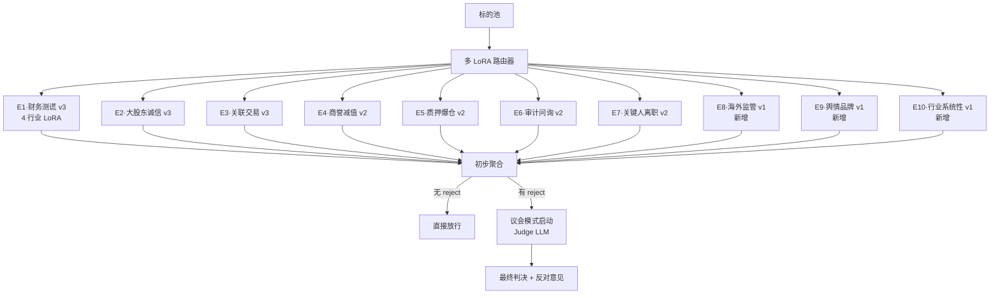
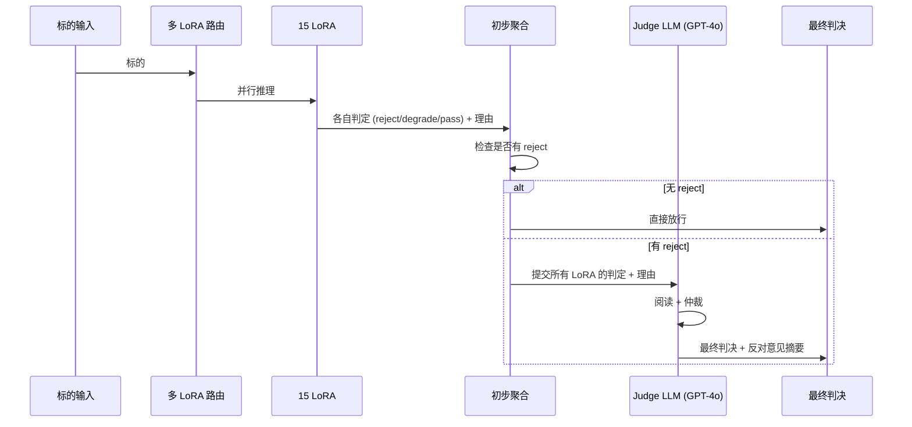

# 维度一·第三阶段·本阶段引擎与工作流

> [!NOTE] **[TRACEBACK]**
> - **本阶段速览**: [README.md](./README.md)
> - **数据采集**: [02_本阶段数据采集任务.md](./02_本阶段数据采集任务.md)
> - **验证守门**: [03_本阶段验证与守门.md](./03_本阶段验证与守门.md)

## 一、本阶段引擎全景（10 引擎 + 议会模式）



---

## 二、新增引擎详情

### 2.1 引擎 8·海外监管风险（中概股专项）

| 项 | 内容 |
|---|---|
| **本阶段实现范围** | 监控 SEC 8-K（美股中概）/ FDA（医药行业）/ 欧盟反垄断 / 集体诉讼 / 中美数据合规跨境监管 |
| **工作流（5 节点）** | 1. SEC EDGAR 监控 2. 集体诉讼数据库扫描 3. FDA RSS 监控 4. 欧盟竞争总司公告 5. LLM 综合（海外监管 LoRA） |
| **训练数据** | 30 案例（瑞幸/Luckin/某中概股暴雷案例 + 阿里/腾讯反垄断 + 滴滴数据合规等） |
| **Holdout 守门** | Recall ≥ 0.85；Precision ≥ 0.65 |
| **本阶段不做** | 不替代专业法务（仅做信号触发） |

### 2.2 引擎 9·舆情与品牌信任崩盘

| 项 | 内容 |
|---|---|
| **本阶段实现范围** | 监控雪球/小红书/黑猫投诉密度 + 知乎质疑帖 + 品牌负面 NLP 情感分析 |
| **工作流（4 节点）** | 1. 多源舆情聚合 2. 情感分析 + 负面密度计算 3. 品牌信任崩盘前兆识别 4. LLM 综合（舆情 LoRA） |
| **训练数据** | 30 案例（如某品牌信任崩盘前 1–3 个月舆情曲线案例） |
| **Holdout 守门** | Recall ≥ 0.78；Precision ≥ 0.55（弱信号容忍噪声） |
| **本阶段不做** | 不替代专业品牌咨询；噪声较高时降级为"degrade" 而非 reject |

### 2.3 引擎 10·行业系统性风险

| 项 | 内容 |
|---|---|
| **本阶段实现范围** | 监控政策突变（双减/集采/反垄断/数据安全法等）+ 行业整治动作 |
| **工作流（5 节点）** | 1. 国务院/部委公告监控 2. 行业协会动态 3. 政策影响标的清单 LLM 推理 4. 历史可比政策的行业冲击映射 5. 综合（行业系统性 LoRA）|
| **训练数据** | 30 案例（双减/教培、集采/医药、反垄断/平台经济、数据安全法/互联网等）|
| **Holdout 守门** | Recall ≥ 0.80；Precision ≥ 0.60 |
| **本阶段不做** | 不预测政策具体出台时间（事后识别 + 早期信号为主） |

---

## 三、议会模式（**本阶段最重要的能力跃迁**）

### 3.1 议会模式架构



### 3.2 Judge LLM Prompt 模板

```python
JUDGE_PROMPT = """你是一名资深风控架构师。下面是 15 个专业 LoRA 对标的 {symbol} 的独立判定：

【LoRA 判定汇总】
{lora_judgments}

【任务】
请阅读所有判定，给出最终判决：
1. 决策（reject / degrade / pass）
2. 主要理由（≤ 200 字）
3. 反对意见摘要（如果有 LoRA 给出截然不同的判定，列出其理由 ≤ 150 字）
4. 置信度（0–1）

【约束】
- 任何 LoRA 给出的"硬证据"（如财务数据矛盾、明确公告）必须保留
- 仅基于"弱信号"的判定可酌情减权
- 历史已暴雷的同类型案例（来自训练数据）应作为强参考
"""
```

### 3.3 议会模式数据合成（Teacher LLM 蒸馏）

```python
def synthesize_parliament_data():
    cases = load_holdout_v3()  # 100 综合案例
    
    parliament_data = []
    for case in cases:
        # 模拟 15 个 LoRA 的判定（部分一致、部分分歧）
        mock_judgments = generate_mock_judgments(case, num_lora=15, dispute_ratio=0.3)
        
        # Teacher LLM (GPT-4o) 作为"标准 Judge"给出仲裁
        judge_answer = call_teacher_judge(case, mock_judgments)
        
        parliament_data.append({
            "input": format_judge_prompt(case, mock_judgments),
            "output": judge_answer
        })
    
    return parliament_data  # 用于训练自家 Judge LLM（如 Qwen2.5-72B + LoRA）
```

### 3.4 议会模式训练

| 项 | 内容 |
|---|---|
| **基座** | Qwen2.5-72B（议会模式需要更强基座，必要时直接用 GPT-4o） |
| **训练数据** | 议会模式合成数据 1500 条 + 架构师 verified 仲裁案例 200 条 |
| **Holdout** | 30 仲裁案例（架构师手动给出"标准答案"） |
| **守门** | Judge LLM 仲裁准确率 ≥ 0.85；议会模式 FN 率 vs 单 LoRA 下降 ≥ 30% |

---

## 四、原 7 引擎升级范围

| # | 引擎 | 本阶段升级动作 |
|---|---|---|
| 1 | 财务测谎 | 加入议会成员；4 行业 LoRA 全部参与议会投票 |
| 2 | 大股东诚信 | 同上；增加 1 LoRA（治理细分版） |
| 3 | 关联交易 | 同上 |
| 4 | 商誉减值 | 同上；增加 1 LoRA（行业细分版） |
| 5 | 质押爆仓 | 同上 |
| 6 | 审计问询 | 同上 |
| 7 | 关键人离职 | 同上 |

---

## 五、本阶段聚合器升级（v3，议会版）

```python
def aggregate_p2_with_parliament(scores):
    """
    scores: dict, key 是 e1-e10，value 是 {lora_id: (score, decision, reasoning)}
    """
    initial_decisions = []
    for engine_id, lora_judgments in scores.items():
        for lora_id, (s, d, r) in lora_judgments.items():
            initial_decisions.append({
                "engine": engine_id,
                "lora": lora_id,
                "score": s,
                "decision": d,
                "reasoning": r
            })
    
    # 检查是否有 reject
    has_reject = any(d["decision"] == "reject" for d in initial_decisions)
    
    if not has_reject:
        return {"decision": "pass", "method": "no_parliament"}
    
    # 启动议会
    judge_prompt = format_judge_prompt(initial_decisions)
    judge_answer = call_judge_lora(judge_prompt)
    
    # 解析议会判决
    final_decision = parse_judge_decision(judge_answer)
    
    # 记录到审计日志
    log_parliament_decision({
        "lora_judgments": initial_decisions,
        "judge_decision": judge_answer,
        "final": final_decision
    })
    
    return {
        "decision": final_decision["decision"],
        "method": "parliament",
        "judge_reasoning": final_decision["reasoning"],
        "dissent": final_decision.get("dissent")
    }
```

## 六、本阶段已经完成全部 10 引擎

至此维度一进入"完整态稳态"，后续仅为月度增量训练 + 季度全量评测，无新增引擎。
