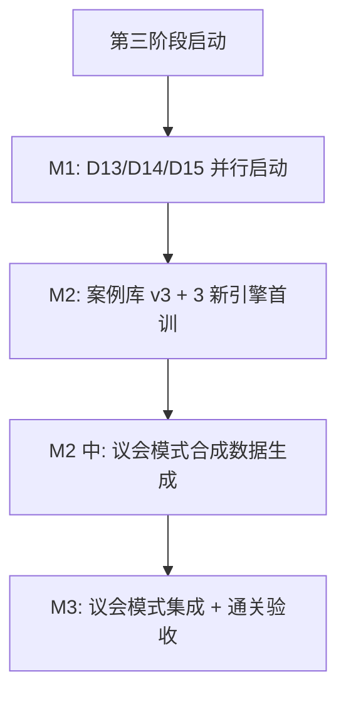

# 维度一·第三阶段·本阶段数据采集任务

> [!NOTE] **[TRACEBACK]**
> - **本阶段速览**: [README.md](./README.md)
> - **维度级数据梯次**: [../../02_数据依赖梯次总表.md](../../02_数据依赖梯次总表.md)

## 一、本阶段数据采集 3 类新增 + 案例库 v3 + 议会模式合成数据

### 1.1 新增数据（3 类）

| # | 数据 | 主要数据源 | 采集量级 | 频率 | 服务的引擎 | 工程量估算 | 截止月份 |
|---|---|---|---|---|---|---|---|
| **D13** | 海外监管动态 | SEC EDGAR / FDA RSS / 欧盟竞争总司公告 | 中概股 200+ 标的 + 全行业海外案例 | 周度 | E8 | 2 周 | M1 |
| **D14** | 舆情数据 | 雪球 + 小红书 + 黑猫 + 知乎 | 全 A 股 + 关键品牌 | 日度 | E9 | 2.5 周（含付费舆情服务调研）| M1 |
| **D15** | 政策/监管动态 | 国务院 + 部委 + 行业协会 | 全行业 | 实时 | E10 | 1.5 周 | M1 |

### 1.2 原数据增量

| 数据 | 增量 | 责任 |
|---|---|---|
| D1–D12 | 持续增量 | CI |
| D5 案例库 v2 → v3 | + 20 新案例（含 3 新引擎案例 + 议会模式校准）| 架构师 + AI |
| DPO 偏好对（10 引擎） | 持续累积 | 架构师 |

### 1.3 议会模式合成数据（**本阶段新增重要类别**）

| 项 | 内容 |
|---|---|
| **数据规模** | 1500 合成 + 200 architect-verified = 1700 条 |
| **构成** | 模拟 15 LoRA 的判定 + Judge LLM 仲裁标准答案 |
| **生成方式** | Teacher LLM (GPT-4o) 蒸馏 + 架构师抽样 verified（100 条复核 + 100 条新写）|
| **存储路径** | `diting-data/cryo_guard/parliament/v1/` |

## 二、采集顺序与依赖



## 三、每项新数据的具体采集计划

### D13·海外监管动态

| 项 | 内容 |
|---|---|
| **数据源** | SEC EDGAR API（免费）+ FDA RSS（免费）+ 欧盟竞争总司 RSS（免费）+ Stanford Securities Class Action Clearinghouse（免费） |
| **采集范围** | (1) 中概股 200+ 标的的 SEC 8-K / 10-K；(2) 集体诉讼数据库；(3) FDA 警告信；(4) 欧盟反垄断公告 |
| **结构化字段** | event_id, source, target_company, target_symbol, event_type, event_date, summary, doc_url |
| **存储路径** | `diting-data/cryo_guard/overseas_regulation/{event_date}_{event_id}.json` |
| **存储规模** | 估算 5GB |
| **责任人** | AI |
| **截止** | M1 |

### D14·舆情数据

| 项 | 内容 |
|---|---|
| **数据源** | 雪球（爬虫）+ 小红书（第三方 API 或人工抓样）+ 黑猫投诉（爬虫）+ 知乎（爬虫） |
| **采集范围** | 全 A 股 5000+ 标的 + 关键品牌（约 1000 个）|
| **结构化字段** | post_id, source, target_company, target_symbol, post_date, text, sentiment_score, negative_density |
| **存储路径** | `diting-data/cryo_guard/sentiment/{date}/{source}/{post_id}.json` |
| **存储规模** | 估算 100GB（含全量抓取，建议第三阶段先聚焦"事件触发"模式）|
| **付费选项** | 第三方舆情服务约 ¥15000/年（如七麦、新榜、新浪舆情通），评估后决定 |
| **反爬应对** | 代理池 + 限速 + 多账号 |
| **责任人** | 架构师 + AI |
| **截止** | M1 |

### D15·政策/监管动态

| 项 | 内容 |
|---|---|
| **数据源** | 国务院新闻办公室 + 各部委（央行/银保监/证监会/工信部/卫健委/教育部 等）+ 行业协会 |
| **采集范围** | 全行业 × 实时政策动态 |
| **结构化字段** | event_id, ministry, event_date, policy_title, policy_summary, affected_industry, doc_url |
| **存储路径** | `diting-data/cryo_guard/policy/{event_date}_{event_id}.json` |
| **责任人** | AI |
| **截止** | M1 |

## 四、案例库 v3 构成

| 类型 | 案例数 | 备注 |
|---|---|---|
| E8 海外监管 | 5 | 瑞幸、滴滴、阿里反垄断、某中概股暴雷 |
| E9 舆情品牌 | 5 | 海天酱油、椰树椰汁、某知名品牌 |
| E10 行业系统性 | 5 | 双减/教培、集采/医药、反垄断/平台 |
| 议会模式校准 | 5 | 多引擎分歧的真实案例 |
| **合计** | **20** | |

## 五、议会模式合成数据生成

### 5.1 模拟 LoRA 判定

```python
def generate_mock_judgments(case, num_lora=15, dispute_ratio=0.3):
    """模拟 15 个 LoRA 的判定，部分一致部分分歧"""
    truth = case["ground_truth"]  # "reject" / "degrade" / "pass"
    
    judgments = []
    for lora_id in range(num_lora):
        if random.random() < dispute_ratio:
            # 30% 比例制造分歧
            decision = random.choice(["reject", "degrade", "pass"])
        else:
            # 70% 比例与真值一致（带噪声）
            decision = truth
        
        # Teacher LLM 生成符合该 decision 的 reasoning
        reasoning = call_teacher_for_reasoning(case, decision)
        
        judgments.append({
            "lora_id": f"lora_{lora_id}",
            "decision": decision,
            "score": 0.7 + random.random() * 0.3,
            "reasoning": reasoning
        })
    
    return judgments
```

### 5.2 Teacher LLM 仲裁

```python
def call_teacher_judge(case, mock_judgments):
    prompt = JUDGE_PROMPT.format(
        symbol=case["symbol"],
        lora_judgments=format_judgments(mock_judgments)
    )
    
    response = openai.ChatCompletion.create(
        model="gpt-4o",
        messages=[{"role": "user", "content": prompt}],
        temperature=0
    )
    
    return parse_judge_response(response.choices[0].message.content)
```

### 5.3 架构师 verified

| 项 | 内容 |
|---|---|
| 抽样 | 200 条议会数据中架构师手动 verified |
| 复核 | 30 天后随机抽 20 条复核 |
| 标准 | Judge 仲裁与架构师一致性 ≥ 0.90 |

## 六、本阶段数据采集成本估算

| 项 | 成本 |
|---|---|
| 第三方舆情服务（**可选**）| ¥15000/年 |
| Teacher LLM（议会模式合成 + 3 新引擎案例库蒸馏）| ¥3000/月 × 3 = ¥9000 |
| 反爬服务增量 | ¥500/月 |
| MinIO 增量存储 | ¥500/月（已计入维度五）|
| **本阶段增量成本** | **¥0–¥15000 一次性 + ¥500/月** |

## 七、本阶段数据治理强化

1. **议会数据隔离**：议会合成数据与评测 Holdout 完全隔离
2. **多源舆情质量**：D14 噪声大，必须做置信度标注
3. **政策数据时效性**：D15 政策出台 2h 内必须入库 + LLM 触发预警
4. **海外数据合规**：SEC/FDA 等公开数据，确保不触及非公开数据
5. **议会数据复审**：每月议会模式数据 verified ≥ 50 条

## 八、本阶段数据"就绪"判定

| 数据 | 就绪标志 |
|---|---|
| D13 | 中概股 200+ 标的历史回溯完成 + 周度增量稳定 |
| D14 | 全 A 股 + 关键品牌历史回溯（最近 6 个月）+ 日度增量稳定 |
| D15 | 全行业政策历史回溯（最近 2 年）+ 实时增量稳定 |
| 案例库 v3 | 20 新案例 verified + DVC tag |
| 议会数据 | 1500 合成 + 200 verified + Kappa ≥ 0.90 |

全部就绪 → 准入议会模式集成
