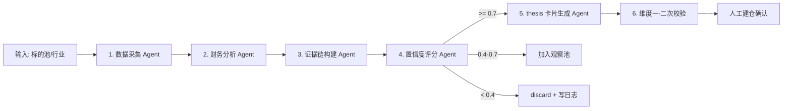

# 维度二·引擎全景与优先级

> [!NOTE] **[TRACEBACK]**
> - **维度概览**: [README](./README.md)
> - **目标边界**: [00_维度目标与能力边界](./00_维度目标与能力边界.md)

## 一、10 剧本扩展计划（三阶段）

| 阶段 | # | 剧本名称 | 主要工作目标 | 能力边界 |
|---|---|---|---|---|
| **P0** | 1 | **利润截留扫描仪剧本**（首引擎） | 识别"成本下降快于收入下降 + 毛利率拐点 + 经营杠杆释放"早期信号；输出 thesis 卡片 | 不识别营收驱动型增长；不预测毛利率上限 |
| **P1** | 2 | **S 曲线渗透率监控剧本** | 监控新技术/新产品在产业链中的渗透率拐点（电动车、AI 算力、固态电池等） | 仅做趋势识别，不预测拐点时间点 |
| **P1** | 3 | **产业链瓶颈嗅探器剧本** | 识别产业链卡脖子环节、稀缺性溢价（稀土永磁、半导体设备、半导体材料） | 仅做"瓶颈识别"，不评估技术细节 |
| **P1** | 4 | **产能出清追踪器剧本** | 识别周期底部产能出清后龙头集中度提升（生猪、光伏硅料、化工） | 不预测周期底部时间点 |
| **P1** | 5 | **国产替代攻坚剧本** | 识别"被卡脖子 + 国内有突破"的赛道（半导体设备、工业软件、医疗设备） | 不评估技术成熟度细节 |
| **P1** | 6 | **出海/全球化扩张剧本** | 识别"中国模式输出海外"机会（家电、电动车、跨境电商） | 不评估海外政治风险 |
| **P2** | 7 | **"中特估"估值重塑剧本** | 识别低估值高分红国央企的价值重估机会 | 仅做估值修复识别，不预测分红率 |
| **P2** | 8 | **政策驱动主升浪剧本** | 政策密集出台后行业 EPS 与估值双升机会（医药集采、半导体设备） | 不预测政策本身 |
| **P2** | 9 | **困境反转个股剧本** | 业绩底部反转拐点识别 | 高失败率剧本，需要严格的 SLI 探针 |
| **P2** | 10 | **细分龙头扩品类剧本** | 主业稳固后扩展第二增长曲线（如食品饮料龙头扩品类、家电龙头出海） | 仅做"扩品类成功率高"的剧本验证 |

## 二、剧本实现优先级与排序理由

按"机会确定性 × 数据可获取性 × 工程门槛"综合排序：

| 排序 | 剧本 | 排序理由 |
|---|---|---|
| 1 | **利润截留扫描仪** | 数据全部在公开财报里；逻辑链最清晰可被 LLM 训练；首战适合作样板 |
| 2 | **S 曲线渗透率** | 数据需要产业链交叉验证（行业协会 + 财报），中等门槛 |
| 3 | **产业链瓶颈嗅探** | 需要构建产业链知识图谱，中等-偏高门槛 |
| 4 | **产能出清追踪** | 数据来源较散（行业协会、财报），周期判断较主观 |
| 5 | **国产替代攻坚** | 数据需要海外对标 + 国内进度跟踪，门槛中等 |
| 6 | **出海/全球化** | 数据需要海外渠道（财报海外业务披露），门槛偏高 |
| 7 | **中特估估值重塑** | 数据简单（市净率/股息率），但触发时机偏主观 |
| 8 | **政策驱动主升浪** | 政策本身不可预测，主要做事后跟踪 |
| 9 | **困境反转** | 失败率高，需大量历史案例训练 |
| 10 | **细分龙头扩品类** | 案例零散，难形成统一模型 |

## 三、剧本工作流标准模板（Agent 编排）

每个剧本都遵循以下 LangGraph 节点编排：

**5 个统一的 Agent 角色**：
1. **数据采集 Agent**：拉取财报/公告/产业数据
2. **财务分析 Agent**：算关键指标（毛利率/经营杠杆/...）
3. **证据链构建 Agent**：把多源证据组织成结构化逻辑链
4. **置信度评分 Agent**：基于规则 + LLM 综合打分
5. **thesis 卡片生成 Agent**：输出 markdown thesis 卡片 + SLI 探针清单

每个剧本只是这个标准模板的"角色 prompt + 知识图谱"差异化。

## 四、维度二的"能力圈管理"

| 角色 | 职责 |
|---|---|
| 架构师 | 在前端"能力圈管理面板"维护一份"我懂的赛道清单"（如新能源车、半导体设备、消费电子...） |
| AI | 剧本仅在能力圈内的赛道扫描 |
| 容灾 | 任何 thesis 卡片如果跨能力圈 → 自动 reject |

**目的**：用"能力圈"作为防止 AI 输出"伪研究卡片"的最后一道闸。
